# Azure AD (OAuth) with Squidex

[Azure AD](https://azure.microsoft.com/en-us/products/active-directory) is a fully-managed Cloud-based identity service from Microsoft providing SSO, MFA and conditional access, amongst many other features.&#x20;

Azure AD provides lots of authentication mechanisms such as OAuth, OIDC and Graph etc. This article uses the plain OAuth method. It shows you how to use Azure AD as an identity provider with a **self-hosted Squidex installation**. Azure AD provides authentication and authorization to users in the Azure AD tenant for your App.


A basic understanding of Azure AD is highly recommended as the article does not explain what Azure AD is and how it works. Microsoft Learn has excellent [documentation](https://learn.microsoft.com/en-us/azure/active-directory/) for this.


## Prerequisites

These prerequisites should be in place to successfully follow this article:

* An Azure Active Directory tenant (FREE tier will work).
  * It is assumed that the Azure AD has a domain associated with it, e.g. _example.com_.
* An installation of Squidex. See [instructions](../) available for various platforms.


An Azure subscription is NOT required for this setup


## Azure AD Configuration

### Register an Azure AD App

During this step, you will register an application with Azure AD and gather a few details that will be required to configure Squidex.

1. Start by navigating to [https://portal.azure.com](https://portal.azure.com).
2.  In the top search box, type **Active Directory** (1) and select **Azure Active Directory** (2) from the list.

    <figure>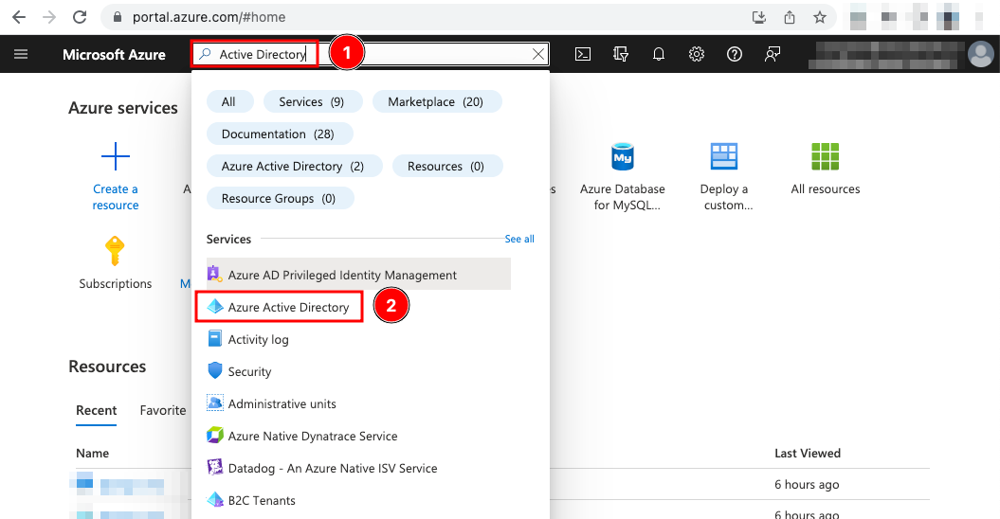<figcaption>
Navigate to Azure Active Directory
</figcaption></figure>
3.  On the Azure AD page, select **App registrations** (3) from the left blade and then click **+ New registration** (4).

    <figure>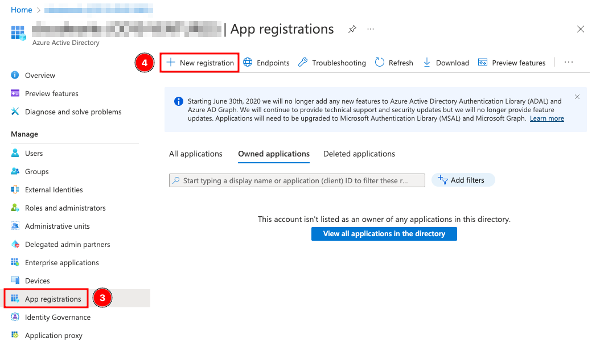<figcaption>
Start registration of a new app
</figcaption></figure>
4.  On the _Register an application_ screen enter a **Name** (5) for the App, select **Accounts in this organizational directory only** (6).\
    Under the **Redirect URI (optional)** section, set the following values:

    1. Choose **Web** (7) from the drop down
    2. Then enter your Squidex domain URL followed by `/signin-microsoft`.\
       The URI must have `/signin-microsoft` else it will fail.

    Click **Register** (8) when done.

    <figure>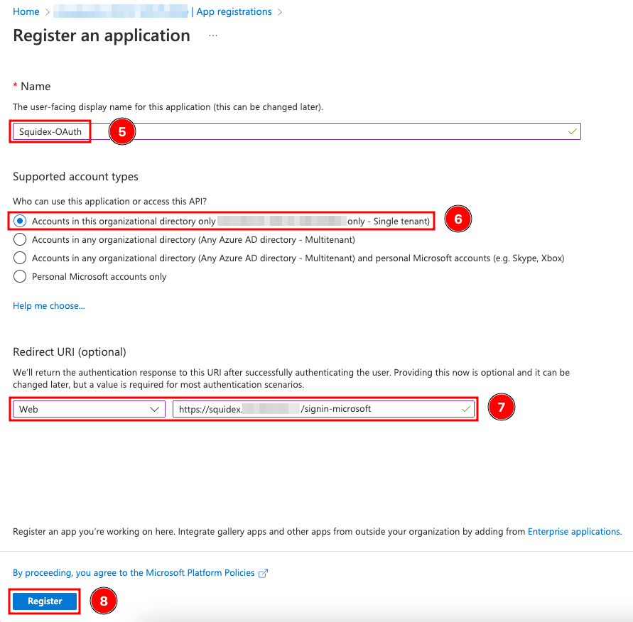<figcaption>
Register an app
</figcaption></figure>
5.  In the Azure AD app details page, copy the **Application (client) ID** (9) and **Directory (tenant) ID** (10) values as they will be needed later.

    <figure>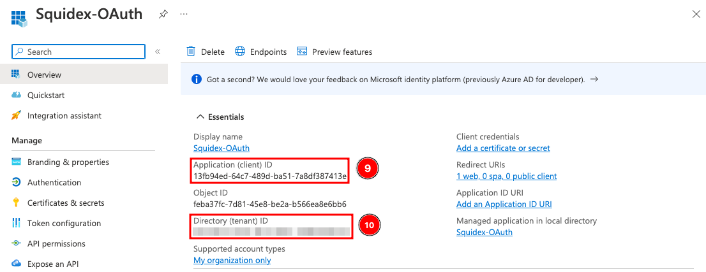<figcaption>
Note down App ID and Tenant ID
</figcaption></figure>
6.  Select **Certificates & Secrets** (11) from the left, next click **+ New client secret** \
    (12). Give a **Description** (13) for the secret and click **Add** (14).

    <figure>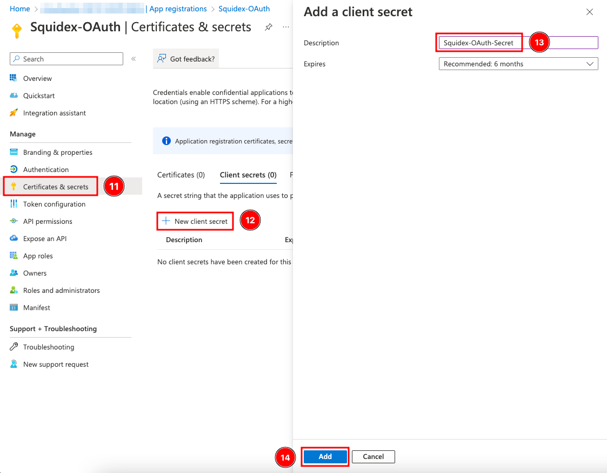<figcaption>
Generate client secret
</figcaption></figure>
7.  Copy the secret **Value** (15) shown in this step.

    <figure>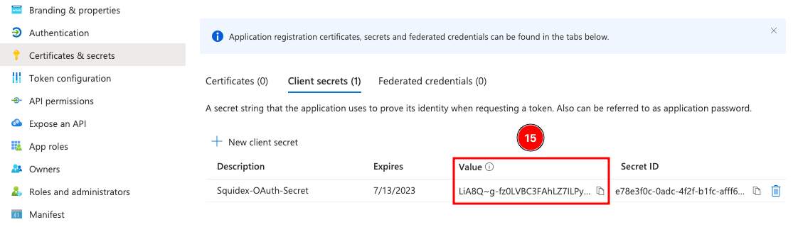<figcaption>
Note down client secret value
</figcaption></figure>
8.  Finally click on **Authentication** (16), check **ID tokens** (17) and click **Save** (18).

    

    <figure>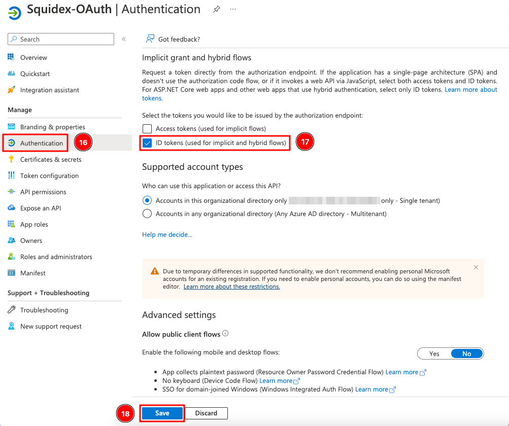<figcaption>
Enable ID token
</figcaption></figure>

    

## Configure Squidex for Azure AD&#x20;

In the next set of steps you will configure Squidex to use Azure AD. Depending on how Squidex is installed / running the steps to add these values will be different and unfortunately we cannot cover everything but in a nutshell, you want the following variables configured with the values collected earlier.&#x20;

When the values are `null`, Microsoft authentication is disabled.

| Variable                    | Description             |
| --------------------------- | ----------------------- |
| `IDENTITY__MICROSOFTCLIENT` | Application (client) ID |
| `IDENTITY__MICROSOFTSECRET` | Client Secret Value     |
| `IDENTITY__MICROSOFTTENANT` | Directory (tenant) ID   |

### Kubernetes / Helm Example

For example, if using Kubernetes Helm charts, these variables should be updated with the values in the `values.yaml` file.

<figure>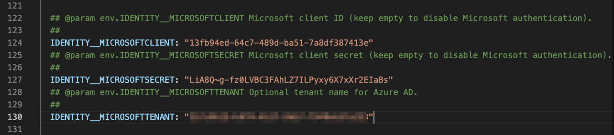<figcaption>
Sample helm values.yaml configuration for enabling Microsoft authentication 
</figcaption></figure>

### Azure App Service Example

Similarly, if Squidex is running on an Azure App Service, they are added to the _Configuration_ of the app service. An example is provided below.

<figure>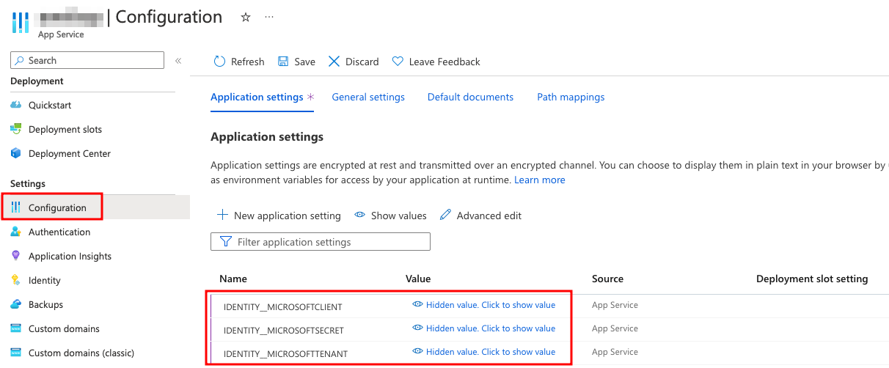<figcaption>
Sample app service configuration for enabling Microsoft authentication 
</figcaption></figure>

### Docker Example

When running it using Docker Compose (or Docker) they are updated in a `.env` file that is used by the `docker-compose.yml` file or you can update the values directly in the `docker-compose.yml` file itself (not recommended).&#x20;

The rest of the steps here refer to a Docker based containerized installation that uses the code/resources provided at [https://github.com/Squidex/squidex-hosting/tree/master/docker-compose](https://github.com/Squidex/squidex-hosting/tree/master/docker-compose)  and uses a `.env` file.

1.  In the `.env` file set the values. Note that these variables are only used in the context of Docker, they are referenced by the actual variables in the `docker-compose.yml` file.\
    \
    A sample screenshot is provided below.

    <figure>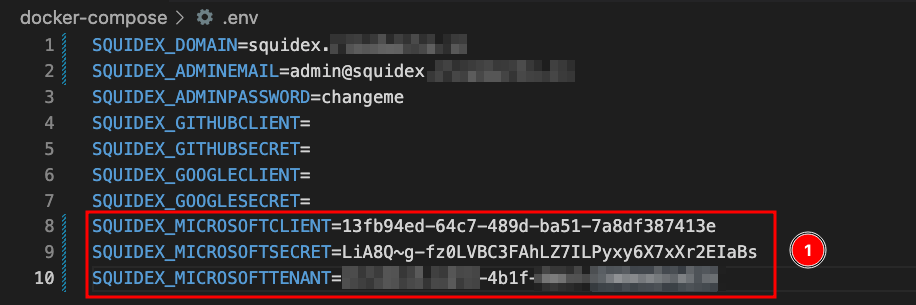<figcaption>
Sample docker environment values for enabling Microsoft authentication 
</figcaption></figure>
2. Next update the Squidex container by recreating it. Run the following command to do so:\
   \
   `docker-compose up -d --force-recreate squidex_squidex`\
   \
   `squidex_squidex` is the default name of the container if you are running the `docker-compose.yml` file provided by us.&#x20;

## Test the Configuration

1. Reload the Squidex page and click **Login to Squidex**.
2.  You should see a **Login with Microsoft** button. In the Signup section, you can also **Signup with Microsoft**.

    

    <figure>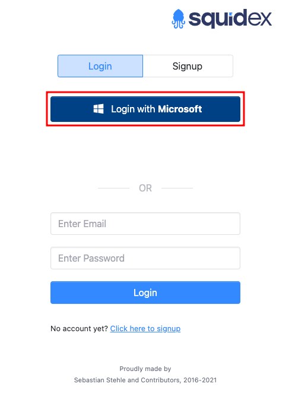<figcaption>
Signin with Microsoft
</figcaption></figure>

     

    <figure>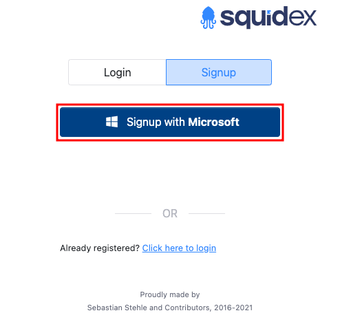<figcaption>
Signup with Microsoft
</figcaption></figure>

    

3. On the next screen, enter a username and password from the Azure AD tenant.
4.  When prompted for permissions, click **Accept**.

    

    <figure>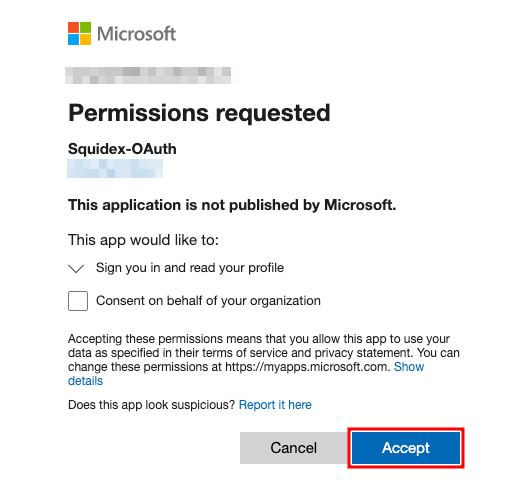<figcaption>
Accept permissions
</figcaption></figure>

    

5. You should be now be able to Signup or Login with a Microsoft account from the configured Azure AD tenant using OAuth.
