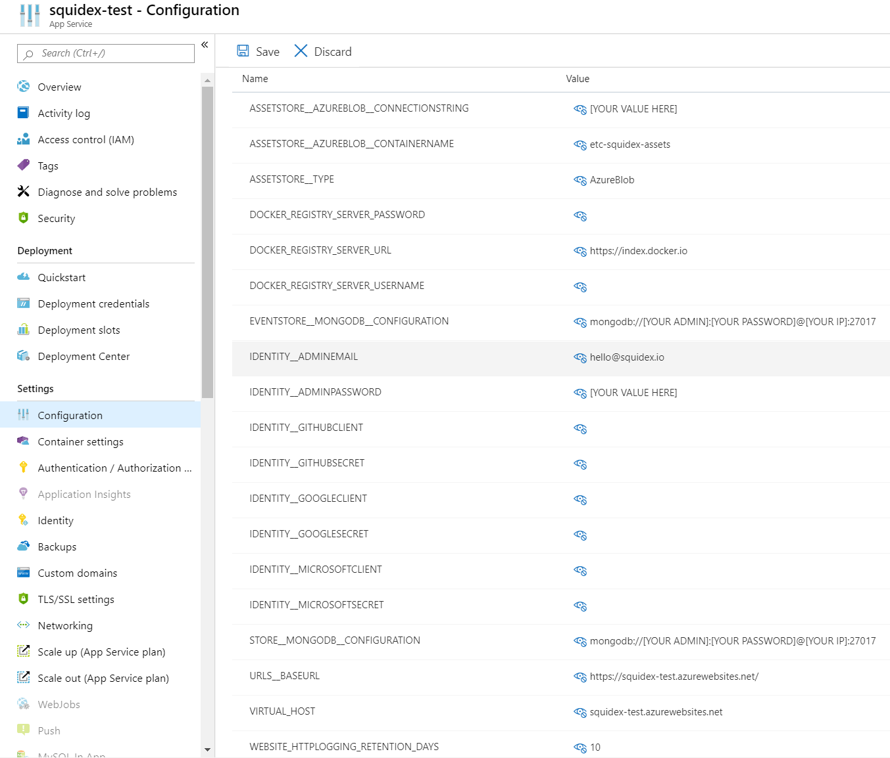

# Install on Azure

Please note that azure also supports Docker compose files so you can also follow the Docker tutorial, especially if it is important for you to be independent from your cloud provider.

In this tutorial I will also not teach you the basics of Azure. it is a very complicated product with thousands of features and you should be familiar with the basics before you follow this tutorial or just learn it on the fly.

## Requirements

Before you start you have to setup a few things first:

1. A resource group for all your squidex resources.
2. A service plan to host squidex (Linux).
3. A storage account for your assets and mongo db (general purpose v1 or v2).
4. [Azure-CLI](https://docs.microsoft.com/en-us/cli/azure/install-azure-cli?view=azure-cli-latest) installed.

## 1. Create the web app

Create a new web app with the following `Basics`:


Configure the `Docker` tab like this:


## 2. Enable logging

In the next step we enable logging. This makes diagnostics easier.

Go to your app service and scroll down to menu item `App Service logs` and turn on file logging. You can then use the `Log stream` to view all log entries.


## 3. Configure your storage account

Go to your storage account instance, choose `Files` and create a file share named 'etc-squidex-mongodb'.

Choose `Blobs` and create a container named 'etc-squidex-assets'.

Choose `Access Keys` and copy one of the keys for the setup of the MongoDB and one Connection String for the setup of the squidex asset store.

## 4. Create the container instance

The following setup of the container instance can only be done using the azure-cli at the moment. Open a terminal, login to azure using _az login_ and run the following command. 

```
  az container create --resource-group [YOUR VALUE HERE] --name mongodb --image mongo --azure-file-volume-account-name [YOUR VALUE HERE] --azure-file-volume-account-key "[YOUR VALUE HERE]" --azure-file-volume-share-name etc-squidex-mongodb --azure-file-volume-mount-path "/data/mongoaz" --ports 27017 --cpu 2 --ip-address public --memory 2 --os-type Linux --protocol TCP --command-line "mongod --dbpath=/data/mongoaz --bind_ip_all"
```

This will create a container Instance with a single container running mongo db. 

> **IMPORTANT**: At this point your MongoDB will run without authentication. Connect to it with a Tool of your choice like [Robo 3T](https://robomongo.org/) and create an admin user. After that run the above command again, but change the _--command-line_ argument to 
```
"mongod --dbpath=/data/mongoaz --bind_ip_all --auth"
```

## 5. Configure your application

Go to the `Configuration section` and choose `Application settings` to configure squidex.

> **IMPORANT**: After you change your configuration values you have to restart your container. In our case the only option was to stop the app service and then start it again. The restart button did not work. Please write a comment if you know a better solution.



Configuration values for external authentication providers are empty to turn them off.

## 6. All settings

All basic settings:

```json
[
  {
    "name": "ASSETSTORE__AZUREBLOB__CONNECTIONSTRING",
    "value": "[YOUR VALUE HERE]",
    "slotSetting": false
  },
  {
    "name": "ASSETSTORE__AZUREBLOB__CONTAINERNAME",
    "value": "etc-squidex-assets",
    "slotSetting": false
  },
  {
    "name": "ASSETSTORE__TYPE",
    "value": "AzureBlob",
    "slotSetting": false
  },
  {
    "name": "DOCKER_REGISTRY_SERVER_PASSWORD",
    "value": "",
    "slotSetting": false
  },
  {
    "name": "DOCKER_REGISTRY_SERVER_URL",
    "value": "https://index.docker.io",
    "slotSetting": false
  },
  {
    "name": "DOCKER_REGISTRY_SERVER_USERNAME",
    "value": "",
    "slotSetting": false
  },
  {
    "name": "EVENTSTORE__MONGODB__CONFIGURATION",
    "value": "mongodb://[YOUR ADMIN]:[YOUR PASSWORD]@[YOUR IP]:27017",
    "slotSetting": false
  },
  {
    "name": "IDENTITY__ADMINEMAIL",
    "value": "hello@squidex.io",
    "slotSetting": false
  },
  {
    "name": "IDENTITY__ADMINPASSWORD",
    "value": "[YOUR VALUE HERE]",
    "slotSetting": false
  },
  {
    "name": "IDENTITY__GITHUBCLIENT",
    "value": "",
    "slotSetting": false
  },
  {
    "name": "IDENTITY__GITHUBSECRET",
    "value": "",
    "slotSetting": false
  },
  {
    "name": "IDENTITY__GOOGLECLIENT",
    "value": "",
    "slotSetting": false
  },
  {
    "name": "IDENTITY__GOOGLESECRET",
    "value": "",
    "slotSetting": false
  },
  {
    "name": "IDENTITY__MICROSOFTCLIENT",
    "value": "",
    "slotSetting": false
  },
  {
    "name": "IDENTITY__MICROSOFTSECRET",
    "value": "",
    "slotSetting": false
  },
  {
    "name": "STORE__MONGODB__CONFIGURATION",
    "value": "mongodb://[YOUR ADMIN]:[YOUR PASSWORD]@[YOUR IP]:27017",
    "slotSetting": false
  },
  {
    "name": "URLS__BASEURL",
    "value": "https://squidex-test.azurewebsites.net/",
    "slotSetting": false
  },
  {
    "name": "VIRTUAL_HOST",
    "value": "squidex-test.azurewebsites.net",
    "slotSetting": false
  },
  {
    "name": "WEBSITE_HTTPLOGGING_RETENTION_DAYS",
    "value": "10",
    "slotSetting": false
  }
]
```

### More issues? 

It is very likely a configuration problem and not related to hosting under azure. Go to the [Configuration](configuration.md) page.
