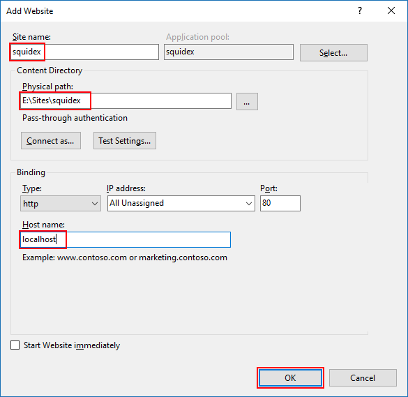

# Install on Windows with IIS

You can also read the guide from Microsoft, how to [Host ASP.NET Core on Windows with IIS](https://docs.microsoft.com/en-US/aspnet/core/host-and-deploy/iis/?view=aspnetcore-2.2#install-the-net-core-hosting-bundle)

## Supported operating systems

The following operating systems are supported:

* Windows 7 or later
* Windows Server 2008 R2 or later

## 1. Install all requirements

### 1.1. Install IIS

If you read this page you are probably familiar with IIS and have already installed it, if not you can read the docs:

> [IIS configuration (Microsoft)](https://docs.microsoft.com/en-US/aspnet/core/host-and-deploy/iis/?view=aspnetcore-2.2#iis-configuration)

### 1.2. Download and install .NET Core hosting bundle: 

Download the installer using the following link:

> [Current .NET Core Hosting Bundle installer (direct download)](https://dotnet.microsoft.com/download/thank-you/dotnet-runtime-2.2.0-windows-hosting-bundle-installer)

Ensure that the `ASPNETCORE_ENVIRONMENT` environment variable is set to `Production`

### 1.3. Download and install MongoDB

Following the official setup instructions:

> [Install MongoDB Community Edition on Windows](https://docs.mongodb.com/manual/tutorial/install-mongodb-on-windows/)

## 2. Install Squidex

#### 2.1. Download the binaries

Go to the release page and download the `binaries.zip` file from the latest release:

> [Squidex Releases](https://github.com/Squidex/squidex/releases)

Create a folder for your squidex installation and extract the archive to this folder.

### 2.2. Create the IIS site

1. In **IIS Manager** open the server's node in the **Connections** panel. Right-click the Sites folder. Select **Add Website** from the contextual menu.

2. Provide a **SiteName** and set the **Physical path** to the squidex folder. In this case we host Squidex at http://localhost:80



3. Under the server's node, select **Application Pools**.

4. Right-click the site's app pool and select **Basic Settings** from the contextual menu.

5. In the **Edit Application Pool** window, set the **.NET CLR version** to **No Managed Code**:


### 2.3. Configure Squidex

1. Go to your Squidex installation.

2. Create a file called `appsettings.Production.json` where we override the default settings. When you make an upload and download a newer release your customized settings will not be overriden.

3. Enter the following content and choose a custom username and password and the path to your assets.

```json
{
  "urls": {
    /*
     * The url where your squidex installation is available at.
     */
    "baseUrl": "http://localhost"
  },
  "identity": {
    /*
     * Disable authentication with google, github and microsoft login.
     */
    "googleClient": "",
    "googleSecret": "",
    "githubClient": "",
    "githubSecret": "",
    "microsoftClient": "",
    "microsoftSecret": "",
    /*
     * Initial username and password.
     */
    "adminEmail": "admin@squidex.io",
    "adminPassword": "save1q2w3e$R"
  },
  "assetStore": {
    "folder": {
      /*
       * Define where to store the assets.
       */
      "path": "E:\\Sites\\squidex\\assets"
    }
  },
  "orleans": {
    /*
     * Disable clustering!
     */
    "clustering": "Development"
  },
}
```

> PLEASE NOTE: The password must contain a lowercase and uppercase letter, a number and a special character.

4. Start the IIS site and go to http://localhost. Login and start editing.

## Troubleshooting

### Where can I see the logs?

Squidex logs to stdout. To forward the logs to a file, open `web.config` and set `stdoutLogEnabled="true"`.

### I get a HTTP Error 404.0 - Not Found

Ensure that the **Physical path** of your site points to the correct location.

### I get a HTTP Error 502.5 - Process Failure

It is very important that you restart IIS after you have installed .NET Core Windows Server Hosting. Restart the server or execute net stop was /y followed by net start w3svc from a command prompt with elevated permissions to pick up a change to the system PATH.

### I get a HTTP Error 504 - Method not allowed

This can happen when you try to make an API call with the PUT or DELETE Verb. For example when you use the Management UI. The reason is that WebDAV might be installed on your server and it blocks these verbs. You have to add the following lines to the `Web.config` file.

    <system.webServer>
        <modules runAllManagedModulesForAllRequests="false">
            <remove name="WebDAVModule" />
        </modules>
    </system.webServer>

### I only see a spinner on a white background

Ensure that the `ASPNETCORE_ENVIRONMENT` environment variable is set to `Production`.

Squidex logs all environment variables on the first start. Search for the following output in the logs:

```json
{
  "logLevel": "Information",
  "message": "Application started",
  "environment": {
    ...
    "aspnetcoreEnvironment": "Production",
  }
}
```

### More issues? 

It is very likely a configuration problem and not related to hosting under IIS. Go to the [Configuration](configuration.md) page.