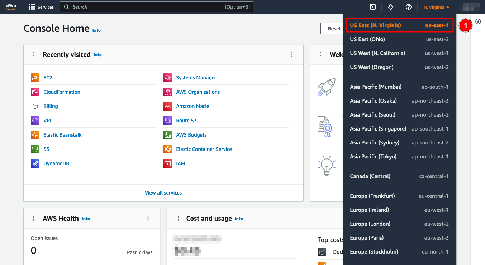
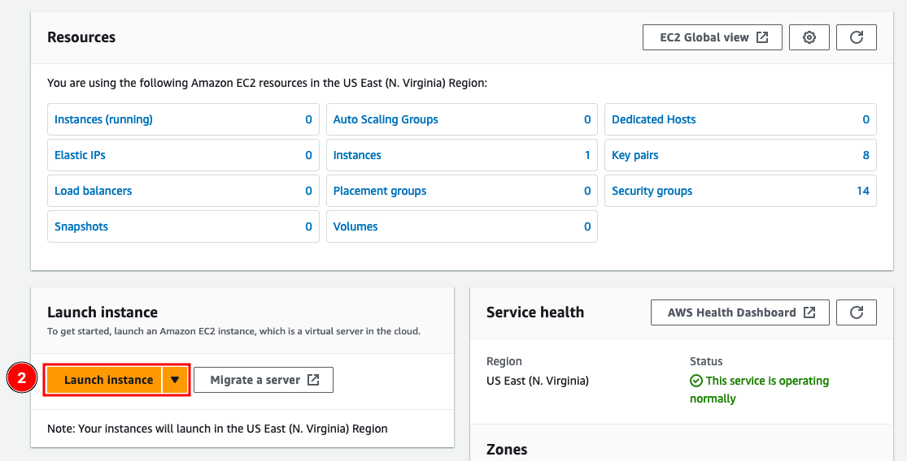
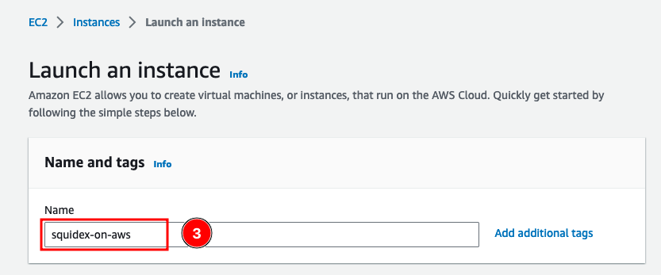
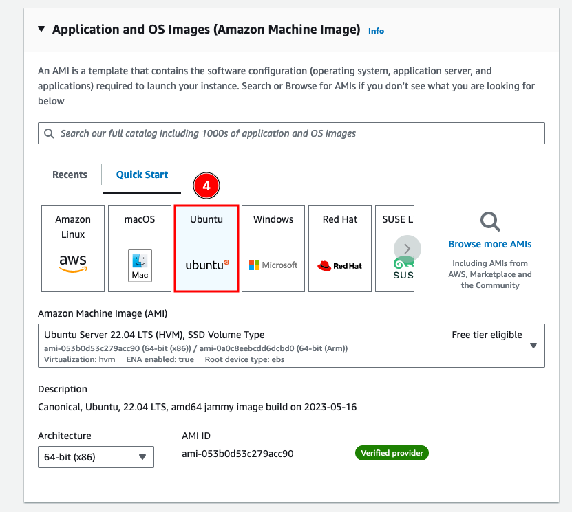
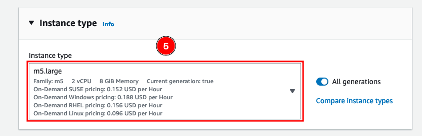
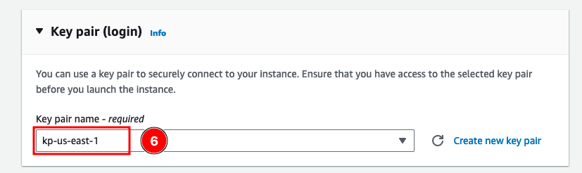
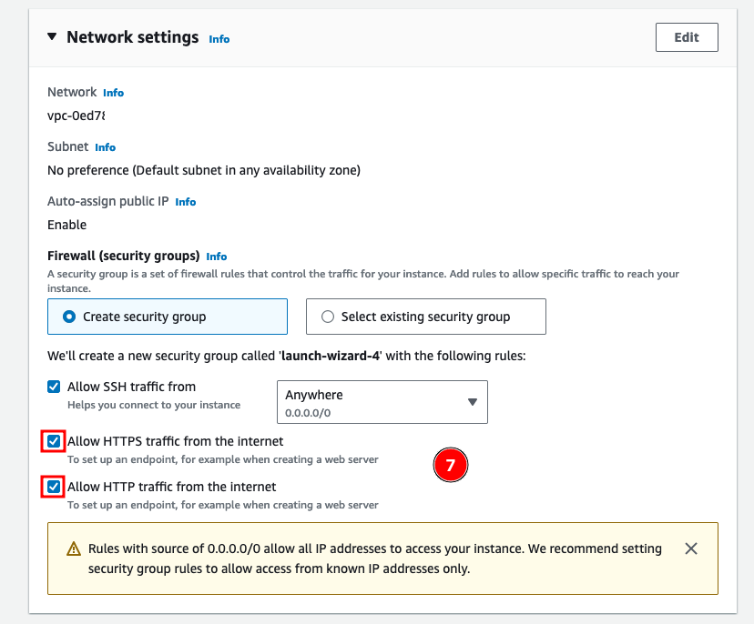
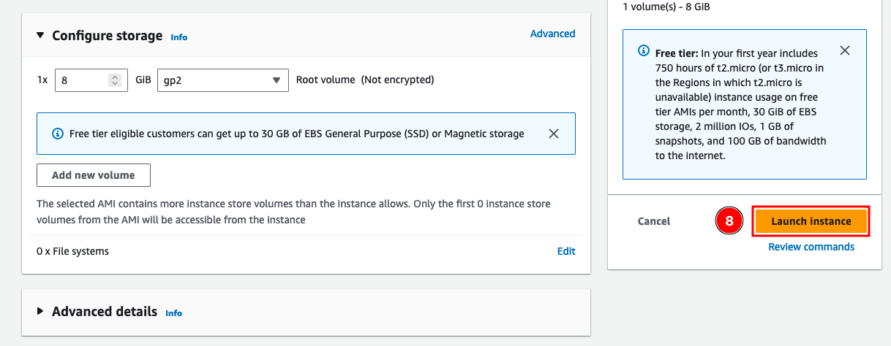
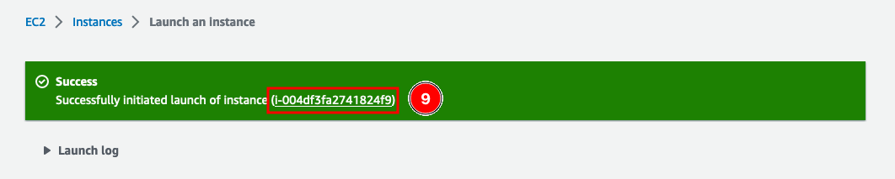
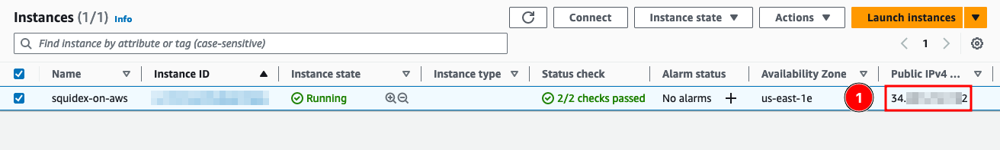

# Install on AWS EC2 using Docker

The instructions provided here help you get Squidex running on an AWS EC2 instance using Docker containers. It uses an EC2 instance running Docker and deploys Squidex along with NGINX for reverse proxy and MongoDB as the database. The data is stored outside of the containers for persistence but on the same instance (single volume).&#x20;

This tutorial does not cover the basics of AWS. You should be familiar with them before you begin with the instructions. We have attempted to keep them simple enough so they can be followed by anyone.

This tutorial runs all containers i.e. Squidex, MongoDB and NGINX in a single EC2 instance and may not be recommended for production environments.&#x20;

## Requirements

Before you start ensure you have:

1. An active AWS account.&#x20;
2. A domain name to be used with Squidex.

## 1. Launch an EC2 Instance

To launch an instance, login to AWS Console and select the desired **region** (1) from the drop down on the right. For this demonstration _us-east-1_ has been used.

<figure><figcaption><p>Login to AWS and select a Region</p></figcaption></figure>

Navigate to the EC2 Dashboard at [https://us-east-1.console.aws.amazon.com/ec2/home](https://us-east-1.console.aws.amazon.com/ec2/home).

Click **Launch instance** (2) to begin.


This demonstration uses a lot of the default values and is just a quick way to get an EC2 instance running. One can always customize the network, storage and other parameters which is beyond the scope of this guide.&#x20;


<figure><figcaption><p>Launch an instance</p></figcaption></figure>

Start by giving a name for the **EC2 instance** (3).&#x20;

<figure><figcaption><p>Name the EC2 instance</p></figcaption></figure>

Next, select **Ubuntu** (4) as the AMI.

<figure><figcaption><p>Select an AMI</p></figcaption></figure>

Select an **Instance type** (5). We recommend at least the **m5.large**. But for sandbox/experimental requirements you can choose a lower configuration.&#x20;

<figure><figcaption><p>Select an Instance type</p></figcaption></figure>

Select a **Key pair** (6) to be able to connect to the EC2 instance later. &#x20;


You must have an AWS Key Pair and select here, otherwise you will not be able to login to the EC2 instance later. If required, click **Create new key pair** to create one and then select it from the list.


<figure><figcaption><p>Select a Key pair</p></figcaption></figure>

For Network settings ensure **Allow HTTP** and **Allow HTTPS** (7) traffic is checked. For this demonstration we will leave the rest to their defaults.

<figure><figcaption><p>Select Network settings</p></figcaption></figure>

Similarly, for this guide we will not make any changes to storage but one can choose a larger disk size based on requirements. Click **Launch instance** (8) when ready.

<figure><figcaption><p>Configure Storage and Launch</p></figcaption></figure>

This should initiate the launch the EC2 instance.  Click on the instance ID (9) to navigate to the instance details.

<figure><figcaption><p>EC2 instance successfully initiated</p></figcaption></figure>

## 2. Configure DNS

Once the instance is ready, copy its **Public IPv4** (1) address and configure the DNS mapping i.e ensure that the domain you wish to use with Squidex is pointing to this IP. This typically involves creating an A record to the domain/subdomain you wish to use for Squidex. It is recommended to wait for the DNS changes to propagate before proceeding further.&#x20;

The mapping is necessary for successful deployment of Squidex and is also used to request SSL certificates.

<figure><figcaption><p>Retrieve Public IP</p></figcaption></figure>

## 3. Connect and Install Docker

Next, connect to the EC2 instance using SSH. Use the key pair selected during instance launch.

```bash
ssh -i path/to/keypair.pem ubuntu@[PUBLIC IPv4]
```


_ubuntu_ is the default username for Ubuntu AMI.


At this point the instance does not have Docker. We will go ahead and install it by running the following commands:&#x20;

```
# Install Docker
curl -fsSL https://get.docker.com -o get-docker.sh
sh get-docker.sh

# Add current user to docker group
sudo usermod -aG docker $USER
```

Next, logout and login back to the EC2 instance and verify that Docker commands run without the need for _sudo_.&#x20;


It is important to logout and login to apply the changes made earlier where the current user was added to docker group.


```
docker --version
```

## 4. Deploy Squidex

Once Docker is installed, the instructions to run Squidex using Docker containers is the same as [install-on-docker.md](install-on-docker.md "mention").

We provide multiple Docker Compose files to quickly get started with Squidex. They can be downloaded from [https://github.com/Squidex/squidex-hosting/tree/master/docker-compose](https://github.com/Squidex/squidex-hosting/tree/master/docker-compose).

In the demonstration below we will run Squidex with NGINX and MongoDB using the `docker-compose-nginx.yml` file. Start by downloading the required files.

```bash
// Download the yml file
wget https://raw.githubusercontent.com/Squidex/squidex-hosting/master/docker-compose/docker-compose-nginx.yml

// Download the environment file
wget https://raw.githubusercontent.com/Squidex/squidex-hosting/master/docker-compose/.env
```

Edit the `.env` file and set the following variables:

<table><thead><tr><th width="294.5">Variable</th><th>Description</th></tr></thead><tbody><tr><td><code>SQUIDEX_DOMAIN</code></td><td>Your domain name, that you want to use for your installation. </td></tr><tr><td><code>SQUIDEX_ADMINEMAIL</code></td><td>The email address of the admin user. You can leave it empty to create a new user with the setup page when you visit your Squidex installation in the browser.</td></tr><tr><td><code>SQUIDEX_ADMINPASSWORD</code></td><td>The password of the admin user. Must contain a lowercase and uppercase letter, a number and a special character. You can leave it empty to create a new user with the setup page when you visit your Squid</td></tr></tbody></table>

The rest variables can be empty for now.

The data files, such as assets and the MongoDB database files will be stored, outside of the Docker container for persistence and to simplify backups. The default path `/etc/squidex` will be created by Docker automatically.

Run the docker-compose file with the following command:

```
docker compose -f docker-compose-nginx.yml up -d
```


Using `-f docker-compose-nginx.yml` (or providing absolute path of the yaml file) is mandatory else the command will fail.&#x20;


Docker compose will download all images and start them in the right order.

To access Squidex, navigate to the domain name used in this installation, for example [https://your\_domain.com](https://your\_domain.com) and you are ready to go.

For further help, go to [Configuration](https://docs.squidex.io/01-getting-started/installation/configuration).

