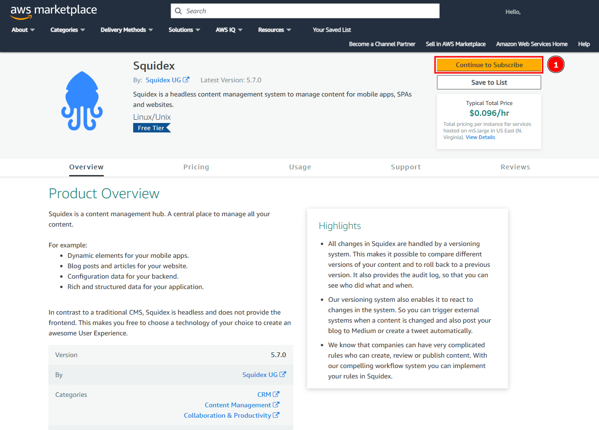
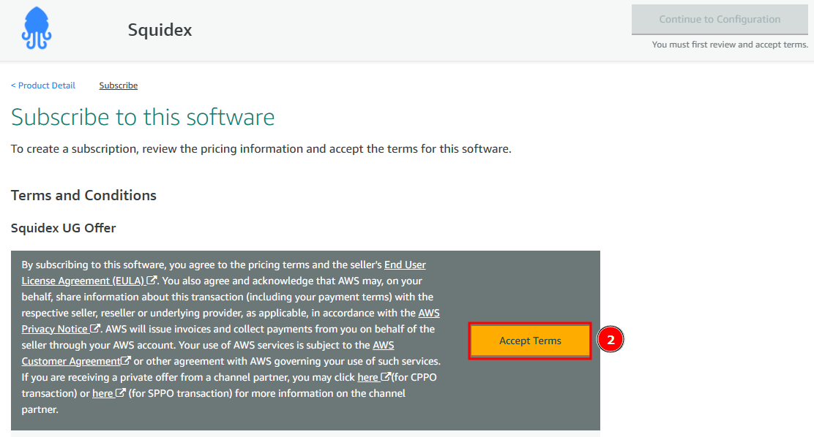
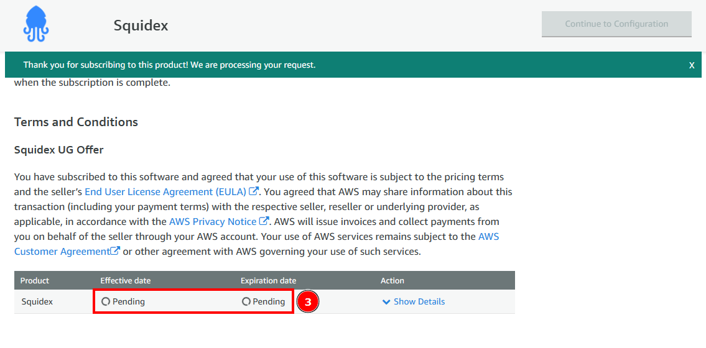
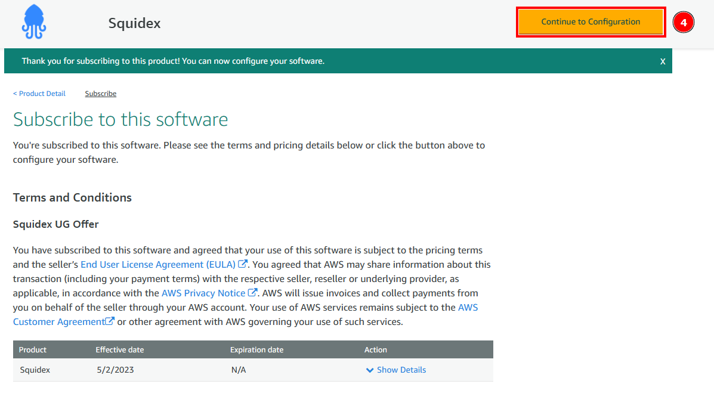
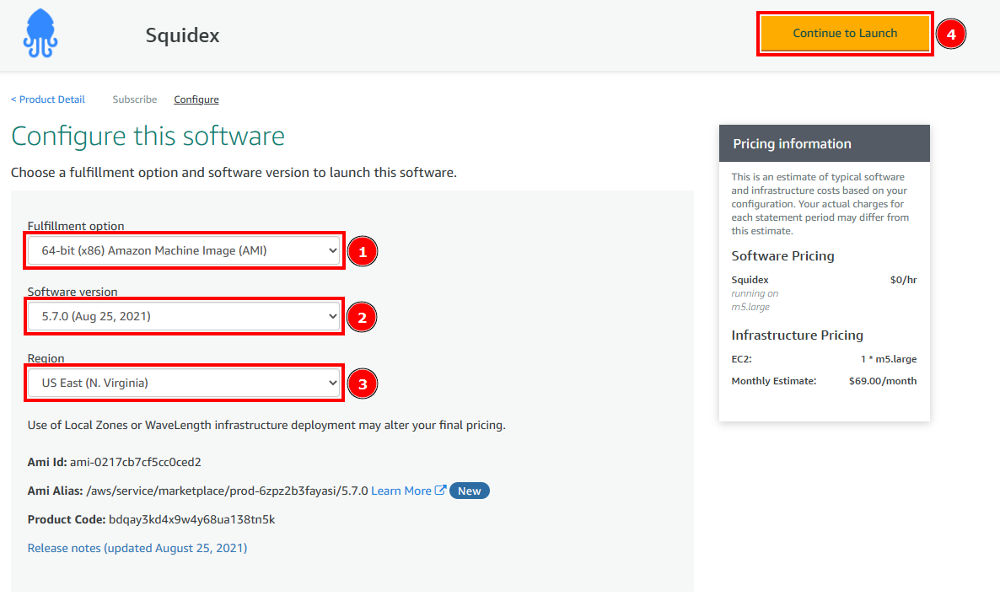
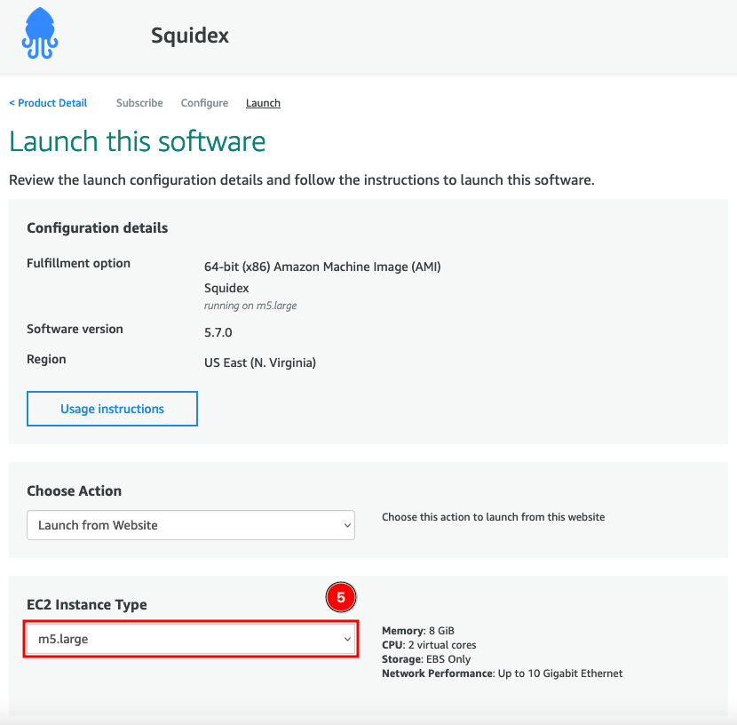
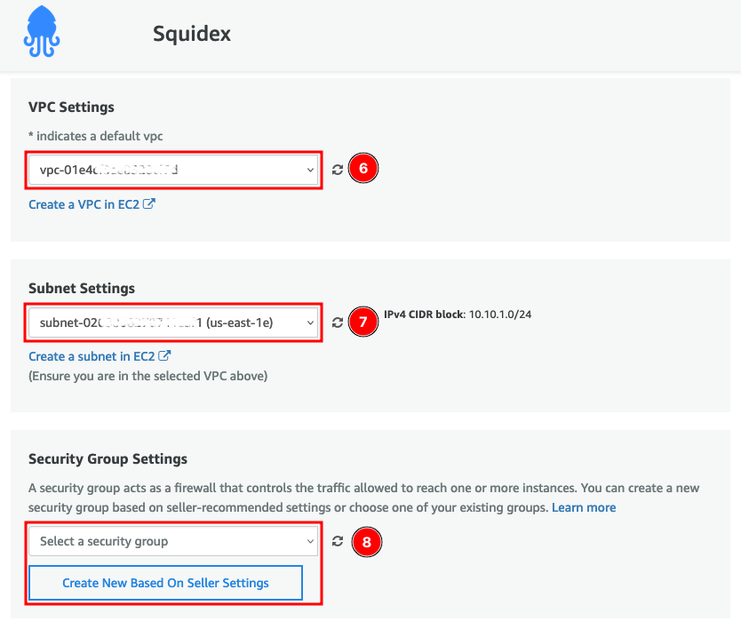
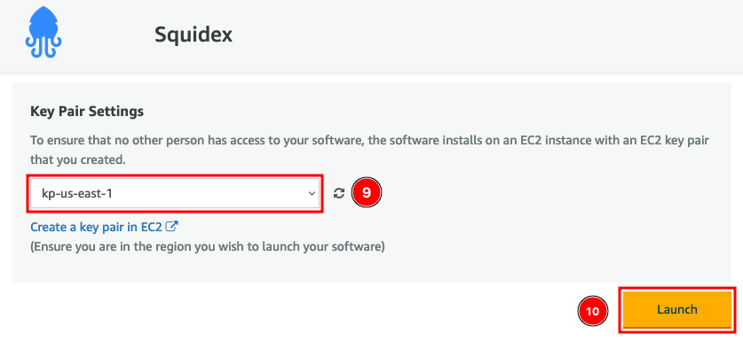
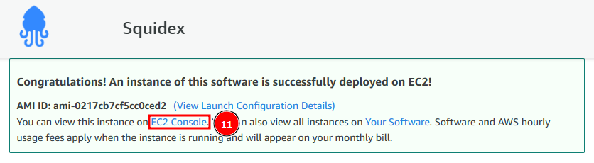
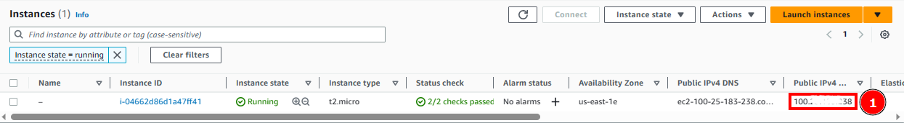

# Install on AWS

## 1. Use the AWS Marketplace Image

Squidex is available in the AWS Marketplace as a listing. To begin, click the **Deploy to AWS** button below.

[](https://aws.amazon.com/marketplace/pp/prodview-zvohj6i2bye7w)

## 2. Subscribe

Squidex is free, but you still need to subscribe to the Amazon Marketplace listing.

In the listing page, click **Continue to Subscribe** (1).

<div align="left">

<figure><figcaption><p>Subscribe to AWS marketplace listing</p></figcaption></figure>

</div>

Read the EULA and accept the terms by clicking **Accept Terms** (2).

<div align="left">

<figure><figcaption><p>Accept terms to subscribe to the listing</p></figcaption></figure>

</div>

Wait until AWS processes your subscription (3).

<div align="left">

<figure><figcaption><p>Subscription being processed by AWS</p></figcaption></figure>

</div>

Once that is ready, click **Continue to Configuration** (1).

<div align="left">

<figure><figcaption><p>Continue to Configuration</p></figcaption></figure>

</div>

## 3. Instance Configuration

Pick a **Delivery Method** (1), a **Software Version** (2) and a **Region** (3), then click **Continue to Launch** (4).

<div align="left">

<figure><figcaption><p>Choose a software configuration</p></figcaption></figure>

</div>

This will take you to the configuration of the EC2 instance to be launched.

Pick the **EC2 Instance Type** (5). We recommend at least a **m5.large**.

<div align="left">

<figure><figcaption><p>Choose an instance type</p></figcaption></figure>

</div>

Scroll down and select a **VPC** (6) and **Subnet** (7) from the pre-populated list. Next, select a **Security Group** (8) or click **Create New Based On Seller Settings** to automatically create one based on Squidex requirements.&#x20;

<figure><figcaption><p>Choose network configuration and security group</p></figcaption></figure>

Finally, select a **Key Pair** (9) and click **Launch** (10).&#x20;


You must have an AWS Key Pair and selected here, otherwise you will not be able to login to the EC2 instance later.


<div align="left">

<figure><figcaption><p>Select key pair and launch</p></figcaption></figure>

</div>

Once the instance is launched, go to the **EC2 Console** (11).

<figure><figcaption><p>EC2 instance successfully deployed</p></figcaption></figure>

## 4. Connect

Once the instance is ready, take its **Public IPv4** (1) and connect to it using SSH and the key pair you selected previously.

<figure><figcaption><p>Retrieve Public IP</p></figcaption></figure>

```bash
ssh -i path/to/keypair.pem ubuntu@[PUBLIC IP]
```

Once you are logged in, run the setup command and follow the on-screen instructions.

```bash
/opt/squidex/setup-squidex.sh
```

You will be asked to enter the domain here. All other values are optional. The installation script will start _docker-compose,_ download all images and start them in the right order.

After you make sure the domain you configured is pointing to the public IP of your instance and that the DNS changes propagated, go to [https://your\_domain.com](https://your\_domain.com) and you should be ready to go.

For further help, go to [Configuration](https://docs.squidex.io/01-getting-started/installation/configuration).

## Troubleshooting

For other issues, it is likely that you have a configuration problem not related to hosting under Docker. Checkout the following documentation:


[configuration.md](../configuration.md)

