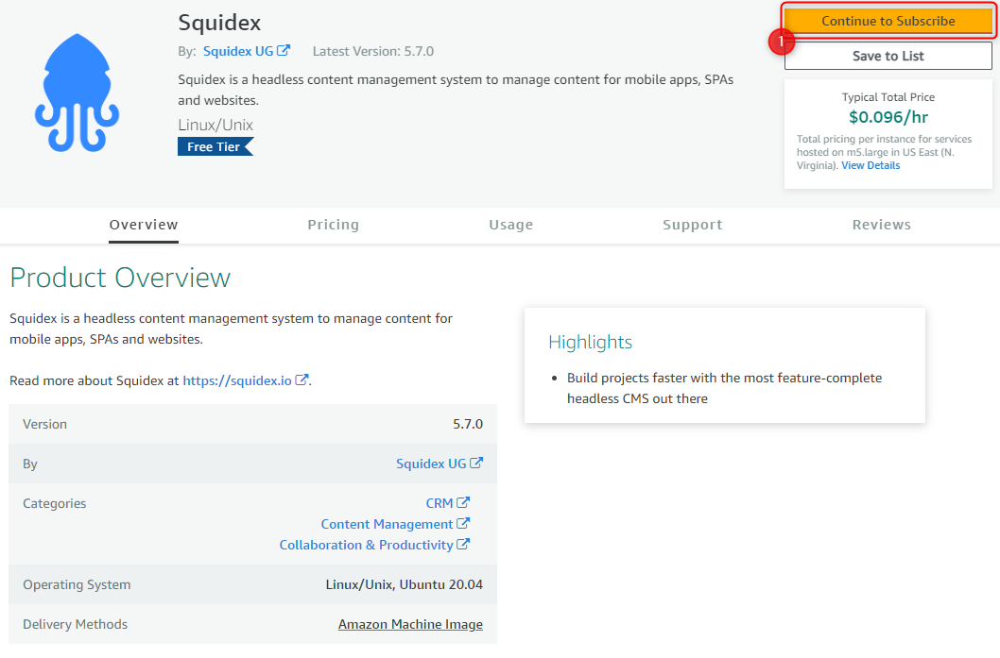
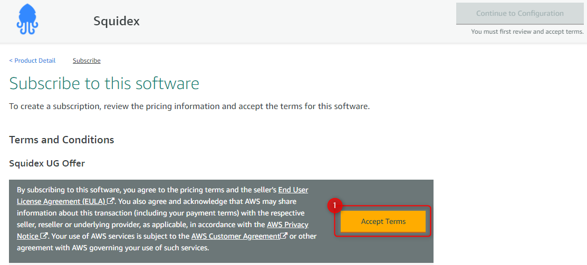
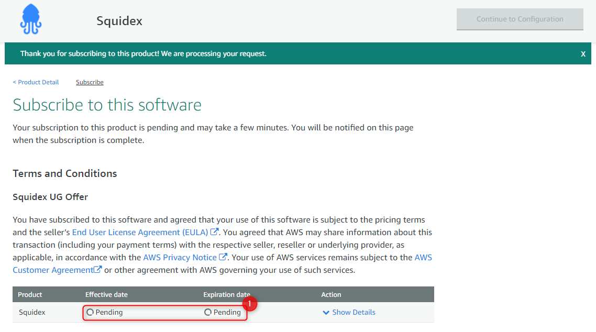
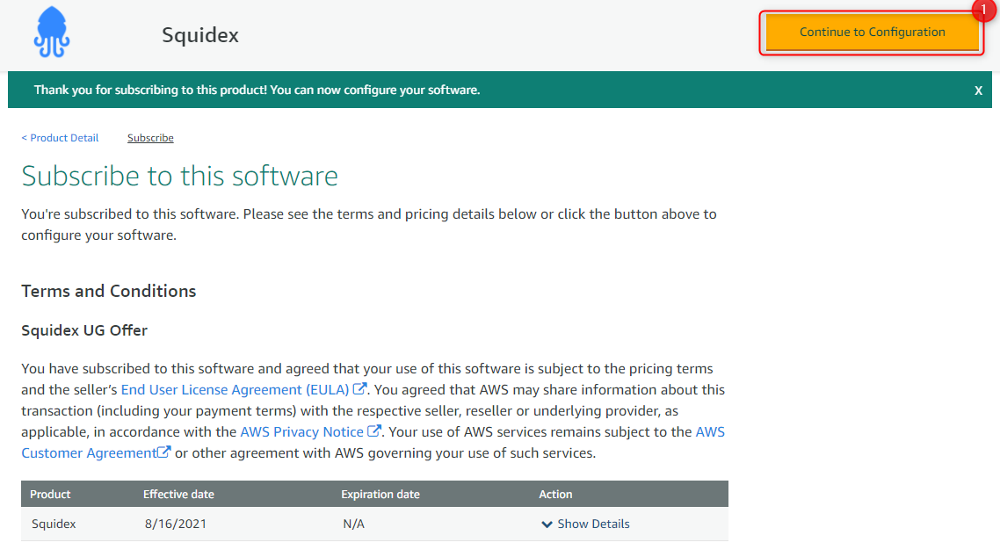
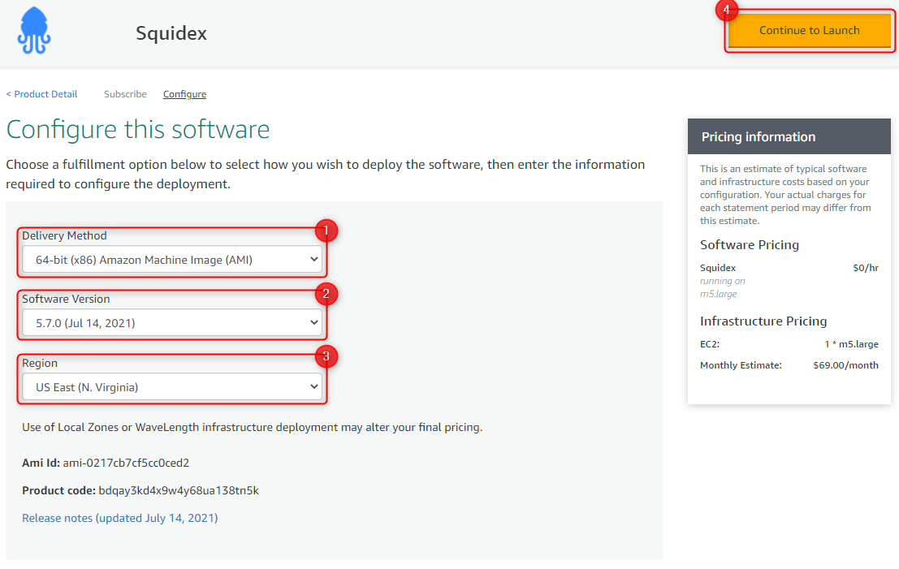
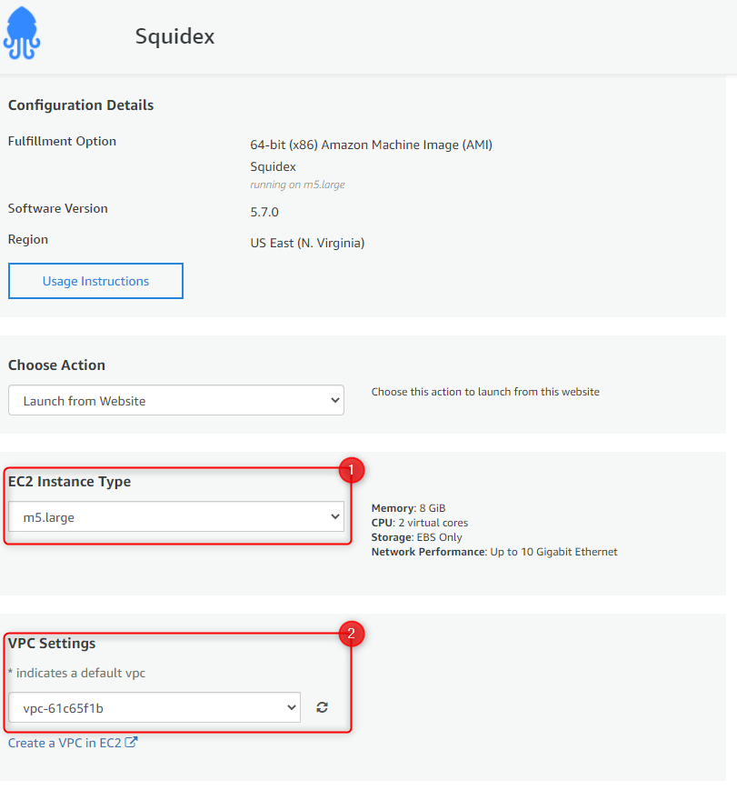
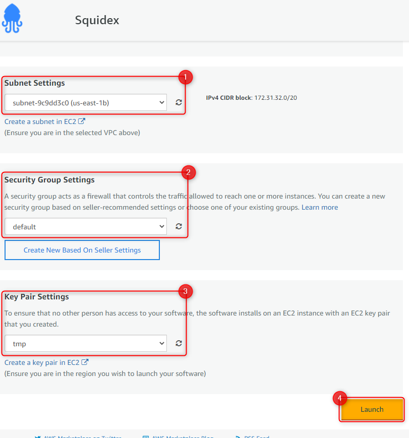
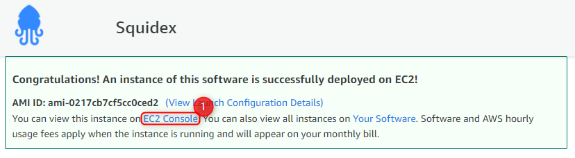
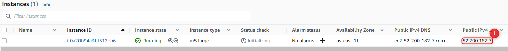

# Install on AWS

## 1. Use the AWS Marketplace Image

[](https://aws.amazon.com/marketplace/pp/prodview-zvohj6i2bye7w)

## 2. Subscribe

Squidex is free, but you still need to subscribe to the Amazon Marketplace listing.

In the listing page, click **Continue to Subscribe** (1).



Read the EULA and accept the terms by clicking **Accept Terms** (1).



Wait until AWS process your subscription.



Once that is ready, click **Continue to Configuration** (1).



## 3. Instance Configuration

Pick an **architecture** (1), a **software version** (2) and a **region** (3), then click **Continue to Launch** (4).



This will take you to the configuration of the EC2 instance to be launched.

Pick the **EC2 Instance Type** (1). We recommend at least a **m5.large**.



Select the **VPC**, **Subnet**, **Security Group** and **Key Pair**, and then click **Launch**.



Once the instance is launched, go to the **EC2 Console** (1).



## 4. Connect

Once the instance is ready, take it's **Public IP** (1) and connect to it using SSH and the key pair you selected previously.



```bash
ssh -i path/to/keypair.pem ubuntu@[PUBLIC IP]
```

Once you are logged in, run the setup command and follow the on-screen instructions.

```bash
/opt/squidex/setup-squidex.sh
```

You will be asked to enter the domain here. All other values are optional. The installation script will start docker-compose then and download all images and start them in the right order.

After you make sure the domain you configured is pointing to the public IP of your instance and that the DNS changes propagated, go to [https://your\_domain.com](https://your\_domain.com) and you should be ready to go.

For further help, go to [Configuration](https://docs.squidex.io/01-getting-started/installation/configuration).

## Troubleshooting

It is very likely a configuration problem and not related to hosting under Docker. Checkout


[configuration.md](../configuration.md)

