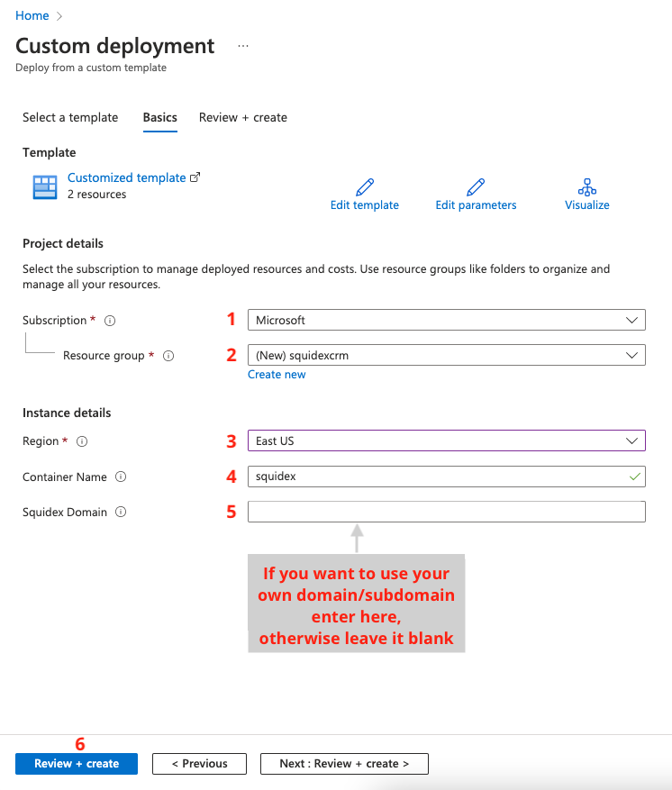
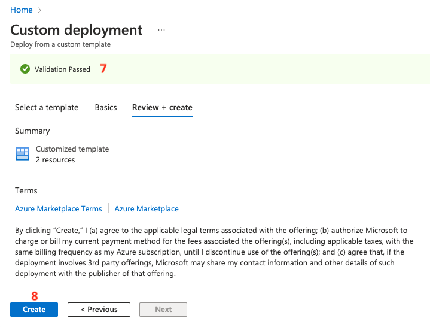
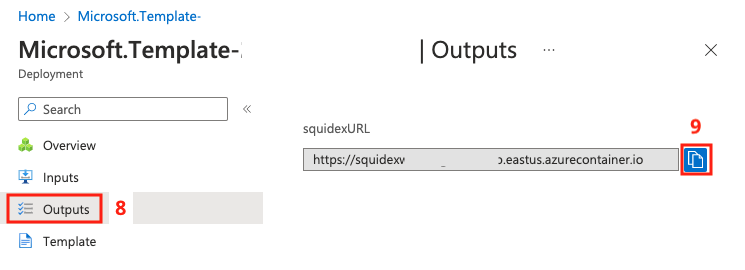
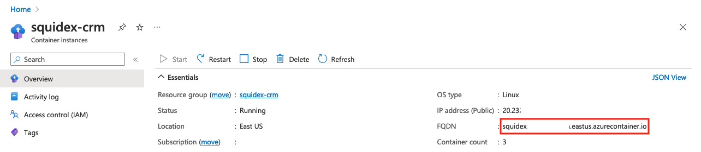
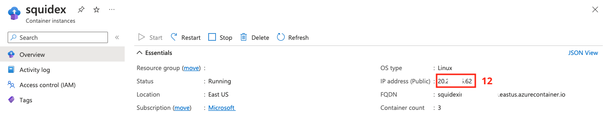
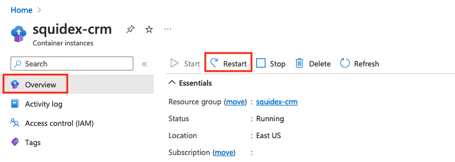
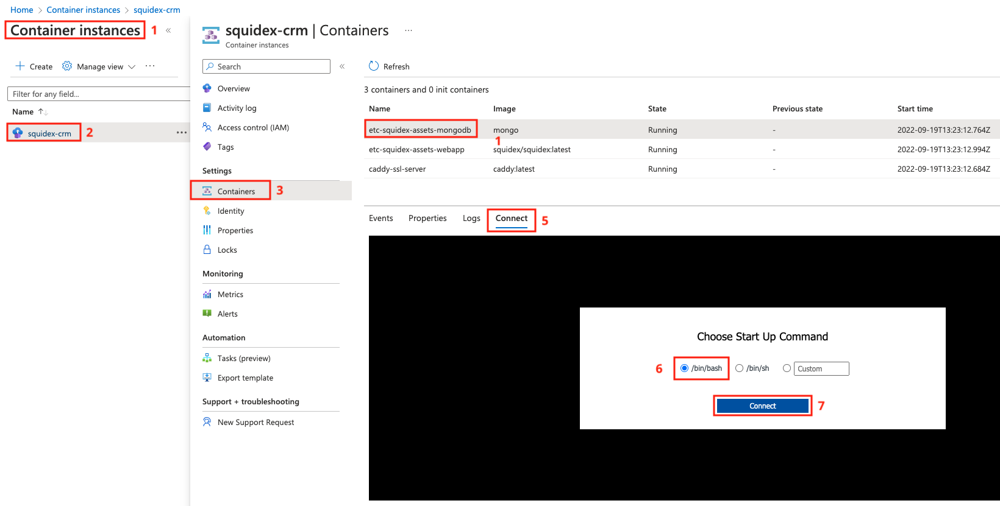
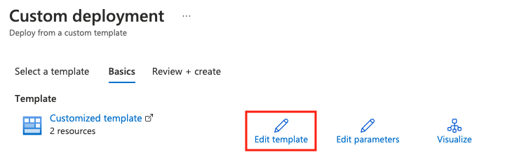
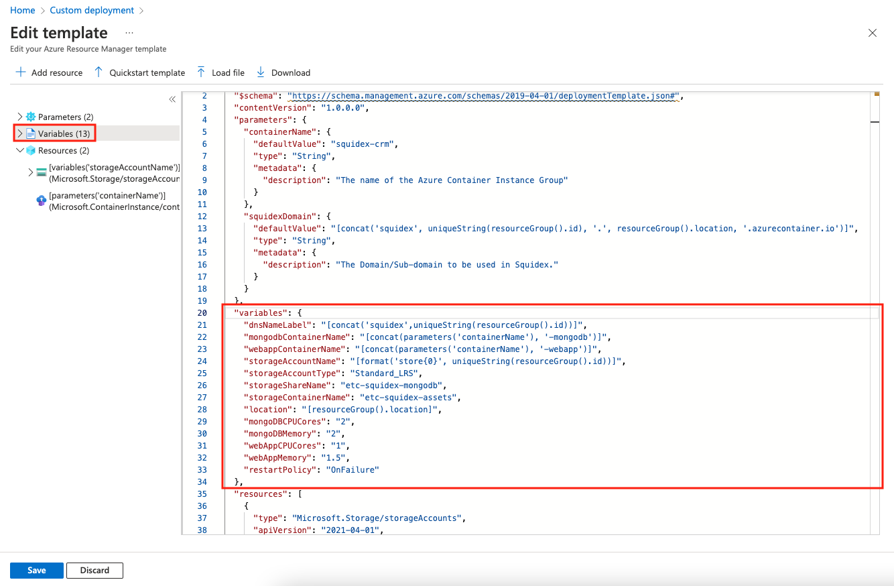

# Install on Azure using ARM

This version of the installation tutorial deploys Squidex along with MongoDB (for datastore) and Caddy (for reverse proxy along with SSL) as a [Container Group](https://learn.microsoft.com/en-us/azure/container-instances/container-instances-container-groups) in Azure using an [Azure Resource Manager or ARM](https://learn.microsoft.com/en-us/azure/azure-resource-manager/templates/overview) template. The approach is called _Infrastructure as Code_.

The tutorial does not cover the basics of Azure. You should be familiar with them before you begin with the installation instructions.

This tutorial runs MongoDB as a single container and is recommended for non-production or trial environments. For production environments, it is best to use one of the MongoDB Atlas (or Enterprise) offerings from [Azure marketplace](https://azuremarketplace.microsoft.com/en-us/marketplace/apps?search=mongodb\&page=1), which provides capabilities such as High Availability.

Use this tutorial as a getting started guide in Azure to explore Squidex and use it as a Dev/Sandbox environment. This setup may not be recommended for a production environment.

## Prerequisites

Before you begin, ensure you meet the following requirements:

1. An active Azure subscription.
2. The following providers registered in your Azure subscription:
   * Microsoft.ContainerInstance
   * Microsoft.Storage

## Deployment Specifications & Other Details

The ARM template creates the following Azure resources:

* An Azure Storage Account
  * Azure Container
  * Azure Share
* Azure Container Instances (Group)
  * Squidex Web App Container (latest image)
  * MongoDB Container (latest image)
  * Caddy container (latest image)

**Important Details**

* Default resource allocations
  * Squidex container: **1 vCPU and 1.5 GiB memory**
  * MongoDB container: **2 vCPU and 2 GiB memory**
  * Caddy container: **1 vCPU and 1.5 GiB memory**
* Squidex and MongoDB containers remain private and are not exposed to public.
* Squidex talks to MongoDB without authentication (mongodb://localhost:27017). Since MongoDB is private it cannot be accessed from outside, hence secure to an extent. **With the current setup you cannot connect using an external client like MongoDB Compass. You can however connect from Azure Container Instance, click** [**here**](install-on-azure-arm.md#connecting-to-mongodb-instance) **for instructions**
* Caddy reverse proxies to the Squidex Web App container.
* An FQDN is provided by Azure Container Instance, _Caddy_ provides SSL for this as the FQDN does not come with SSL. This FQDN is set as the `URLS__BASEURL` and `VIRTUAL_HOST` for Squidex configuration.


NOTE: If you wish to modify any of the variables such as vCPU, Memory etc., you can do so by editing the ARM template. Click \[here]\(#modifying-arm-variables) for basic instructions.


## 1. Launch the ARM Template

Simply click **Deploy to Azure** button to load the template in Azure Portal, fill in a few details (instructions below) and deploy Squidex.

## 2. Configure Details

On the Custom deployment page complete the following steps to submit the deployment.

1. Select your **Subscription** from the list.
2. Select an existing **Resource group** or click **Create new** to create a new Resource group.
   * If creating a new Resource group, enter a name and click Ok.
3. Select your preferred **Region** from the list.
4. Enter a name for the Container Group in **Container Name** field. (It uses the Resource Group name by default but you are free to change it)
5. If you wish to provide your own Domain/Sub-domain (e.g. example.com or squidex.example.com) enter it in the **Squidex Domain** field, otherwise leave it blank.
6. Click **Review + create**.

1. Ensure that the _validation_ is successful.
2. Click **Create** to submit the deployment.

The deployment process will take a few minutes. (Preferably do not navigate away from this page)

## 3. Access Squidex

1. Once the deployment is complete, Click **Outputs** in the deployment page to retrieve the URL.
2. Copy the URL.

Alternatively, you can also retrieve the FQDN anytime from the Azure Container Instances blade.


NOTE: This is only for deployments where custom domain is NOT provided


## 4. Update DNS Record (For Own Domain Deployments Only)

1. Navigate to Azure Container Instances page, click on the Container instance (i.e. squidex) to access the details.
2. Under Overview, to the right you should find the **IP Address (Public)** value, copy it.

1. Now access your domain control panel, and create an **A Record** pointing your domain to this IP address.
2. Continue with the next steps once the DNS propagation is done, this will depend on your domain provider.


NOTE: The SSL certificates are not generated (by Caddy) until the DNS resolution works


## 5. Completing Squidex Installation

1. Open the URL in a browser to load the _Squidex Installation Page_.

**It may take a few minutes before the certificates are generated and the URL starts working. For own domain scenarios this process may be even take longer**

1. Create the Admin User to complete the installation and login to Squidex.

## Azure Troubleshooting

#### Validation Failed

* Ensure all the fields have been populated.
* If you are rerunning the ARM template (either another installation or due to a previous failure) and using the same names, change them (or delete previously created resources).

#### Deployment failed

In the Microsoft template deployment window click _Deployment failed. Click here for more details_ to view the error details and look for clues. This tutorial does not go into the details of Azure troubleshooting.


NOTE: Use \_Redeploy\_ to resubmit the deployment again (after fixing errors). This continues the operation instead of creating a fresh deployment.


#### Containers in _waiting_, _failed_ or _terminated_ status.

* Restart the Azure Container Instance

## Squidex Issues

It is very likely a configuration problem and not related to Azure. Please visit the following page:

[Configuration](configuration.md)

## Connecting to MongoDB Instance

1. On the Azure Portal, navigate to **Container Instances** page
2. Click on your Container Instance (e.g. `squidex-crm`)
3. Select _Containers_ from the left navigation menu
4. Select the MongoDB container (i.e. `etc-squidex-assets-mongodb`) by clicking on it
5. Select the **Connect** tab
6. Ensure _/bin/bash_ is selected
7. Click **Connect** again

This will drop you into the Container Shell. Type `mongosh` to connect to MongoDB shell.

## Modifying ARM Variables

1. After clicking _Deploy to Azure_ button, click **Edit template**.

1. Click **Variables** on left and this should show the variables section on the right.
2. You can now change any of the variables such as `mongoDBCPUCores` or `mongoDBMemory` etc.

