# Install on Azure

The instructions provided help you to get your Squidex installation running on an Azure WebApp with the assets & MongoDB data hosted on Azure Storage and MongoDB running on an Azure Container Instance.


Please note, that Azure also supports Docker Compose files so you can follow the Docker tutorial, especially if it is important for you to be independent from your Cloud provider (avoid vendor lock-in).


This tutorial does not cover the basics of Azure. You should be familiar with them before you begin with the installation instructions. We have attempted to keep the instructions simple enough so they can be followed by anyone.

This tutorial demonstrates running MongoDB as a single container and is recommended for non-production or trial environments. For production environments, it is best to use one of the MongoDB Atlas (or Enterprise) offerings from [Azure Marketplace](https://azuremarketplace.microsoft.com/en-us/marketplace/apps?search=mongodb\&page=1) with at least 3 members for High Availability etc.

## Requirements

Before you start you have to setup a few things first:

1. An active Azure subscription
2. A Resource Group for all your Squidex resources.
3. An App Service plan (Linux) to host Squidex.
4. A _Standard (General Purpose v2)_ Storage Account for assets and MongoDB.
5. An installation of the [Azure-CLI](https://docs.microsoft.com/en-us/cli/azure/install-azure-cli?view=azure-cli-latest) on your developer machine (optional).
6. An installation of a MongoDB tool like [MongoDB Compass](https://www.mongodb.com/try/download/compass2) on your developer machine (optional).
7. The [Microsoft.ContainerInstance](https://azure.microsoft.com/en-gb/services/container-instances/) provider registered in your Azure subscription.

## 1. Setup your Storage Account

Execute the following steps in the storage account.


You must have a storage account before continuing. The steps do not cover the process of storage account creation.


1.  Click **Containers** (1) under _Data Storage_ and then click **+ Container** (2) to load the _New container blade_.\


    <figure>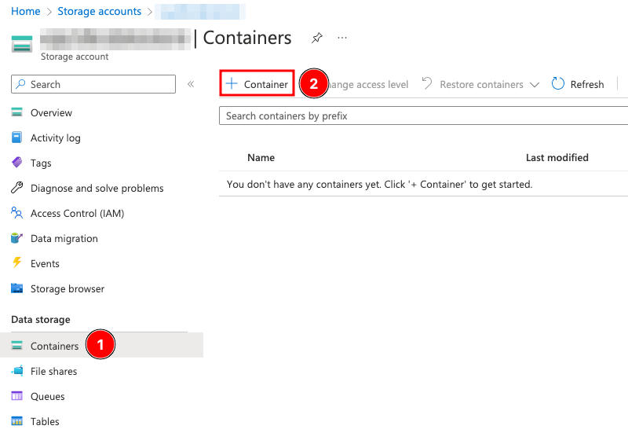<figcaption></figcaption></figure>
2.  Create a container named `etc-squidex-assets`(3). Do not make any other modifications, click **Create** (4).\


    <figure>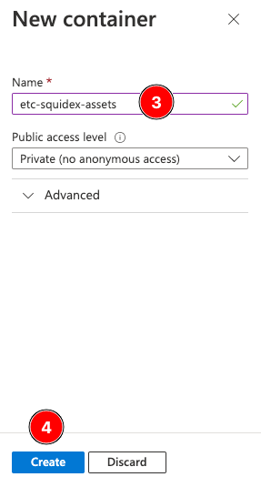<figcaption></figcaption></figure>
3.  Similarly, select **File shares** (5), click **+ File share** (6) and create a file share named `etc-squidex-mongodb` (7). Click **Create** (8).\


    <figure>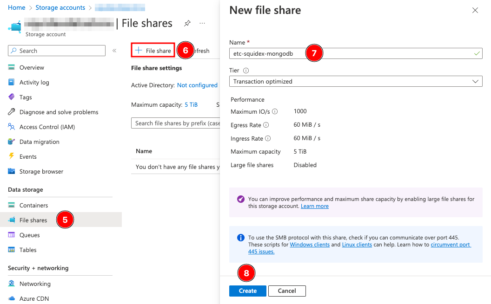<figcaption></figcaption></figure>
4.  Next, note down the storage account _Connection String_ and one of the _Access Keys_ for use in the subsequent steps.\
    \
    To do so, go to **Access Keys** (9) and click **Show** (10) next to _Key_ in key1. Copy this Access Key safely somewhere. Similarly click **Show** (11) next to _Connection string_ and copy it.\


    <figure>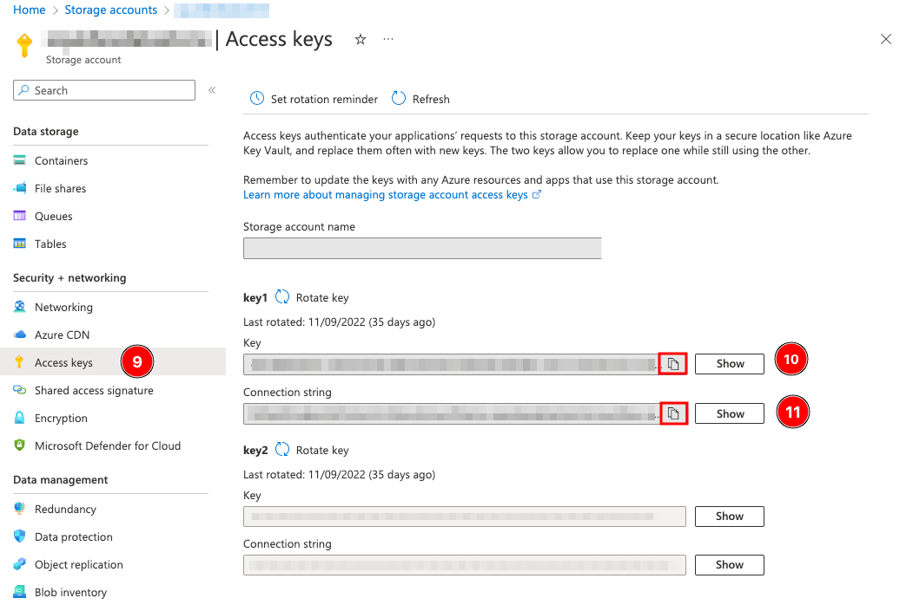<figcaption></figcaption></figure>

## 2. Create the MongoDB Instance

To create the MongoDB Azure Container Instance we will use the Azure CLI. Using the browser based Azure Shell is the easiest and quickest way to run the command.&#x20;

<figure>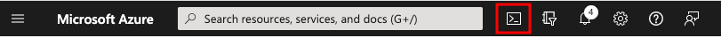<figcaption></figcaption></figure>

You can also execute them through an installation of Azure CLI on your developer machine. If you are using your own installation of Azure CLI, on the command prompt run `az login` first to login to Azure (this step is not required if you are using Azure Shell).


The following creation of the container instance can only be done using the Azure CLI at the moment.


Run the following command to create the MongoDB container instance. You will need the following values noted down from earlier:

* \[YOUR\_RESOURCE\_GROUP]
* \[YOUR\_STORAGE\_ACCOUNT]
* \[YOUR\_STORAGE\_KEY]

```bash
az container create --resource-group [YOUR_RESOURCE_GROUP] --name mongodb --image mongo --azure-file-volume-account-name [YOUR_STORAGE_ACCOUNT] --azure-file-volume-account-key "[YOUR_STORAGE_KEY]" --azure-file-volume-share-name etc-squidex-mongodb --azure-file-volume-mount-path "/data/mongoaz" --ports 27017 --cpu 2 --ip-address public --memory 2 --os-type Linux --protocol TCP --command-line "mongod --dbpath=/data/mongoaz --bind_ip_all --auth"
```

This creates a single container instance running MongoDB.

### 2.1 Create an Admin User

At this point the MongoDB instance is running but requires authentication. But we do not have any users, so we will go ahead and create a user for use with the database.&#x20;

Connect to your MongoDB container console from Azure:

1. Go to **Container instances** (1) and select your container, usually **mongodb** (2).
2. Click **Containers** (3) and then select the **Connect** tab (4).
3. Select **/bin/bash** and click **Connect** (5) button.

<figure><figcaption></figcaption></figure>

Execute the following steps inside the container to create a MongoDB user.


For security reasons provide your own choice of username and password


```
// Switch to Mongo shell
mongosh

// Switch to admin db
use admin

// Create user
db.createUser({ "user": "root", "pwd": "1q2w3e$R", "roles": ["root"] })
```

Now that the user is created, you can optionally connect to it from a tool like [MongoDB Compass](https://www.mongodb.com/try/download/compass2) and verify connectivity. To connect, you will need the Public IP address of the MongoDB instance. To do so, go to **Container instances** (1), select your **container** (2) and from **Overview** (3) copy the **Public IP address** (4). Make a note of it as it will be needed again in future steps.

<figure>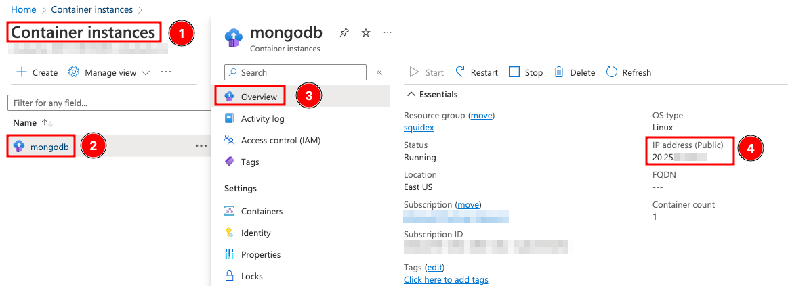<figcaption></figcaption></figure>

To connect to it from MongoDB Compass, create a connection string that contains the username and password similar to the example below.

`mongodb://root:1q2w3e$R@[IP_ADDRESS]`

## 3. Create & Configure the Web App

### 3.1 Create Web App

1.  Start by creating a new Web App with the following settings. The wizard also lets you create a new App Service Plan (think Hosting Plan) if there isn't any.​

    1. Select the existing **Resource Group** (1) from previous steps
    2.  Enter a **Web App Name** for the FQDN provided by Azure Web App.

        
        This Name should be globally unique.
        
    3. Select **Docker Container** (3)
    4. Choose **Linux** (4) for the Operating System
    5. Set your preferred **Region** (5), preferably the same region as other resources
    6. The default _Sku and size_ selected is ideal for production environments and costs more. If this is a sandbox, trial or a non-production environment it is best to change this to a lower Sku. Click **Change size** (6) to do so and change it to _F1_ or _B1_.
    7. Click **Next: Docker** to continue with the next steps.\


    <figure>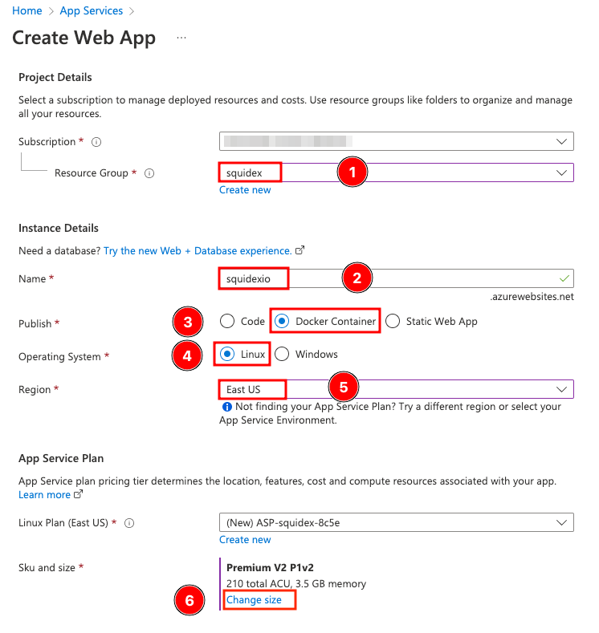<figcaption></figcaption></figure>

    <figure>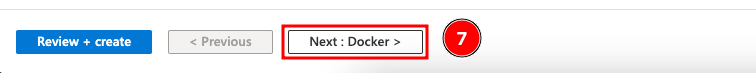<figcaption></figcaption></figure>
2.  In the _Docker_ settings tab, configure as following:

    1. Set _Options_ as **Single Container** (8)
    2. Set _Image Source_ as **Docker Hub** (9)
    3. Set _Access Type_ to **Public** (10)
    4. Enter _Image and tag value_ as `squidex/squidex:latest`
    5. Click **Review + create** (12).


    <figure>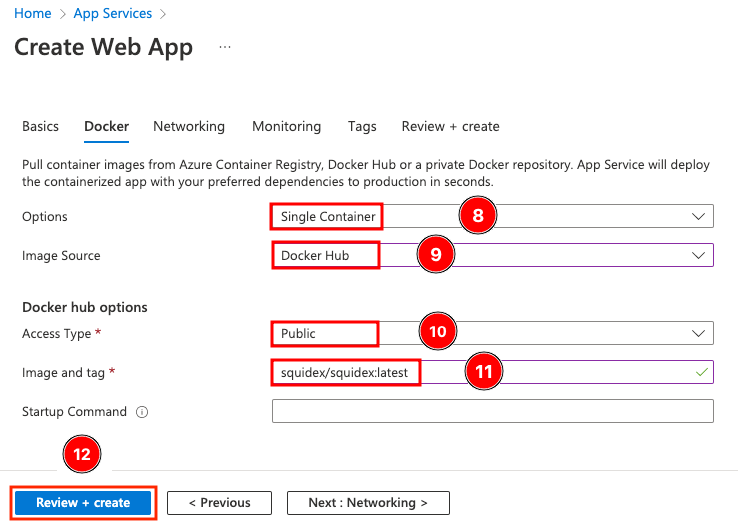<figcaption></figcaption></figure>
3. In the Review page, click **Create**.
4.  Once deployment is complete, click **Go to resource** (14) and continue with the next section on configuring the environment variables.

    <figure>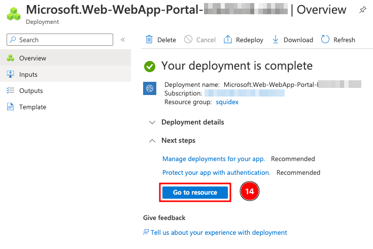<figcaption></figcaption></figure>

### 3.2 Configure Web App

During this step, we will add the configuration values to the Web App and restart the Web App. Before proceeding ensure you have the following info handy, you will need it:

| Key                        | Description                                                | Sample                                      |
| -------------------------- | ---------------------------------------------------------- | ------------------------------------------- |
| `[AZURE_CONNECTIONSTRING]` | The connection string to your storage account. See step 1. |                                             |
| `[MONGO_USERNAME]`         | The username of the MongoDB user.                          | For example in this instruction: "root"     |
| `[MONGO_PASSWORD]`         | The password of the MongoDB user.                          | For example in this instruction: "1q2w3e$R" |
| `[MONGO_IP]`               | The IP address to your MongoDB container.                  | See Step 2.1                                |
| `[WEBAPP_NAME]`            | The name of your webapp.                                   | For example in this instruction "squidexio" |

1.  From the previous step you should already be in the Web App page. Click **Configuration** (1) and then **Advanced edit** (2).

    <figure>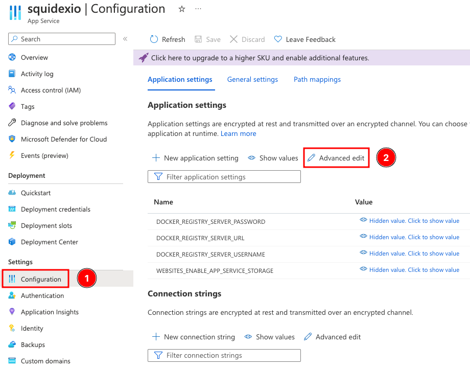<figcaption></figcaption></figure>
2.  Copy and paste the following JSON into the code window (**DO NOT click OK.**)

    ```
    [
      {
        "name": "ASSETSTORE__AZUREBLOB__CONNECTIONSTRING",
        "value": "[AZURE_CONNECTIONSTRING]",
        "slotSetting": false
      },
      {
        "name": "ASSETSTORE__AZUREBLOB__CONTAINERNAME",
        "value": "etc-squidex-assets",
        "slotSetting": false
      },
      {
        "name": "ASSETSTORE__TYPE",
        "value": "AzureBlob",
        "slotSetting": false
      },
      {
        "name": "DOCKER_REGISTRY_SERVER_PASSWORD",
        "value": "",
        "slotSetting": false
      },
      {
        "name": "DOCKER_REGISTRY_SERVER_URL",
        "value": "https://index.docker.io",
        "slotSetting": false
      },
      {
        "name": "DOCKER_REGISTRY_SERVER_USERNAME",
        "value": "",
        "slotSetting": false
      },
      {
        "name": "EVENTSTORE__MONGODB__CONFIGURATION",
        "value": "mongodb://[MONGO_USER]:[MONGO_PASSWORD]@[MONGO_IP]:27017",
        "slotSetting": false
      },
      {
        "name": "IDENTITY__GITHUBCLIENT",
        "value": "",
        "slotSetting": false
      },
      {
        "name": "IDENTITY__GITHUBSECRET",
        "value": "",
        "slotSetting": false
      },
      {
        "name": "IDENTITY__GOOGLECLIENT",
        "value": "",
        "slotSetting": false
      },
      {
        "name": "IDENTITY__GOOGLESECRET",
        "value": "",
        "slotSetting": false
      },
      {
        "name": "IDENTITY__MICROSOFTCLIENT",
        "value": "",
        "slotSetting": false
      },
      {
        "name": "IDENTITY__MICROSOFTSECRET",
        "value": "",
        "slotSetting": false
      },
      {
        "name": "STORE__MONGODB__CONFIGURATION",
        "value": "mongodb://[MONGO_USER]:[MONGO_PASSWORD]@[MONGO_IP]:27017",
        "slotSetting": false
      },
      {
        "name": "URLS__BASEURL",
        "value": "https://[WEBAPP NAME].azurewebsites.net/",
        "slotSetting": false
      },
      {
        "name": "VIRTUAL_HOST",
        "value": "[WEBAPP NAME].azurewebsites.net",
        "slotSetting": false
      },
      {
        "name": "WEBSITE_HTTPLOGGING_RETENTION_DAYS",
        "value": "10",
        "slotSetting": false
      }
    ]
    ```
3.  Replace all placeholders with your values (without additional quotes). It should look similar to the screenshot below. Click **OK** (3) when done.\
    Configuration values for external authentication providers are empty to turn them off.

    <figure>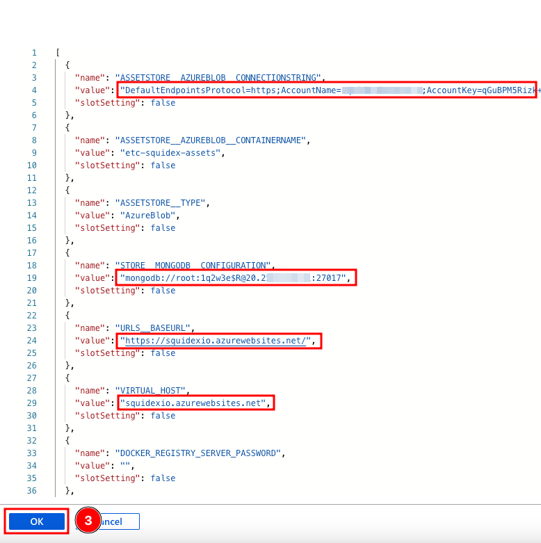<figcaption></figcaption></figure>
4.  Click **Save** (4).

    <figure>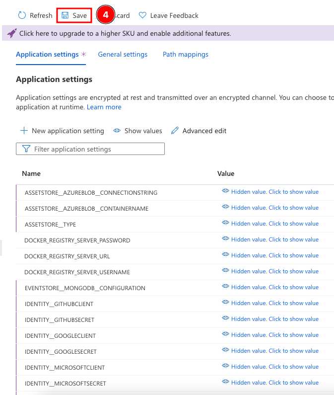<figcaption></figcaption></figure>
5.  Click **Overview** (5) and then click **Restart** (6). Click **Yes** (7) when prompted.\


    <figure>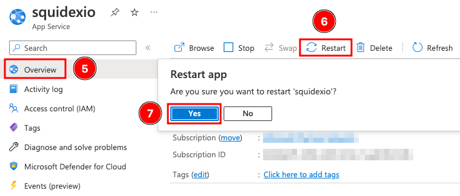<figcaption></figcaption></figure>
6. You can now access Squidex at the App Service URL and continue with setting up Squidex.


**IMPORTANT:** It may take a few minutes before Squidex welcome page loads due to background configurations and setup processes by Azure.&#x20;

If the restart in Step 5 above does not work, stop and start the Web App.


### 3.3 Turn on Logging

While this is an optional step, logging can make diagnostics easier.


You can then use the _Log stream_ to view all log entries


1.  Next from the left menu scroll down (or search) and click on **App Service logs** (1). Enable Application logging by clicking on **File System** (2) and click **Save** (3).\


    <figure>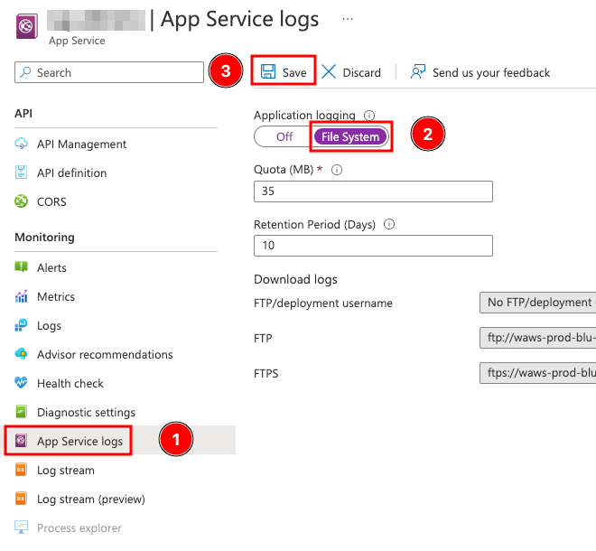<figcaption></figcaption></figure>

## More issues?

For other issues, it is likely that you have a configuration problem not related to hosting under Azure. Checkout the following documentation:


[configuration.md](../configuration.md)

