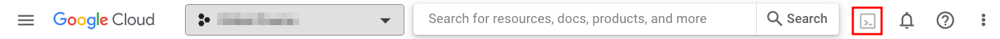

# Install on Google Cloud Platform (GCP)

This tutorial deploys Squidex as a container on [Cloud Run](https://cloud.google.com/run/), which is a managed compute platform that lets you run containerized applications.

The tutorial does not cover the basics of GCP. You should be familiar with them before you begin with the installation instructions. This tutorial uses the following services from GCP:

* [Google Cloud Storage](https://cloud.google.com/storage)
* [Google Cloud Run](https://cloud.google.com/run/)
* [MongoDB Atlas](https://www.mongodb.com/cloud/atlas/mongodb-google-cloud) running on Google Cloud

This tutorial used MongoDB Atlas on Cloud running in shared (free) mode and is recommended for non-production, trial or sandboxed environments as it has limited resources and basic configuration. For production environments, it is best to go for one of the Pay-as-you-go models such as Dedicated. You can also deploy your own cluster.

Use this tutorial as a getting started guide in GCP to explore Squidex or use it as a Dev/Sandbox environment. This setup may not be recommended for a production environment as it does meet requirements such as scalability and high-availability.

## Prerequisites

Before you begin, ensure you meet the following requirements:

1. An active Google Cloud account.
2. A _Project_ in GCP

## Deployment Specifications & Other Details

Over the course of this installation you will create the following resources:

* A Cloud Storage bucket
* A Cloud Run instance
* A free MongoDB Atlas cluster at [https://cloud.mongodb.com/](https://cloud.mongodb.com/)

**Important Details**

* Default resource allocations
  * Squidex instance: **1 vCPU and 1.5 GiB memory**

## 1. Create a MongoDB Atlas Cluster

Visit [MongoDB Atlas on Google Cloud](https://www.mongodb.com/cloud/atlas/mongodb-google-cloud) and click **Start Free** (1).


Register by clicking **Sign up with Google** (2) and sign-in using your existing Google Cloud credentials. This is the fastest way to register. On successful registration and login you will be redirected to the cloud.mongodb.com portal _Projects_ page.


Start by creating a project. Click **New Project** (3).


Provide a project name such as _Squidex_ (4) and click **Next** (5) to continue.


Finish project creation by clicking **Create Project** (6).


The next step is to create the MongoDB database. Click **Build a Database** (7) to start.


Select **Create** under _Shared_ which provides 1 free cluster.


Ensure again that **Free Shared** (9) option is selected, click **Google Cloud** (10), select a region of choice (11) and click **Create Cluster** (12).


In the next step, set Security details. Enter a Username (13) and Password (14) of choice (or click Autogenerate Secure Password to get one generated). Click **Create User** (15).


Finally, add network access permissions so Squidex can talk to it. Ensure **My Local Environment** (16) is selected, enter 0.0.0.0/0 (17) for IP Address and any Description (18). Click **Add Entry** (19).


Click **Finish and Close**. This will redirect you to the Database Deployments page similar to the screenshot below.


You will need the connection information for this MongoDB for use in the app configuration later. To copy the connection string click **Connect** (20) and then select **Connect your application** (21).


Select C#/.NET (22) & 2.13 or later (23), copy the connection string (24) and click **Close** (24)


This completes creating the free MongoDB Atlas cluster.

## 2. Upload Squidex image to Artifact Registry

The following steps require Google cloud CLI, which can be installed on your development machine or you can use the Cloud Shell. The later is preferred for convenience. To launch Cloud Shell click  on the google cloud web console next to the search bar.

<figure><figcaption></figcaption></figure>

Run the following commands in sequence to create an Artifact Registry, download the latest Squidex from dockerhub and push it to Artifact Registry.

```
gcloud services enable artifactregistry.googleapis.com
```

```
export ARTIFACT_REGISTRY_NAME=squidex
export PROJECT_ID=$(gcloud config get-value project)
export REGION=us-central1
```

```
gcloud artifacts repositories create $ARTIFACT_REGISTRY_NAME --repository-format=docker --location=$REGION
```

```
docker pull squidex/squidex:latest
```

```
gcloud auth configure-docker $REGION-docker.pkg.dev
```

```
docker tag squidex/squidex:latest $REGION-docker.pkg.dev/$PROJECT_ID/$ARTIFACT_REGISTRY_NAME/squidex:latest
```

```
docker push $REGION-docker.pkg.dev/$PROJECT_ID/$ARTIFACT_REGISTRY_NAME/squidex:latest
```

## 3. Create Storage Bucket

Follow the steps below to create a Cloud Storage bucket for Squidex assets.

Sign into Google Cloud Console and navigate to Cloud Storage page. Select **Buckets** (1) (should be already selected) and click **+ Create** (2).


Enter a unique name (3) for the bucket and click **Create** (4). You can leave the rest of the settings as it is or feel free to modify them as per needs.


You may be prompted with a message. Click **Confirm** (5).


You will be taken to the bucket page. This completes the storage bucket creation step.

## 4. Create & Configure Cloud Run instance

Navigate to Cloud Run page in Google Cloud. Click **+ Create Service** (1) to begin.


Click **Select** (2), choose **Artifact Registry** tab and select (3) the Squidex image added earlier. Click **Select** (4) to continue.


A Service name (5) is already assigned, modify this if needed. Set **Minimum number of instance** to _1_ and **Maximum number of instance** to _1_ (6).


At this point Squidex has not been tested for autoscaling on Cloud Run, setting more than 1 instances here may have issues.



Scroll down and select **Allow all traffic** (7) and **Allow unauthenticated invocations** (8). Then expand (9) the _Containers, Connections, Security_ section.


Set **Container port** to _5000_ (10) and set Memory to _1_ and CPU to _1_ (11).


Finally we set the environment variables. Click **+Add Variable** (12) and set the following environment variables (13) one by one replacing the values with your actual values where applicable, click **Create** (14) when done.

| Key                                    | Value                          | Notes                    |
| -------------------------------------- | ------------------------------ | ------------------------ |
| `[ASSETSTORE__TYPE]`                   | GoogleCloud                    | Do not change this value |
| `[ASSETSTORE__GOOGLECLOUD__BUCKET]`    | _\[STORAGE BUCKET NAME]_       | Provide your own value   |
| `[EVENTSTORE__MONGODB__CONFIGURATION]` | _\[MONGODB CONNECTION STRING]_ | Provide your own value   |
| `[STORE__MONGODB__CONFIGURATION]`      | _\[MONGODB CONNECTION STRING]_ | Provide your own value   |
| `[ASPNETCORE_URLS]`                    | http://+:5000                  | Do not change this value |


Wait until the deployment is complete and you have sucessful notification with a green check. Copy the URL (15) and click **Edit & Deploy New Version** (16).


Add a new environment variable by clicking **+Add Variable** (17) and then adding the following (18). Click **Deploy** (19) when done.

| Key               | Value              | Notes                  |
| ----------------- | ------------------ | ---------------------- |
| `[URLS__BASEURL]` | _\[CLOUD RUN URL]_ | Provide your own value |


If you want to use your \*\*custom domain\*\*, enter the domain/sub-domain here instead of the Cloud Run URL.



This should deploy a new revision of the Cloud Run and update the Base URL value in the app.


You can now open the URL in a browser and continue with Squidex setup.
