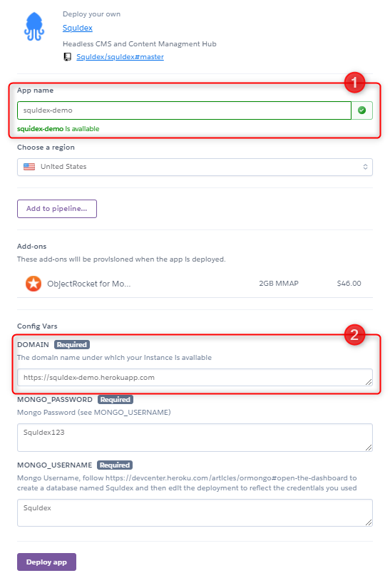
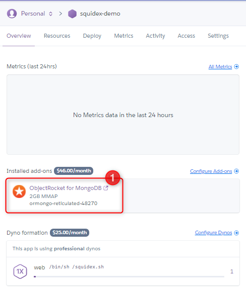
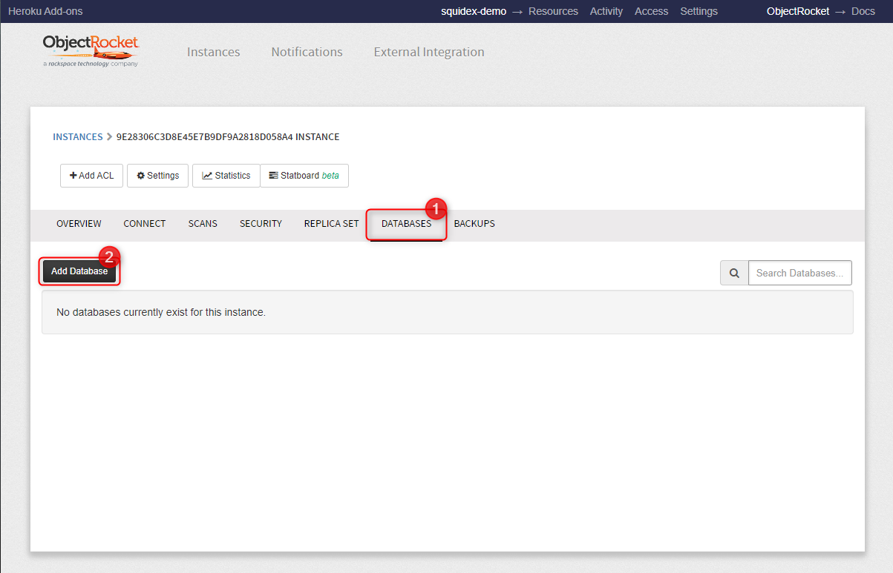
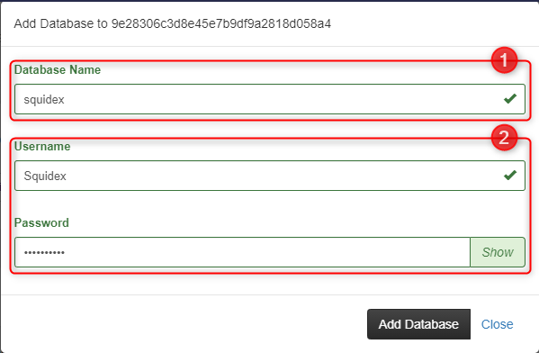

# Install on Heroku

## 1. Use the 1-click deploy button

## 2. Fill in the details

Make sure to fill in the **App name** \(1\) field with something unique, and then fill the **DOMAIN** \(2\) variable with the external domain you wish your Squidex instance to be available on.

You can ignore MONGO\_USERNAME and MONGO\_PASSWORD for now.

When you are done, click **Deploy App**.

## 3. Wait for the deployment to complete

When it's finished, click **Manage app** \(1\).

## 4. Create MongoDB database and credentials

On the Dashboard, click **ObjectRocket for MongoDB** \(1\)**.**

On the ObjectRocket Dashboard, click **DATABASES** and then **Add Database**.

Enter the **database name** \(1\) \(must be `squidex`\), the **username and the password** \(2\). Keep note of those, as you will be needing them for the next step.

## 5. Fill in the database credentials

Back at the Heroku Dashboard, click **Settings** \(1\), then click **Reveal Config Vars** \(2\).

Fill the fields `MONGO_USERNAME`  \(1\) and `MONGO_PASSWORD` \(2\) with the same credentials you provided in the previous step.

You should then be ready to go!

## Troubleshooting

Please check the logs by clicking **More** \(1\), and then **View logs \(2\).**

### Restart dynos

In case the deployment gets stuck, go to the top right of the dashboard, click **More** and then **Restart all dynos**.

### More issues?

It is very likely a configuration problem and not related to hosting under Docker. Checkout



