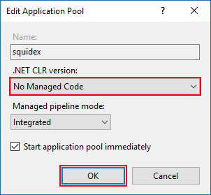

# Install on  IIS

You can also read the guide from Microsoft, how to [Host ASP.NET Core on Windows with IIS](https://docs.microsoft.com/en-US/aspnet/core/host-and-deploy/iis/?view=aspnetcore-2.2#install-the-net-core-hosting-bundle).

This document is just a shorter version of the official guide.

## Supported operating systems

The following operating systems are supported:

* Windows 7 or later
* Windows Server 2008 R2 or later

## Step 1. Install all requirements

### 1.1. Install IIS

If you read this page and are planning to setup Squidex under Windows. you are probably familiar with IIS and have already installed it on your machine. If not you can read the docs:

> [IIS configuration (Microsoft)](https://docs.microsoft.com/en-US/aspnet/core/host-and-deploy/iis/?view=aspnetcore-2.2#iis-configuration)

### 1.2. Download and install .NET Core hosting bundle:

Download the installer using the following link:

> [Current .NET Core Hosting Bundle installer (direct download)](https://dotnet.microsoft.com/download/thank-you/dotnet-runtime-2.2.0-windows-hosting-bundle-installer)

Ensure that the `ASPNETCORE_ENVIRONMENT` environment variable is set to `Production`

### 1.3. Download and install MongoDB

Following the official setup instructions:

> [Install MongoDB Community Edition on Windows](https://docs.mongodb.com/manual/tutorial/install-mongodb-on-windows/)

## Step 2. Install Squidex

### 2.1. Download the binaries

Go to the release page and download the `binaries.zip` file from the latest release:

> [Squidex Releases](https://github.com/Squidex/squidex/releases)

Create a folder for your squidex installation and extract the archive to this folder.

### 2.2. Create the IIS site

1. In IIS Manager, open the server's node in the **Connections** panel. Right-click the **Sites** folder. Select **Add Website** from the contextual menu.
2. Provide a **SiteName** and set the **Physical path** to the squidex folder that you created in the previous step. In this case we host Squidex at [https://localhost:80](https://localhost:80)
3. Ensure that you also create a https binding with a proper certificate or development certificate. Due to recent security changes in Chrome, you are not able to login to Squidex anymore if you are using http instead of https. You can also use Cloudflare as https termination if you do not want to pay for a certificate.
4.  Confirm the process model identity has the proper permissions.

    If the default identity of the app pool (**Process Model** > **Identity**) is changed from `ApplicationPoolIdentity` to another identity, verify that the new identity has the required permissions to access the app's folder, database, and other required resources. For example, the app pool requires read and write access to folders where the app reads and writes files.


### 2.3 Configure the Application Pool

1. Under the server's node, select **Application Pools**.
2. Right-click the site's app pool and select **Basic Settings** from the contextual menu.
3. In the **Edit Application Pool** window, set the **.NET CLR version** to **No Managed Code**:



### 2.4. Configure Squidex

1. Go to your Squidex installation folder.
2. Create a file called `appsettings.Production.json` where we override the default settings. When you make an upload and download a newer release your customized settings will not be overridden. You can also configure all settings with environment variables which is the recommended way for all other platforms, but in this case a file is easier.
3. Enter the following settings. The `baseUrl` is the most important setting as it must match to the domain that you are using. All other settings are optional. If you use a version lower than 5.6 you also have to define the initial username and password in the settings.

```javascript
{
  "urls": {
    /*
     * The url where your squidex installation is available at.
     */
    "baseUrl": "http://localhost"
  },
  "identity": {
    /*
     * Disable authentication with google, github and microsoft login.
     */
    "googleClient": "",
    "googleSecret": "",
    "githubClient": "",
    "githubSecret": "",
    "microsoftClient": "",
    "microsoftSecret": "",
    /*
     * Initial username and password. Only needed before Squidex 5.6
     */
    "adminEmail": "admin@squidex.io",
    "adminPassword": "save1q2w3e$R"
  },
  "assetStore": {
    "folder": {
      /*
       * Define where to store the assets.
       */
      "path": "E:\\Sites\\squidex\\assets"
    }
  },
  "orleans": {
    /*
     * Disable clustering!
     */
    "clustering": "Development"
  },
}
```


The password must contain a lowercase and uppercase letter, a number and a special character. If you use Squidex 5.6 or later you will see a simple setup screen when you open your site for the first time and no user is created. You can create the initial user on this screen.


Start the IIS site and go to [http://localhost](http://localhost). Login and start editing.

## Troubleshooting

### Where can I see the logs?

Squidex logs to standard output.&#x20;

To forward the logs to a file, open `web.config` and set `stdoutLogEnabled="true"`.

### I get a HTTP Error 404.0 - Not Found

Ensure that the **Physical path** of your site points to the correct location.

### I get a HTTP Error 502.5 - Process Failure

It is very important that you restart IIS after you have installed .NET Core Windows Server Hosting. Restart the server or execute `net stop was /y` followed by `net start w3svc` from a command prompt with elevated permissions to pick up a change to the system PATH.

### I get a HTTP Error 504 - Method not allowed

This can happen when you try to make an API call with the PUT or DELETE Verb. For example when you use the Management UI. The reason is that WebDAV might be installed on your server and it blocks these verbs. You have to add the following lines to the `web.config` file.

```markup
<system.webServer>
    <modules runAllManagedModulesForAllRequests="false">
        <remove name="WebDAVModule" />
    </modules>
</system.webServer>
```

### I only see a spinner on a white background

Ensure that the `ASPNETCORE_ENVIRONMENT` environment variable is set to `Production`.

Squidex logs all environment variables on the first start. Search for the following output in the logs:

```javascript
{
  "logLevel": "Information",
  "message": "Application started",
  "environment": {
    ...
    "aspnetcoreEnvironment": "Production",
  }
}
```

### I do not see referenced content items or assets when I add a lot of references

To fetch the referenced content items or assets the user interfaces makes an API call where all IDs are added to the query string. When you have too many items, the query string becomes too long and IIS will return a `404`status code. Newer versions of Squidex will fallback to POST requests but you can also increase the request limit.

```markup
<system.webServer>
    <security>
        <requestFiltering>
            <requestLimits maxQueryString="8192" />
        </requestFiltering>
    </security>
</system.webServer>
```

### More issues?

It is very likely a configuration problem and not related to hosting under IIS. Go to the [Configuration](../configuration.md) page.
