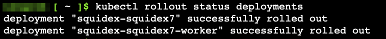
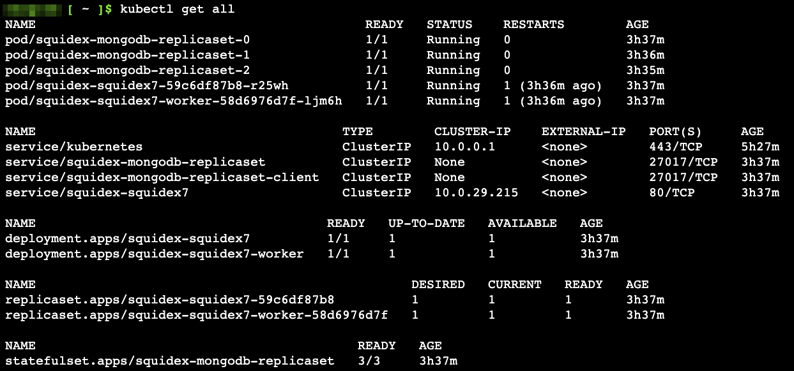

# Install on Kubernetes

## Supported Platforms

* Kubernetes 1.23+

## Prerequisites

* Kubernetes cluster
* An [Ingress Controller](https://kubernetes.io/docs/concepts/services-networking/ingress-controllers/) such as [NGINX](https://www.nginx.com/products/nginx-ingress-controller/) deployed in the cluster
* [cert-manager](https://cert-manager.io/v0.14-docs/installation/kubernetes/) for auto SSL of custom domain
* A custom domain for use during Squidex deployment

## Use the Helm Chart

We provide a Helm chart that deploys Squidex along with MongoDB.

The helm chart creates the following resources / objects:

* Deployments
  * A Squidex primary deployment
  * And a Squidex worker deployment for background jobs&#x20;
* Statefulsets
  * A MongoDB statefulset with 3 replicas&#x20;
* PVs & PVCs
  * Persistent volumes for MongoDB
* Services
* Ingress

The Github link below contains all the details:

> [https://github.com/Squidex/squidex/tree/master/helm](https://github.com/Squidex/squidex/tree/master/helm)

### 1. Connect to the Kubernetes Cluster

Use _kubeconfig_ to connect to your Kubernetes cluster and ensure you are able to run `kubectl` commands.

### 2. Add the Repository

Here _squidex_ is the name used for the repository.&#x20;

```
helm repo add squidex https://squidex.github.io/squidex/helm/
```

### 3. Install the Chart

The below command installs version 7 of Squidex. &#x20;

```
helm install squidex squidex/squidex7 --set env.URLS__BASEURL=https://squidex.your.domain --set ingress.hostName=squidex.your.domain
```

* Here `squidex/squidex7` means we are installing version 7 of Squidex.
* Replace ~~squidex.your.domain~~ with your custom domain name.

### 4. Wait for the rollout

It may take a few minutes before the rollout is successful. Run the below command to check the status:

```
kubectl rollout status deployments
```

Below is a sample screenshot of a successful rollout

<figure><figcaption><p>Successful rollout of Squidex deployments</p></figcaption></figure>

### 5. Verify resources/objects

You can verify / see all the objects created by running:

```
kubectl get all
```

<figure><figcaption><p>Screenshot of all objects deployment by the helm chart</p></figcaption></figure>

### 6. Access Squidex

Open the custom URL address on a browser to continue with Squidex setup.

## Troubleshooting

To troubleshoot, check deployment logs of the respective deployment. You can also check the pod logs.

```bash
kubectl logs deployment/squidex-squidex7
```

### 404 Error on Accessing URL

If you receive a 404 Error, It's mostly an ingress issue. Check the ingress class name for your ingress controller deployment.

This helm chart uses the _ingressClassName_ as **nginx**.

### Common Issues

#### Warning for ServerGC

> info: Orleans.Runtime.Silo\[100404]\
> Silo starting with GC settings: ServerGC=False GCLatencyMode=Interactive\
> warn: Orleans.Runtime.Silo\[100405]\
> Note: Silo not running with ServerGC turned on - recommend checking app config : --\
> warn: Orleans.Runtime.Silo\[100405]\
> Note: ServerGC only kicks in on multi-core systems (settings enabling ServerGC have no effect on single-core machines).

This is not a critical warning. ServerGC is a special Garbage Collector as it has no positive or negative impact when running with a single core. You can just ignore it.

**Solution**: Request more than 1 CPU&#x20;

```
resources:
  requests:
    cpu: 2
```

### More Issues?

For other issues, it is likely that you have a configuration problem not related to hosting under Kubernetes. Checkout the following documentation:


[configuration](../configuration/)

