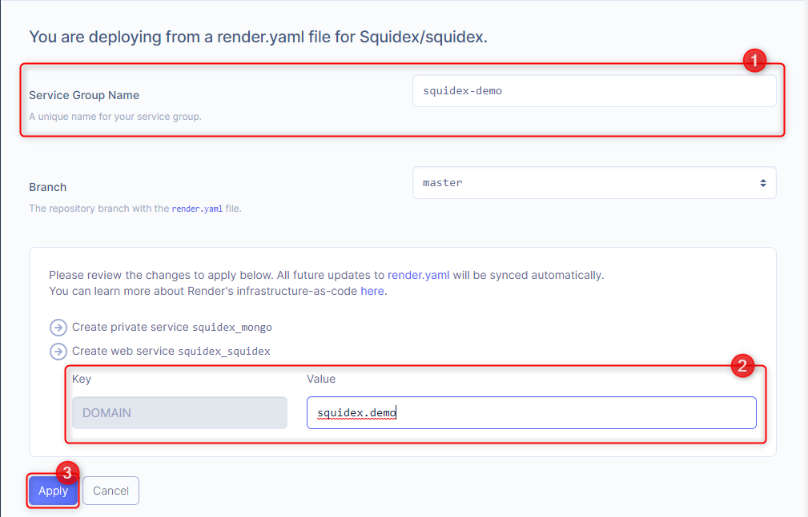
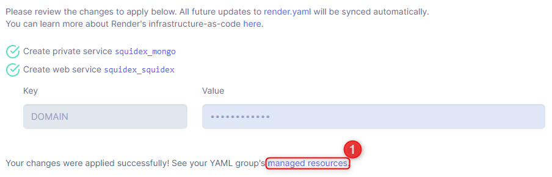
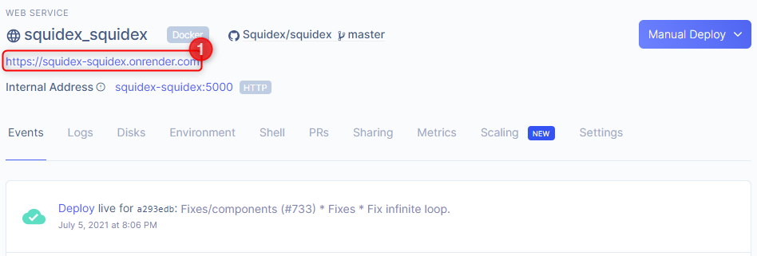
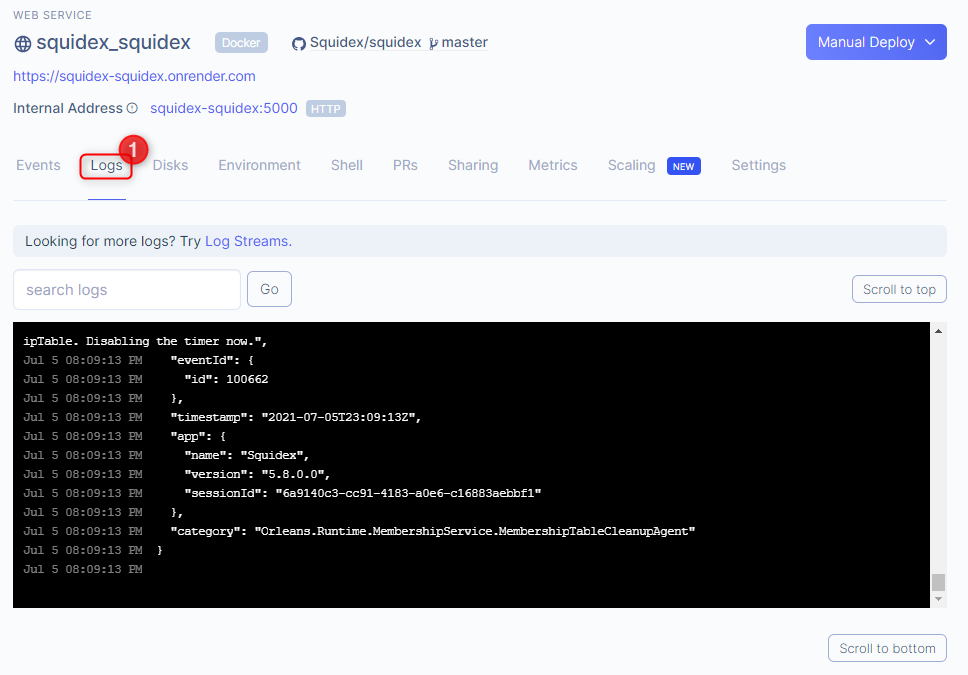

# Install on Render

## 1. Use the 1-click deploy button

[![Deploy to Render](https://img.shields.io/badge/-Deploy%20to%20Render-44E4B4?style=for-the-badge\&logo=data:image/png;base64,iVBORw0KGgoAAAANSUhEUgAAAEAAAABACAYAAACqaXHeAAADyklEQVR4Xu1aT0gUURh/k5qV2y5pEbpqHiqqy4IIQUGghbNOK53WkwQFdekqRHXNDkHXIKhuXdZTZu6MRkbkJRFJKAKNUnQPEir+IXdr98XbdXbfzrznjLvvObM7s5dld7553/f93u/78/4IwOEfweH+AxcAlwEOR8ANAYcTwE2CfEIAAqEzpjSmQPLobhj2zi9N4fLiotxKet87vvZloKcnqT6jyW2sx2fGz1xb38kGJgCEv0b2h/yBvuu+0/0kZRAAAtX0/wqCkGcPhBAJ6T7SbNQXPSWtqQ9ocsFFpUNpDI5xBeBnYn2+pcrTtJuZpsnSANBCRQNAK8cVgM7F4W6lvmuQZRYxy4De2ajvlSkGvO1QGkPsGXB/aeJF/7G2myxmHR/DGIBMREizsnUhcO/3xMtHdW03WDuPxjMGIKPVshwgLshXZb84lO88OcUVApDtAYAwBUn5XHV2Kbn1tzc2FhptlkYKAcCKd0yXwbnExnxzVQ012z9emb5ztzbw1AonitFpCgBU5yPnwnGaouCCcl5pCn4uxhCr3jUFwLPVbw9v+84+0BkJAXiyMn2rry7w3CoHkN7u2JtDJP0HPv2J4x0jScYUALROaym5lTheebDaSueRbu6dIE2BOBe9PNIivS9vACAQIIApIn00vbtVQOgnKFOambTCV2KDzaP13XOlBUDGWiYAoKVmtEGcJCULbeNiHwYwBkBuECdLiwEMQwAxwO4AFMM8wzLoAuAyYDsECIs+uyRBx4dACkJIimVmZTAvCWJMsAsDuLbCpZAE9xYACADiG6KcAxmQ4b8aBQ4EIJNvHQ+AWnbswgDuZdDuiyHuAOTKYH435BgGuIuhklsO89wP2I4C9LXPjltiWJTyaYWxjGOXHMC3E/wlt8onSm1HiGcIZNsgG7XCKZjeu9aeWzoqBEhn1EwACMNIxcaypyZNqmUAQG0uCUTrcvd0imlGin23a2bYSxrDc7Jrc0AQspepCj4aK9ZAO79vuClqZ+NZ2OYCYISi2R0hdEQ9WB/aNHOAQqvb1Csyaobb/t7TO0Kirg/I5VvcYBUAUjY2e/fHSC49NgRA+kG5KIkrhwAEYwwuSuIM0DpHAqAQBtA2WEzfFE33AXrNTMpgFgCDcwGuIaDxbW9DwOTJkAsAzyRoJQMufn992OOpbsvZ8A8AUJn+id/EDkciFWsXvJdwW5EUktbe2BYX5HZSrtDLDbWrunB5r1/8iHd4tPHiNdVTH460r+5U6dw+wKgPKPfnLgPKfYaN/HMZYIRQuT93GVDuM2zk338nAalfI74e1QAAAABJRU5ErkJggg==\&logoColor=ffffff)](https://render.com/deploy?repo=https://github.com/Squidex/squidex)

## 2. Fill in the details

Fill the **Service Group Name** (1) and then fill the **DOMAIN** (2) variable with the external domain you wish your Squidex instance to be available on.

You can leave the **Branch** field at the default **master**.

When you are done, click **Apply** (3).

## 3. Wait for the deployment to complete

When it's finished, click **managed resources** (1).

## 4. Get the external URL

Click **squidex\_squidex** (1).

Your **URL** (1) will be just below the service name.

You should then be ready to go!

## Troubleshooting

Please check the logs by clicking **Logs** (1) in the service page.

### More issues?

It is very likely a configuration problem and not related to hosting under Docker. Checkout


[configuration.md](../configuration.md)

