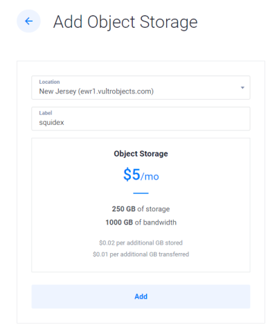
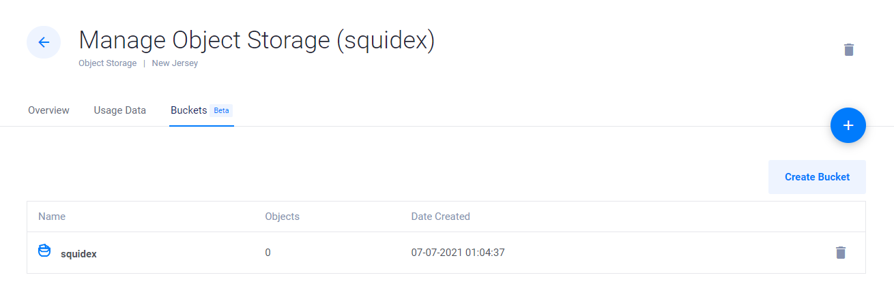

# Install on Vultr

## Considering Vultr

### When to use Vultr?

* You want a server for low costs.
* You do not need scalability.
* You do not need integrated monitoring and logging.
* You have a custom domain.

### When not to use Vultr

* You are already customer of another cloud provider.
* You need scalability for Squidex and the database.

### Requirements

* A custom domain or subdomain and the ability to create an A DNS record.

## What is included?

This installation configures a Ubuntu 20.04 x64 machine with

* Docker
* Docker-Compose

Based on this setup 3 containers are installed:

* Squidex
* MongoDB for storing your data.
* Caddy as reverse proxy and for https termination ([https://caddyserver.com/](https://caddyserver.com)).

To work properly you need a DNS A record entry pointing to your machine, because caddy will issue a certificate using lets-encrypt.

## Installation guide

### Step 1: Go to the marketplace

Just follow the link: [https://www.vultr.com/marketplace/apps/squidex](https://www.vultr.com/marketplace/apps/squidex)

### Step 2: Deploy a new server

1. Select your target location close to your center of operation.
2. Select the size of your machine. At least 4GB or memory with 2 virtual cores are recommended.

.png>)

### Step 3: Wait for the server to spin up

It can take a while until your server is ready to be used.

.png>)

### Step 4: Create a DNS record

Click your new server and wait until you got a IP address.

.png>)

Create a DNS A record to this IP address.

### Step 5: Connect using SSH

On the same page you see the SSH username and password. Login to your server with SSH or putty for Windows to run the installation script.

Go to the home directory and run the setup script

```bash
cd /home/

# Run the setup script
./setup-squidex.sh
```

You will be asked to enter the domain here. All other values are optional. The installation script will start docker-compose then and download all images and start them in the right order.

 (1) (1).png>)

Squidex is ready to be used now. If you visit your installation under [https://mydomain.com](https://mydomain.com) you will see a simple setup guide where you can create the initial admin user.

## Configuring object storage

Vultr Object Storage provides an option for cost-effective and scalable S3 compatible storage for Squidex assets. The following steps outline the process of configuring Squidex to use this Vultr product.

### Step 1: Add object storage

Follow this link [https://my.vultr.com/objectstorage/add/](https://my.vultr.com/objectstorage/add/) and proceed to add object storage to your account.



### Step 2: Add a bucket and a folder

Navigate to the buckets tab and add a bucket.



Click on the bucket you just created and add a folder.


### Step 3: Configure asset storage to use S3

Navigate to the overview tab and make note of your S3 credentials.


Edit the `/home/.env` file using your editor of choice and add the following environment variables using the appropriate values for each (leave the S3\_REGION variable empty for now):

```
S3_SERVICEURL=https://ewr1.vultrobjects.com
S3_BUCKET=squidex
S3_FOLDER=assets
S3_REGION=
S3_ACCESSKEY=9I2XHCLL43LKD2WLKDEN
S3_SECRETKEY=PUT_YOUR_SECRET_KEY_HERE

# the following variable is used to compartmentalize 
# each app's assets in a separate folder
S3_FORCEPATHSTYLE=true
```

Next, edit the `/home/docker-compose.yml` file to pass these environment variables on to the container:

```
squidex_squidex:
    image: "squidex/squidex:5"
    environment:
      ... previous variables are here
      - ASSETSTORE__TYPE=AmazonS3
      - ASSETSTORE__AMAZONS3__SERVICEURL=${S3_SERVICEURL}
      - ASSETSTORE__AMAZONS3__BUCKET=${S3_BUCKET}
      - ASSETSTORE__AMAZONS3__BUCKETFOLDER=${S3_FOLDER}
      - ASSETSTORE__AMAZONS3__REGIONNAME=${S3_REGION}
      - ASSETSTORE__AMAZONS3__ACCESSKEY=${S3_ACCESSKEY}
      - ASSETSTORE__AMAZONS3__SECRETKEY=${S3_SECRETKEY}
      - ASSETSTORE__AMAZONS3__FORCEPATHSTYLE=${S3_FORCEPATHSTYLE}
```

In your command line shell, update your Squidex container to use the new asset storage settings:

```
docker-compose up -d
```

Enjoy and have fun.
