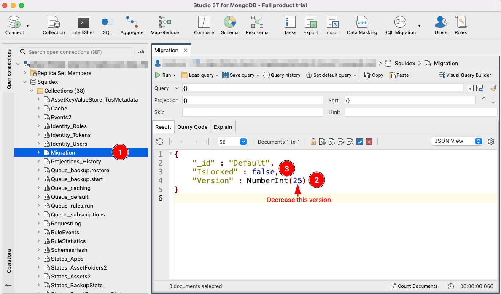
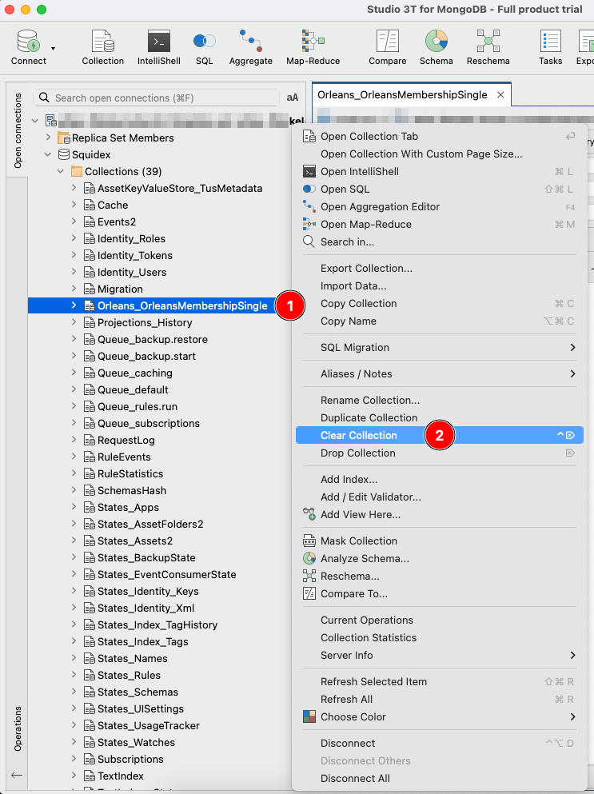

# Troubleshooting and Support

## Before You Start

It is best to think about whether you want to install Squidex on your own machines or if it might be better for you to use the Cloud instead. In general, the Cloud is cheaper if you take into account the time spent for installation, maintenance and updates.

If you are sure that you want to install Squidex on your own machine, there are a few things that are essential:

1. You should understand how to use logging in your environment. Especially if you are running Squidex with multiple instances, it is crucial to aggregate all the logs into one stream that can be searched and analyzed. Many Cloud providers have a very good solution for this. There are also free products like the ELK (Elasticsearch, Logstash, and Kibana) stack ([https://www.elastic.co/log-monitoring](https://www.elastic.co/log-monitoring)).
2. You must also understand how to monitor your installation. Very often, the logging infrastructure already provides a solution for problems, but you can also use alternatives like Statping ([https://github.com/statping/statping](https://github.com/statping/statping)). This is an awesome tool as a [public status page](https://status.squidex.io), but you should make sure you have internal monitoring solutions.
3. If you have a very complicated setup, it really is best to have an APM (Application Performance Monitoring) tool in place to analyze performance issues. Squidex provides an integration to Datadog APM ([https://www.datadoghq.com/product/apm/](https://www.datadoghq.com/product/apm/)) and Azure Application Insights.

The previous points are in prioritized order.

## I Need Help and Support!

If you do not have a paid support contract, the only option is the support forum: [https://support.squidex.io](https://support.squidex.io). In the past, there were other support channels like GitHub, Email and Slack but it took too much time to answer all the support requests. The only option for good, free support, is to ask for help over a single, public channel (which helps others with the same problem to search the forum too). There's no way to support issues via private messages. If you would like to use another channel, you can always purchase a support contract.

### How to Ask for Help

The support forum provides a template for support requests with placeholders for information that is needed to give support. It is very important to fill in this information. Most of the time, the support team will ask for this information, so if it's there at the beginning, it's helpful and doesn't waste time! When all the information is in place, it usually only takes a few hours to solve an issue.&#x20;

#### What Questions Does Support Want to Know?

1. **Information about your environment**: Very often, problems are related to a specific environment, for example when the root cause is a networking issue in Docker. Therefore, environmental information is essential.
2. **Your browser**: This is very often needed when you have issues with the user interface or with authentication. It helps to reproduce the issue.
3. **Squidex versions**: Some issues are already widely known and have already been fixed . If you allow our team to organize Squidex installation from the beginning, issues can usually be resolved very quickly. If you don't know the Squidex version, it is helpful to give support the exact date and time when you installed Squidex. You can view your version in the Squidex dashboard, when you use Docker.

Furthermore, the support team will need logs from your installation, more on preparing server logs below:

### Preparing Server Logs

As we are the team who have developed Squidex, we know every line of code and have a lot of experience on how our product behaves in different environments! Of course, we haven't tested every environment or Cloud provider ourselves and we don't know every issue, otherwise we'd have fixed them!  Your Squidex installation is like a black box for us and we can only guess what's gone wrong.

This means that it is very important to gain insight into your installation via logs.

#### How to Get Logs

Squidex logs everything to the standard output stream (`stdout`). This is a recommended pattern for Cloud-ready applications and is described in the 12-factors--App manifest: [https://12factor.net/logs](https://12factor.net/logs).

Most Cloud providers redirect the standard output stream to storage and make the logs available in their Cloud portal. Please read the documentation from your own Cloud provider.

Here are a few hints on how to retrieve logs:

* If you installed Squidex under IIS in Windows you should read the following article from Microsoft: [https://docs.microsoft.com/en-us/aspnet/core/host-and-deploy/aspnet-core-module?view=aspnetcore-3.1#log-creation-and-redirection](https://docs.microsoft.com/en-us/aspnet/core/host-and-deploy/aspnet-core-module?view=aspnetcore-3.1#log-creation-and-redirection).
* If you used Docker you should read the following article: [https://docs.docker.com/config/containers/logging/](https://docs.docker.com/config/containers/logging/). The document also describes how to setup a log driver that can be used to redirect all logs to a centralized logging service.

#### Search in Logs

Before you upload the logs, search for the `exception` keyword. You might find the solution to your problem in the logs.

Sometimes, the identity systems masks Personally Identifiable Information (PII) in the logs. If you see such a case in your log file and you think that relevant information is missing, you can turn off this behavior with the following setting: [https://github.com/Squidex/squidex/blob/master/backend/src/Squidex/appsettings.json#L580](https://github.com/Squidex/squidex/blob/master/backend/src/Squidex/appsettings.json#L580)

The environment variable for this setting is `IDENTITY__SHOWPII=true`.

Read more about how to configure Squidex here:


[configuration.md](../configuration.md)


#### How to Provide Logs

Please provide your logs as an easy-to-read file. You can upload files to Dropbox, Google Drive or another file-sharing offering and provide the link in a private message through the support forum.

If the logs are less than 10 MB, you can just provide the full logs. Otherwise, you can provide a subset of the logs around the timestamp when you experienced the issue. The more logs you can provide, the better. It can also be helpful to restart Squidex and to reproduce your issue and then collect the logs from this test. Then, we'll get a full history from the time Squidex was started to the time you reproduced the issue.

If you only have a few lines, you can add them to your post, but please ensure that the logs are formatted properly with code blocks.


Do not insert long logs as a plain text or formatted code block to your topic. The topic becomes hard to read and very often the logs are not complete.


### Prepare Browser Logs

Do also check your browser console for errors. It is very likely that you are a software developer and frontend engineer, so you probably know how to do that.


Usually, browser logs contain only a handful of useful log lines. Therefore, you can post them directly in the support ticket as a code block.


### Prepare a Backup of Your Mongo Database

Sometimes, it's useful to have a backup of your database ready. Squidex provides its own backup tool but these backups are not useful for troubleshooting because the final result may differ from the state of your database.

Therefore, use `mongodump` to create a backup: [https://docs.mongodb.com/database-tools/mongodump/#mongodump-options](https://docs.mongodb.com/database-tools/mongodump/#mongodump-options)

1. Ensure that you have access to your Mongo database. It might be necessary to open ports temporarily.
2. Create a backup of your Mongo databases. Do not use the `archive` flag.
3. Create a ZIP file of the generated dump folder and upload it to an online storage like Dropbox.
4. Ensure that the ZIP archive can be downloaded as anonymous user.
5. Click the profile picture of the supporting developer in the support forum and send the link to the archive as private message.
6. Remember to provide the name of the App that's causes the problems.

### What Else?

Here are a few other things that are relevant:

1. If you have code examples or logs, use code blocks to format them properly.
2. If you have relevant screenshots for UI problems, you should also upload them but don't upload screenshots for error messages because we can't copy and paste these to search for the error message in our code (or somewhere else).
3. Provide as many details as possible.

Please bear in mind that you are getting free support. Respect everybody's time and prepare your support request properly. The more information you provide, the more likely it is that your issue will be resolved. By being prepared and providing lots of information, it's far speedier to get the response you want!&#x20;


If it is very obvious that a topic creator has not read this guidelines, the support team will just delete the topic. The team just doesn't have the time to ask for logs over and over again!


## Known Tools and Solutions

### My Mongo Database is Corrupt

Squidex uses event sourcing (an architectural principle), where everything that happens is recorded as an event. An example for such an event is `ContentCreated` or `ContentDeleted`. Other state or collections are derived from events. Therefore, the events can be recreated if necessary.

You can have a look at the `appSettings.json` file for all the restore options: [https://github.com/Squidex/squidex/blob/master/backend/src/Squidex/appsettings.json#L683](https://github.com/Squidex/squidex/blob/master/backend/src/Squidex/appsettings.json#L683)

To start such a rebuild, you have to execute the following steps:

1. Enable rebuilding, for example, by setting the environment variable `REBUILD__APPS=true`.
2. Restart Squidex and wait until your instance has started.
3. Remove the environment variables or set the value to `false`.
4. Restart Squidex again and wait until your instance is available.

Read more about how to to use the configuration system here:


[configuration.md](../configuration.md)


### My Migration is Broken

In some cases, Squidex needs to run a migration script to convert the database structure to a new version. These cases are described in the changelog: [https://github.com/Squidex/squidex/blob/master/CHANGELOG.md](https://github.com/Squidex/squidex/blob/master/CHANGELOG.md).

Sometimes a migration fails, for example if the application is restarted before the migration is complete or in the case of a bug. Very often, is is best to run the migration again. The state of the migration is stored in MongoDB. Use a tool of your choice and connect to your MongoDB database. Then, search for the `Migration` (1) collection. There is only one document. Decrement the version (2) and ensure that `IsLocked` is set to `false` (3). Then restart Squidex.

<figure><figcaption>
Modifying the migration status
</figcaption></figure>

### My Cluster Won't Start

Until Version 7 Squidex used a clustering technology to scale. With this setup, the memberships communicate through a database collection which members are part of the cluster. If your cluster crashes, or is not shutdown properly there will still be members in the collection, which are not marked as dead yet. When you restart your cluster, new Squidex instances try to connect to these members, which usually fails, because the new instances have new IP addresses. Depending on the setup you have, this will take too long for your load balancer. Therefore, it is easier to clear the membership collection using this method:

1. Ensure that your deployment has zero (0) instances.
2. Clear the `Orleans_OrleansMembershipSingle` collection.
3. Restart your cluster.

<figure><figcaption>
Clearing the Orleans_OrleansMembershipSingle collection
</figcaption></figure>

