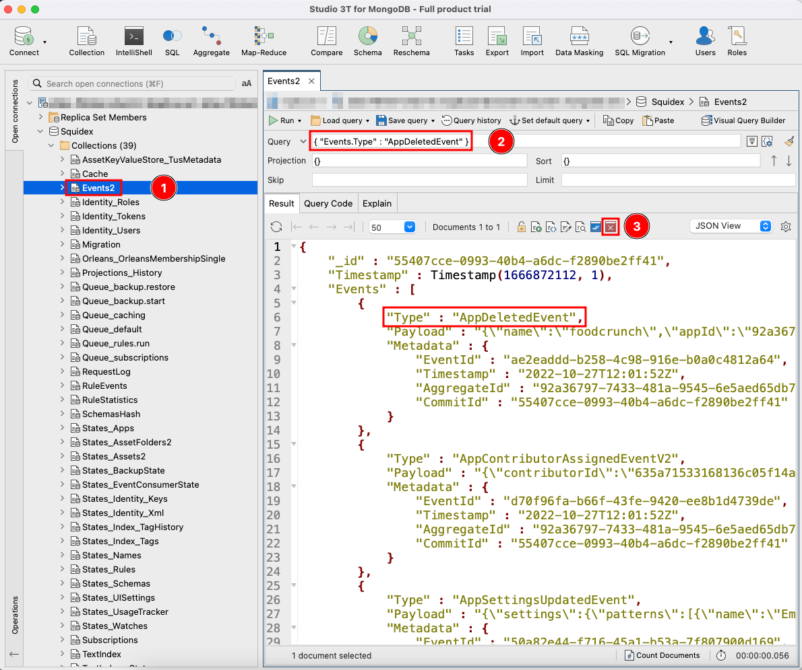
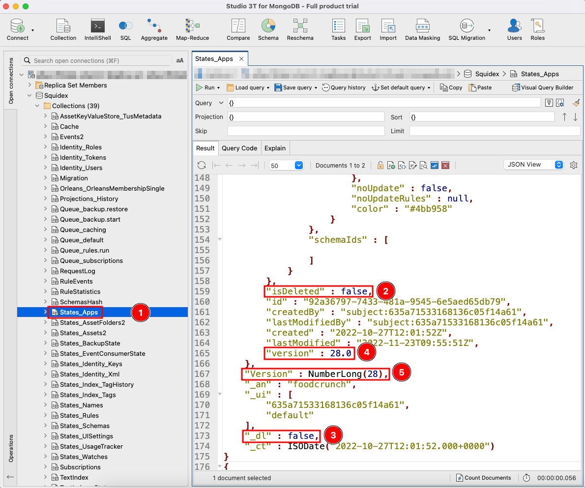

# Restoring Deleted Apps

## When Can I Restore An App?

Squidex uses event sourcing to store the state of an object (an App, content, asset and so on). When an object is deleted, a new deletion event is added to the system and the object is marked as deleted. Therefore, most objects can be restored.

However, with Squidex 6.0 a new flag has been introduced: `apps:deletePermanent`. When this flag is set to `true`, a deletion process deletes all app data in the background. Therefore, it is not possible to restore the data.

## Use a Backup

If a backup of the data is available, it is best to restore that backup, but this process requires taking the system offline. If this is not possible, proceed with the following guide.

Read more about backups in the following article:


[backups.md](../../../02-documentation/concepts/backups.md)


## Restore Process

Before continuing, you need a way to connect to the MongoDB instance. A graphical management tool, such as [https://studio3t.com/](https://studio3t.com), is recommended. If the database is not accessible from outside, login to the server directly, or use port forwarding.&#x20;

If MongoDB is running in Kubernetes, use `kubectl port-forward` command to forward the port.

```
kubectl port-forward mongo-0 27018:27017
```

Then the MongoDB server will be accessible under `mongodb://localhost:27018`.

### Step 0: Prepare a Backup

Before continuing, backup the database. If you don't have an existing process in place, create a backup using **studio3t**:

[https://studio3t.com/knowledge-base/articles/mongodb-export-csv-json-sql-bson/#export-mongodb-to-bson-or-mongodump](https://studio3t.com/knowledge-base/articles/mongodb-export-csv-json-sql-bson/#export-mongodb-to-bson-or-mongodump)

### Step 1: Delete the `Deletion` Event

The main data source in Squidex is a list of events. Most other states are derived from that list, so you can easily restore the other states from the events.

1. Go to the **Events** (1) collection.
2. Find the deletion event with the following filter: \
   `{ "Events.Type": "AppDeletedEvent" }`(2).
3. Delete this document (3).

<figure><figcaption><p>Deleting an AppDeletedEvent document from database</p></figcaption></figure>

### Step 2: Update the App Document

For this, there are two options. Variation 1 is faster, but does not work well if you have to undo a lot of changes.

#### Variation 1:

In this variation, changes are made in the database manually. It is faster, but there is the possibility of making mistakes. It is also time consuming if there are lots of changes.

To update the document for the App in the database, follow the procedure below:

1. Go to the **States\_Apps** (1) collection.
2. Set the `isDeleted` (2) and `_dl` (3) fields to `false`. Ensure that you update both fields.
3. Decrement the `version` (4) & `Version` (5) fields. There are two entries, ensure that you update both of them.
4. **Save** the document.

<figure><figcaption><p>Updating the App document from database</p></figcaption></figure>

#### Variation 2

In the second variation you can use the rebuild process. This part of Squidex runs before startup and uses the events to rebuild all documents of a given type, for example, all Apps or all assets.

1. Stop your Squidex instance.
2. Turn on the rebuild process: [https://github.com/Squidex/squidex/blob/master/backend/src/Squidex/appsettings.json#L553](https://github.com/Squidex/squidex/blob/master/backend/src/Squidex/appsettings.json#L553), for example set `REBUILDER__APPS=true` as environment variable (**IMPORTANT**: this it is a double underscore).
3. Start your Squidex instance and wait until the rebuild is over and your Squidex instance is available again. If you use multiple instances, set the instance count to 1 to ensure that the rebuild is not running multiple times or in parallel.
4. Stop the instance.
5. Turn off the rebuild process, for example, by removing the environment variable or by setting the value to `false`.
6. Restart your instance. If you use multiple instances, remember to set the instance count to your previous value to gain high availability once more.
