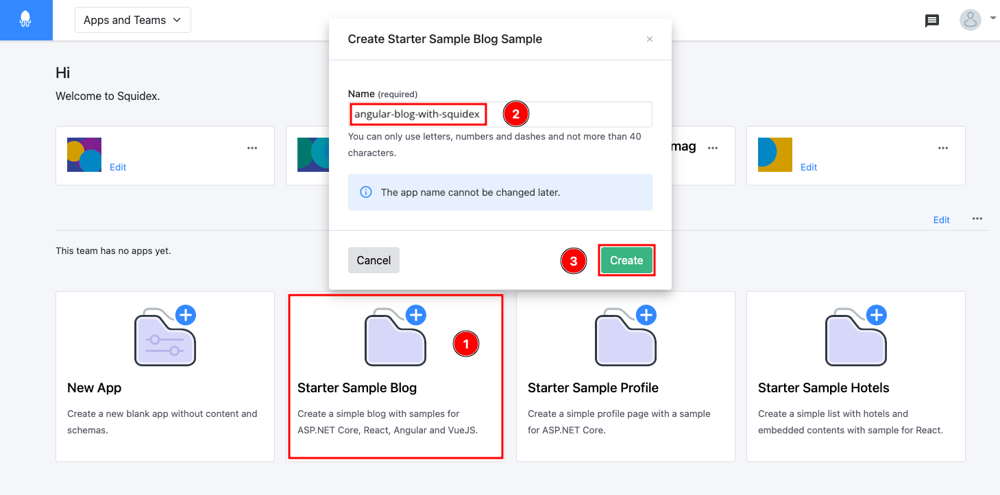
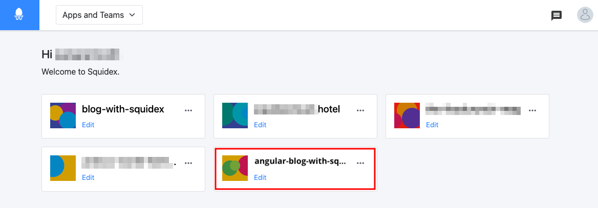
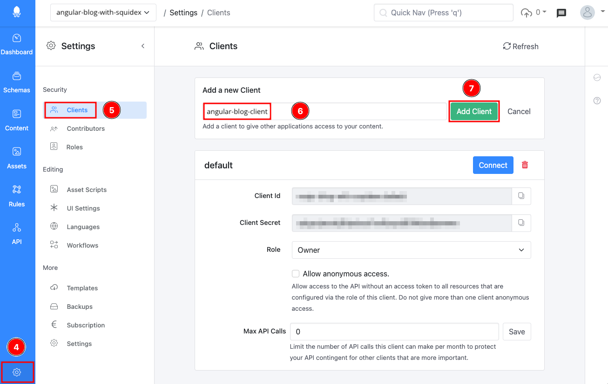
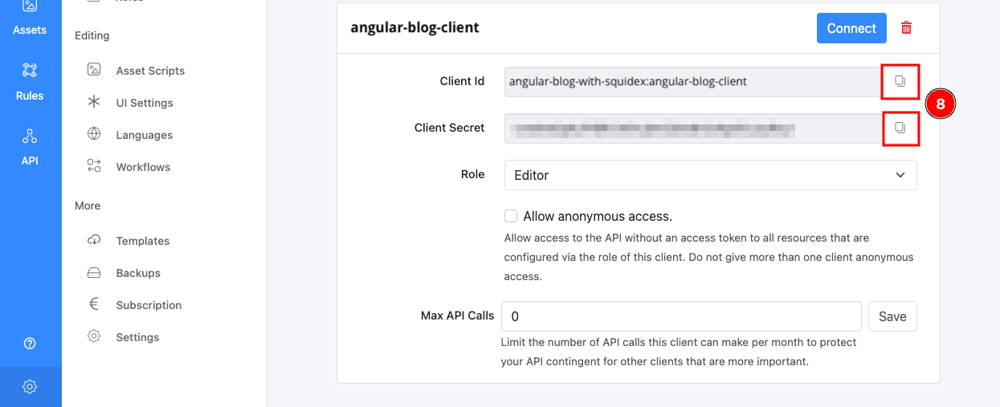
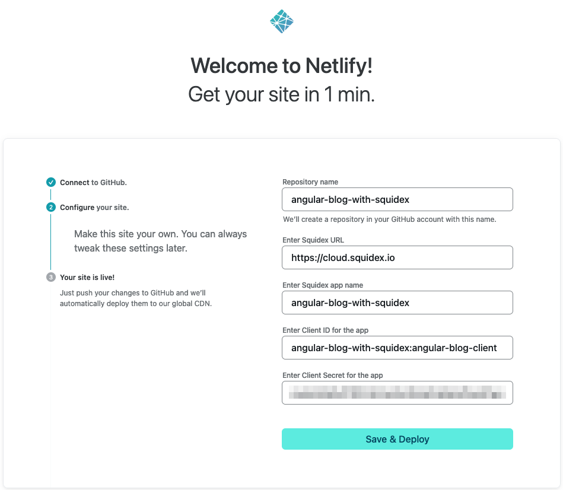
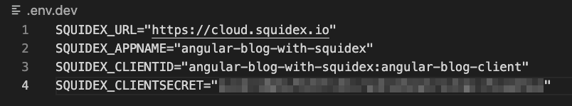
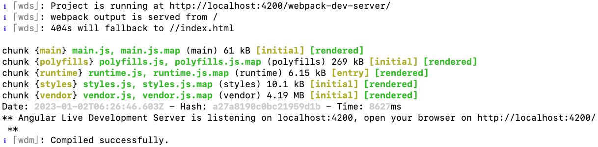
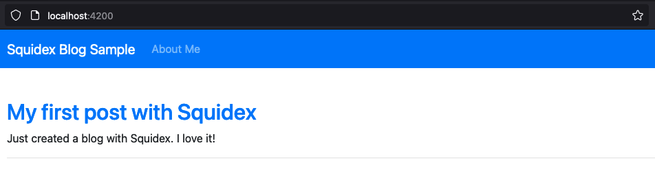

# Angular Blog with Squidex

This article provides you with instructions on how to quickly deploy an Angular blog with Squidex Cloud. The same approach can also be used for a self-hosted Squidex. For installation instructions click [here](../installation/).

## Prerequisites

* Account at [cloud.squidex.io](https://cloud.squidex.io/) (or a self-hosted Squidex).
* Account at [app.netlify.com](https://app.netlify.com).
* Account at [github.com](https://github.com/).
* For local deployment / development:
  * Node.js 16 or above.
  * NPM 8 or above.

## Creating the Squidex App

For this quick-start, you can create the App with pre-populated schemas directly in Squidex. To do this follow the steps below:

1. Navigate to [https://cloud.squidex.io](https://cloud.squidex.io) and login. (If you do not have an account, create one).
2.  Click **Starter Sample Blog** (1), give it a unique **Name** (2) such as `angular-blog-with-squidex-[your_initials]` and click **Create** (3). \

    

    <figure><figcaption>
Creating the Starter Sample Blog App on Squidex
</figcaption></figure>

    

3.  Click on the newly created App to navigate into it. You should make a note of the _App Name_ as it will be required later in the instructions. \

    

    <figure><figcaption>
Accessing the Squidex App
</figcaption></figure>

    

## Creating a Client in the Squidex App

In this step, let's create a client that will be used by the Angular code to talk to Squidex. \
When an App is created, there is a default client already present however, it has an _Owner_ role by default and it's not recommended to use this as a best practice.

1.  Navigate to **Settings** (4) > **Clients** (5) in the App. Next enter a **Name** for the client (6) and click **Add Client** (7).\

    

    <figure><figcaption>
Create a client for the Angular App
</figcaption></figure>

    

2.  This creates a new client with the role of _Editor_. **Copy** (8) the _Client Id_ and _Client Secret_ as they will also be required along with the _App Name_ later in the instructions.\

    

    <figure><figcaption>
Copy the Client Id &#x26; Client Secret
</figcaption></figure>

    

You are now ready to use this App with the code. &#x20;

If you wish to run the sample code locally, proceed with these steps [here](angular-blog-with-squidex.md#running-the-vue.js-blog-locally), otherwise continue to deploy the blog to an online platform.

## Deploying the Angular Blog

You can deploy the Angular code using various methods such as self-hosting and as a Docker container, in Kubernetes etc. You can also deploy them to various modern, fast and developer-friendly serverless platforms such as _Netlify_. The instructions here cover the latter:

### Deploying to Netlify

Netlify is a platform that helps you quickly build and deploy sites to a global network with a host of features and you can get stated for free!

When you click the **Deploy to Netlify** button below, the following steps will occur:

1. You will be redirected to _Netlify_ and prompted to sign in. (If you do not have an account visit [https://app.netlify.com/signup](https://app.netlify.com/signup) and create an account first).
2. Next, you will be asked to connect to your GitHub account. This step is required as the deployment process will clone the code to a repository in your own account.&#x20;
3.  Finally, you will be prompted to enter a name for the repository and the environment variables for the Squidex App. Enter the values noted down from before. \
    <mark style="color:orange;background-color:orange;">Your values will be different than the values in the screenshot.</mark>&#x20;

    <figure><figcaption>
Configuring the Netlify site
</figcaption></figure>
4. Next, _Netlify_ will deploy the App and provide a URL to access the App. (_Netlify_ runs the App in a Starter plan which is free).

Click   to get started.

### Running the code locally

1. Start by cloning the Angular sample blog code to your machine \
   `git clone https://github.com/sangramrath/squidex-angular-blog-starter.git`\

2.  Next, create the environment variables files using the example file available i.e. `.env.example`. To separate your variables from development and production you can create `.env.dev` and `.env.prod`.\
    \
    Update the `.env.dev` file with your values of _App Name_, _Client ID_ and _Client Secret_ noted down earlier. For the _URL_ use `https://cloud.squidex.io` if using Squidex Cloud or the URL to your Squidex instance, e.g. `http://localhost:5000` if you run it locally.\
    \
    The final file may look something like this:

    <figure><figcaption>
Environment file example
</figcaption></figure>
3. Run `npm install` to install the node modules and setup the project.
4.  Run `npm start` to compile and run it in development mode. This will serve the App at `http://localhost:4200/`. (sample screenshot below):\

    

    <figure><figcaption>
Successfully running Angular App
</figcaption></figure>

    

    \
    The development mode supports hot-reload for any live changes.
5.  Access your App locally, it should display your content fetched from Squidex. The _Starter Sample Blog_ App at Squidex has only one post.\

    <figure><figcaption>
Blog running locally
</figcaption></figure>
