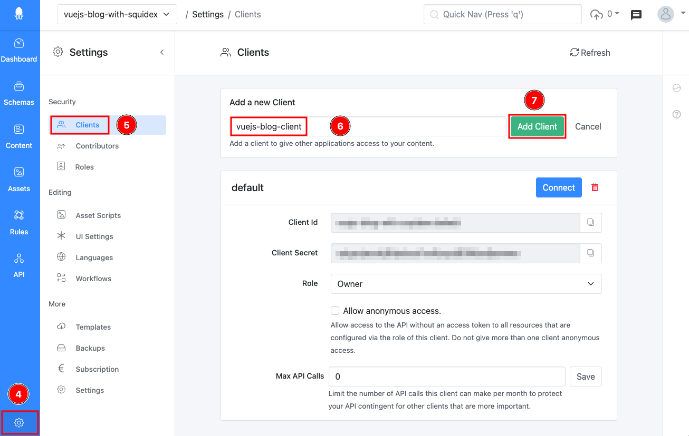

# Vue.js blog with Squidex CMS

This articles provides you with instructions on how to quickly deploy a Vue.js blog with Squidex Cloud. The same approach can also be used for a self-hosted Squidex. For installation instructions click [here](../installation/).

#### Pre-requisites

* Account at [cloud.squidex.io](https://cloud.squidex.io/) (or a self-hosted Squidex)
* Account at [app.netlify.com](https://app.netlify.com)
* Account at [github.com](https://github.com/)
* For local deployment / development
  * nodejs 16 or above
  * npm 8 or above

### Creating the Squidex app

For this quick start we can create the app with prepulated schemas directly in Squidex. To do this follow the below steps:

1. Navigate to `cloud.squidex.io` and login. (If you do not an account, create one.)
2.  Click **Starter Sample Blog** (1), give it a unique **name** (2) such as `vuejs-blog-with-squidex-[your_initials]` and click **Create** (3).&#x20;

    <figure><figcaption>
Creating the Starter Sample Blog app on Squidex
</figcaption></figure>
3.  Click on the newly created app to navigate into it. Also make a note of the app name as it will be required later in the instructions.&#x20;

    <figure><figcaption>
Accessing the Squidex app
</figcaption></figure>

### Creating a client in the Squidex app

In this step we will create a client that will be used by the Vue.js code to talk to Squidex. \
When an app is created, there is a default client already present however it has an _Owner_ role by default and hence not recommended to be used as a best practice.

1.  Navigate to **Settings** (4) > **Clients** (5) in the app. Next enter a **name** for the client (6) and click **Add Client** (7).

    <figure><figcaption>
Create a client for Vue.js
</figcaption></figure>
2.  This creates a new client with the role of an _Editor_. **Copy** (8) the `Client Id` and `Client Secret` as they will also be required along with the `app name` later in the instructions.

    <figure><figcaption>
Copy the Client Id &#x26; Client Secret
</figcaption></figure>

You are now ready to use this app with the code. &#x20;

If you rather wish to run the sample code locally proceed with the steps [here](vue.js-blog-with-squidex-cms.md#running-the-vue.js-blog-locally).

### Deploying the Vue.js blog

You can deploy the Vue.js code using various methods such as self-hosting, as docker container, in Kubernetes etc. You can also deploy them to various modern, fast and developer friendly serverless platforms such as _Netlify_. The instructions here cover the latter.&#x20;

#### Deploying to Netlify

Netlify is a platform that helps you quickly build and deploy sites to a global network with a host of features and you can get stated for free.

When you click the button the following steps will occur:

1. You will be redirected to Netlify and prompted to sign in. (If you do not have an account visit [https://app.netlify.com/signup](https://app.netlify.com/signup) and create an account first)
2. Next, you will be asked to connect to your GitHub account. This step is required as the deployment process will clone the code to a repository in your own account.&#x20;
3. Finally, you will be prompted to enter the environment variables for the Squidex app.
4. Post this Netlify will deploy the app and provide a URL to access the app. (Netlify runs the app in a Starter plan which is free)

When ready click **Deploy to Netlify** to get started.

### Running the code locally

1. Start by cloning the Vue.js sample blog code to your machine \
   `git clone https://github.com/sangramrath/squidex-vuejs-blog-starter.git`\

2.  Next, create the environment variables files using the example file available i.e. `.env.example`. To separate your variables from development and production you can create `.env.development` and `.env.production`.\
    \
    Add the app name, clientid and clientsecret values noted down earlier. For url use `https://cloud.squidex.io` if using Squidex cloud or the url to your Squidex instance, e.g. `http://localhost:5000` if you run it locally.\
    \
    The final file may look something like this:

    <figure><figcaption>
Environment file example
</figcaption></figure>
3. Run `npm install` to install the node modules and setup the project.
4.  Run `npm run serve` to compile and run it in development mode. This will serve the app at `http://localhost:8080/`. (sample screenshot below)

    <figure><figcaption>
Successfully running Vue.js app
</figcaption></figure>

    The development mode supports hot-reload for any live changes.
5.  Access your app locally, it should display your content fetched from Squidex. The _Starter Sample Blog_ app at Squidex has only one post.

    <figure><figcaption>
Blog running locally
</figcaption></figure>
