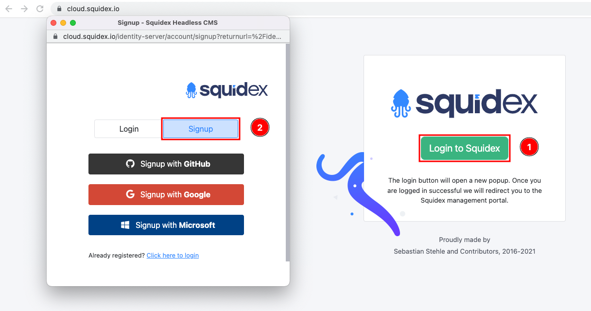
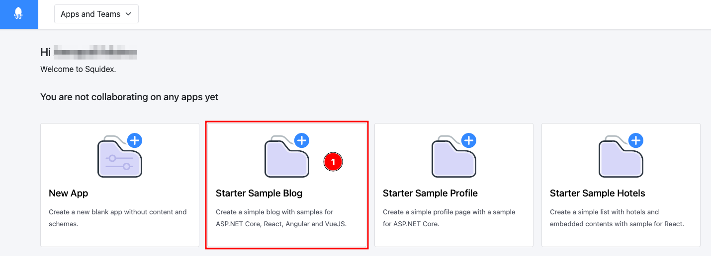
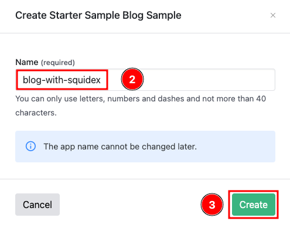
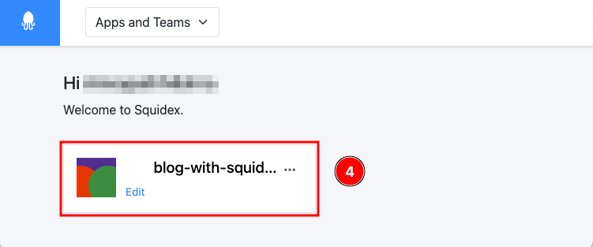

# Squidex Cloud

We provides a SaaS version hosted by us for anyone who wishes to quickly start using Squidex without the hassles of installation, configuration, maintenance etc. You can get started for free and move up as your needs increase.

To install Squidex yourself click [here](installation/) for installation instructions available for various platforms.&#x20;

## Signing up for Squidex Cloud

1. Start by navigating to https://cloud.squidex.io.&#x20;
2.  Click **Login to Squidex** (1) and then select **Signup** (2). Use one of the Identity providers such as GitHub, Google or Microsoft to signup to Squidex.&#x20;

    <figure><figcaption>
Signup to Squidex
</figcaption></figure>
3. In the following steps you will be prompted to sign in and authorize Squidex with your Identity provider. On successful signup you are logged in to Squidex dashboard. (If required you may have to login again)

## Using Squidex Cloud

You can now start with an empty App (click [here](../02-documentation/concepts/apps.md) to read what an App in Squidex is) or select one of the starter apps we provide. Starter apps come with sample schema(s) and some sample content, they help you to quickly start using Squidex.

In the following example, we will use the starter sample blog to quickly create an app.

1.  Click **Starter Sample Blog** (1) to get started.

    <figure><figcaption></figcaption></figure>
2.  Enter a unique **name** (2) (in Squidex cloud if an app name is already taken it will ask you to enter a different name) and click **Create** (3).

    <figure><figcaption></figcaption></figure>
3.  Click on the newly create app (4) to access it.

    <figure><figcaption></figcaption></figure>
4. You can now explore the pre-populated Schemas and Content and make modifications / additions to it. For a better understanding we highly recommend looking at the [documentation](../02-documentation/concepts/).
5. At this point this app is ready to be used with a frontend of your choice. We have a few quick start guides that work with this blog app which you can explore.
   * [Vue.js blog with Squidex CMS](quick-start-guides/vue.js-blog-with-squidex-cms.md)
   * [React.js blog with Squidex CMS](quick-start-guides/react.js-blog-with-squidex-cms.md)
   * [Angular blog with Squidex CMS](quick-start-guides/angular-blog-with-squidex-cms.md)
