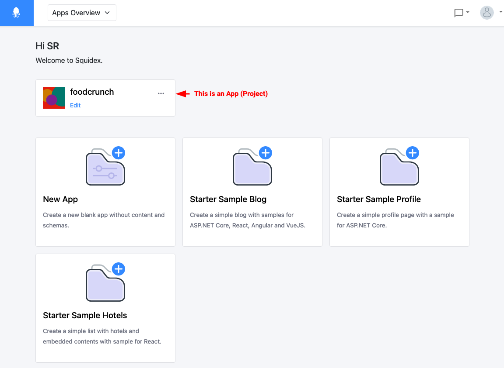

# Apps

This documentation is based on the _FoodCrunch_ use case. Please open the link below alongside this page to understand the examples.


[introduction-and-use-case.md](../introduction-and-use-case.md)


## What is an App?

An App in Squidex is the highest level of organization for your content. An App could represent a project, a team or an application in your organization or structure. This is where the schema, actual content, assets and settings etc., live.&#x20;

<figure><figcaption>
Apps overview in Squidex (self-hosted) or Squidex Cloud
</figcaption></figure>

An App is made up of the following:

* A display name, description and logo to make it discoverable in the overview.
* **Schemas** to define the structure of your content.
* **Content** itself.
* **Assets** such as images, that belong to your App and are linked to your content.
* **Rules** to model business workflows.
* **Custom Workflow** definitions.
* **Collaborators** who can work on your content with roles and permissions.
*   A subscription and an associated plan in the Squidex Cloud.\

    
    Subscriptions and plans are applicable only when using Squidex Cloud (https://cloud.squidex.io/)
    

<figure><figcaption>
Dashboard of an App
</figcaption></figure>
