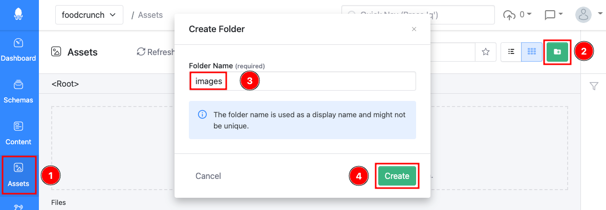
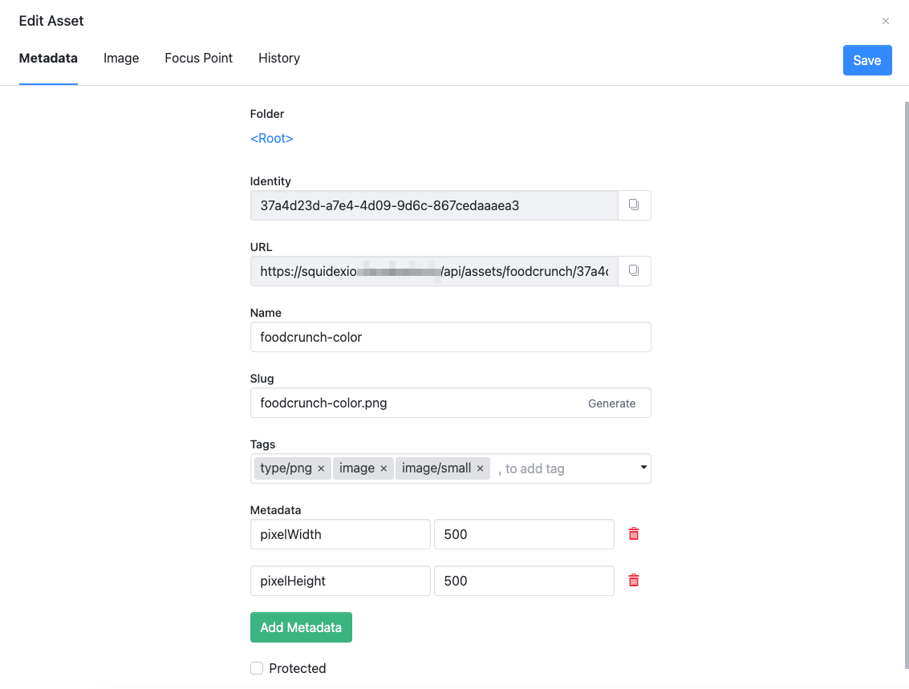

# Assets

This documentation is based on the _FoodCrunch_ use case. Please open the below link side by side to this page to understand the examples.


[introduction-and-use-case.md](../../introduction-and-use-case.md)


An asset in Squidex is a static content such as a file, a document, an image, a video or any other media file. These assets may be used along with the data in Content area.&#x20;

An example for our FoodCrunch use case could be the **logo** of the startups.

Assets can be uploaded to the root or in folders. For example assets of type images could be uploaded to a folder called _images_.

To create a folder clickicon (2), enter a **Folder Name** (3) e.g. _images_, click **Create** (4).&#x20;

<figure><figcaption></figcaption></figure>

## Asset Properties

An asset has properties and some of them can be modified after uploading the asset.&#x20;

Properties such as Name, Slug, Tags, Metadata can be added and/or modified. One can also protect an asset from anonymous download by checking the **Protected** box. This makes the asset private and hence a token is required to download it directly.


All assets uploaded are public by default.&#x20;


<figure><figcaption></figcaption></figure>
