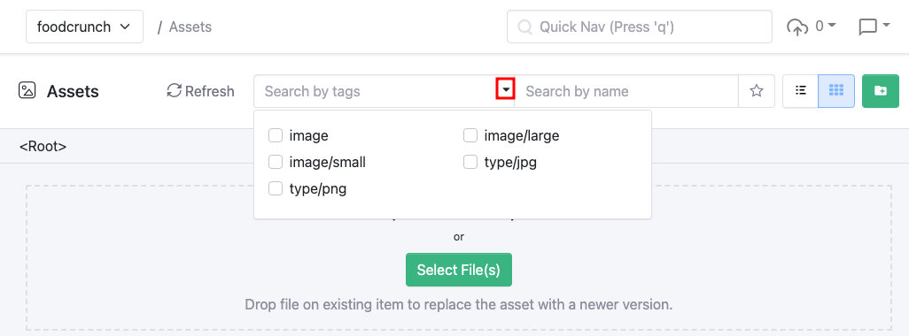
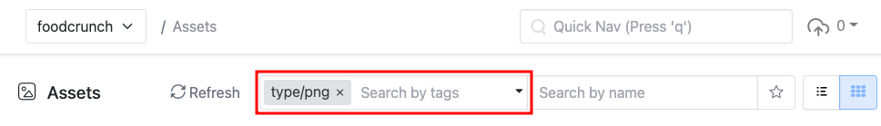
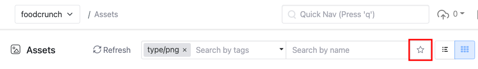

# Querying Assets

Squidex provides the capability to query your uploaded assets. You can query (search) by tags or name or a combination of both.

The following example shows how to search based on a tag _type/png_.

<figure><figcaption>
Selecting a search tag
</figcaption></figure>

<figure><figcaption>
Tag selection screenshot
</figcaption></figure>

Additionally, you can also save the query and decide whether to share it with other or not. To save the query click on the star button next to the search fields.

<figure><figcaption>
Saving the query - I
</figcaption></figure>

On the popup windows enter a name under **Name your query** (1) and click **Create** (2).

<figure><figcaption>
Saving the query - II
</figcaption></figure>

