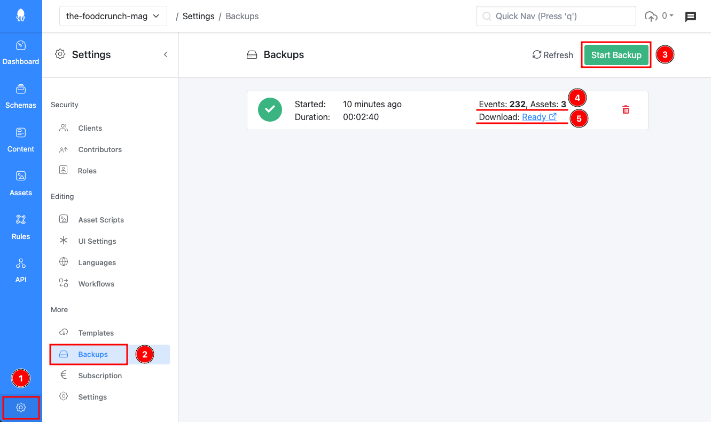
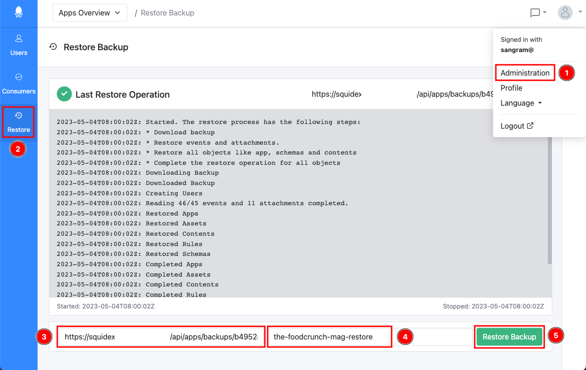

# Backups

This documentation is based on the _FoodCrunch_ use case. Please open the link below alongside this page to understand the examples.


[introduction-and-use-case.md](../introduction-and-use-case.md)


## What is a Backup?

A backup is an ZIP archive file that stores all your data for one App. It contains several files of the following types:

1. One file per each event that has happened in your system, for example `AppCreated` or `ContentDeleted`events. These files are named in consecutive order by the order they have occurred in your application.
2. One file per asset in your App.
3. Metadata files, for example, all users in your system as a pair of user IDs and email addresses. When the backup is restored, these users are created in a target system if they do not yet exist.

## Creating Backups

### How to Create Backups

If you are the owner of the App, go to **Settings** (1) and then **Backups** (2). To create a new backup press the **Start Backup** (3) button.&#x20;

<figure><figcaption>
Creating &#x26; managing backups
</figcaption></figure>

The screen will not refresh immediately and it can take a few seconds until you see the status of your backup.


Squidex only allows 10 backups per App. If you have reached this limit, you need to deleted an old backup to free up space.&#x20;


Each backup item has a **Download link** (5) that you need to restore the backup and also shows the **number of events and assets** in your backup (4). When you restore the backup, it will print the number of restored events and you can compare this with the total number of events in your backup to get an understanding of how long the backup operation might take. We do not show a progress indicator because it almost never works properly (see Microsoft Windows).

## Restoring Backups

### Restore a Backup (Self-Hosted)

In order to restore a backup, you will need access to the Administration page. If you are hosting Squidex, you are very likely the administrator and you will see a link to the Administration section when you click your profile.&#x20;


This option is not available for you in the Cloud.


1. Click on your profile, select **Administration** (1) and click **Restore** (2).
2. Copy the URL from your backup and add it to the first input field called **Url to backup** (3). You can (as an option) provide an **App name** (4) in the second input field.\
   If an App with the same name already exists you have to either delete the App first or define a new name for your restored App.
3. Press the **Restore Backup** button (5) to restore your backup. If you have restored a backup before, you will still see the logs as shown in the following screenshot:

<figure><figcaption>
Restoring a backup
</figcaption></figure>

### Restore a Backup (Squidex Cloud)

Backups are critical paths for Squidex and do not provide the same security mechanisms as normal API calls, therefore the backup must be validated first, to ensure that it won't cause any harm to the system. Create a backup of your local or Cloud App and send us the URL in a personal message through the [support forum](https://support.squidex.io).

If you want to restore a backup please complete the following steps:

1. Provide a download link directly to the backup. If you need to delete your App (see point 4) you have to upload your backup to an external storage location first. Please ensure that the backup can be downloaded anonymously (without any authentication). \
   <mark style="color:orange;">Do not use Google Drive, because it causes issue when downloading a backup.</mark>
2. Provide the number of events and assets, so that the time it takes to restore the backup can be estimated.&#x20;
3. If you want to change the name of the App, provide a new name.
4. If you want to keep the name then you have to delete your App first. Once the App is deleted, the download link for the backup becomes invalid, which is why it is important to upload the backup to an external storage location first (see point 1).
5. Do not share your backup link in a public post, use personal messages for this purpose.


Click the profile picture of the user you want to write a personal message to.


### How Does the Restore Process Work?

The restore process executes the following steps:

1. The name of the App is reserved.
2. All events from the backup are inserted into the system. If the event is an asset event, the corresponding asset is added to the system.
3. All indices are restored based on the inserted events.
4. Content and assets are created from the events and added to the database.
5. The App name reservation is either taken if the restore operation was successful or released if the operation has failed.


The backup cannot use an existing App and creates a new App to avoid conflict.


## Using the Backup System

The backup feature has a few DOs and DON'Ts that are important to understand.

### When to Use the Backup System

1. The backup system is useful if you want to clone your App with its full history to either the same installation or another installation. You can define a new App name for your backup and create as many independent copies as you want.
2. The backup system can be used to migrate from the Cloud to a self-hosted installation or from self-hosting to the Cloud. In the first case, you can just restore the backup yourself. In the second case, you have to create a support ticket as described above.

### When Not to Use the Backup System

1. The backup system is not as fast as MongoDB backup and can only secure your App information. Therefore, using the backup system is not recommended for system backups. Have a look at the official documentation about [Back Up and Restore with MongoDB Tools](https://docs.mongodb.com/manual/tutorial/backup-and-restore-tools/#back-up-and-restore-with-mongodb-tools) to understand the different backup options for MongoDB. If you use a Cloud provider such as MongoDB Atlas, it is typically built in.
2. The backup system constantly creates new Apps and old Apps are not deleted from the system (they are only marked as deleted). Therefore, you should not use the backup system to create syncs between different environments. It is much more efficient to use the synchronization features of the CLI (link below) for this purpose. If you use the backup system for this use case, multiple zombie Apps will be created in your system.&#x20;


[automation-tools.md](../developer-guides/automation-tools.md)

