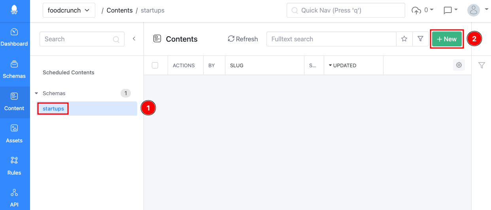
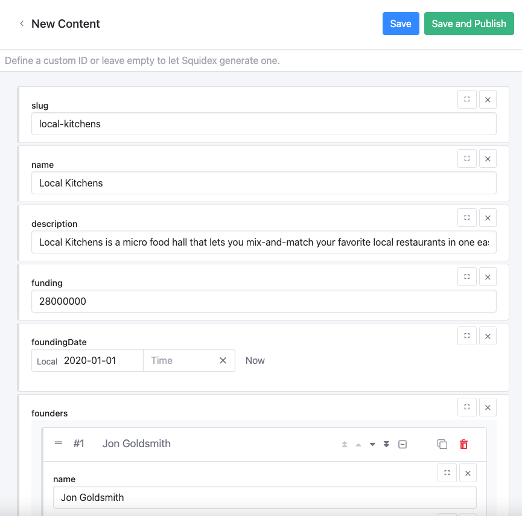
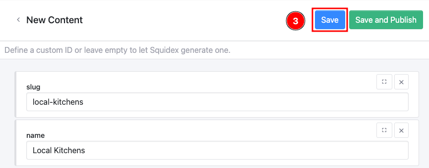

# Content

This documentation is based on the _FoodCrunch_ use case. Please open the below link side by side to this page to understand the examples.


[introduction-and-use-case.md](../../introduction-and-use-case.md)


**Content** is where you can add or view (existing) your actual content.&#x20;


Content can only be added on a published schema.


Content could be in one of the 3 stages:

1. Draft - when you add content and click **Save**, the content is in draft mode.&#x20;
2. Published - when you add content and click **Save and Publish**, the content is published.
3. Archived

To add content to your schema click on the **schema** (1) i.e startups in this example use case and then click **+ New** (2).

<figure><figcaption>
Add/view content
</figcaption></figure>

Then add content depending on the schema. For our food startups use case we will add information about a few emerging food startups.&#x20;

<figure><figcaption>
Adding content
</figcaption></figure>

When done click **Save** (3) if you do not wish to publish it immediately or click **Save and Publish** if you want to publish it immediately.

<figure><figcaption>
Saving the content
</figcaption></figure>

### Other operations on content

* Clone
* Delete
