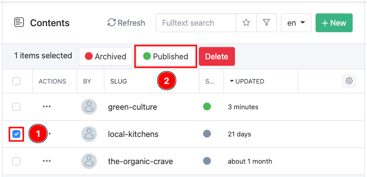
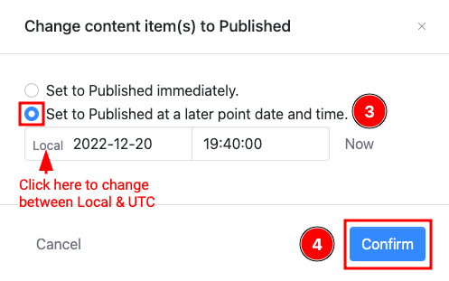
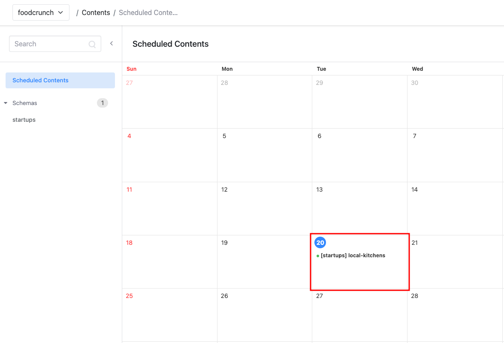

# Scheduled Publishing

This documentation is based on the _FoodCrunch_ use case. Please open the link below alongside this page to understand the examples.


[introduction-and-use-case.md](../../introduction-and-use-case.md)


When you add content through the Squidex portal, you can either _Save_ or _Save and Publish_.

_Save and Publish_ publishes your content immediately, however there may be instances where you would like to publish your content at a later date. You can do this by scheduling your content.

To schedule your content, select _Save_ content. Once your content is saved, navigate back to the list of content. Select the content(s) that you would like to publish at a later date by using the **checkbox** (1), then click **Published** (2).

<figure><figcaption>
Publishing at a later date
</figcaption></figure>

On the pop-up prompt select **Set to Published at a later point date and time** (3) and click **Confirm** (4). Click on the time zone to change between _Local_ & _UTC,_ if required.

<figure><figcaption>
Selecting a schedule
</figcaption></figure>

You can now see your content publishing schedule under **Scheduled Contents**.

<figure><figcaption>
Scheduled contents view
</figcaption></figure>

The Scheduled Contents area has a daily, weekly and monthly view that you can toggle between.
