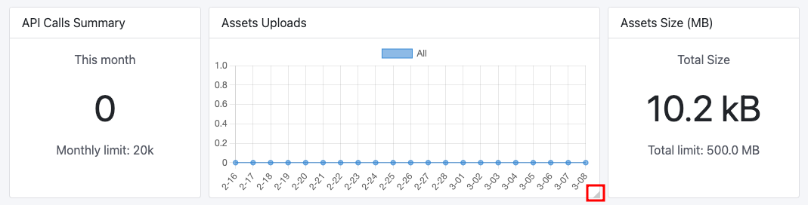

# Dashboard

This documentation is based on the _FoodCrunch_ use case. Please open the link below alongside this page to understand the examples.


[introduction-and-use-case.md](../introduction-and-use-case.md)


Apps in Squidex use a dashboard that displays various statistics concerning the App along with some quick links to operations, as well as some external links.

The default view of the dashboard shows the following statistics as cards:

* API Calls.
* API Performance (ms).
* API Calls Summary.
* Asset Uploads.
* Assets Size (MB).
* Traffic (MB).
* History.

<figure><figcaption>
Squidex App Dashboard
</figcaption></figure>


All assets are **anonymous**, this means you may see anonymous API Calls, Traffic or API performance statistics even though there may be no anonymous access.


### Customizing the Dashboard

#### Adding / Removing cards

In order to customize the dashboard, click on **Settings** (the gear icon) situated at the top-right of the page.

<figure><figcaption>
Customizing the dashboard
</figcaption></figure>

To remove a card or statistic, **uncheck** it from the list. To add a statistic, **check** it.

#### Resizing cards

The individual cards can also be resized to suit personal preference. To resize, move the mouse over to the bottom-right corner of the card to reveal the resize control.&#x20;

<figure><figcaption>
Resize a card
</figcaption></figure>

Next, press and hold the pointer (mouse or touchpad) and drag it left or right to resize.

<figure><figcaption>
Resized card
</figcaption></figure>

#### Changing Graph View&#x20;

Some statistics can be viewed in both grouped mode (default) and in stacked mode. To toggle, click the **Stacked** check box on the card.&#x20;

<figure><figcaption>
Grouped view
</figcaption></figure>

 

<figure><figcaption>
Stacked view
</figcaption></figure>


Changing the view of any card to Stacked changes it for all cards.


#### Filtering

You can filter clients from a metric. This is done by clicking the name which strikes it off so it is no longer displayed on the card.&#x20;

For example, in the following screenshot default, reader and Squidex frontend clients are disabled and only anonymous traffic size is displayed.

<figure><figcaption>
Filter clients from a metric
</figcaption></figure>

### Expert Mode

An **Expert Mode** is also available (choose from the Settings icon) if you wish to modify it through code.

<figure><figcaption>
Expert Mode
</figcaption></figure>

### Downloading API Logs

API logs can be downloaded in a CSV format from the dashboard page too. To do so, click on the **Download Log** link on the **API Calls** card.&#x20;

<figure><figcaption>
Download API Calls Logs
</figcaption></figure>

Additional operations that can be completed from the dashboard include:

* Navigate to Create Schema page.&#x20;
* View the API documentation for the App.
* Navigate to [Support](https://support.squidex.io/) page for feedback and support.
* Navigate to the source code on GitHub.
