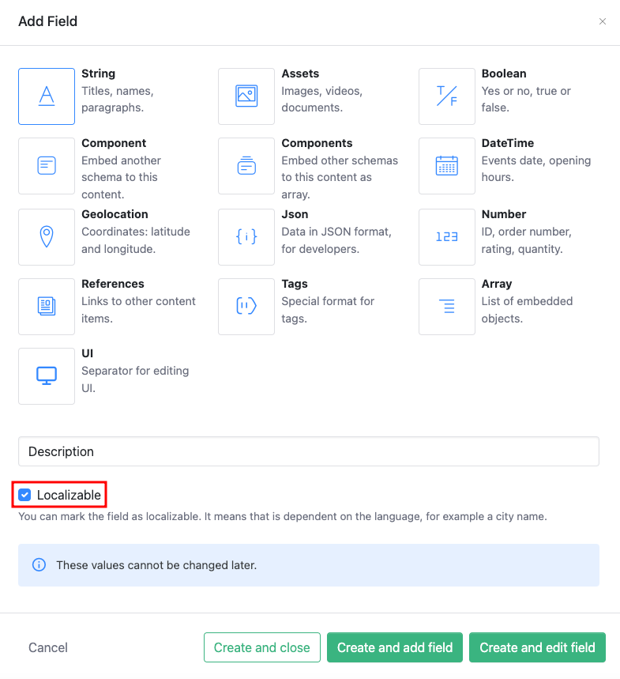
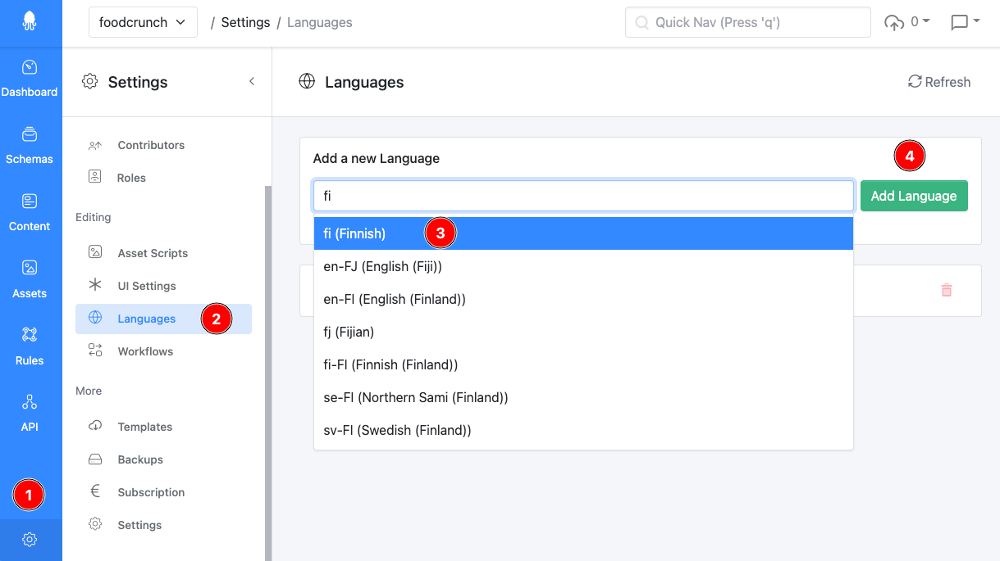
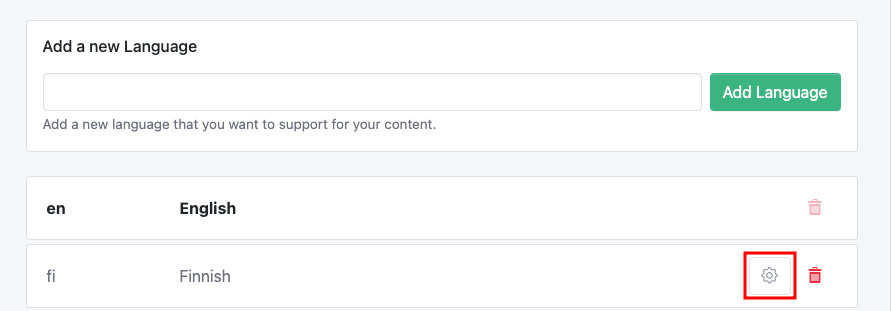
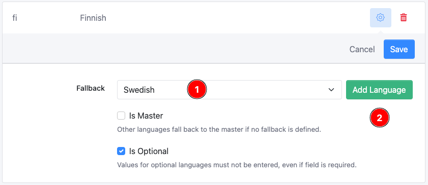

# Localization

This documentation is based on the _FoodCrunch_ use case. Please open the link below alongside this page to understand the examples.


[introduction-and-use-case.md](../introduction-and-use-case.md)


## Basic Concept

Localization is defined on a per field basis. We call this system "partitioning", more about that [here](localization.md#why-do-you-call-it-partitioning).&#x20;

Referring to our _FoodCrunch_ use case, the **Description** field in the `startups` schema is a _Localizable_ field.&#x20;


Localization is set when adding a field and cannot be modified later.&#x20;


<figure><figcaption><p>Setting a field as Localizable</p></figcaption></figure>

### Languages

Before you can add localized content, you must add the additional languages you wish to support and their fallback settings. This is configured in the Management UI.

To add languages click **Settings** (1) and then select **Languages** (2). **Search** (3) for the desired language, select it and click **Add Language** (4).&#x20;

<figure><figcaption><p>Adding localization/ language support </p></figcaption></figure>

### Language Settings

There are three configurable parameters for the Languages used for localization.&#x20;

To modify or apply these settings, click on the **Gear** icon next to the respective language.

<figure><figcaption><p>Modify language settings</p></figcaption></figure>

*   **Fallback** - This setting states that whenever a value for a localizable field is not available, Squidex tries to resolve the value from the master language which is the default fallback language. You can set more than one fallback language.\
    To set a fallback, select a language from the **dropdown** (1) (list only includes enabled languages) and click **Add Language** (2).

    <figure><figcaption><p>Adding a fallback language</p></figcaption></figure>

    The final screenshot for the Swedish language in our example looks something like below: \


    <figure><figcaption><p>Set multiple fallback languages</p></figcaption></figure>

    You can reorder these to set your priority. To reorder, use the   icon and drag it up or down.


_Master Language_ cannot have fallback languages and it cannot be Optional.


* **Is Master** - This is used to set if a language is the _Master Language_, meaning when another language has no value, it displays the content in this language. English is the _Master Language_ by default.
* **Is Optional** - This means that required fields can be omitted. This is useful when you introduce a new language. You can save content with required fields even if the field value has not been entered for the _Optional Language_.

&#x20;Remember to click **Save** when done.


A _Master Language_ cannot be modified or deleted unless a different language is set as a the _Master Language_.


For our _FoodCrunch_ use case, we have added the following languages along with their settings.&#x20;

| Name        | Code | Fallback       | Optional | Description                                                                                                                                                                                                                                                                    |
| ----------- | ---- | -------------- | -------- | ------------------------------------------------------------------------------------------------------------------------------------------------------------------------------------------------------------------------------------------------------------------------------ |
| **English** | `en` | -              | N/A      | Our master language. Whenever a fields is not available in a language it falls back to the master language.                                                                                                                                                                    |
| **Swedish** | `sv` | Not configured | Yes      | Swedish has no fallback language configured, therefore the fallback language is always English. This is an optional language.                                                                                                                                                  |
| **Finnish** | `fi` | `sv,en`        | Yes      | Finish has Swedish configured as a fallback language. This means that whenever a value for a localizable fields is not available Squidex tries to resolve the value from Swedish first and then from the master language (English). Finish is also marked as optional.         |
| **Italian** | `it` | `en`           | Yes      | Italian is a new language and has been added after the content editors have created most of the content. Therefore most content items do not have a value available. Since no fallback language is configured, English will be the fallback language. Italian is optional too. |

The final screenshot may look similar to the screenshot below.

<figure><figcaption><p>Languages settings for FoodCrunch app.</p></figcaption></figure>

It's easy to understand when you look at a content object from the API:


```javascript
{ 
    "id": "01",
    "created": "2017-02-25T19:56:35Z",
    "createdBy": "...",
    "lastModified": "2017-02-25T19:56:35Z",
    "lastModifiedBy": "...",
    "data": {
        "description": {
            "en": "FoodCo aims to revolutionize the way we eat. Their innovative products focus on sustainability.",
            "fi": "FoodCo pyrkii mullistamaan ruokailutottumuksiamme. Niiden innovatiiviset tuotteet keskittyvät kestävään kehitykseen.",
            "it": null,
            "sv": "FoodCo har som mål att revolutionera vårt sätt att äta. Deras innovativa produkter fokuserar på hållbarhet."
        },
        "founded": {
            "iv": 2019
        }
    }
}
```


Each field value is a set of values that are associated with keys. In JavaScript this is called an `Object`, other programming languages call it `HashMap` or `Dictionary`. The keys must be unique. Depending whether the field is localizable or not the API accepts different keys.

* The `founded` field is not localizable. Therefore the only allowed key is `iv`, which stands for "_invariant_".
* The `description` field is localizable. The allowed keys are the language codes for the languages you have configured.

## How to Use the API

### How to Retrieve the Correct Languages?

The rest endpoint provides two headers that can be used to query the correct language.

#### X-Languages Header

You can filter the languages with the `X-Languages` header. Other languages will be omitted. We do not use the `Accept-Language` header because we want to avoid compatibility issues. If you define a language that is not supported, this language will be ignored. For example, if you set `X-Languages: en,sv,it` for our example above you will only retrieve English (`en`) and Swedish (`sv`).


```javascript
X-Languages: en,sv,it
{ 
    ...,
    "data": {
        "description": {
            "en": "FoodCo aims to revolutionize the way we eat. Their innovative products focus on sustainability.",
            "sv": "FoodCo har som mål att revolutionera vårt sätt att äta. Deras innovativa produkter fokuserar på hållbarhet."
        },
        "founded": {
            "iv": 2019
        }
    }
}
```


If none of the specified languages are provided, you will only retrieve the _Master Language_.


```javascript
X-Languages: de
{ 
    ...,
    "data": {
        "description": {
            "en": "FoodCo aims to revolutionize the way we eat. Their innovative products focus on sustainability."
        },
        "founded": {
            "iv": 2019
        }
    }
}
```


#### X-Flatten Header

If you add this header, fields that only have a single value will be flattened. So the example above will be transformed to:


```javascript
X-Flatten: true
{ 
    ...,
    "data": {
        "description": {
            "en": "FoodCo aims to revolutionize the way we eat. Their innovative products focus on sustainability.",
            "fi": "FoodCo pyrkii mullistamaan ruokailutottumuksiamme. Niiden innovatiiviset tuotteet keskittyvät kestävään kehitykseen.",
            "it": null,
            "sv": "FoodCo har som mål att revolutionera vårt sätt att äta. Deras innovativa produkter fokuserar på hållbarhet."
        },
        "founded": 2019
        }
    }
}
```


Both headers can be combined. If you define a single language with the `X-Languages` header, the localizable fields will contain only one value each and therefore the fields can be flattened as well. If you provide an unsupported language you will just get the _Master Language_.

So, our example from above might look like this:


```javascript
X-Languages: de, X-Flatten: true
{ 
    ...,
    "data": {
        "description": "FoodCo aims to revolutionize the way we eat. Their innovative products focus on sustainability.",
        "founded": 2019
    }
}
```


This means that you can just forward the user language and Squidex will handle the rest.


The headers above are not supported by the GraphQL endpoint, because in GraphQL the output should be defined as only the query.


### How to Disable Fallback Languages?

If you want to complete the fallback handling in your API, you can disable the behavior above. Add the following header to all your to all your requests: `X-NoResolveLanguages=1`

You will then receive the raw data and some fields might not have a value for a language, for example when this language is new and nobody has entered a value yet:


```javascript
X-NoResolveLanguages: 1
{ 
    ...,
    "data": {
        "description": {
            "en": "FoodCo aims to revolutionize the way we eat. Their innovative products focus on sustainability.",
            "fi": "FoodCo pyrkii mullistamaan ruokailutottumuksiamme. Niiden innovatiiviset tuotteet keskittyvät kestävään kehitykseen.",
            "sv": "FoodCo har som mål att revolutionera vårt sätt att äta. Deras innovativa produkter fokuserar på hållbarhet."
        },
        "founded": {
            "iv": 2019
        }
    }
}
```


## Why is this Called Partitioning?

This means that the a value is partitioned into multiple subvalues. When we implemented the localization feature we realized that it might be very helpful to extend this feature to other types of keys, for example you can:

* Define your prices for different currencies.
* Write your texts for different countries.
* Define customer groups.

So, we implemented the localization feature with the idea in mind that we might extend it in coming versions.
