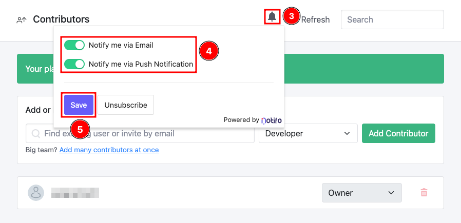

# Notifications

This documentation is based on the _FoodCrunch_ use case. Please open the link below alongside this page to understand the examples.


[introduction-and-use-case.md](../introduction-and-use-case.md)


## Introduction

Squidex provides a notification service that is power by _Notifo_. [_Notifo_](https://notifo.io) is an open source general purpose notification framework, initially developed for Squidex to enable users to subscribe to changes and receive notifications.

### Scenarios Where Notifications Can Be Triggered

* When there is a content item change.
* When there are changes made to the schema.
* When there are changes to contributors, such as adding contributors or changing their roles.&#x20;
* Notifications can also be triggered by rules.
* Notifications are also triggered by mentions and comments, e.g. if you add "_@user_" to a comment


This notification service only works in Squidex Cloud (i.e. cloud.squidex.io) by default. To use this service in a self-hosted installation, you must separately install and run the Notifo service. Click here for installation instructions (coming soon).&#x20;


### How Notifications Work

* Notifications can be received through email or (web) push notifications.


At the time of writing this article, email notifications are not operational.


* Those subscribing to a change won't see any notifications if they initiated the changes themselves. A notification is only created if changes are made by someone else.

The notification icon is situated on the top menu bar, next to the user icon. Clicking on this displays _Notifications_, _Archive_ (archived notifications) and the notification _Profile_.

<figure><figcaption>
Notification icon
</figcaption></figure>

## Subscribing to Changes

Follow the instructions below to subscribe to changes. For this purpose of this example we are subscribing to changes in **Settings** > **Contributors**.

1.  Navigate to **Settings** (1) and then **Contributors** (2) for your App.\

    <figure><figcaption>
Contributor settings for the app
</figcaption></figure>
2.  Next, subscribe to the changes. To do so, click on the **bell icon** (3) and then toggle to the **notification mediums of choice** (4), Notifications can be received by Email and/or Push Notifications. Next, click **Save** (5).\

    <figure><figcaption>
Subscribing to notifications
</figcaption></figure>
3.  At this point a new contributor can be added or invited. To test notifications, you can add a contributor. \
    \
    To do so, **enter the name or email** (1) address of the contributor (a drop down menu appears making it easy to select an existing user or enter an email address if you wish to add a new user). Next, select the role for example **Editor** (2) and click **Add Contributor** (3). \
    \
    <mark style="color:orange;">NOTE: Subscribers will only receive a notification if the change is actioned by another user.</mark>\

    <figure><figcaption>
Adding a contributor
</figcaption></figure>
4. Whenever a new contributor is added, the subscribed user will receive a notification through their chosen notification methods (currently, only Web Push Notifications work). An example of a (eWb) Push Notification can be viewed below.

## Setting the Notification Profile

To set the notification profile, click the **Notification icon** (1) on the top bar and then select the **Profile** tab (2). You can set your notification preferences, notification email and preferred time zone amongst other settings.

<figure><figcaption>
Setting notification profile
</figcaption></figure>
