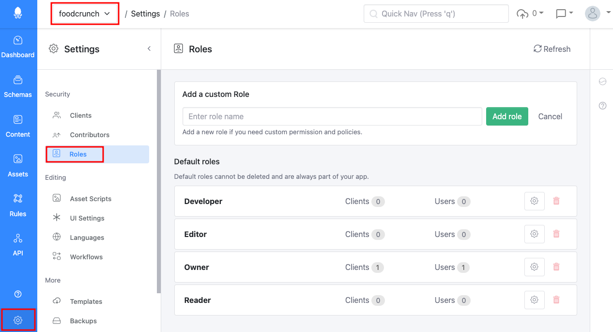
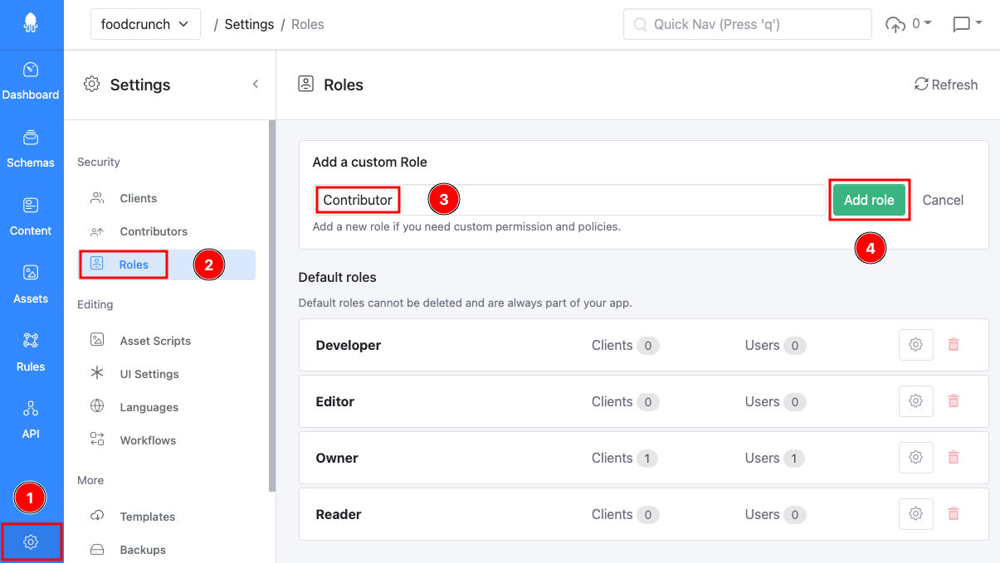
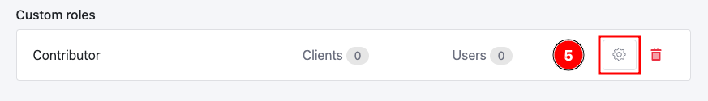
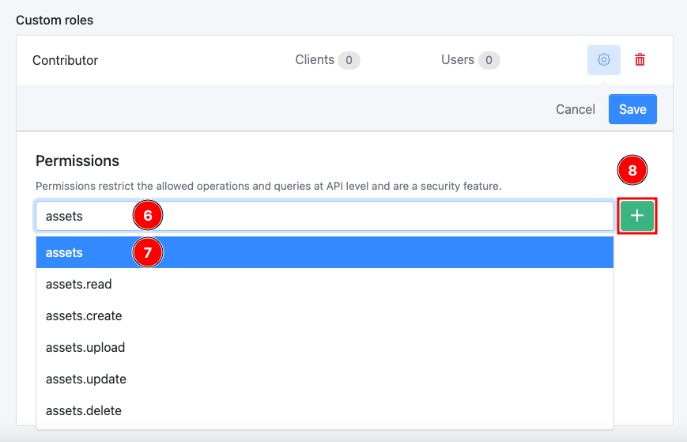
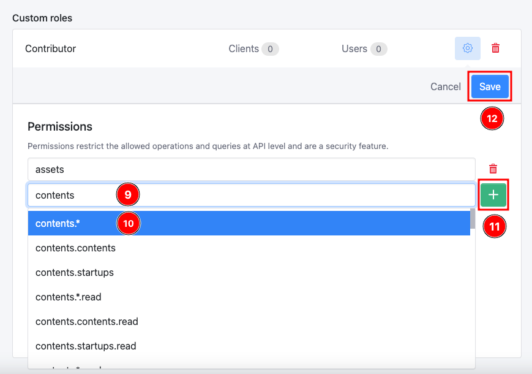

# Roles & Permissions

This documentation is based on the _FoodCrunch_ use case. Please open the link below alongside this page to understand the examples.


[introduction-and-use-case.md](../introduction-and-use-case.md)


## Permissions in Squidex

Squidex uses a fine grained permission system. Permissions are defined with a dot-notation as outlined below.

* `squidex`
* `squidex.apps.{app}.clients`
* `squidex.apps.{app}.clients.read`
* `squidex.apps.{app}.contents`
* `squidex.apps.{app}.contents.{schema}`
* `squidex.apps.{app}.contents.{schema}.read`
* `squidex.apps.{app}.contents.{schema}.create`

`{app}` and `{schema}` are placeholder that will be replaced with your current app name or schema name.

The full list of permissions can be found here: [https://github.com/Squidex/squidex/blob/master/backend/src/Squidex.Shared/PermissionIds.cs](https://github.com/Squidex/squidex/blob/master/backend/src/Squidex.Shared/PermissionIds.cs)

The system is expressed as a hierarchy. Visualizing it as a tree you get the following structure:

* squidex
  * apps
    * {app}
      * clients
        * reader
      * contents
        * {schema}
          * read
          * create

This means that:

* `squidex` gives you all permissions and makes you an administrator.
* `squidex.apps.{app}` gives you all permissions for a specific app and makes you the app owner.

### Defining permissions

The permission system also allows wildcards:

`squidex.apps.{app}.contents.*.read` gives you read access to all schemas in your app, but now write access.

Another example of a wildcard is the below:

`squidex.apps.{app}.contents.contents|startups.*` which gives you full access to two schemas contents and startups.


The _FoodCrunch_ use case has a schema called **contents** and should not be confused with the properties of the app also called as contents.


A third example of the wildcard can be:

`squidex.apps.{app}.contents.^settings.*` gives you full access to all schemas except to a schema called settings.

### Special permission

In the list of [available permissions](https://github.com/Squidex/squidex/blob/master/backend/src/Squidex.Shared/PermissionIds.cs) there is one special permissions i.e. `squidex.apps.{app}.common`.&#x20;

This gives you the minimum permissions to access an app.&#x20;

If you create a role that can view content only, this role also needs the permissions to query the configured languages and published schemas for an app. Therefore all app roles have this permissions implicitly.

## Roles

Roles are used to assign one or more permissions to users. You can view the default roles and create custom roles under **Roles** in **Settings** section of the app.&#x20;

<figure><figcaption>
Roles
</figcaption></figure>

### Default roles

Squidex had four default roles that cannot be deleted.&#x20;


`{app}` is your app name.


### Owner

An owner is the owner of the app and can do everything, including deleting the app.

|                      |                 |
| -------------------- | --------------- |
| `squidex.apps.{app}` | All permissions |

### Developer

Users with developer role can use the API view, edit assets, contents, schemas, rules, workflows and settings.

| Permission                    | Description                                                    |
| ----------------------------- | -------------------------------------------------------------- |
| `squidex.apps.{app}.api`      | Can use the api section the Management UI                      |
| `squidex.apps.{app}.assets`   | Can view and manage assets                                     |
| `squidex.apps.{app}.contents` | Can view and manage contents                                   |
| `squidex.apps.{app}.patterns` | Can view and manage patterns                                   |
| `squidex.apps.{app}.rules`    | Can view and manage rules                                      |
| `squidex.apps.{app}.schemas`  | Can manage schemas (Viewing schemas is an implicit permission) |

### Editor

The editor role allows editing assets and contents and viewing workflows

| Permission                    | Description                 |
| ----------------------------- | --------------------------- |
| `squidex.apps.{app}.assets`   | Can view and manage assets  |
| `squidex.apps.{app}.contents` | Can view and manage content |

### Reader

A user with reader role can only read assets and contents.

|                                      |                  |
| ------------------------------------ | ---------------- |
| `squidex.apps.{app}.contents.*.read` | Can view content |

### Custom roles

You can create custom roles in the Management UI. To create a custom role, navigate to **Settings** (1) and then **Roles** (2) in your app. Enter a **name** (3) for the role and then click **Add role** (4).

For our _FoodCrunch_ use case, we want to create a custom role for blog/magazine contributors. We will call it **Contributor**.

<figure><figcaption>
Creating a custom role
</figcaption></figure>

Next, click on the gear icon (5)  next to the custom role to start assigning permissions.

<figure><figcaption>
Custom role settings
</figcaption></figure>

For our FoodCrunch magazine contributors, we want to provide _full access to assets and contents_ only of the app. The default Editor role has these permissions but it also has other permissions that allow reading roles and workflows which we want to avoid for our use case. Hence, the need for a custom role.&#x20;

The following permissions will be added:

* `assets`
* `contents.*`

To start adding permissions, start typing a few words of the permission that you want to assign and a drop down list appears, select the desired permission and click + to add it.

So, for our use case we search for the word **assets** (6) and select **assets** (7) from the list since we want to provide all permissions for assets. Click **+** (8) to add it.

<figure><figcaption>
Adding permissions to a customer role - 1
</figcaption></figure>

Similarly, search for **contents** (9) and select **contents.\*** (10) from the list. Click **+** (11) to add the permission to the custom role and then **Save** (12) to save the changes.

<figure><figcaption>
Adding permissions to a customer role - 2
</figcaption></figure>

All permissions will be prefixed with `squidex.apps.{app}` automatically, otherwise you would be able to create roles that give you permissions to another app.

## Administration

As an administrator you can also assign permissions to users individually:

There are some limitations to keep in mind:

* When you assign permissions to a user manually, the user has to logout and login again for the changes to take effect as these permissions are stored as claims in the cookie.
* Even if a user has the admin permission (`squidex`) or permissions for all apps (`squidex.apps`) he will not see them in the apps overview in the administration UI. A Squidex instance can have thousands of apps (like our cloud) and the user interface is not designed for that. Either assign them explicitly to an app, like `squidex.apps.{app}`, or enter the url manually.
