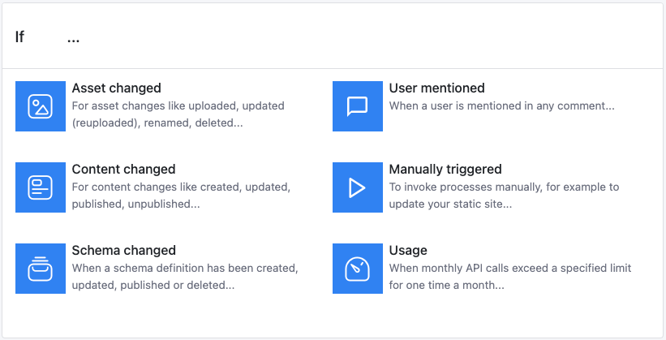
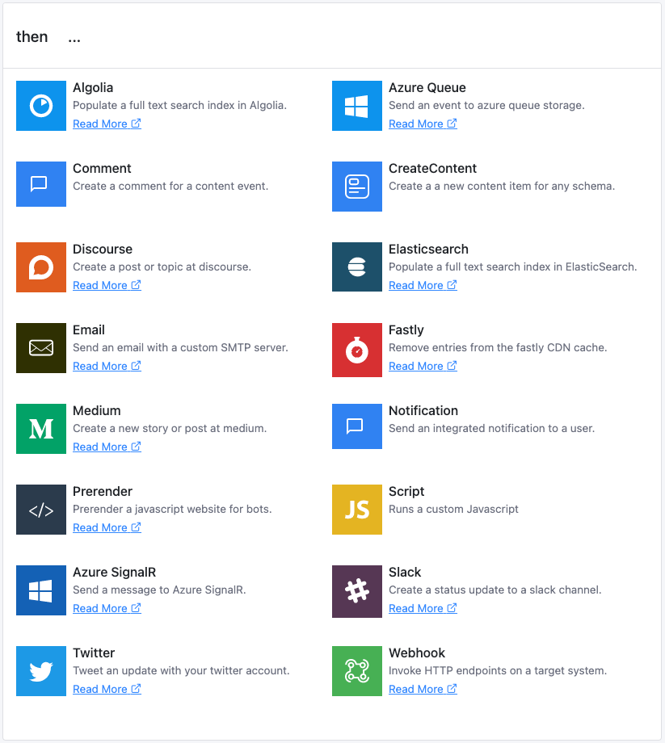
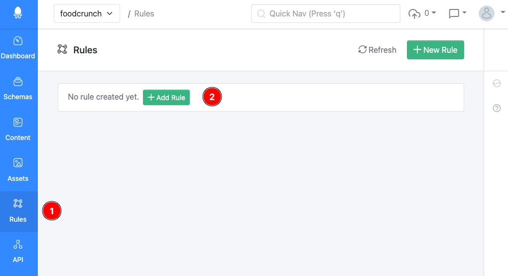

# Rules

This documentation is based on the _FoodCrunch_ use case. Please open the link below alongside this page to understand the examples.


[introduction-and-use-case.md](../introduction-and-use-case.md)


## Concepts

### Event

Whenever you make a change in Squidex, such as creating content or updating settings, an event is created. An event describes what happened in the past and has a unique name, for example `ContentChanged`. You can react to events by defining rules.

A rule has two parts:

1.  A **Trigger** that defines when to execute the rule. This is also called **If** in the UI.\
    The following triggers are currently available in rules:\


    <figure><figcaption><p>Triggers in rules</p></figcaption></figure>
2.  An **Action** that defines what to do. This is otherwise called **then** in the UI.\
    The following actions are currently available:\


    <figure><figcaption><p>Actions in rules</p></figcaption></figure>

To create a rule go to **Rules** (1) and click **+ Add Rule** (2) or **+ New Rule**.

<figure><figcaption><p>Creating a rule</p></figcaption></figure>

The final list of rules would look something similar to the screenshot below:


## Workflow

To execute a rule the following steps are performed:

1. **Enrichment**: The event is enriched with additional information.
2. **Matching**: The matching rules are determined by comparing the rule triggers with the enriched event.
3. **Formatting**: An rule job is created and stored. It contains all information to execute the rule for the current event.
4. **Execution**: The rule job is queried from the store and executed. If not succeeded it will be marked for a retry at a later point of time.

### 1. Enrichment

Events contain only the bare minimum of information. For the `ContentPublished` event only the if of the content that has been published is needed. All other information can be derived. In addition to that, metadata is only stored, such as the time stamp and the ID of the user who created the content. This is common for all events. However, for next steps additional information is needed. Therefore, these are retrieved from the system and enriched events are created.

The enriched events have the following structure:

#### Content Events

```javascript
{
    "id": "123...", // Id of the content.
    "actor": { "type": "subject", "id": "123..." }, // Id of the user
    "appId": { "name": "my-app", "id": "123..." }, // App name and id
    "created": "2018-01-01T12:00:00Z",
    "createdBy":  { "type": "subject", "id": "123..." },
    "data": { // Content data
        "city": {
            "en": "Munich",
            "de": "München"
        },
        "population": {
            "iv": 123000
        }
    },
    "lastModified": "2018-01-01T12:00:00Z",
    "lastModifiedBy": { "type": "subject", "id": "123..." },
    "schemaId": { "name": "my-schema", "id": "123..." }, // Schema id
    "status": "Draft", // Status of the content: Draft, Archived, Published
    "timestamp": "2018-01-01T12:00:00Z",
    "type": "Created", // The type of the event.
    "user": { // The user information.
        "id": "123...",
        "name": "John Doe",
        "email": "john@email.com"
    },
    "version": 1 // Version of the content, increased with any operation
}
```

The content event type can be one of the following values:

* `Created`: The content has been created.
* `Updated`: The content has been updated.
* `Published`: The status of the content has been changed to `Published`.
* `Unpublished`: The status of the content has been changed from `Published` to another status.
* `StatusChanged`: The status has been changed, e.g. `Draft` to `Archived`.
* `Deleted`: The content has been deleted.

#### Asset Events

```javascript
{
    "id": "123...", // Id of the asset
    "actor": { "type": "subject", "id": "123..." }, // Id of the user
    "appId": { "name": "my-app", "id": "123..." }, // App name and id
    "created": "2018-01-01T12:00:00Z",
    "createdBy": "subject:123",
    "fileName": "Avatar.png",
    "fileSize:": 512000,
    "fileVersion": 1,
    "isImage": true,
    "lastModified": "2018-01-01T12:00:00Z",
    "lastModifiedBy": { "type": "subject", "id": "123..." },
    "mimeType": "image/png",
    "pixelHeight": 600,
    "pixelWidth": 800,
    "timestamp": "2018-01-01T12:00:00Z",
    "type": "Created", // The type of the event.
    "user": { // User information
        "id": "123...",
        "name": "John Doe",
        "email": "john@email.com"
    },
    "version": 1 // Version of the asset, increased with any operation
}
```

The asset event type can be one of the following values:

* `Created`: The asset has been uploaded.
* `Updated`: The file of the asset has been replaced with a newer version.
* `Annotated`: The metadata or slug has been changed.
* `Deleted`: The asset has been deleted.

It is important to understand the structure because it is used in the matching step. Furthermore, some actions just pass over the enriched events to other systems. For example, the `webhook` action adds the event to the request body in (almost) the same format.

### 2. Matching

Let's have a look at a trigger definition first:


In the matching process, it is checked whether the action should be executed. There are several conditions:

1. The event type must be correct:
   * A rule with a `AssetChanged` trigger can only handle asset events.
   * A rule with a `ContentChanged` trigger can only handle content events.
2. If a condition is defined it must evaluate to true.

A condition is a JavaScript expression that must return `true` to execute the rule.

Here are some examples to demonstrate this:

Specific asset events:

```
event.type == 'Created' || event.type == 'Updated'
```

Large assets only:

```
event.fileSize > 100000000
```

Images only:

```
event.isImage
```

Of course, it can be more complex if necessary.

### 3. Formatting

When configuring an action, several settings must be defined. In our example above we create a Twitter update and have to define the text we want to publish.

Almost all text settings for actions support placeholders that allow information from the enriched event to be integrated. Furthermore, JavaScript expressions are used for complex use cases.

More information can be found at:


[rule-formatting](../developer-guides/rule-formatting/)


### 4. Execution

Squidex will make several attempts to execute a job:

1. The first attempt occurs a few seconds after the event has happened.
2. The next attempt occurs after 5 minutes.
3. The next attempt occurs after 1 hour.
4. Another attempt occurs after 6 hours.
5. The next attempt occurs following 12 hours.

Jobs expire after 2 days and are deleted automatically.

## Webhooks

Webhooks are the most flexible rule actions. You have to provide an HTTP endpoint to Squidex and each event is sent to this endpoint as a `POST` request.

#### Request Headers

* `X-Application` and `User-Agent`

Used to identify the sender and has the static value: `Squidex Webhook`

* `X-Signature`

The signature can be used to verify that a request is from Squidex and not from a potential attacker. The signature is calculated in the following way:

```
ToBase64String(Sha256(RequestBody + Secret))
```

Do **not expose** the secret to the public, always keep it private.
