# Populate Elasticsearch Index

This documentation is based on the _FoodCrunch_ use case. Please open the link below alongside this page to understand the examples.


[introduction-and-use-case.md](../../introduction-and-use-case.md)


If you are new to _Rules_, we highly recommend reading the following document before continuing:


[rules.md](../rules.md)


The steps provided here are applicable to both self-hosted installations and Squidex Cloud.

## Prerequisites

In order to create this rule you will need a working installation of Elasticsearch. Elasticsearch can be installed either as a Docker container, or in Kubernetes. Refer to the following links for installation instructions:

* Docker installation: [https://www.elastic.co/guide/en/elasticsearch/reference/current/docker.html](https://www.elastic.co/guide/en/elasticsearch/reference/current/docker.html)
* Kubernetes Installation: [https://www.elastic.co/guide/en/cloud-on-k8s/current/k8s-installing-eck.html](https://www.elastic.co/guide/en/cloud-on-k8s/current/k8s-installing-eck.html)

In this example, we are using the cloud version of ElasticSearch at [https://elastic.co](https://elastic.co). You can subscribe to a 14 day trial of the Elasticsearch cloud [here](https://www.elastic.co/cloud/elasticsearch-service/signup).



Squidex also provides an action for **OpenSearch**. The reason OpenSearch is also available is because Elasticsearch blocks all non-official drivers.&#x20;

OpenSearch action has the same logic and works similarly.


### Retrieving ElasticSearch Values for Squidex Rule

1. Select your Elastic deployment from the dashboard.&#x20;

<div align="left">

<figure>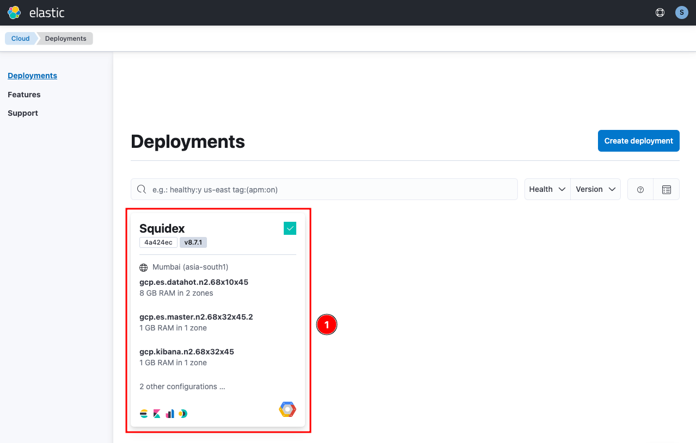<figcaption><p>Select Elastic cluster</p></figcaption></figure>

</div>

2. Copy the **endpoint** value next to Kibana (2). This is the _Server Url_ value which will be required later.

<div align="left">

<figure>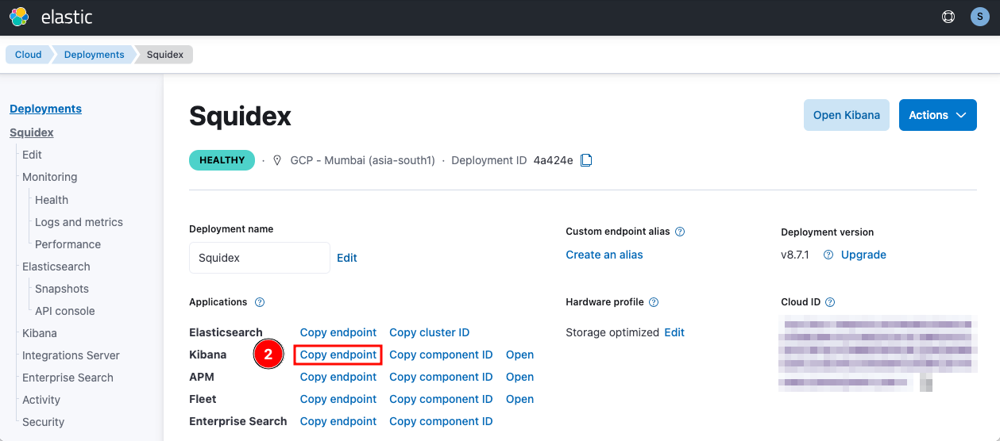<figcaption><p>Copy Kibana endpoint</p></figcaption></figure>

</div>

3. The default user is **elastic**. The password is the same that has been set during Elastic cluster deployment. Make a note of them, these will also be required later in the steps.\
   \
   In case there is a need to reset the password, it can be done from security settings of the deployment. \
   Select **Security** from the deployment and then click **Reset password**.

<div align="left">

<figure>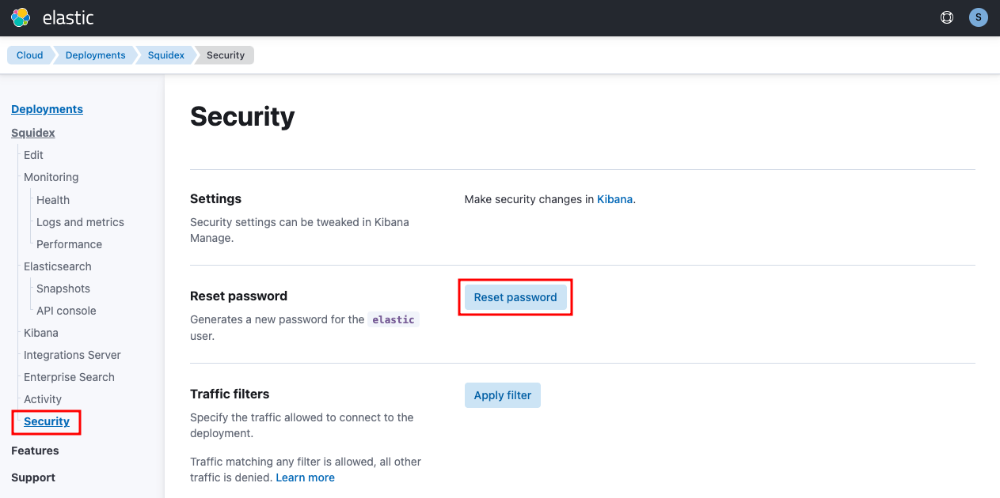<figcaption><p>Reset elastic user password (if needed)</p></figcaption></figure>

</div>

## Creating the Elasticsearch Rule

### Add a Rule

Navigate to **Rules** (1) in the Squidex App and select **+ New Rule** (2).

<div align="left">

<figure><figcaption><p>Create a new rule</p></figcaption></figure>

</div>

Select **Content changed** (3) as the trigger for this event. This will load additional settings for the trigger that can be configured such as _Conditions_.

<div align="left">

<figure>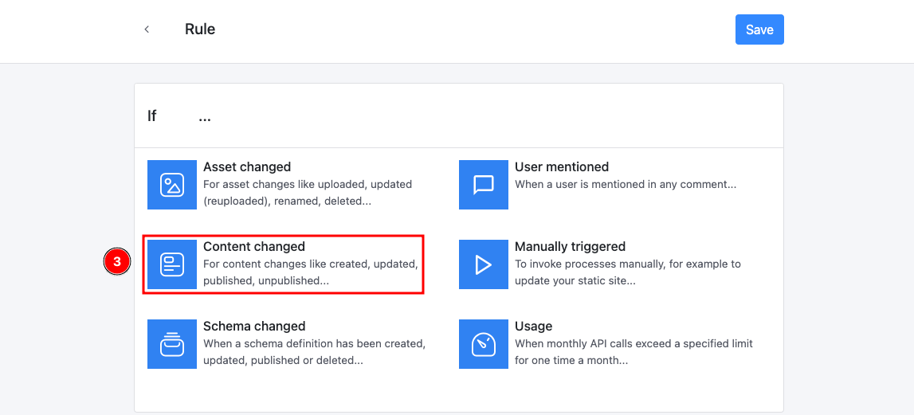<figcaption><p>Select when to trigger the rule</p></figcaption></figure>

</div>

In this example, we are setting this rule for the `magazine` schema only and triggering it for all events in the schema where the event status is _Published_. Click **+** (4) to add a condition, select the **schema** (5) from the dropdown (i.e. `magazine` in this case) and use the following **condition** (6) in Javascript format:

```
event.status == 'Published'
```

<div align="left">

<figure>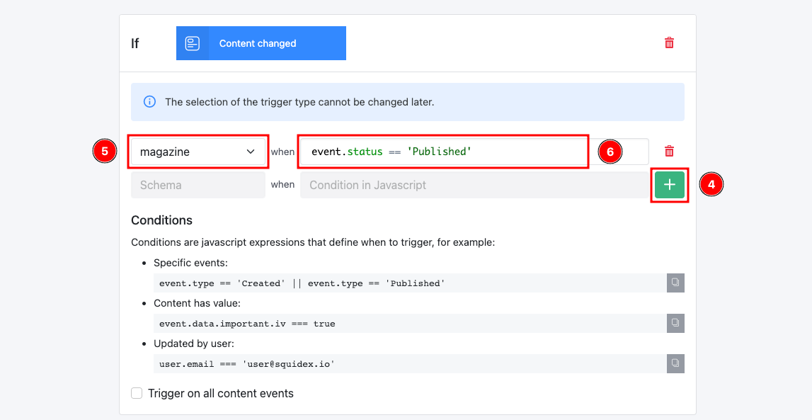<figcaption><p>Set the condition for the trigger</p></figcaption></figure>

</div>

Next, select **Elasticsearch** (7) as the action.

<div align="left">

<figure>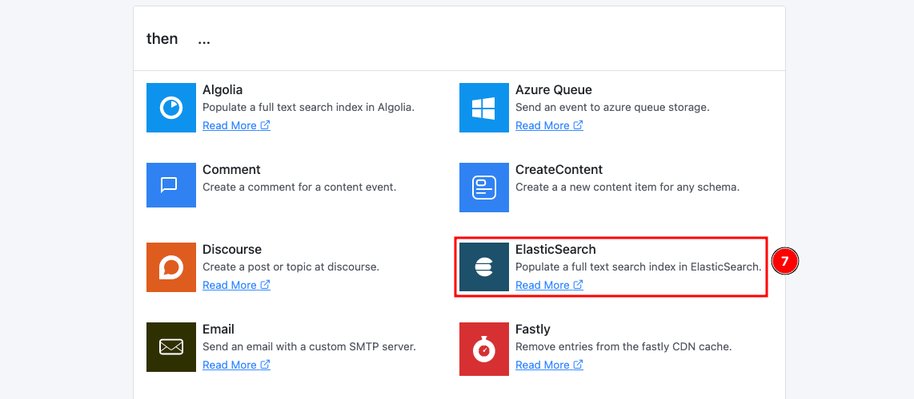<figcaption><p>Select ElasticSearch as the connector</p></figcaption></figure>

</div>

Provide the ElasticSearch instance values here such as the Server Url, Index Name, Username, Password etc. Click Save when done.

<div align="left">

<figure>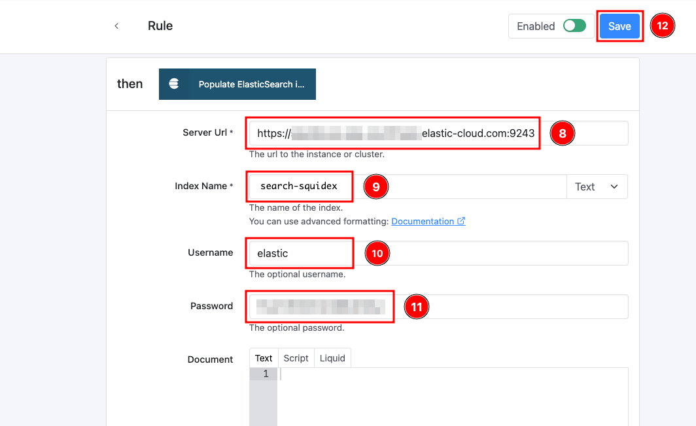<figcaption><p>Configure ElasticSearch in the rule</p></figcaption></figure>

</div>

### Test the Rule

In order to test the rule we can either create a new article or update an existing article. The article / content must be in _Published_ status for the event to trigger.

On successful trigger, you will see a status message similar to the screenshot below.

<div align="left">

<figure>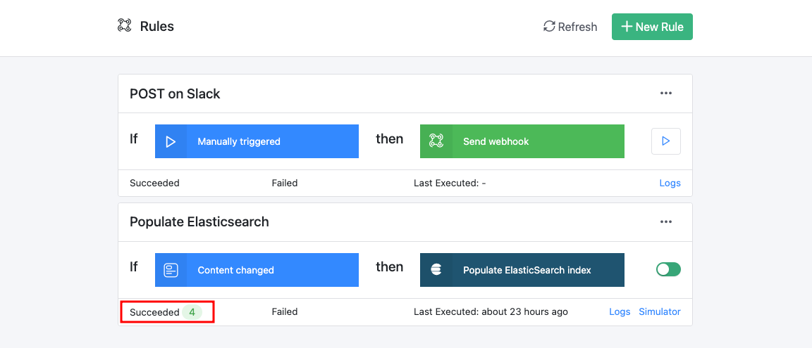<figcaption><p>Verify that the rule ran</p></figcaption></figure>

</div>

### Verifying the Indexed Data

On successful _Rule_ execution, one can connect to (or query) the ElasticSearch cluster to validate the creation of the documents in the Index. In this example we are using the managed cluster option through https://cloud.eastic.co, hence the screenshots and the navigation instructions refer their platform. If you are using a self-hosted ElasticSearch cluster the screenshots may be different.&#x20;

To view the documents, navigate and login to the **Kibana endpoint** (1) (you can find the same in your Elastic Cloud home page).&#x20;

<div align="left">

<figure>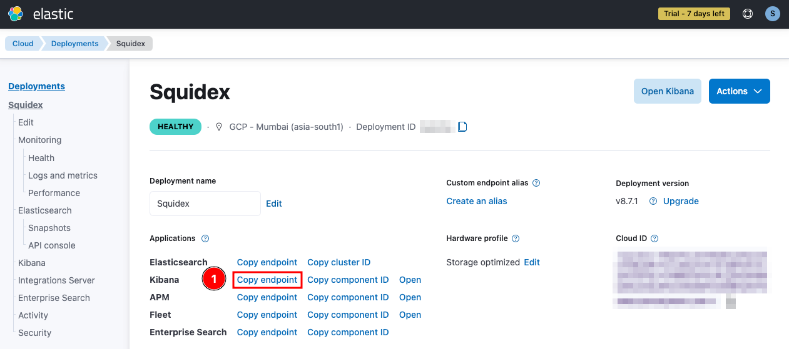<figcaption><p>Copy Kibana endpoint</p></figcaption></figure>

</div>

Post login, select **Enterprise Search** (2).

<div align="left">

<figure>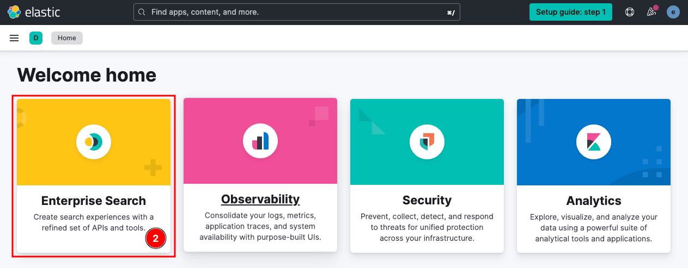<figcaption><p>Access Kibana Dashboard</p></figcaption></figure>

</div>

Next, click **Indices** (3) and then select the **Index** (4), which in this example is **search-squidex**.

<div align="left">

<figure>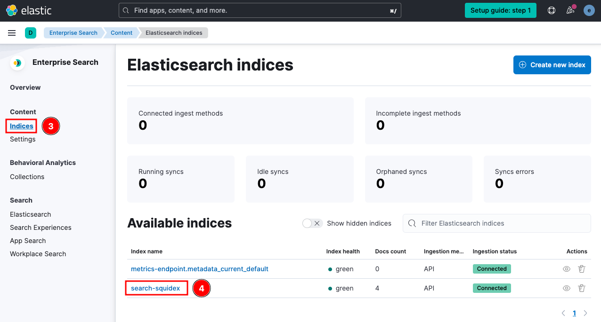<figcaption><p>Select the index</p></figcaption></figure>

</div>

Select the **Documents** (5) tab to view the documents created through the Rule.

<div align="left">

<figure>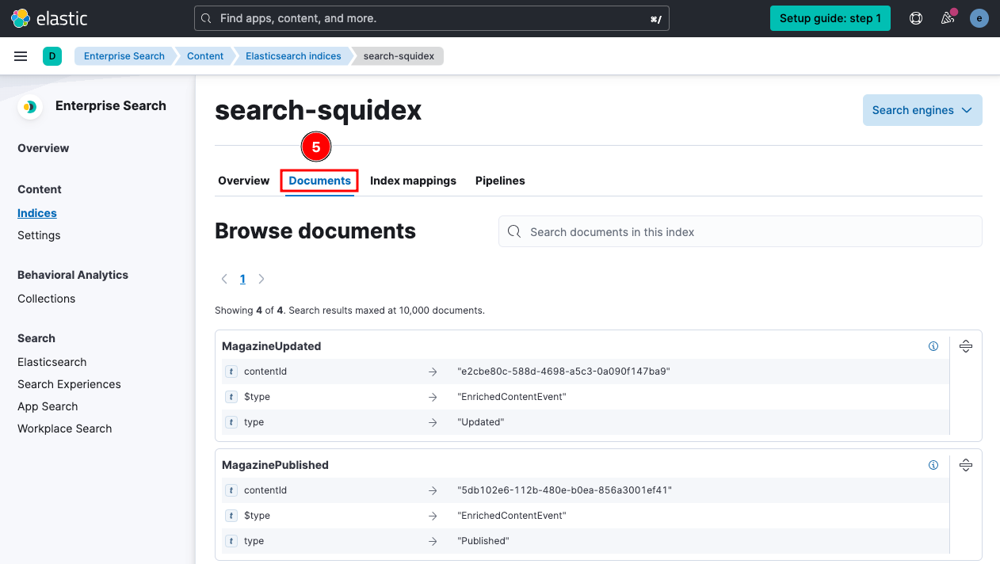<figcaption><p>Select documents tab to view documents</p></figcaption></figure>

</div>

A newly _Published_ article appears as **MagazinePublished** and an _Updated_ article will appear as **MagazineUpdated**.

## Customizing the Document

You can choose to customize the document that is populated in ElasticSearch. We support plain _Text_, _Script_ and _Liquid_ syntax.

Below is an example of custom document that sends only the **Title** of the article. It is written in the Liquid syntax. You must create a valid json string, therefore it is good to use the **escape** formatter.

<div align="left">

<figure>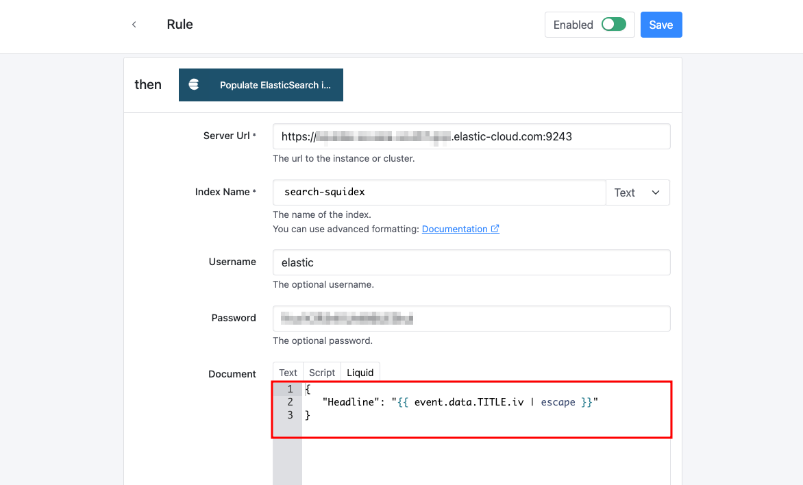<figcaption><p>Custom Document</p></figcaption></figure>

</div>

## Additional Information

### Important Information about the Workflow

The content ID from Squidex is used as the Elasticsearch document ID.&#x20;

<div align="left">

<figure>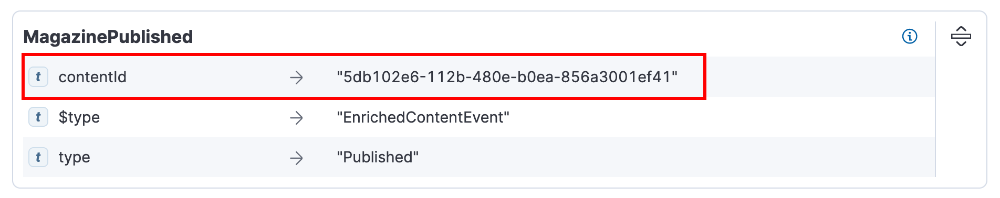<figcaption><p>Screenshot of ElasticSearch showing document ID</p></figcaption></figure>

</div>

Populating to ElasticSearch is an **asynchronous** operation. Hence, it may take a few seconds before the updated results appear on a search.

### Using ElasticSearch as the Full Text Store

You can configure Squidex to use ElasticSearch as the full text store and search directly using Squidex search API. To do this set the following values:

```
FULLTEXT__TYPE=elastic
FULLTEXT__ELASTIC__CONFIGURATION=[CONNECTION_STRING]
FULLTEXT__ELASTIC__INDEXNAME=[NAME_OF_THE_INDEX]
```

For more details and other full text parameters, refer to the `appsettings.json` file at: [https://github.com/Squidex/squidex/blob/master/backend/src/Squidex/appsettings.json#L30](https://github.com/Squidex/squidex/blob/master/backend/src/Squidex/appsettings.json#L30)
