# Publish an Event to Azure Queues using Rules

This documentation is based on the _FoodCrunch_ use case. Please open the link below alongside this page to understand the examples.


[introduction-and-use-case.md](../../introduction-and-use-case.md)


## What are Azure Storage Queues?

Azure Storage Queues, part of the Azure Storage offering, is a service that provides scalable storage capabilities for messages. A single message in an Azure Storage Queue can be upto 64KB in size and there can be millions of messages in a queue.

To read more about Azure Storage Account and its services including Queues refer to the link below:


Azure Storage Documentation


## Prerequisites


This tutorial does not cover the basics of Azure. It is highly recommended that one be familiar with Azure, Azure Storage, Azure Queues etc to understand this use case and the instructions better. We have attempted to keep the instructions simple enough so they can be followed by anyone.


In order to create this rule you will need the following:

* An Azure Subscription

### Create a Storage Account

For the purposes of this example, we will quickly create a Storage Account without getting into the details of configuring all the properties. Select an Azure **Subscription** (1), create or select a **Resource group** (2), provide a unique **Storage account name** (3), choose a **Region** (4) and finally click on **Review** (5).

<div align="left">

<figure>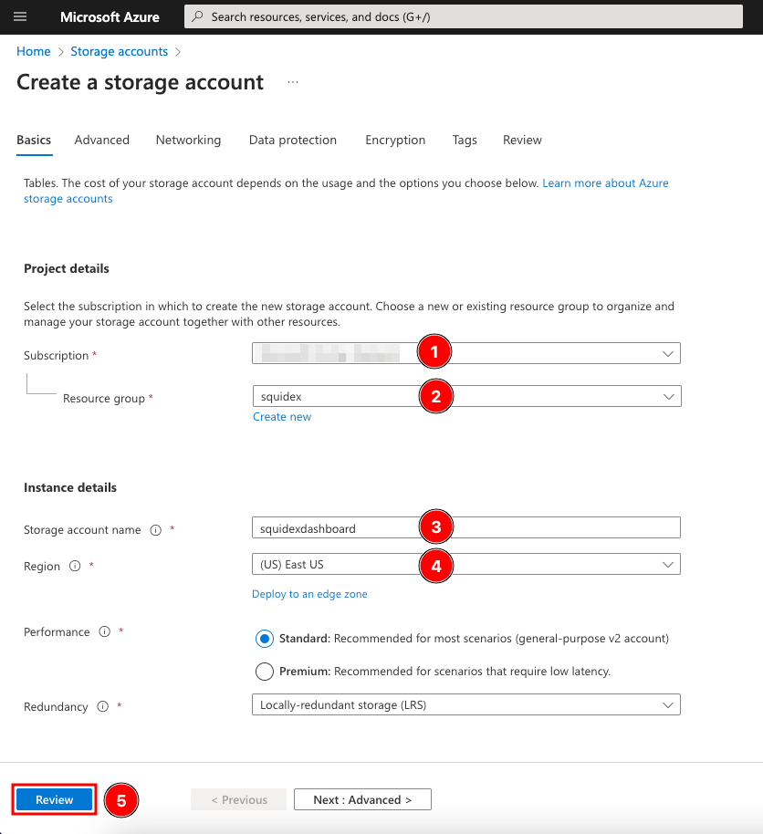<figcaption><p>Create Storage Account - 1</p></figcaption></figure>

</div>

Click **Create** (6) to submit the form.

<div align="left">

<figure>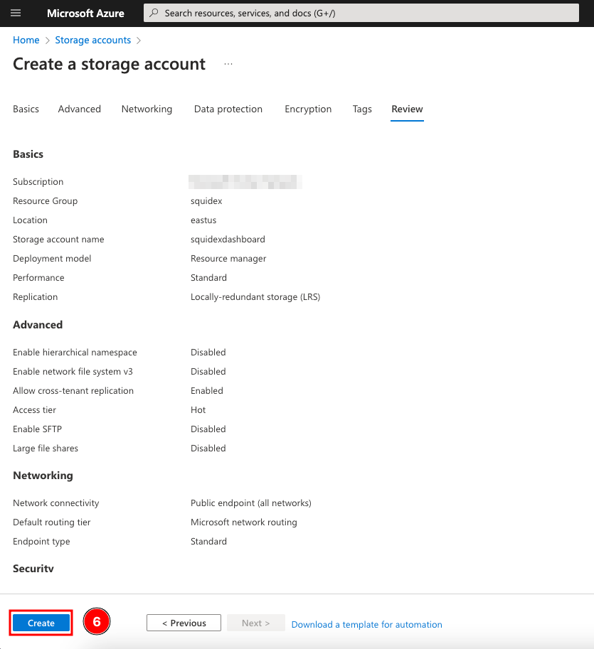<figcaption><p>Create Storage Account - 2</p></figcaption></figure>

</div>

### Create a Queue

To create an _Azure Storage Queue_, select the **Azure Storage account** created earlier (1) and then choose **Queues** (2) from the list. Click **+ Queue** (3), provide a **Queue name** (4) and click **OK** (5) to create the Queue.

<div align="left">

<figure>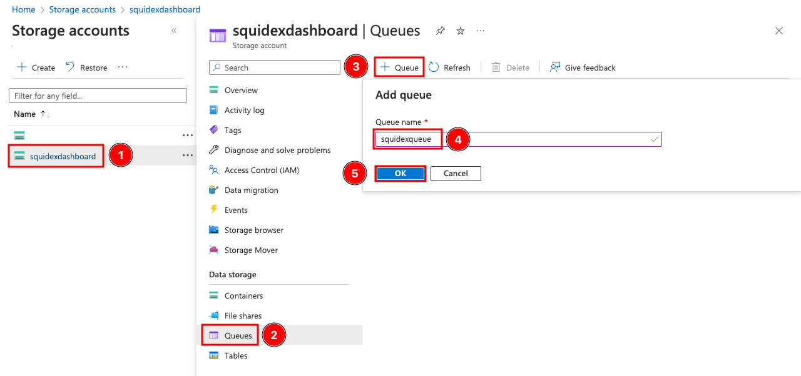<figcaption><p>Create the Azure Storage Queue</p></figcaption></figure>

</div>

Make a note of this _Queue_ name as it will be required later.

### Copy the Connection String

We will need the connection string of the Azure Storage Account as well, so Squidex can authenticate to it and push messages to the Queue.

To gather the connection string, within the **Storage Account** (1) select **Access keys** (2). There are two keys provided for each Storage Account. Click **Show** (3) next to any one of them and then use the **copy button** (4) to copy the connection string. Make a note of it for use in the next steps.

<div align="left">

<figure>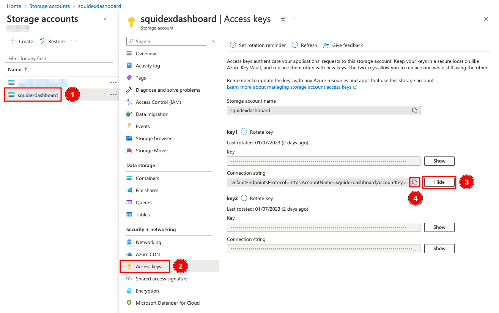<figcaption><p>Copy connection string</p></figcaption></figure>

</div>

## Create the Rule

To demonstrate this example consider a scenario where you have a dashboard that shows the count of _assets created_ and the count of _assets deleted_. So, every time an asset is created or deleted you want a message to be sent to an Azure Queue which will then be picked up by the dashboard application to update the counter.

Navigate to **Rules** (1) in the Squidex App and select **+ New Rule** (2).

<div align="left">

<figure>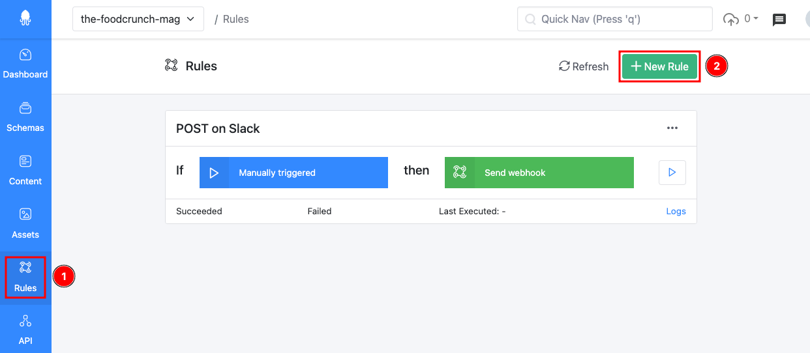<figcaption><p>Create new Rule</p></figcaption></figure>

</div>

Select **Asset changed** (3) as the trigger for this event. This will load additional settings for the trigger that can be configured such as _Conditions_.

<figure>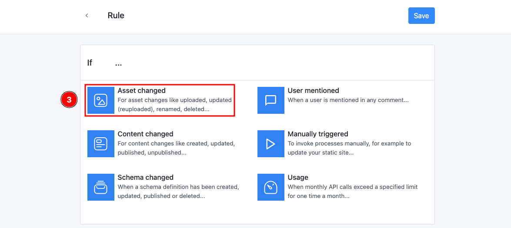<figcaption><p>Select the Rule trigger event</p></figcaption></figure>

Add the following custom **condition** (4):

```
event.type == 'Created' || event.type == 'Deleted'
```

<div align="left">

<figure>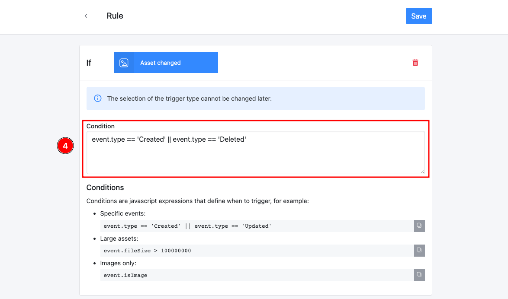<figcaption><p>Type Rule condition</p></figcaption></figure>

</div>

Next, select **Azure Queue** (5) as the action.

<div align="left">

<figure>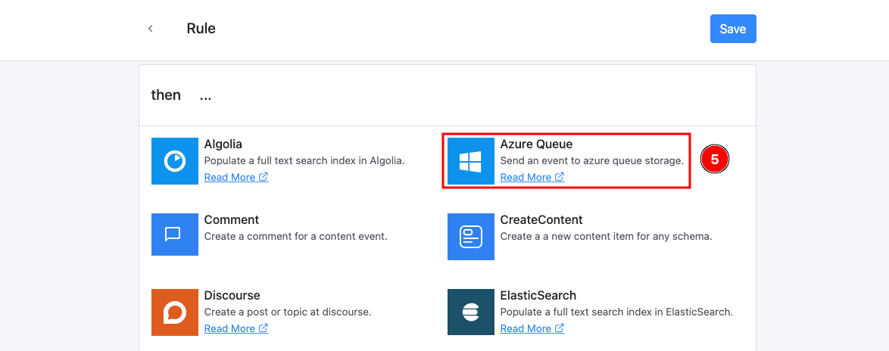<figcaption><p>Select Rule action</p></figcaption></figure>

</div>

In the following step, enter the **Connection String** (6) and the **Queue name** (7) noted down from earlier. Click **Save** (8) to save the rule.

<div align="left">

<figure>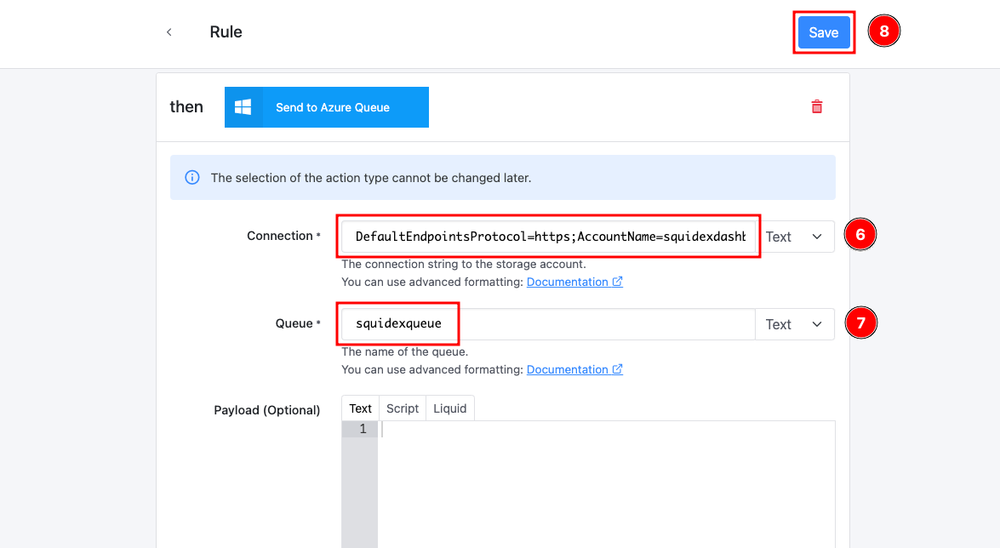<figcaption><p>Configure the Rule action</p></figcaption></figure>

</div>

### Simulate the Rule

After the rule is created, one can use the **Simulator** feature to simulate the rule using the last 100 events.

To simulate the rule, from the Rules page, click **Simulator** (1) next to the rule and click **Simulate** (2) to execute.&#x20;

This will display whether an event will be published to Azure Queues or not. An event that is will trigger the publish is shown as _Success_.


You may not see any successful event if there are no relevant operations that meet the conditions of the rule. Or there may be events that are _skipped_ because they are wrong events for this rule.&#x20;


<div align="left">

<figure>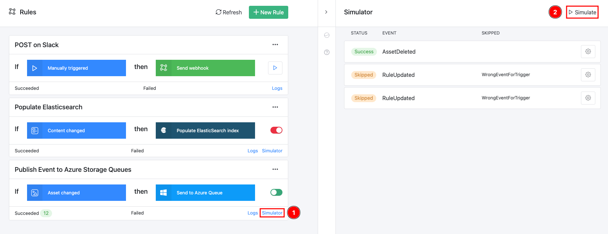<figcaption><p>Simulate a Rule</p></figcaption></figure>

</div>

## Test the Rule

To test the rule perform an asset create or asset delete operation. For this example, we can upload an image to Squidex that will register an event of type **AssetCreated**. (Steps for uploading assets is not demonstrated as this is a very fundamental operation)

On successful trigger, you will see a status message similar to the screenshot below.

<div align="left">

<figure>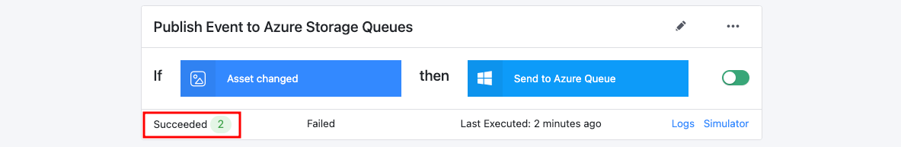<figcaption><p>Rule status </p></figcaption></figure>

</div>

## Verify Messages in the Queue

In a real world there will be applications that will consume the messages published to the Azure Storage Queue. For this demonstration, we can navigate to the Queue in Azure and see the messages.

To do so, navigate to the **Azure Storage Account** (1), click **Queues** (2) and then select the **Queue** (3) i.e. _squidexqueue_ in this example, from the list.&#x20;

<div align="left">

<figure>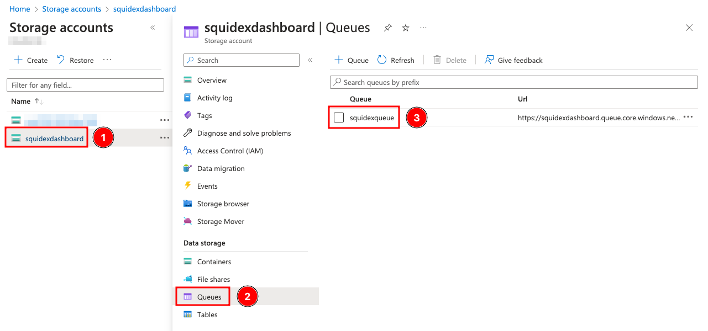<figcaption><p>Navigate to Azure Queue</p></figcaption></figure>

</div>

You should now see the messages on the screen. The below screenshot is an example of an _AssetCreated_ event and the message (without any customizations) that gets published to the Queue.

<div align="left">

<figure>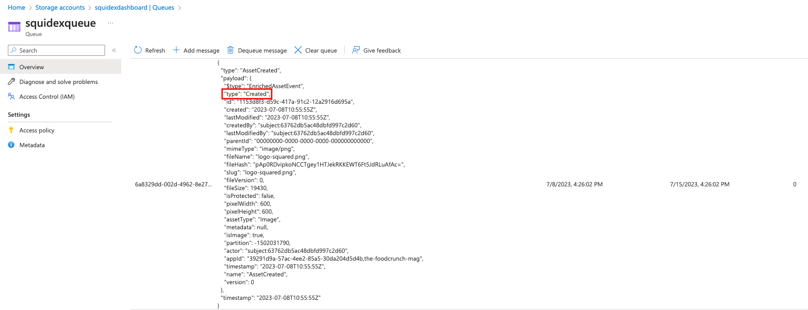<figcaption><p>Event Message in Azure Queue</p></figcaption></figure>

</div>

## Customizing the Payload

You can choose to customize the payload in order to customize the message that is pushed to the Queue. We support plain _Text_, _Script_ and _Liquid_ syntax.

Below is an example of custom payload that posts a message whether the asset is an **image or not**. It is written in the Liquid syntax. You must create a valid JSON string, therefore it is good to use the **escape** formatter.

Refer to the formatting documentation in the link below:


[rule-formatting](../../developer-guides/rule-formatting/)


<div align="left">

<figure>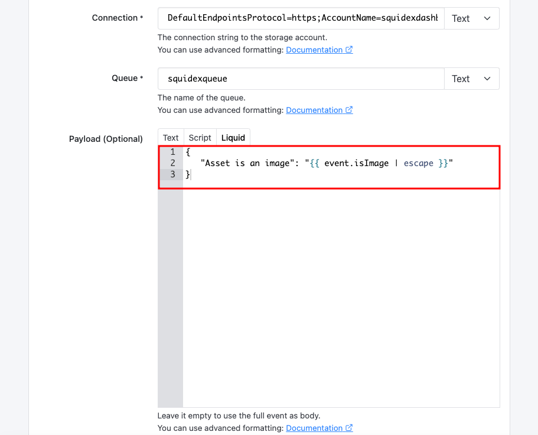<figcaption><p>Custom Payload</p></figcaption></figure>

</div>

Below is an example of the custom payload message in Azure Queue.

<div align="left">

<figure>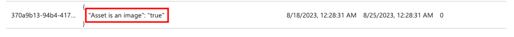<figcaption><p>Custom Payload</p></figcaption></figure>

</div>
