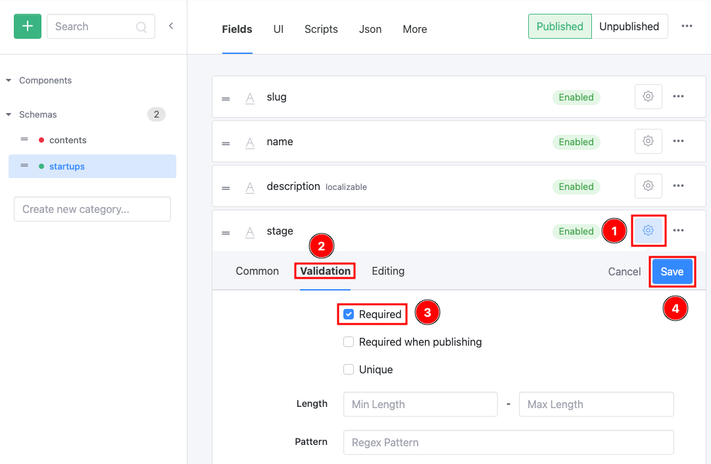
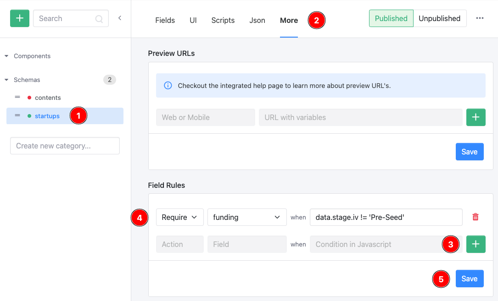
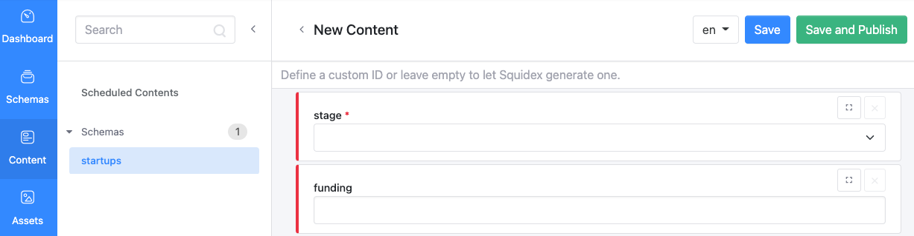
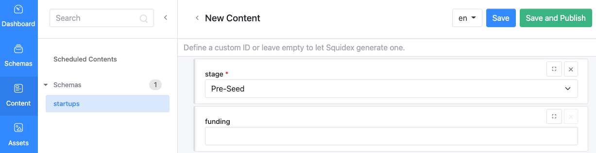
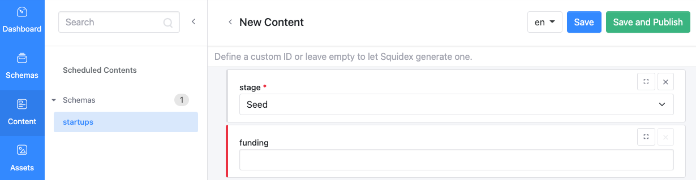

# Field Rules

This documentation is based on the _FoodCrunch_ use case. Please open the below link side by side to this page to understand the examples.


[introduction-and-use-case.md](../../introduction-and-use-case.md)


A Field Rule is a method of implementing automated actions on schema fields when a certain condition is met. It is made up of three components i.e. _Action_, _Field_ and _Condition_.

* **Action**: This component states what should be done when the condition(s) is/are met. It has the following options:
  * Disable
  * Hide
  * Require
* **Field**: This is where the schema field is selected on which the action should be taken
* **Condition**: Written in Javascript, the action is triggered when this is met.

For our _FoodCrunch_ use case let's consider the following example to understand Field Rules. For all startups that are not in Pre-Seed stage, the funding value has to be mentioned. It is a required field.

For our use case the rule is that anytime the value of the _Stage_ field is anything other than Pre-Seed, then the _Funding_ is a required field otherwise it's optional.&#x20;

Let's see how to implement this:

* Ensure that _Stage_ field is set to **Required** in field settings. This is required to ensure that a value is always selected.&#x20;

<figure><figcaption>
Setting validation for a field
</figcaption></figure>

* To create a Field Rule go to the **schema** (1) (i.e. in our case startups), select **More** (2) tab, click **+** (3) next under Field Rules and enter the selections for **Action, Field and Condition** (4). Click **Save** (5) when done.\
  In our example the following values have been set
  1. Action = `Require`
  2. Field = `funding`
  3. Condition in Javascript = `data.stage.iv != 'Pre-Seed'`

<figure><figcaption>
Creating a Field Rule
</figcaption></figure>

*   This can now be validated by trying to add content. Go to Content and try adding content. Immediately you will find that the stage and funding fields have a red flag.

    <figure><figcaption>
Fields with rules
</figcaption></figure>

    * If you set _stage_ as **Pre-Seed**, the red flag denoting that the _funding_ value is required is gone which means its optional.

    <figure><figcaption>
Rule validation example 1
</figcaption></figure>

    * If you set _stage_ as any other value, the red flag remains meaning that a value has to entered in _funding_.

    <figure><figcaption>
Rule validation example 2
</figcaption></figure>

