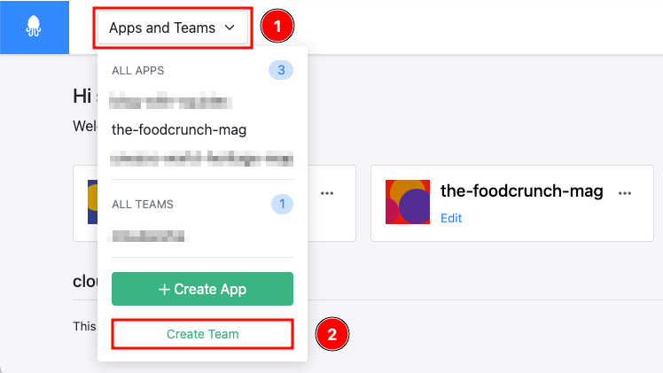
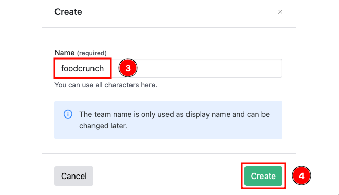
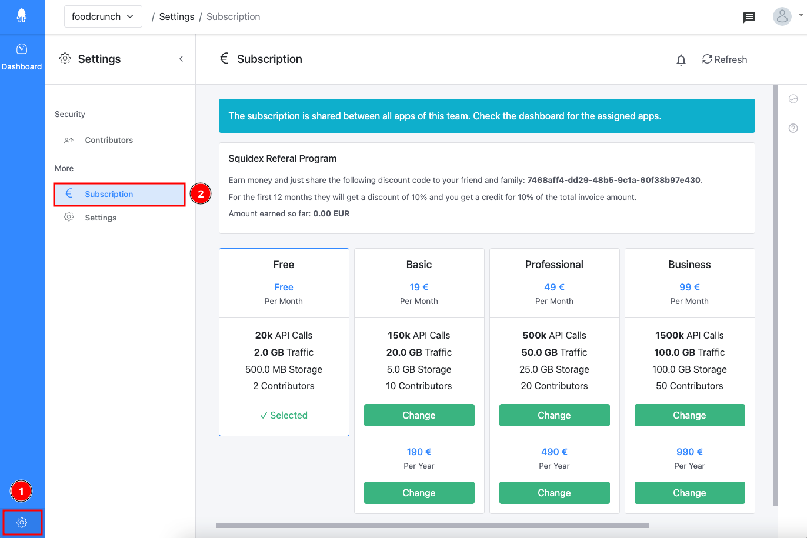
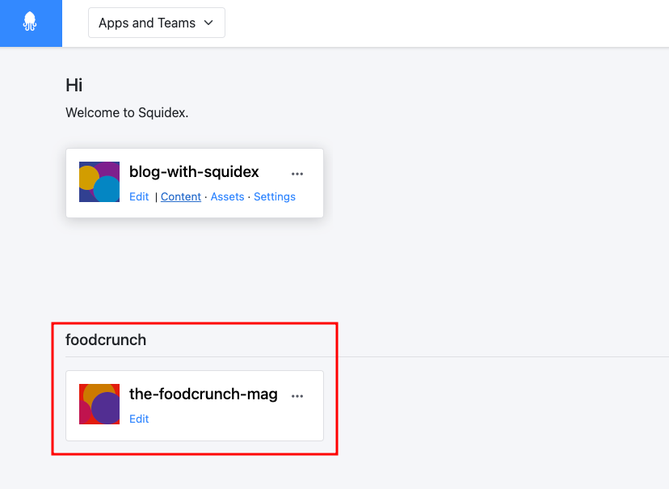
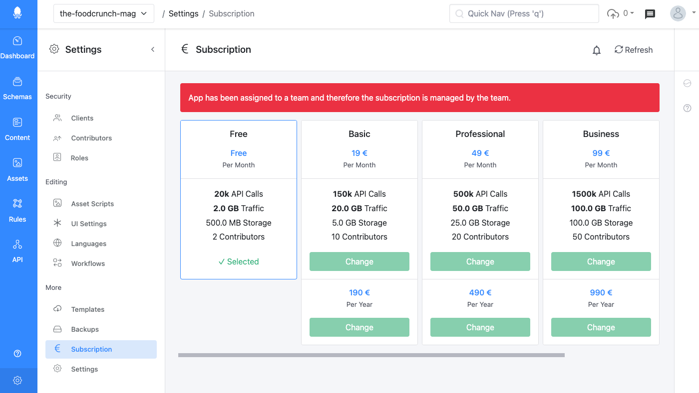
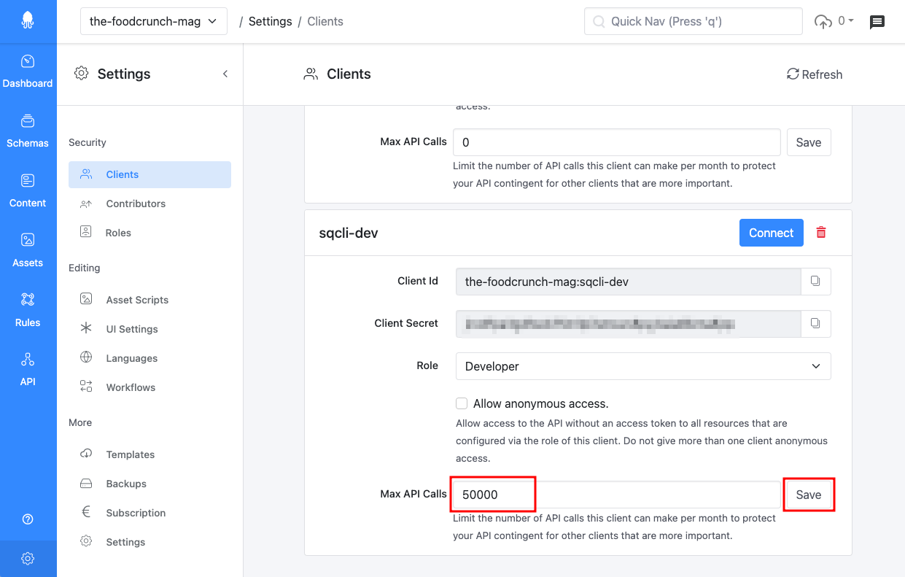
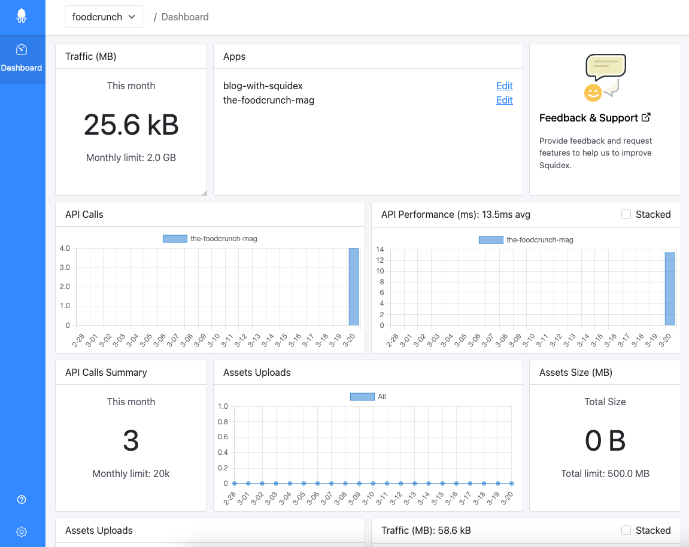

# Teams

Teams are primarily beneficial for Squidex cloud where an organization may have multiple apps and they may wish to share the subscription.

The teams capability solves the following problems:

* Generally subscriptions are associated with a single user that creates it. Hence in a situation where this has to be transferred to another user, it is inconvenient.
* Since subscriptions are bound to a single app, it cannot be shared among multiple apps for scenarios such as grouping and distributing the cost among apps.&#x20;

### Creating a Team

To create a team, click **Apps and Team** (1) and click **Create Team** (2).

<figure><figcaption>
Creating a Team - Step 1
</figcaption></figure>

Next enter a **Name** (3) for the team and click **Create** (4).

<figure><figcaption>
Creating a Team - Step 2
</figcaption></figure>

### Managing Subscriptions

In order to manage subscriptions for a team, navigate to **Settings** (1) and then click **Subscription** (2).

<figure><figcaption>
Managing subscription
</figcaption></figure>

A subscription is shared among all apps in the team.

### Transferring an App to a Team

Once a team is created, you can move an app to the team. To do so navigate to the app, click **Settings** (1) and then more **Settings** (2). Then select the team from the dropdown under **Transfer to team** (3) and click **Transfer** (4).

<figure><figcaption>
Transferring an app to a team
</figcaption></figure>


Only if a user has permissions for the app and the team, they can transfer the app to the team.


At the moment this will not show any confirmation or the screen won't change. So, a way to verify that the app was moved to the team would be to check in the welcome dashboard or the team dashboard.&#x20;

In this example we moved the foodcrunch app to the foodcrunch team.

<figure><figcaption>
App part of a team
</figcaption></figure>

Once an app is moved to a team, the subscription for the app can only be managed by the team.

<figure><figcaption>
Subscription management of app
</figcaption></figure>

### Managing Quota (for multiple apps)

Since a subscription is shared among all apps that are part of the team, the quota for a subscription also shared.&#x20;

If you wish to limit API calls for certain apps (e.g. to protect your API contingent for other apps that are more important) you can set the Max API Calls parameter for each client in an app.

<figure><figcaption>
Setting API limits for clients
</figcaption></figure>

### Team Dashboard

Every team has a dashboard similar to an app and displays the same statistics including the apps associated with the team.

<figure><figcaption>
Team Dashboard
</figcaption></figure>

### Deleting a Team

At the moment a team cannot be deleted.

### Other Important Information about Teams

* You can add contributors to the team but there is no provision for roles are the moment.&#x20;
* A team contributor can only manage the subscription of the team and does not have access to the associated apps automatically.

