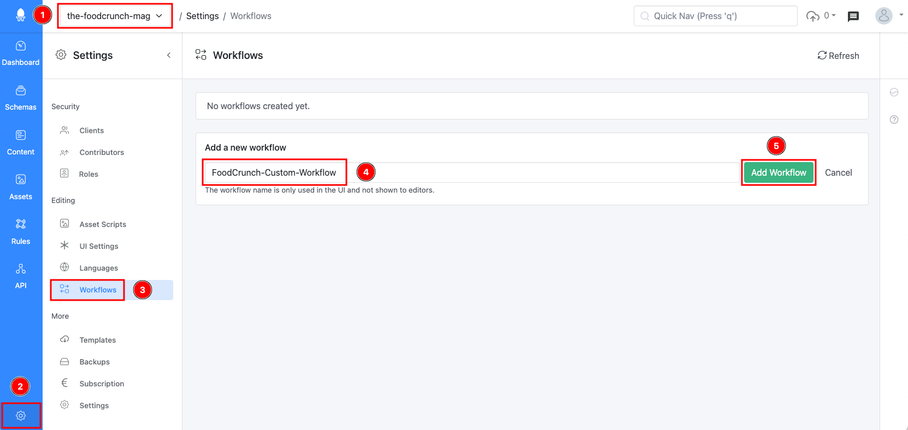
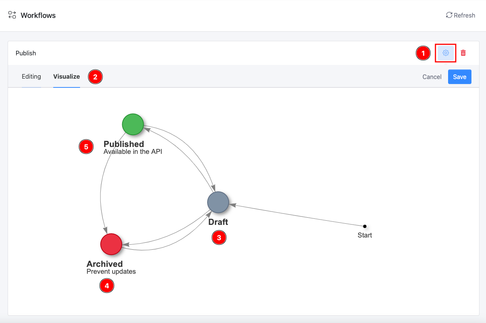
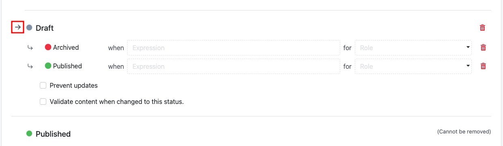
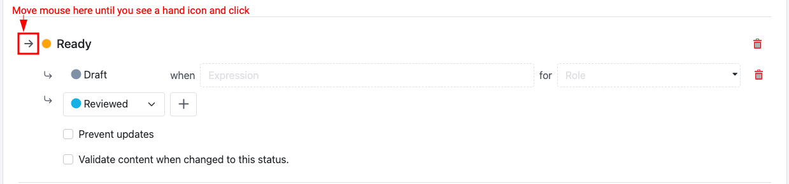
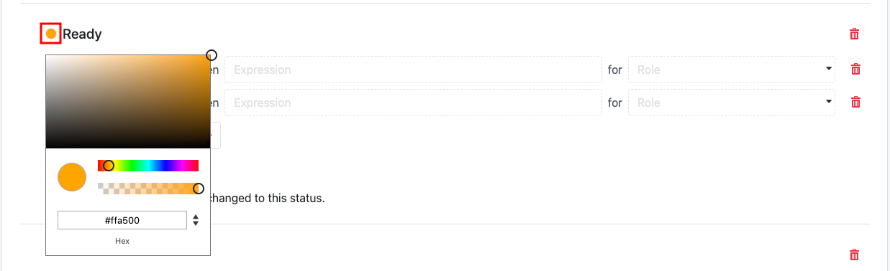
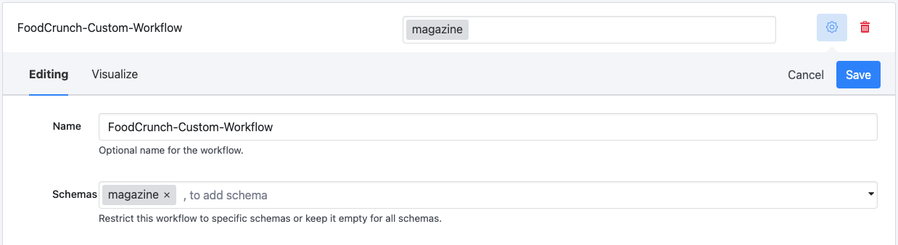
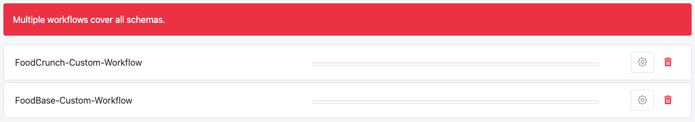
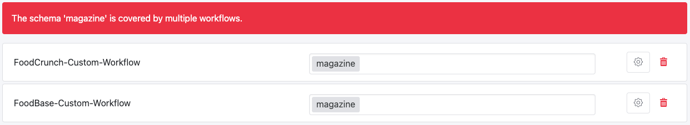

# Workflows

## Introduction

This documentation is based on the _FoodCrunch_ use case. Please open the link below alongside this page to understand the examples.


[introduction-and-use-case.md](../introduction-and-use-case.md)


## What is a Workflow?

A workflow defines the various statuses of a content item from initial status to published status. Workflows are typically used when contributors work together to create and publish content items and when they have different roles, such as Writer, Reviewer and Publisher. Workflows are very flexible and you can have an unlimited number of workflows per App.

### Terms

A content workflow is represented as a [graph](https://en.wikipedia.org/wiki/Graph\_\(discrete\_mathematics\)) of statuses (nodes) that are connected with transitions (edges). The **Status** of a content item is defined by the workflow that is configured for the content schema.

* A **Status** is a unique name that represents the status of your content item and has a colour to identify it in the user interface.
* A **Transition** defines upcoming statuses of your content item. A transition defines the next status and can have an optional expression and role/s.

Workflows do not exist in older Squidex installations, but you can implement them using scripting.


[workflows.md](../developer-guides/workflows.md)


## How to Create a Workflow

Complete the following steps to create a new workflow:

1. Go to your **App** (1).
2. Click **Settings** (2) and then select **Workflows** (3).
3. Enter a **Name** (4) for the workflow and click **Add Workflow** (5).\
   Note that this name is only used for this screen and can be changed later.

<figure><figcaption><p>Creating a workflow</p></figcaption></figure>

Typically, the list of workflows is empty here, which means that _default workflow_ is applied to all the schemas. The default workflow has the same structure as the new workflow that's just been created. If a schema has no matching workflow, this default workflow will be applied.

#### The Default Workflow

To visualize the default workflow click on the **Gear icon** (1)  next to the workflow name, then click the **Visualize** (2) tab. You should see the graphical representation of your workflow here.

<figure><figcaption><p>Visualizing the default workflow</p></figcaption></figure>

The default workflow has three statuses as follows:

* **Draft** (3) is the initial status for each content item. The initial status is visualized by an arrow. From Draft, you can either change a content item to "Published" or to "Archived".
* **Archived** (4) is a status that is used to mark deleted content items without actually deleting them. It is a soft delete. Archived content items cannot be updated. You cannot change from "Archived" to "Published" directly, you must change to "Draft" first.
* **Published** (5) is a special status that cannot be removed. Only content items with a status set to "Published" are available in the normal API. If you do not need a workflow at all, you can delete all other statuses.

## How to Edit a Workflow

The user interface is intuitive enough that it does not need detailed instructions, but there are some special cases that need explanation.

### Changing the Initial Status

The initial status is indicated with a small **arrow icon** (1). You can change this by moving the mouse over to another status (which displays the same arrow icon next to it) and clicking it.&#x20;

In the following screenshot, there are three statuses (this is default in a new workflow) and **Draft** is the initial status, marked with the arrow.

<figure><figcaption><p>Initial status</p></figcaption></figure>

In the below screenshot, as an example, we are changing the initial status to **Ready**. To do this, we move the mouse over to Ready and click it.

<figure><figcaption><p>Changing initial status</p></figcaption></figure>

### Changing the Color of a Status

The status colors can be changed. Just click the colored circle next to each step to change to the desired color.

<figure><figcaption><p>Change the color of a status</p></figcaption></figure>

### Restricting Transitions with Roles

You can assign one or more roles to a transition. When a role is assigned, only contributors that are assigned to that role can move a content item to the target status as defined by this transition. When no role is assigned, all contributors can perform an action. However, the action is also restricted by Permissions, so when a user has no permission, he or she cannot update content items at all, and the workflow cannot perform these changes.

Let's have a look at the following example:

.png>)


The screenshot above has been modified and some UI elements have been removed to make it more compact.


In our use case, we have described three user groups:

1. **Editors** write content. When they are finished, they move their content item to **Ready** status. They cannot review or publish content items.
2. **Reviewers** review content items, when they are ready for review. They either move the content item to **Reviewed**, when the review process is successful or back to "Draft" if the content item requires changes.
3. **Publishers** publish reviewed content items by moving these content items to "Published"**.**

This workflow can be extended further and multiple review steps can be implemented.


Workflows can be combined with Permissions to restrict who can create content items.


### Restricting Transitions with Expressions

You can write a JavaScript expression. This expression is evaluated each time a piece of content is updated to determine whether a transition to another status is possible.

For example, if you have a schema for different types of editorial content items such as articles, blog posts or news, then this type of item is defined by a string field.

In this case, we extend the example from the previous section where we used roles.

.png>)

A content item where the type field is set to **News** does not need a review and can be published directly. Articles that need the review process will have previous rules applied.

When you design the Expression you only have access to the content data which is directly part of the content. For example, when you have a relationship, only the IDs of the referenced items are stored in the content and not the content of the references itself.

The data has the same structure as it is also used for queries and for the API.

```javascript
{
    "data": {
        // More fields
        "type": {
            "iv": "News"
        }
    }
}
```

The structure is explained in detail here in this use case documentation:


[introduction-and-use-case.md](../introduction-and-use-case.md)


### Assigning a Workflow to Schemas

Workflows can be assigned to schemas. If no schema is assigned, the workflow handles all schemas where no other workflow is assigned. Other schemas that have no assigned workflow, have an implicit default workflow.

<figure><figcaption><p>Assigned schemas</p></figcaption></figure>

You must pay attention not to assign the same schema to multiple workflows. This can happen when you have multiple workflows that have no assigned schemas

<figure><figcaption><p>Multiple workflows with no schemas assigned</p></figcaption></figure>

Or when multiple workflows have the same schema assigned to them.

<figure><figcaption><p>Multiple workflows for the same schema</p></figcaption></figure>

In both cases, you will receive a warning which should be resolved. You can save workflows and create and update content items as normal but the workflow won't be defined when a content item is updated. It can even change over time and behavior is unpredictable.

### Prevent Updates

You can prevent updates when a content item has a certain status. In some cases, you can also define an optional expression or role to restrict the updates or for a specific subset of your contributors.

.png>)

In the default workflow, this situation is used to turn **Archived** content items into read-only, but you can also use this feature to stop updates during the review process.
