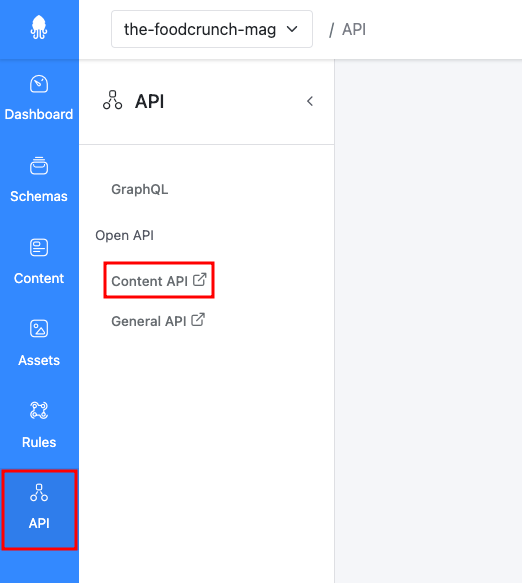
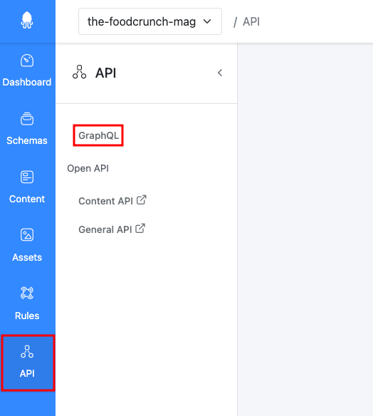
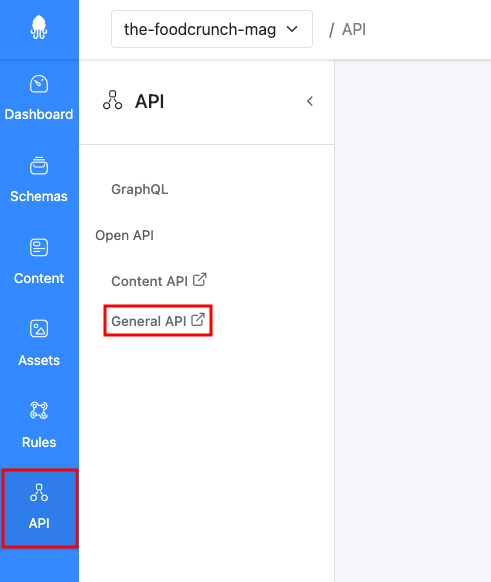

# API

This documentation is based on the _FoodCrunch_ use case. Please open the link below alongside this page to understand the examples.


[introduction-and-use-case.md](../../introduction-and-use-case.md)


## Introduction

With the API you can:

* Create, change or query your content.
* Upload, download or query assets.
* Create complex queries with the GraphQL endpoint.
* Execute all management operations such as creating Apps, schemas, rules and update settings.

The Management UI uses the same API endpoints. If you can perform an action manually you can also perform the same action with code.

The next paragraph will give you a short introduction about the different API endpoints. There are also some useful links to additional pages about specific aspects of the API.

## API Endpoints

Technically, the API has only a single endpoint, but the API is distributed in several parts, with different principles and generated documentations.

### Content API

Each App has its own content API. The documentation is generated when you change your schemas and is tailored for your content structure. The documentation is cached and it might take a few minutes to be able to use the newest version for your App and schemas.

You can find the link to your Content API in the API section of the Management UI.

<figure><figcaption>
Content API
</figcaption></figure>

For example, this this is the Content API for the App that serves the content for the Squidex website:

[https://cloud.squidex.io/api/content/squidex-website/docs](https://cloud.squidex.io/api/content/squidex-website/docs)

### Content GraphQL API

The [GraphQL ](https://graphql.org)endpoint is also generated per client. The documentation is provided by GraphQL, an integrated, interactive GraphQL query editor. This endpoint can only be used to query content items and assets. Mutations have not yet been implemented due to several restrictions with the underlying GraphQL framework. The GraphQL endpoint is also cached for each API, with a time to live (TTL) of 10 minutes. Therefore, it can take up to 10 minutes before you see your changes.

<figure><figcaption>
GraphQL
</figcaption></figure>

### General API

The rest of the API is the same for all your Apps. This includes endpoints to query and manipulate Apps, schemas, assets, rules and all settings.&#x20;

For Squidex Cloud, the generated documentation can be found at:

[https://cloud.squidex.io/api/docs](https://cloud.squidex.io/api/docs)

<figure><figcaption>
General API
</figcaption></figure>

## Cloud CDN (BETA)

The Cloud version provides CDN endpoints for professional and business plans.

The CDN is implemented using [https://www.fastly.com/](https://www.fastly.com).

### Endpoints

There are dedicated endpoints provided for different parts of the API. The CDN isn't that valuable for management end points, such as querying schemas and settings (where you always want to retrieve the current version).  Furthermore, getting the caching behavior correct to provide up-to-date information  is not an easy task, so the decision has been made to provide specialized endpoints.

#### Contents CDN

The content CDN endpoint only provides access to your content items, including the GraphQL endpoint.

The endpoint format is: `https://contents.squidex.io/<app>/<schema>` instead of `https://cloud.squidex.io/api/contents/<app>/<schema>`.

#### Assets CDN

The assets CDN endpoint only provides access to your content items and should be used for images.

The endpoint format is `https://contents.squidex.io/<app>/<asset-id>` instead of `https://cloud.squidex.io/api/assets/<app>/<asset-id>`.

### How Caching works

In general caching only works for GET requests.

Therefore, you will not leverage the caching system of the CDN provider when you query content items using GraphQL and POST requests. However, the GraphQL specification and our implementation supports [POST, as well as GET](https://graphql.org/learn/serving-over-http/#http-methods-headers-and-body).

The CDN provider uses the URL and the authentication states as cache keys. When you make requests with a user access token, the bearer token is used as an additional cache key. When the bearer token is created for an App client, the name of the client is used. This means that when you create a new access token for the client and then repeat the request again, you will get the cached version because the name of the client has not changed.

In addition to that, we make use of [surrogate keys](https://docs.fastly.com/en/guides/purging-api-cache-with-surrogate-keys). Surrogate keys are an HTTP response header that contain IDs that make up the HTTP response. For example, when you retrieve a single content item, the response is dependent upon the content item itself, the related schema and the App it belongs to. Therefore, we also add the App ID and schema ID together with the content ID as a response header. When the App or schema ID is changed we send a purge notification to the CDN provider to delete all cached entries that contains the changed ID. This means that changing App settings such as roles, contributors and clients, purges all cached content items. This is useful when you restrict a client's permissions.


Surrogate keys header has a limitation of 16KB. Therefore, we can only serve around 400 keys.


### Pricing

The same pricing structures as described in the next paragraph are applied but the costs for cached requests are reduced by 50%.

## Cloud Costs

The pricing for the Cloud version mainly depends on the number of API calls but not all API endpoints have associated costs:

| Action                                     | Costs |
| ------------------------------------------ | ----- |
| Query apps / Modify apps                   | 0 / 1 |
| Query schemas / Modify schemas             | 0 / 1 |
| Query clients / Modify clients             | 0 / 1 |
| Query contributors / Modify contributors   | 0 / 1 |
| Query languages / Modify languages         | 0 / 1 |
| Query patterns / Modify patterns           | 0 / 1 |
| Query roles / Modify roles                 | 0 / 1 |
| Query histories                            | 0     |
| Query rules / Modify rules                 | 1 / 1 |
| Query rule events / Modify rule events     | 0 / 0 |
| Query workflows / Modify workflows         | 0 / 1 |
| Query assets / Modify assets               | 1 / 1 |
| Query asset folders / Modify asset folders | 1 / 1 |
| Query asset content                        | 0.5   |
| Query contents                             | 1     |
| Query contents with GraphQL                | 2     |
| Modify contents                            | 1     |

Modifications include creations, updates and deletions.

## Additional Reference

If you want to jump into the details of how to use the API, the following articles can be helpful.

### How to Get Started with Postman


[postman.md](postman.md)


### How to Retrieve an Access Token


[authentication.md](authentication.md)


### How to Use the Query System to Filter Content


[api.md](api.md)


### How to Download and Resize Assets


[assets-api.md](assets-api.md)


##
