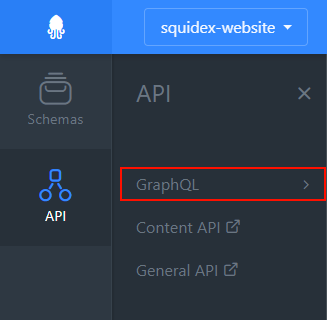
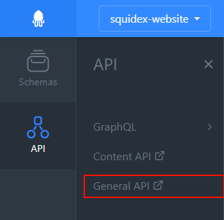

# API

## Introduction

With the API you can:

* ... create, change or query your content.
* ... upload, download or query assets.
* ... make complex queries with the GraphQL endpoint.
* ... execute all management operations such as creating apps, schemas, rules and updating settings.

The Management UI is using the same endpoints. If you can do something manually you can also do it with code.

The next paragraph will give you a short introduction about the different endpoints. After that we have some useful links to additional pages about specific aspects of the API.

## Different endpoints

Technically the API has only a single endpoint, but they API is distributed in several parts, with different principles and generated documentations:

### Content API

Each app has its own content API. The documentation is generated when you change your schemas and is tailored for your content structure. The documentation is cached and it might take a few minutes to serve the newest version for your app and schemas.

You can find the link to your Content API in the API section of the Management UI:

For example, this this is the Content API for the app that serves the content for the Squidex website:

[https://cloud.squidex.io/api/content/squidex-website/docs](https://cloud.squidex.io/api/content/squidex-website/docs)

### Content GraphQL API

The [GraphQL ](https://graphql.org/)endpoint is also generated per client. The documentation is provided by GraphiQL, an integrated, interactive GraphQL query editor. This endpoint can only be used to query content items and assets. Mutations have not been implemented yet, due several restrictions with the underlying GraphQL framework. The GraphQL endpoint is also cached for each API with a time to live time of 10 minutes. Therefore it can take up to 10 minutes until you see your changes.

### General API

The rest of the API is the same for all your apps. This includes endpoints to query and manipulate apps, schemas, assets, rules and all settings. For the cloud the generated documentation and can be found at:

[https://cloud.squidex.io/api/docs](https://cloud.squidex.io/api/docs)

## Cloud CDN \(BETA\)

The cloud version provides CDN endpoints for the Professional and Business plan.

The CDN is implemented using [https://www.fastly.com/](https://www.fastly.com/).

### Endpoints

We provide dedicated endpoints for different parts of the API. The CDN is not that very valuable for management endpoints, such as querying schemas and and settings, where you always want to retrieve the current version and it is not an easy task to get the caching behavior right to always provide up to date information. Therefore the decision has been made to provide specialized endpoints.

#### Contents CDN

The content CDN endpoint provides only access to your content items, including the GraphQL endpoint.  

The endpoint is:



instead of [https://cloud.squidex.io/api/contents/&lt;app&gt;/&lt;schema&gt;](https://cloud.squidex.io/api/contents/<app>/<schema>).

#### Assets CDN

The assets CDN endpoint provides only access to your content items and should be used for images.

The endpoint is:



instead of [http://cloud.squidex.io/api/assets/&lt;app&gt;/&lt;asset-id&gt;](http://cloud.squidex.io/api/assets/<app>/<asset-id>).

###  How Caching works

In general caching works only for GET requests. 

Therefore you will not leverage the caching system of the CDN provider when you query contents items using GraphQL and POST requests. But the GraphQL specification and our implementation supports [POST, as well as GET](https://graphql.org/learn/serving-over-http/#http-methods-headers-and-body).

The CDN provider uses the URL and the authentication states as cache keys. When you make requests with a user access token we use the bearer token as an additional cache key. When the bearer token is created for an app client the name of the client is used. This means that when you create a new access token for this client and then make the request again you will the cached version because the name of the client has not changed.

In addition to that we make use of [surrogate keys](https://docs.fastly.com/en/guides/purging-api-cache-with-surrogate-keys). Surrogate keys is a HTTP response header that contains ids that make up the HTTP response.   
For example when your retrieve a single content item, the response is dependent on the content item itself, but also on the related schema and the app it belongs to. Therefore we also add the app id and schema id together with the content id as a response header.   
When the app or schema id is changed we send a purge notification to the CDN provider to delete all cached entries that contains this id. This means that changing app settings like roles, contributors and clients purges all cached content items. This is useful when you restrict the permissions of a client.


Surrogate keys header has a limitation of 16KB. Therefore we can only serve around 400 keys.


### Pricing

The same pricing structures as described in the next paragraph is applied but the costs for cached requests are reduced by 50%.

## Cloud Costs

The pricing for the cloud version mainly depends on the number of API calls. But not all API endpoints have associated costs:

| Action | Costs |
| :--- | :--- |
| Query apps / Modify apps | 0 / 1 |
| Query schemas / Modify schemas | 0 / 1 |
| Query clients / Modify clients | 0 / 1 |
| Query contributors / Modify contributors  | 0 / 1 |
| Query languages / Modify languages  | 0 / 1 |
| Query patterns / Modify patterns | 0 / 1 |
| Query roles / Modify roles | 0 / 1 |
| Query histories | 0 |
| Query rules / Modify rules   | 1 / 1 |
| Query rule events / Modify  rule events | 0 / 0 |
| Query workflows / Modify workflows | 0 / 1 |
| Query assets / Modify assets | 1 / 1 |
| Query asset folders / Modify asset folders | 1 / 1 |
| Query asset content | 0.5 |
| Query contents | 1 |
| Query contents with GraphQL | 2 |
| Modify contents | 1 |

Modifications include creations, updates and deletions.

## Further pages

If you want to jump into the details of the API these pages might be helpful:

### How to get started with Postman



### How to retrieve an access token



### How to use the query system to filter content



### How to download and resize assets



## 

