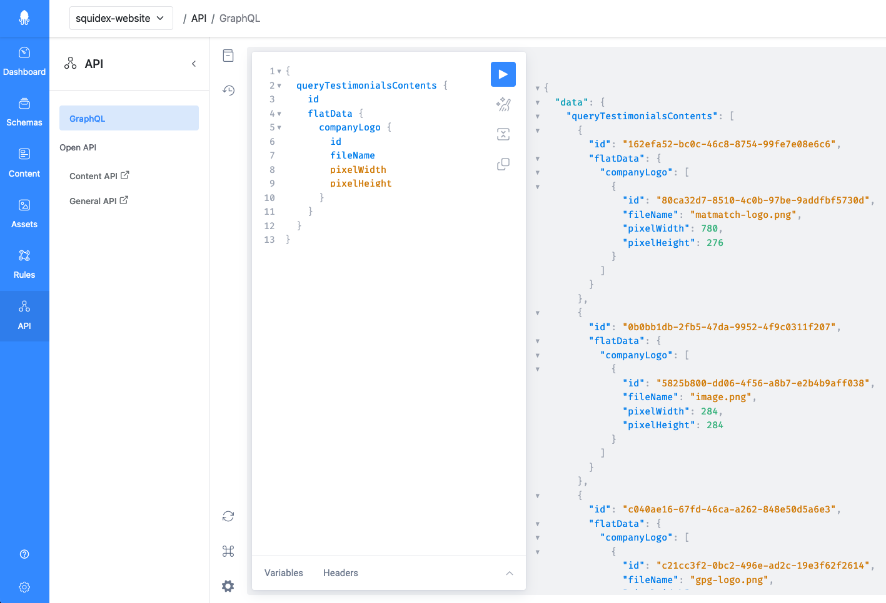

# Assets

This documentation is based on the _FoodCrunch_ use case. Please open the link below alongside this page to understand the examples.


[introduction-and-use-case.md](../../introduction-and-use-case.md)


## How to Retrieve Assets and Content

All assets are publicly available and not secured. However, the IDs are randomly generated as 128 bit numbers ([GUID](https://en.wikipedia.org/wiki/Universally\_unique\_identifier)) and almost impossible to find out just by using trial and error. Consider your assets safe!

You can download and link assets using the following URL format:

```
http://<YOUR-DOMAIN>/api/assets/{app}/{idOrSlug}/{*more}
```

So, if you are using the Squidex Cloud you have to use:

```
https://cloud.squidex.io/api/assets/{app}/{idOrSlug}/{*more}
```

Typically, an asset URL will look like this:

```
https://cloud.squidex.io/api/assets/the-foodcrunch-mag/182999c2-e266-46bc-9586-6ad9e49bc5b8/
```

If your assets have a slug, you can also use that slug for your URL:

```
https://cloud.squidex.io/api/assets/the-foodcrunch-mag/foodco_logo
```

If multiple assets with the same slug exist, the first asset with this value will be returned.&#x20;

The `more` parameter can be used to add additional text to the URL, to improve your link quality. Here's an example:

```
https://cloud.squidex.io/api/assets/the-foodcrunch-mag/foodco_logo/grayscale
```

The API reference with all parameters is provided here: [https://cloud.squidex.io/api/docs#operation/AssetContent\_GetAssetContent](https://cloud.squidex.io/api/docs#operation/AssetContent\_GetAssetContent)

## How to Resize Images?

The API has several parameters to provide and manipulate images. Resized images are cached permanently to improve performance for the following requests.

Use the following query string parameters:

<table><thead><tr><th width="191">Parameter</th><th width="130">Type</th><th>Description</th></tr></thead><tbody><tr><td><code>width</code></td><td>number</td><td>The target width of the asset, if it is an image.</td></tr><tr><td><code>height</code></td><td>number</td><td>The target height of the asset, if it is an image.</td></tr><tr><td><code>mode</code></td><td>string</td><td>The resize mode when the width and height is defined. Default: <code>Max</code></td></tr><tr><td><code>download</code></td><td>number</td><td>By default, Squidex provides the file name of the asset in the response. Therefore most browsers will download the file, which might be not desired for images. By setting this parameter to <code>0</code> you can prevent the download for images.</td></tr><tr><td><code>version</code></td><td>number</td><td>Use this value to get a concrete version. If omitted, the last version is returned. The initial version is <code>0</code> and it is updated with each update of the asset, not only when a new file version is uploaded.</td></tr><tr><td><code>cache</code></td><td>number</td><td>The client cache duration in seconds. Only affects the response header.</td></tr><tr><td><code>quality</code></td><td>number</td><td>Define the quality of the resized image.</td></tr><tr><td><code>bg</code></td><td>string</td><td>Background color, if the image has a transparent background.</td></tr><tr><td><code>focusX</code></td><td>number</td><td>Overrides the X value of focus point as a relative value from 0 (left) to 1 (right). Can also be configured via the Management UI. The dimensions are changed during resize, the focus point will be always visible.</td></tr><tr><td><code>focusY</code></td><td>number</td><td>Overrides the Y value of focus point as a relative value from 0 (top) to 1 (bottom). Can also be configured via the Management UI. The dimensions are changed during resize, the focus point will be always visible.</td></tr><tr><td><code>nofocus</code></td><td>boolean</td><td>Ignores the focus point when resizing.</td></tr><tr><td><code>force</code></td><td>boolean</td><td>Resizes the image, even it is cached on the server side. Can be used to invalidate broken cache entries.</td></tr><tr><td><code>auto</code></td><td>boolean</td><td>Delivers the image in the best format, depending on the <code>Accept</code> header. This is usually <code>webp</code> or <code>avif</code>.</td></tr></tbody></table>

You must fill in either the `width` or `height` parameter. If the asset is not an image, these parameters have no effect.

Squidex supports the following resize modes:

<table><thead><tr><th width="193">Mode</th><th>Description</th></tr></thead><tbody><tr><td><code>Crop</code></td><td>Crops the resized image to fit the bounds of its container. If the desired width and height is greater than the image dimensions it behaves like <code>BoxPad</code>.</td></tr><tr><td><code>CropUpsize</code></td><td>Crops the resized image to fit the bounds of its container, also desired width and height is greater than the image dimensions.</td></tr><tr><td><code>Pad</code></td><td>Pads the resized image to fit the bounds of its container. If only one dimension is passed, will maintain the original aspect ratio.</td></tr><tr><td><code>BoxPad</code></td><td>Pads the image to fit the bound of the container without resizing the original source. When down-scaling this mode performs the same functionality as <code>Pad</code>.</td></tr><tr><td><code>Max</code></td><td>Constrains the resized image to fit the bounds of its container maintaining the original aspect ratio.</td></tr><tr><td><code>Min</code></td><td>Resizes the image until the shortest side reaches the set given dimension. Up-scaling is disabled in this mode and the original image will be returned if attempted.</td></tr></tbody></table>

### How to Change the Image Quality

You can also add the `quality` parameter to the asset URL to define the quality from 0 (lowest) to 100 (best). If you define the quality, the image will always be returned in jpeg format and you might loose transparency information.

## How caching works

Squidex provides the `ETag` \*\*header for each asset. The browser caches the asset, along with its ETag. If the user wants to retrieve the same URL resource again, it will first determine whether the locally cached version of the URL has expired (through the `Cache-Control` and the `Expire` \*\* headers). If the URL has not expired, it will retrieve the locally cached resource. If it is determined that the URL has expired (is stale), the client will contact the server and send its previously-saved copy of the ETag along with the request in an `If-None-Match` field.\


Squidex now compares the passed ETag with the ETag of the current version of the asset. If the ETag values match (meaning that the asset has not changed), the server sends back an empty response with an [HTTP 304 Not Modified](https://en.wikipedia.org/wiki/HTTP\_304) status and the browser will show the cached version.

More about the ETag header can be found on [Wikipedia](https://en.wikipedia.org/wiki/HTTP\_ETag).&#x20;

You can add the `cache` query parameter as a number of seconds to cache the image in the browser. Then the following header is added to the response:

```
Cache-Control: public,max-age=<cache>
```

### Resolving References Assets

When you have content items with asset fields, the assets are added as IDs to the content item. Therefore, by default you will only retrieve the IDs when you query content items and you have to create additional requests to get asset information.

You have two options to solve this:

### Use GraphQL

With GraphQL you can get the exact information you are looking for. You have to define the fields you want to retrieve, from referenced assets or referenced content. In the following example you will find a query built to retrieve testimonials using the associated company logo as the field:

This example is NOT from the _FoodCrunch_ use case

<figure><figcaption><p>Use GraphQL to get asset information</p></figcaption></figure>

### Using Headers in the REST Endpoint

When using the normal REST endpoint, you can use the `X-Resolve-Urls` to define the fields that should be resolved. The value of this header must be a comma-separated list of field names:

.png>)
