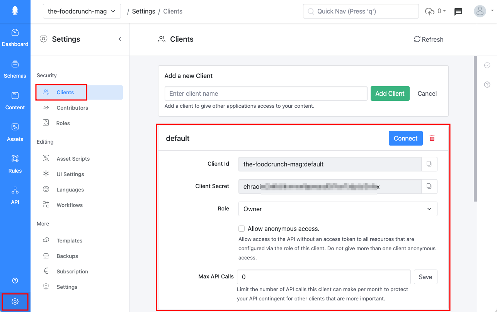

# Authentication

This documentation is based on the _FoodCrunch_ use case. Please open the below link side by side to this page to understand some of the examples.


[introduction-and-use-case.md](../../introduction-and-use-case.md)


## Introduction

Squidex uses OpenID Connect and OAuth2.0 as authentication protocols. Both are state of the art specifications and adopted by a lot of internet services. You have already used it when you logged in with your Google account to a third-party website.

The implementation uses [IdentityServer4](https://identityserver.io), a certified access control solution.

## Basic authentication flow

Lets talk about the general authentication flow first.

### 1. Generate Clients

Before you get an access token you have to create a client first. A client is just another name for an application and could be a mobile app, a public website, single page application or a backend server.

If you create a new app, it already has a default client.

<figure><figcaption><p>Default Client</p></figcaption></figure>

Each client also has a role assigned that defines which operations can be performed i.e. permissions. This is particularly useful when the client is a public application that can be easily reverse engineered like a mobile app or single page application. You can store your client credentials (client id and client secret) in the application but you have to ensure, that you give your client only the necessary permissions and not more.

Read more about permissions in the following link.


[permissions.md](../../concepts/permissions.md)


### 2. Request a token

The client id and secret cannot be used directly in the API calls. You have to make an additional request to identity-server first to get an access token. This token is then valid for 30 days.



Get an access token from Squidex Identity.



squidex-api



**<YOUR_CLIENT_SECRET>**



**<YOUR_CLIENT_ID>**



client_credentials



```
{
    "access_token":"<YOUR_ACCESS_TOKEN>,
    "expires_in":2592000,  // Expiration in seconds, 30 days
    "token_type":"Bearer",
    "scope":"squidex-api"
}
```



Or just make a request with curl:

```bash
curl
    -X POST 'https://cloud.squidex.io/identity-server/connect/token'
    -H 'Content-Type: application/x-www-form-urlencoded'
    -d 'grant_type=client_credentials&
        client_id=<YOUR_CLIENT_ID>&
        client_secret=<YOUR_CLIENT_SECRET>&
        scope=squidex-api
```

### 3. Use the token

Add the returned token to all consecutive requests.

```bash
Authorization: Bearer <YOUR_ACCESS_TOKEN>
```

## How to deal with the access token

An often asked question is how to deal with the access token, because there are a few challenges:

1. The token is valid only for 30 days.
2. The token might expire sooner, for example when a certificate is replaced on the server.
3. You need an additional request to get the token.

Our recommendation is to use the following pattern (pseudo code):

```javascript
function makeRequest(url, body) {
    const token = getTokenFromCache();
    
    if (!token) {
        token = getToken(clientId, clientSecret);
        
        storeTokenInCache(token, days: 30);
    }
    
    const response = makeRequestToSquidex(url, body);
    
    // Token has probably expired. 
    if (response.status == 401) {
        // Request the token again.
        token = getToken(clientId, clientSecret);
        
        storeTokenInCache(token, days: 30);
        
        // Try the request again.
        response = makeRequestToSquidex(url, body);
    }
    
    // You can still have a 401 here, but this very likely not an epxired token then.
    return response;
}
```

As you can see, we use a simple memory cache to keep our token. We request a new token when it has been expired in the cache or on the server, before the first request after our application has started.

You can also request multiple tokens in parallel, for example when you have a cluster of servers. There is no need to sync the access tokens between your servers or to keep them in a centralized cache.
