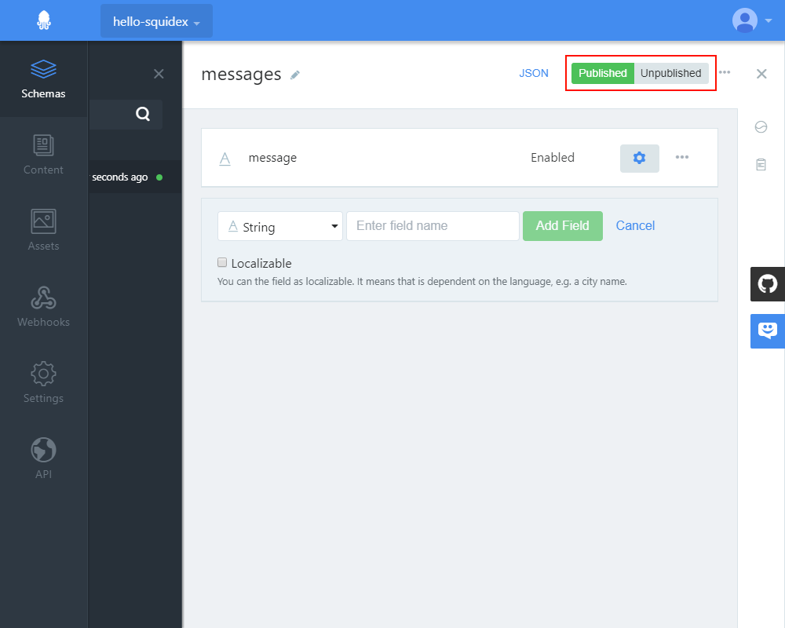
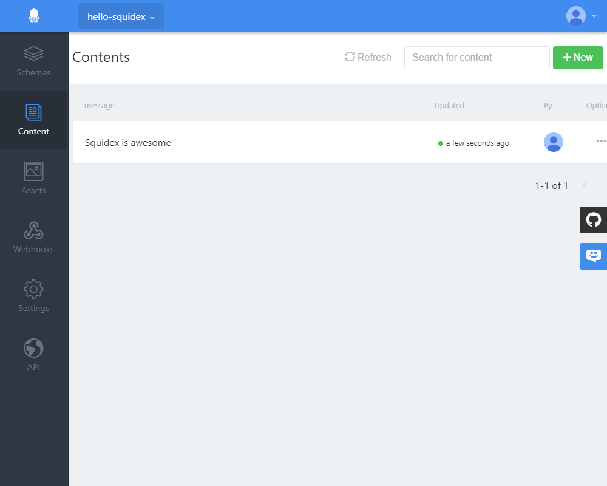
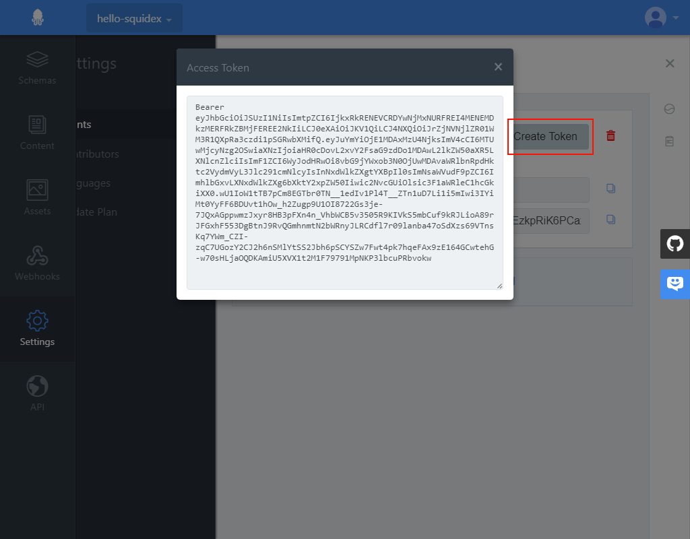
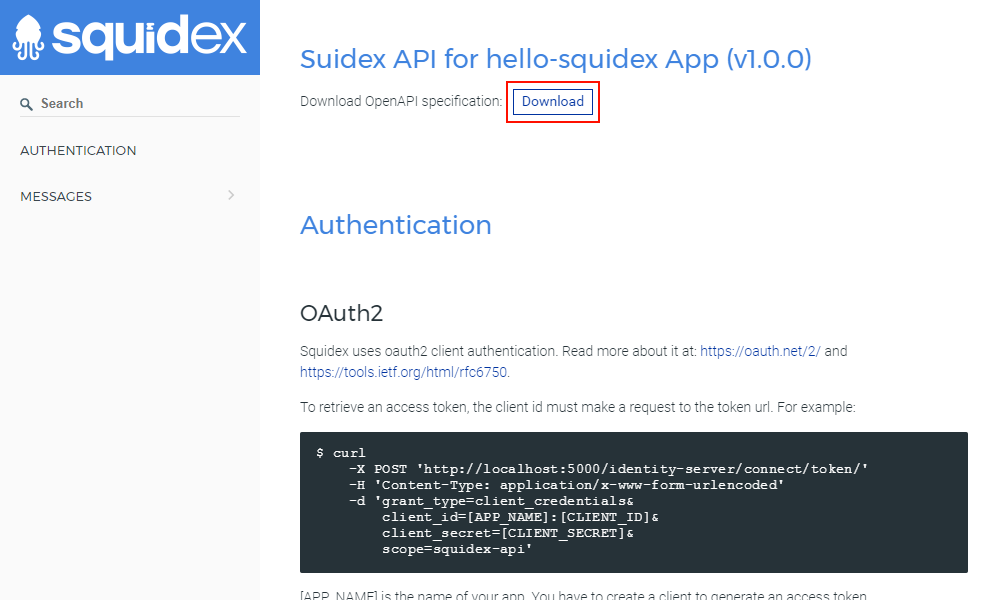

# Postman

This is a short tutorial how to make the first requests with Postman. 

## What is Postman

Postman is a free collaboration platform for API development and a good way to get started.



## Lets get started

### 1. Create an App

The first step is to create an application. Choose a name of your choice.


### 2. Create a Schema

Next create a schema. In this example we added a single field.


Ensure that the schema is published. Otherwise you cannot create content for the schema.



### 3. Add Content

Add some content to your schema.



### 4. Create a Client

Create a client for each application. Choose a name.


We have implemented the [OpenID client credentials flow](https://docs.axway.com/u/documentation/api_gateway/7.5.3/webhelp_portal_oauth/Content/OAuthGuideTopics/oauth_flows_client_credentials.). It is an secure and open standard to protect your APIs and to provide authentication for clients \(aka applications\) and users. As you are tried out Squidex you got in touch with it by using the Google, Github or Microsoft login.

You have to use generated client id and client secret to make a request to the identity system to get an authentication token. 

This token is valid for 30 days, but can be renewed as often as you want.

```text
$ curl
    -X POST 'https://cloud.squidex.io/identity-server/connect/token/' 
    -H 'Content-Type: application/x-www-form-urlencoded' 
    -d 'grant_type=client_credentials&
        client_id=[APP_NAME]:[CLIENT_ID]&
        client_secret=[CLIENT_SECRET]&
        scope=squidex-api'
```

For now we just use the 'Create Token' button to get the access token.



### 5. Download Swagger Specification

Open the API documentation under _API\Swagger_ and download the swagger specification:



### 6. Make the request with Postman

1. Open Postman
2. Import the Swagger specification \(just ignore the errors\).
3. Open the collection for your app and use the Query-request.
4. Just delete the query strings for now.
5. Add an authorization header and copy the access token from **Step4**.


