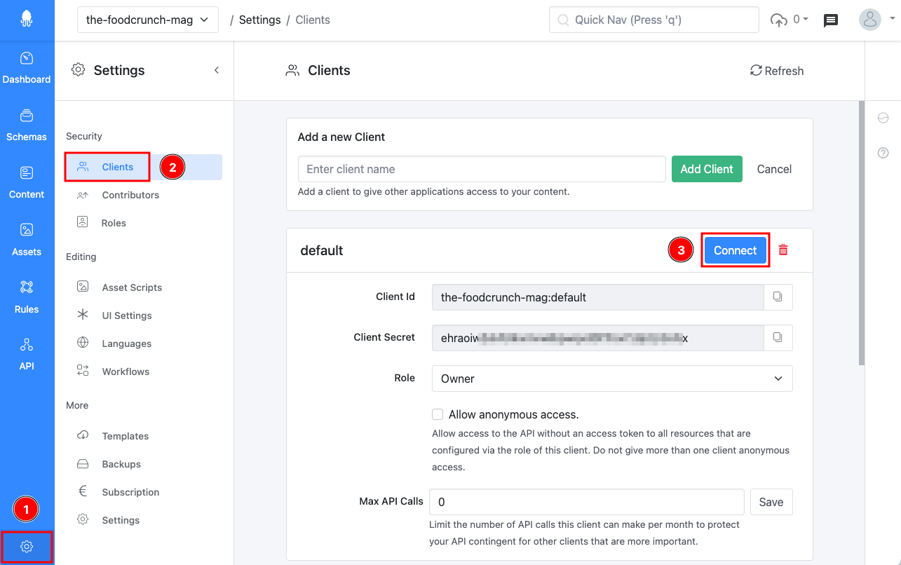
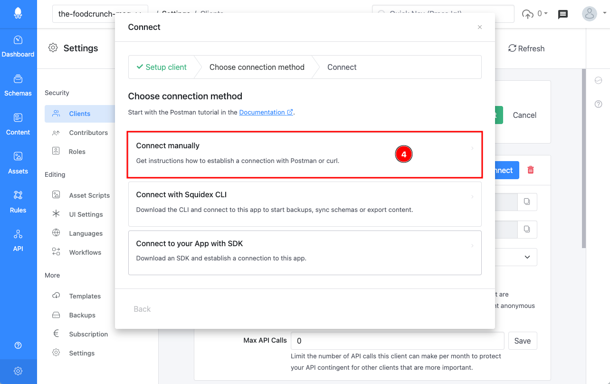
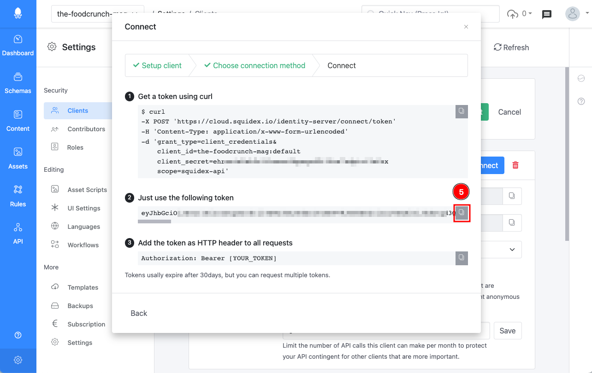
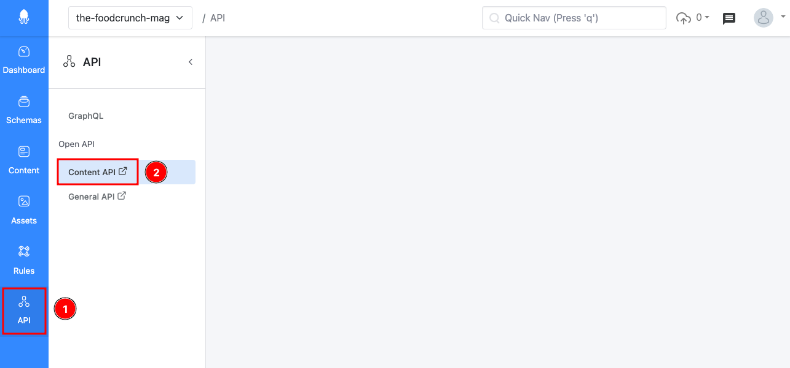
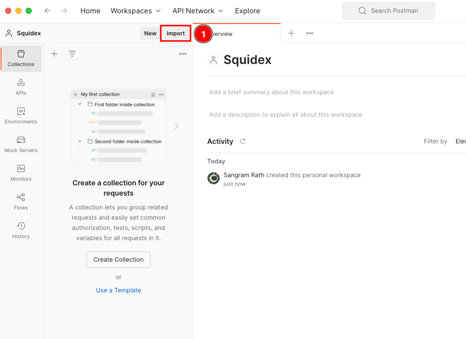
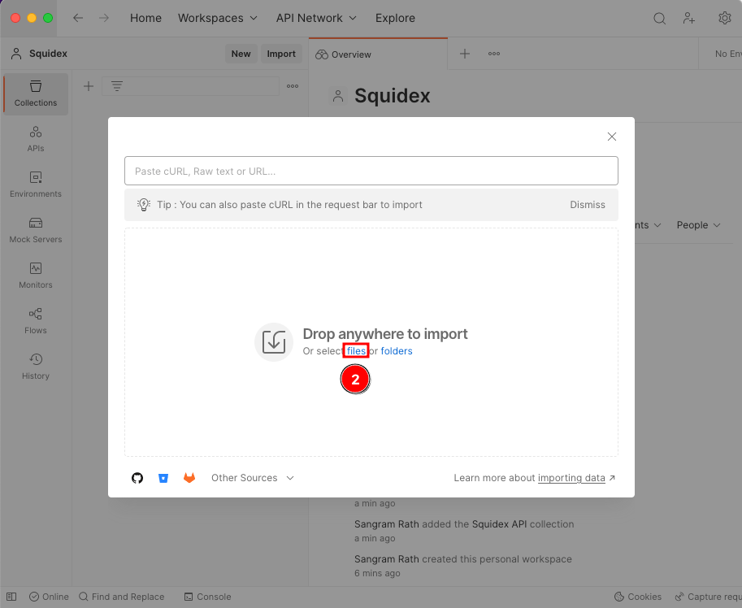
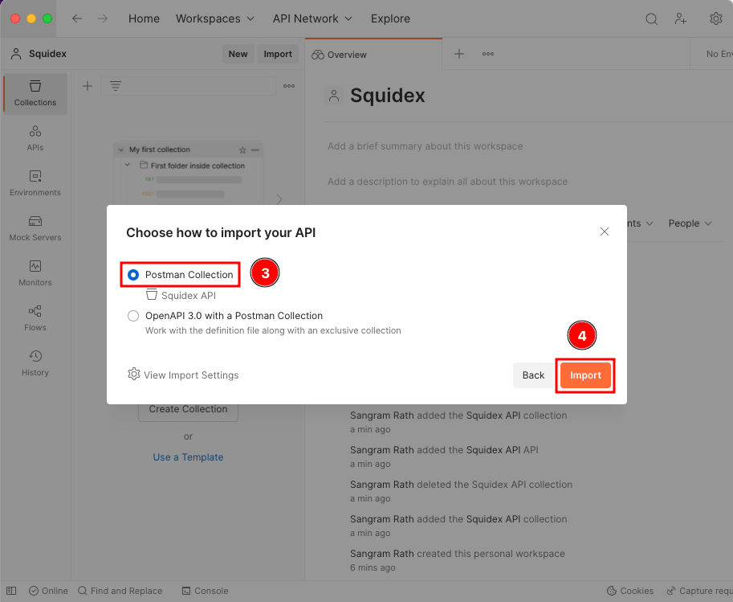
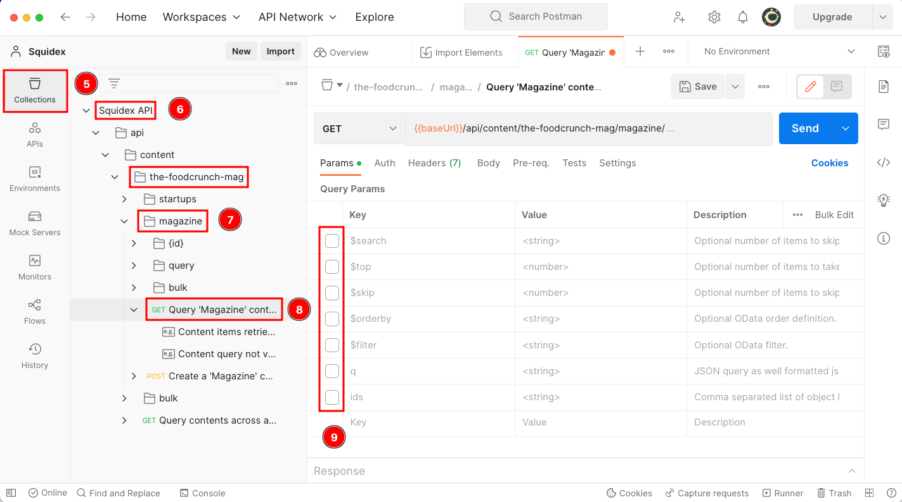
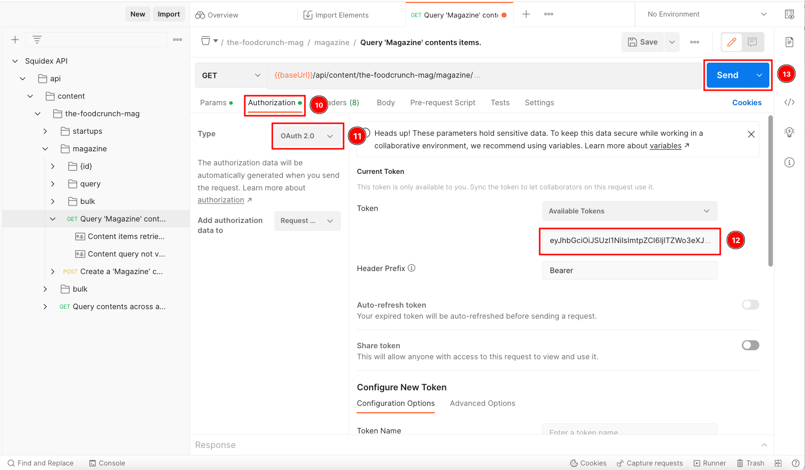

# Postman

This documentation is based on the _FoodCrunch_ use case. Please open the below link side by side to this page to understand some of the examples.


[introduction-and-use-case.md](../../introduction-and-use-case.md)


## What is Postman

Postman is a free collaboration platform for API development and a good way to get started. You can download Postman from the link below.

[https://www.postman.com/downloads/](https://www.postman.com/downloads/)

## Using Postman

### Pre-requisites

* Postman
* A Squidex app

If you do not have an app, you can refer one of the quick start guides to quickly create an app that has a pre-defined schema and sample content.


[Broken link](broken-reference)


Alternatively, if you wish to create an app from scratch and learn how to create a schema and add content then the following link is a good place to start.\



[building-a-nextjs-blog-with-squidex.md](../tutorials/building-a-nextjs-blog-with-squidex.md)


### 1. Generate a token for the client

A client represents an application like a mobile app or server application.

We have implemented the [OpenID client credentials flow](https://docs.axway.com/u/documentation/api\_gateway/7.5.3/webhelp\_portal\_oauth/Content/OAuthGuideTopics/oauth\_flows\_client\_credentials.). It is a secure and open standard to protect your APIs and to provide authentication for clients (aka applications) and users. It is also used by big players like Microsoft, GitHub and Google. When you login to applications using third party logins you have already used it.


[authentication.md](authentication.md)


By default, a client called _default_ is generated for your Squidex app. If this is not the case you are probably running an older version of Squidex. In that case you have to create a new client with a name of your choice.

To acquire a token perform the following steps:

Start by navigating to the **Settings** (1) section of your App and then select **Clients** (2). Click the **Connect** (3) button.

<figure><figcaption><p>Acquire a token - 1</p></figcaption></figure>

In the pop-up dialog, we provide explanations on how to connect to your app. For this example we will connect manually with Postman. Click the first option i.e. **Connect manually** (4).

<figure><figcaption><p>Acquire a token - 2</p></figcaption></figure>

In the next step you see the token that is generated and how to use it. Copy the token by clicking the **copy-button** (5).

<figure><figcaption><p>Acquire a token - 3</p></figcaption></figure>

This token is valid for 30 days, but can be renewed as often as you want.

You can also access a token with a HTTP request using the client id and secret:


```bash
curl \
-X POST 'https://cloud.squidex.io/identity-server/connect/token/' \
-H 'Content-Type: application/x-www-form-urlencoded' \
-d 'grant_type=client_credentials&client_id=[APP_NAME]:[CLIENT_ID]&client_secret=[CLIENT_SECRET]&scope=squidex-api'
```


### 2. Download the OpenAPI Specification

Squidex creates an OpenAPI documentation for your App. We will download and import it to Postman. To do so:

Go to the **API** (1) section of your App. Click the **Content API** (2) link to open the API docs in a new tab.

<figure><figcaption><p>Content API</p></figcaption></figure>

The documentation shows all the endpoints available for your content. **Download** (3) the OpenAPI specification file and save it in your file system to later import it with Postman. The file is called `swagger.json`.

<figure><figcaption><p>Download OpenAPI specification</p></figcaption></figure>

### 3. Import the OpenAPI into Postman

Launch Postman. To import the OpenAPI file to Postman, click **Import** (1) in your Workspace (or alternatively click File and then Import).&#x20;

<figure><figcaption><p>Import OpenAPI file - 1 </p></figcaption></figure>

Then, select the downloaded **file** (2) that you have saved before.

<figure><figcaption><p>Import OpenAPI file - 2</p></figcaption></figure>

Select **Postman Collection** (3) (selected by default). Click **Import** (4).

<figure><figcaption><p>Import OpenAPI file - 3</p></figcaption></figure>

You should be able to see the API now.&#x20;

### 4. Make a request using Postman

We are now ready to make requests using Postman. To make a request:&#x20;

1. Go to **Collections** (5).
2. Select the ContentAPI (6) for your App, its called _Squidex API_ in this example
3. Select the endpoints for your **schema** (7). In our example there are two schemas and the _magazine_ schema is selected.
4. Next, select the **query** endpoint (8) to query all content items.
5. **Uncheck** (9) all query parameters.

<figure><figcaption><p>GET request using Postman - 1</p></figcaption></figure>

Finally, the last step is to enter the access token. To do so:

1. Click the **Authorization** (10) tab.
2. Ensure **Type** (11) is `OAuth 2.0`.
3. Paste in the **Access Token** (12).
4. Send your request with the **Send** (13) button.

<figure><figcaption><p>GET request using Postman - 2</p></figcaption></figure>

You should see a response body which is the result of the GET request.

You have learnt how to retrieve the content items.
