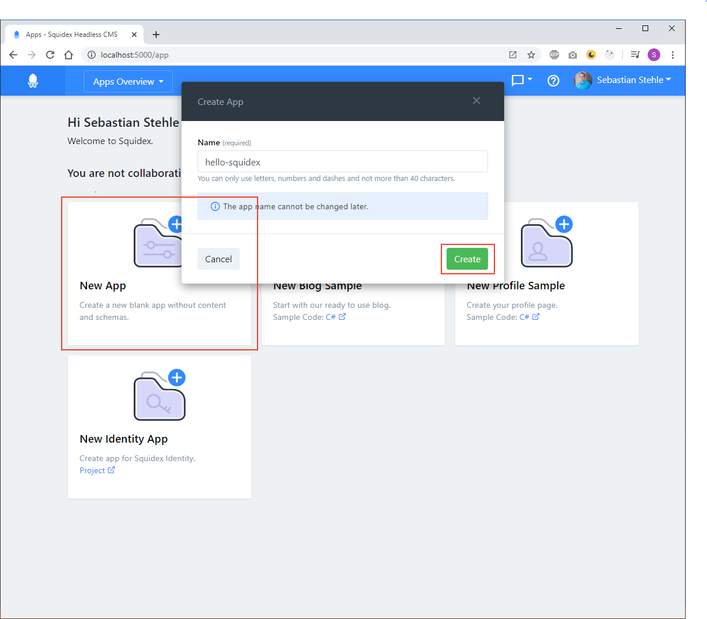
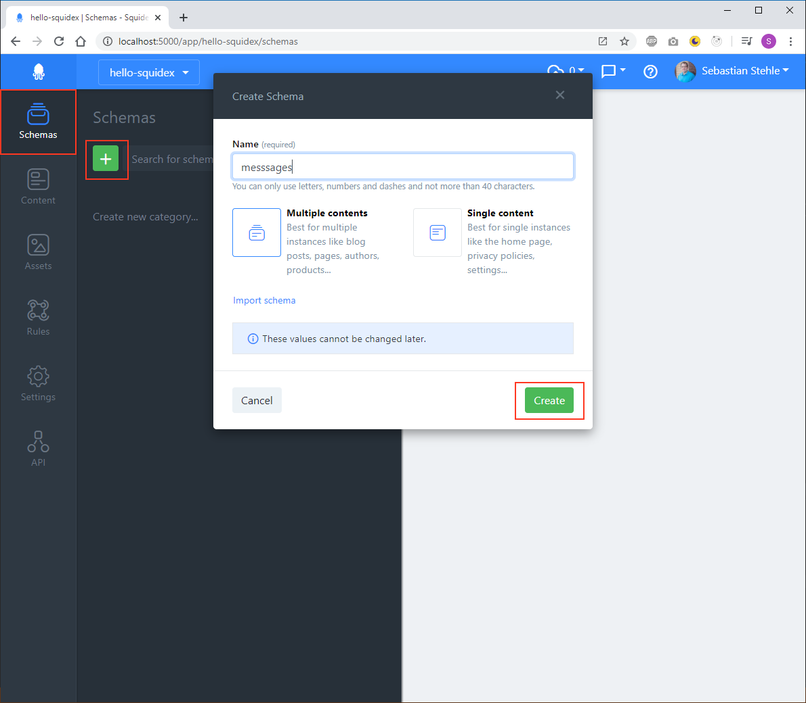
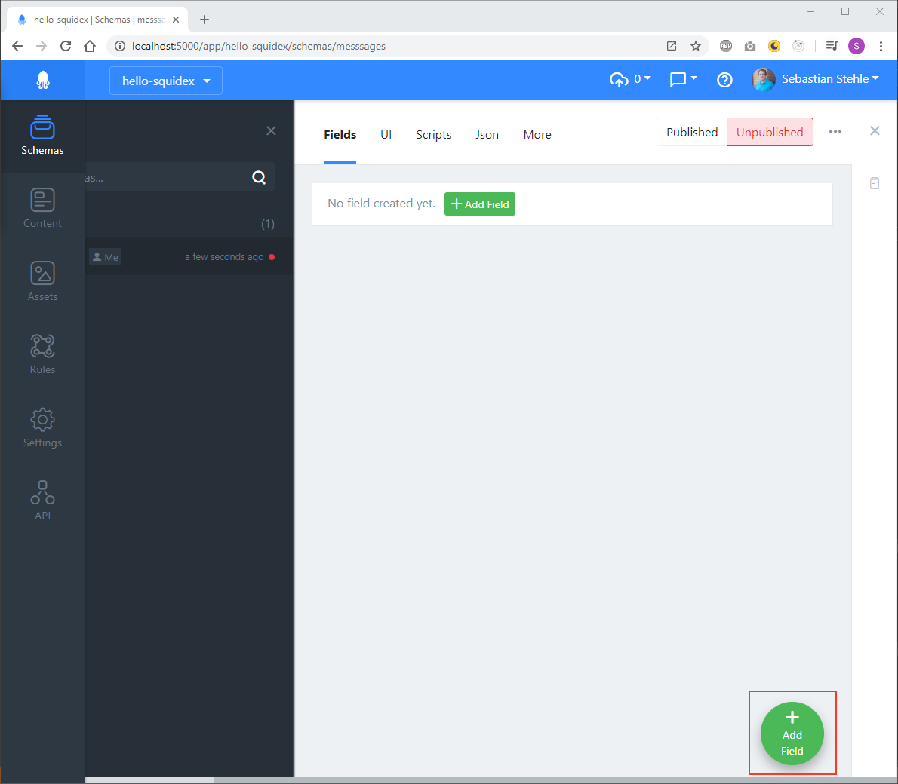
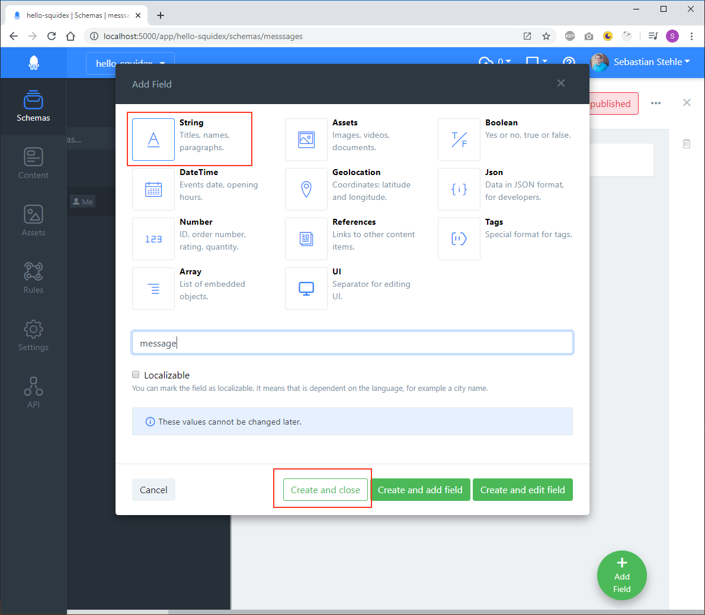
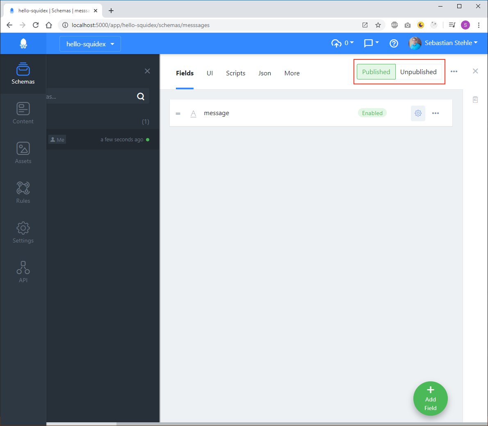
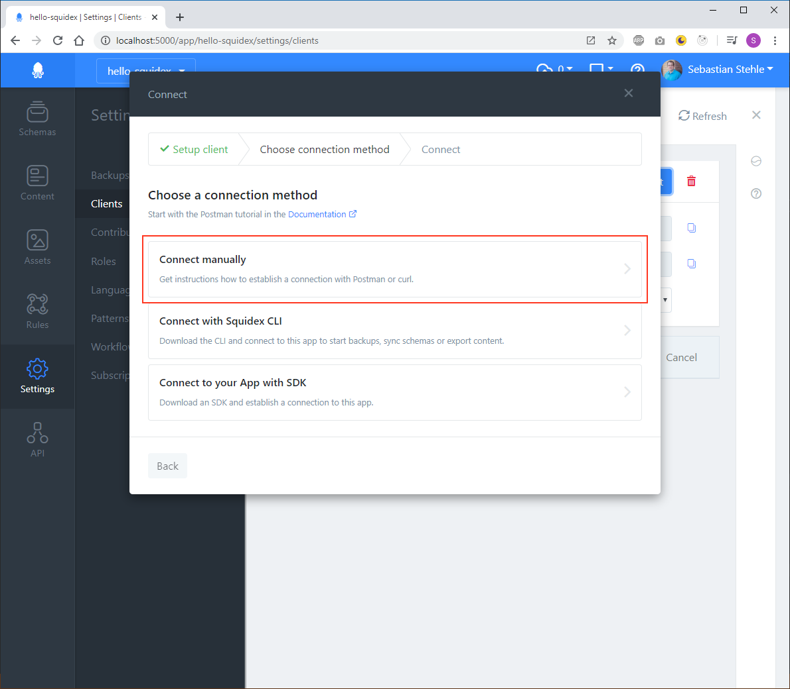
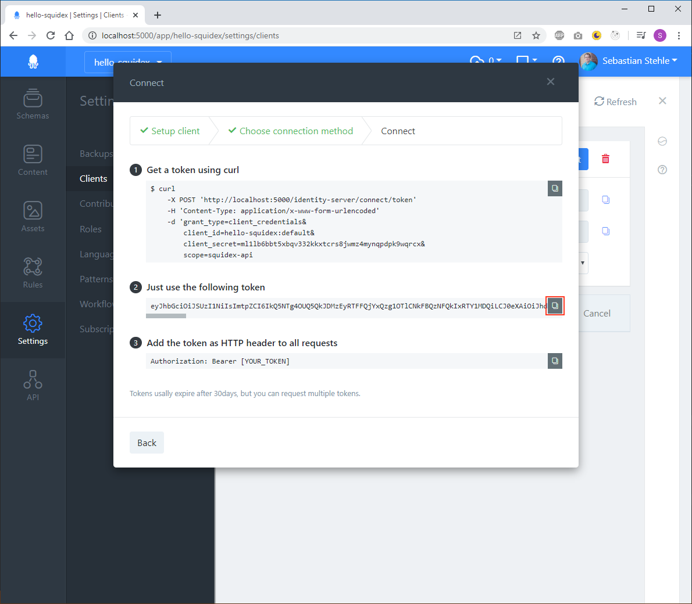
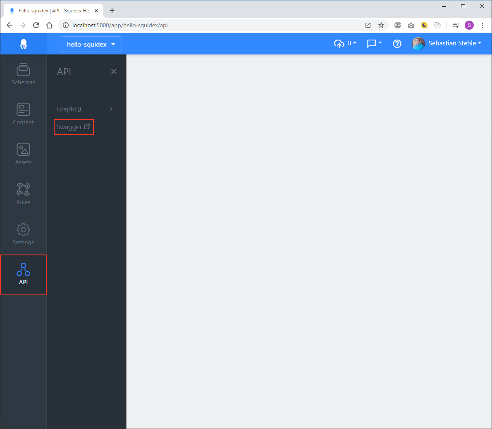

# Postman

This is a short tutorial how to make the first requests with Postman. 

## What is Postman

Postman is a free collaboration platform for API development and a good way to get started.



## Lets get started

### 1. Create an App

The first step is to create an app, which is just another name for project or space. Choose a name of your choice. The name must be unique so it might already been taken if you use the cloud version. The name can also contain only lowercase letters, numbers and dashes because it will be part of the URLs.



Read more about Apps:



### 2. Create a Schema

Next create a schema, which is like a database table with fields of different types.



 In this example we add a single String field. Click the "Add-Field" button to get the field dialog:



Ensure that you have the `String` type selected and choose a name of your choice:



Also ensure that the schema is published. Otherwise you cannot create content for the schema.



If you want to learn more about schemas use the following page:



### 3. Add Content

Add some content to your schema. 

Go to the contents section, select your schema and click the "+ New" Button.


Enter your text and press "Save and Publish". Only published content is visible in the API.


### 4. Connect to your app using a client

A client represents an application like a mobile app or server application. 

We have implemented the [OpenID client credentials flow](https://docs.axway.com/u/documentation/api_gateway/7.5.3/webhelp_portal_oauth/Content/OAuthGuideTopics/oauth_flows_client_credentials.). It is an secure and open standard to protect your APIs and to provide authentication for clients \(aka applications\) and users. It is also used big big players like Microsoft, Github and Google. When you login to applications using third party logins you have already used it.



By default a default client is generated for each. If this is not the case you are probably running an older version of Squidex. Then you have to create a new client with a name of your choice.


Click the "Connect"-button to create a temporary access token. In the dialog we provide different connection methods. Click "Connect" manually now.



In the next step you see the token that is generated for you and how to use it. Just copy the token by clicking the copy-button that is marked with a red border here.



This token is valid for 30 days, but can be renewed as often as you want.

You can also access a token with a HTTP request using the client id and secret:

```text
$ curl
    -X POST 'https://cloud.squidex.io/identity-server/connect/token/' 
    -H 'Content-Type: application/x-www-form-urlencoded' 
    -d 'grant_type=client_credentials&
        client_id=[APP_NAME]:[CLIENT_ID]&
        client_secret=[CLIENT_SECRET]&
        scope=squidex-api'
```

### 5. Download Swagger Specification

Go to  the API section and click the "Swagger" item to go to the API documentation for your app. It is very likely that we rename this menu item to "Open API" in the future, so don't get confused when you cannot find it there.



The documentation shows all the endpoints that are available for your content. You can download the specification now to import it into Postman.


### 6. Make the request with Postman

1. Open Postman
2. Import the Swagger specification \(just ignore the errors\).
3. Open the collection for your app and use the Query-request.
4. Just delete the query strings for now.
5. Add an authorization header and copy the access token from **Step4**.


That's it. You have created your first app, schema and content with Squidex and you have learned how to retrieve the content items.

