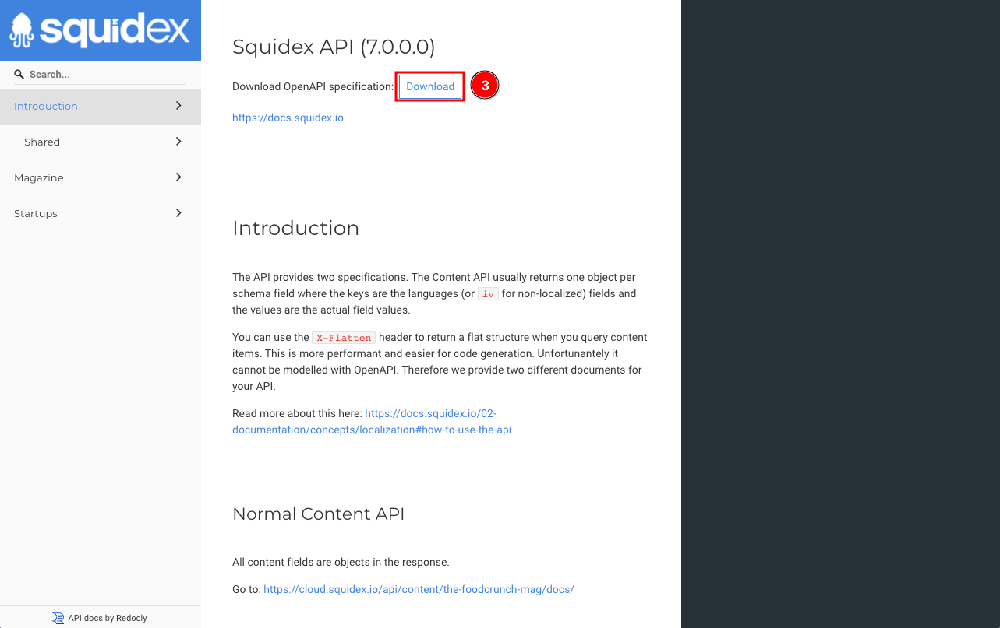

# Postman

This documentation is based on the _FoodCrunch_ use case. Please open the link below alongside this page to understand the examples.


[introduction-and-use-case.md](../../introduction-and-use-case.md)


This is a short tutorial detailing how to create first requests using Postman.

## What is Postman?

Postman is a free collaboration platform for API development and a good way to get started.



## Let's Get Started

### Pre-requisites

* Postman
* A Squidex App

If you do not yet have an App, you can refer to one of the quick start guides to create an App that has a pre-defined schema and sample content.


[Broken link](broken-reference)


Alternatively, if you wish to create an app from scratch and learn how to create a schema and add content then the following link is a good place to start.


[building-a-nextjs-blog-with-squidex.md](../tutorials/building-a-nextjs-blog-with-squidex.md)


### 1. Generate a Token for the Client

A client represents an application such as a mobile App or server application.

We have implemented the [OpenID client credentials flow](https://docs.axway.com/u/documentation/api\_gateway/7.5.3/webhelp\_portal\_oauth/Content/OAuthGuideTopics/oauth\_flows\_client\_credentials.). It is a secure and open standard to protect your APIs and to provide authentication for clients (aka applications) and users. It is also used by big brands such as Microsoft, GitHub and Google. You've already used it in the past, when you've logged into applications using third party logins.


[authentication.md](authentication.md)


By default, a _default_ client is generated for your App. If this is not the case, you are probably running an older version of Squidex. If this is the case, you have to create a new client with a name of your choice.

To acquire a token you should perform the following steps:

Go to the **Settings** (1) section of your App, select **Clients** (2) under _Security_ and then click the **Connect** (3) button.

<figure><figcaption><p>Acquire a token - 1</p></figcaption></figure>

Next, we provide explanations on how to connect to your App. For now, we must connect manually with Postman. Click the first option i.e. **Connect manually** (4).

<figure><figcaption><p>Acquire a token - 2</p></figcaption></figure>

In the next step, you see the token that is generated for you and how to use it. Just copy the token by clicking the **copy-button** (5) as shown in the screenshot below:

<figure><figcaption><p>Acquire a token - 3</p></figcaption></figure>

This token is valid for 30 days, but can be renewed as often as you want.

You can also access the token with an HTTP request using the _Client ID_ and _Client Secret_ as below:


```bash
curl \
-X POST 'https://cloud.squidex.io/identity-server/connect/token/' \
-H 'Content-Type: application/x-www-form-urlencoded' \
-d 'grant_type=client_credentials&client_id=[APP_NAME]:[CLIENT_ID]&client_secret=[CLIENT_SECRET]&scope=squidex-api'
```


### 2. Download the OpenAPI Specification

Squidex creates an OpenAPI documentation for your App. We are going to download it in order to import it to Postman:

Go to the **API** (1) section of your App and click the **Content API** (2) link to open the API docs in a new tab.

<figure><figcaption><p>Content API</p></figcaption></figure>

The documentation shows all the end points that are available for your content. **Download** (3) the OpenAPI specification file and save it in your file system to import it with Postman. The file is called `swagger.json`.

<figure><figcaption><p>Download OpenAPI specification</p></figcaption></figure>

### 3. Import the OpenAPI into Postman

Next, you need to import the OpenAPI file to Postman. To do this, launch Postman and click the **Import** (1) button in your Workspace (or alternatively click File and then Import).&#x20;

<figure><figcaption><p>Import OpenAPI file - 1 </p></figcaption></figure>

Next, select the downloaded **file** (2) that you have saved before.

<figure><figcaption><p>Import OpenAPI file - 2</p></figcaption></figure>

Select **Postman Collection** (3) (this should be selected by default) and click **Import** (4).

<figure><figcaption><p>Import OpenAPI file - 3</p></figcaption></figure>

You should be able to see the API now.&#x20;

### 4. Make a Request using Postman

We are now ready to make requests using Postman. To make a request:&#x20;

1. Go to the **Collections** (5).
2. Select the ContentAPI (6) for your App, its called _Squidex API_ in this example
3. Select the endpoints for your **schema** (7). In our example there are two schemas and the _magazine_ schema is selected.
4. Next, select the **query** endpoint (8) to query all content items.
5. **Uncheck** (9) all query parameters.

<figure><figcaption><p>GET request using Postman - 1</p></figcaption></figure>

The last step is to enter you access token:

1. Click the **Authorization** (10) tab.
2. Ensure **Type** (11) is `OAuth 2.0`.
3. Paste in the **Access Token** (12).
4. Send your request with the **Send** (13) button.

<figure><figcaption><p>GET request using Postman - 2</p></figcaption></figure>

You should see a response body which is the result of the GET request.

You have just learnt how to retrieve the content items using Postman!
