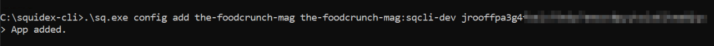
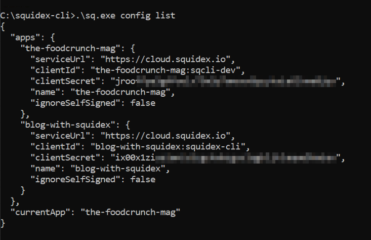
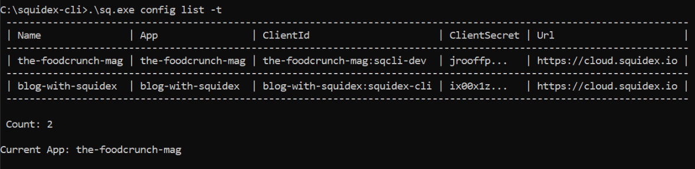
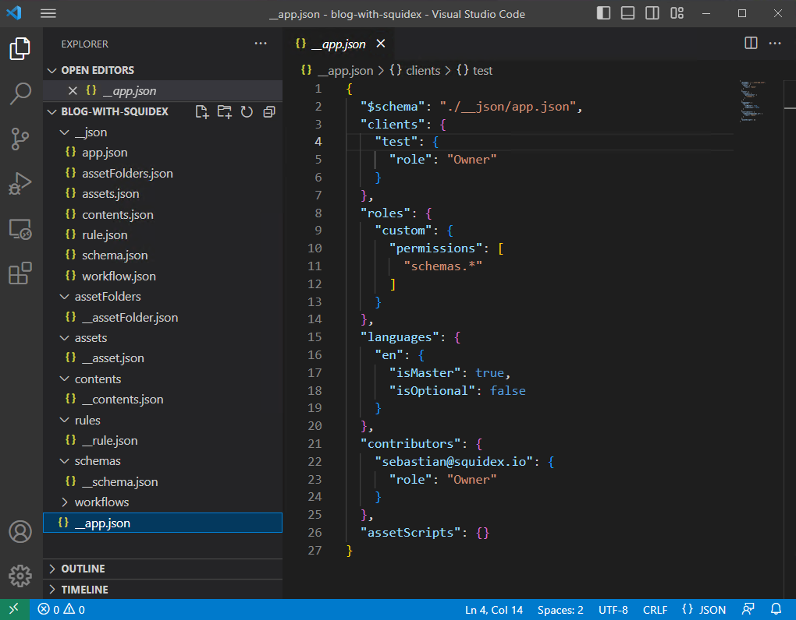
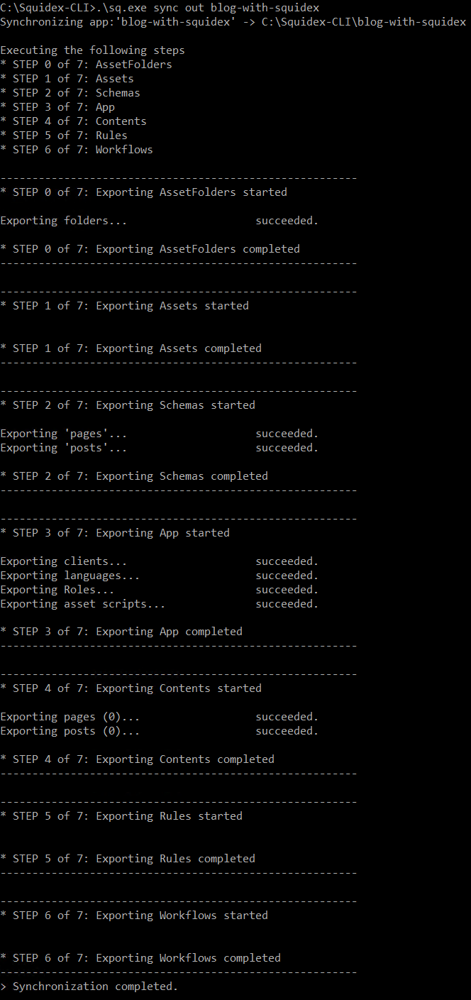
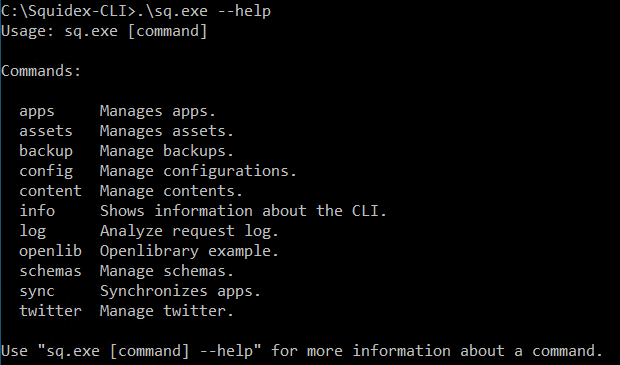
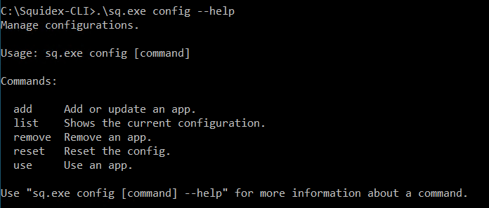

# Automation Tools (CLI)

The Squidex CLI (Command Line Interface) is a terminal application available for Windows, Linux and macOS (OS X).

You can download the CLI at the GitHub release page here: [https://github.com/Squidex/squidex-samples/releases](https://github.com/Squidex/squidex-samples/releases)

The CLI has two main advantages:

1. It is easy to automate things in your build and release processes, for example, you can trigger nightly updates and schema migrations from one App to another or export content.
2. It is easier to integrate complex features, such as export to CSV because it takes more time to write a good user interface than the export routine itself.

## How to Use the CLI?

Hopefully, the CLI itself is good enough for you and you can use the integrated help to navigate through all the features.

The general structure of each command is as follows:

```
.\sq.exe [FEATURE] [COMMAND] [ARGS] [OPTIONAL_PARAMETERS]
```

Depending on your use cases you will need a client with the **Developer** or **Owner** role.


This page demonstrates examples using Windows, but the CLI is also available for Linux and macOS (OS X).


## How to Manage Configurations

A configuration contains all information to connect the CLI to a specific App in your Squidex installation and contains the _App Name_, _Client ID_, _Client Secret_ (and optionally the _URL_ to your installation if you do not use the Squidex Cloud).

The CLI can manage multiple configurations, so you don't have to define the App, client and secret for each command. Configurations are stored in a file that is located just next to the CLI, so you need to write permissions to this directory.

The `config` feature of the utility is used to manage configurations.

### STEP 1: Add a Configuration

```
.\sq.exe config add [APP_NAME] [CLIENT_ID] [CLIENT_SECRET]
```

<figure><figcaption><p>Adding an app configuration</p></figcaption></figure>

### STEP 2: Show all Configurations

```
.\sq.exe config list
```

<figure><figcaption><p>List all added configurations</p></figcaption></figure>

To view the configurations as a table use `-t` or `--table`.

```
.\sq.exe config list -t
.\sq.exe config list --table
```

<figure><figcaption><p>List all added configurations in a table</p></figcaption></figure>

### STEP 3: Switch to Another Config

When working with multiple Apps, the `config use` command can be used to switch between Apps. It is used to select an App (configuration) from a list of configurations.

```
.\sq.exe config use [APP_NAME]
```

## Use Cases

The following section describes the most common use cases and how to execute them with the CLI.

### Synchronize all App Settings


You need a client with the **Owner** role for this use case.


A common use case of the CLI is that you can synchronize your Squidex app settings using the `sync` command.

The syntax for it is:

```
.\sq.exe sync [COMMAND] [OPTIONS] [ARGS]
```

The `sync` command can be used to export or import your App settings to a set of JSON files. This command is able to synchronize the following settings:

* Schemas
* Contents (this setting can be imported only)
* Contributors (this setting can be imported only)
* Clients
* Roles
* Rules
* Workflows

#### Use Case - Create Sample Configuration files

The `sync` command can be used to create a new folder with sample files that can then be imported to the App.

The following command does the same (replace `<folder>` with a folder name of your choice):

```bash
.\sq.exe sync new <folder>
```

The CLI creates a set of sample configuration files that begin with \_\_ (see screenshot below). The files starting with a double underscore are ignored during the synchronization. Therefore, you have to rename or copy the samples files in order to sync them.

The screenshot below shows a typical folder structure with sample configuration files:

<div align="left">

<figure><figcaption></figcaption></figure>

</div>

The CLI also generates JSON schema files that are referenced by the configuration files and provide basic intelligence features in editors such as [Visual Studio Code](https://code.visualstudio.com). You will see error messages when you do not follow the JSON schema. Do also look out for additional errors that might occur when synchronizing your configuration.

#### Use Case - Import (Synchronize Configuration From Folder to App)

To synchronize a configuration (created through the CLI) with your App, use the following command replacing `<folder>` with the folder name where the configuration is:

```bash
.\sq.exe sync in <folder>
```


When synchronizing your configuration, it is very important that the client used by the CLI configuration to establish the connection to your App is the same in the App.JSON file. If you don't do this, the client will be deleted during the synchronization stage and also, consecutive commands will fail.


The `sync in` command also provides flags to control the synchronization process. You can view a list of supported flags/options by running the following command:

```bash
.\sq.exe sync in --help
```

<table><thead><tr><th width="374">Flag</th><th>Description</th></tr></thead><tbody><tr><td><code>app</code></td><td>The name of the app. If not provided then app configured in <code>currentApp</code> gets created.</td></tr><tr><td><code>targets</code></td><td>This flag can be used to only import certain parts of your app. You can use multiple parameters. E.g. 'sync in -t contents -t schemas'. Use <code>sync targets</code> to view all targets.</td></tr><tr><td><code>language</code></td><td>The content language to synchronize.</td></tr><tr><td><code>content-action</code></td><td><p>Defines how to handle content. </p><p>Allowed values: <strong>Upsert, UpsertPatch, Create, Update, Patch</strong>.</p></td></tr><tr><td><code>delete</code></td><td>Use this flag to also delete entities.</td></tr><tr><td><code>patch-content</code></td><td>Make content updates as patch.</td></tr><tr><td><code>recreate</code></td><td>Use this flag to also recreate entities.</td></tr><tr><td><code>skip-assets</code></td><td>Use this flag to sync asset folders but not assets.</td></tr><tr><td><code>update-current-client</code></td><td>Also update the client that is used during the sync process.</td></tr><tr><td><code>emulate</code></td><td>Use this flag to only emulate the changes, like a dry run.</td></tr></tbody></table>

#### Use Case - Export (Synchronize Configuration from App to Folder)

The `sync` command also lets you export your App configuration to a folder. If you do not want to start from scratch, you can also export. Use the following command replacing `<folder>` with an actual folder name.

```bash
.\sq.exe sync out <folder>
```


Make note of the following when synchronizing out or exporting.

1. A client with the Owner role can export all configurations.
2. A client with the Developer role will not be able to export clients (in Step 3) and will throw a `403 Forbidden` error message. This will complete export of the rest of the configurations.&#x20;
3. A client with the Editor role will completely fail exporting with the `403 Forbidden` message.


For example, in the following screenshot we are exporting the configuration of an App called _blog-with-squidex_ to our local machine where CLI is installed. The client has the Owner role.

```
.\sq.exe sync out blog-with-squidex
```

<div align="left">

<figure><figcaption><p>Synchronize out / Export configuration from app to folder</p></figcaption></figure>

</div>

The `sync out` command also provide flags to control the synchronization process.

```
.\sq.exe sync out --help
```

<table><thead><tr><th width="374">Flag</th><th>Description</th></tr></thead><tbody><tr><td><code>app</code></td><td>The name of the app. If not provided then app configured in currentApp gets created.</td></tr><tr><td><code>targets</code></td><td>This flag can be used to only export certain parts of your app. You can use multiple parameters. E.g. 'sync out -t contents -t schemas'. Use '<code>sync targets</code>' to view all targets.</td></tr><tr><td><code>describe</code></td><td>Create a README.md file.</td></tr></tbody></table>

#### Restrictions

The synchronization feature has a few restrictions:

1. **Contributors Cannot be Exported**. We use the email address of the users to add new contributors to your App. However, because Squidex protects the PII (Personally Identifiable Information) of our users, we do not expose email addresses via the API and therefore cannot export the contributors.
2. **Content Cannot be Exported.** In contrast to other entities, such as schemas or workflows, an App can have tens of thousands of content items and therefore it does not make sense to export them.
3. **Content Cannot be Deleted.** It is just too complicated!

### Synchronizing Schemas


You need a client with either **Developer** or **Owner** role for this use case.


The CLI provides a mechanism to synchronize schemas using a JSON file. The `schemas` command helps you to achieve this. The syntax for this is:

```
.\sq.exe schemas [command] [options]
```

STEP 1: Use the `config` command to select the source App and then save the schema to a JSON file.

```bash
.\sq.exe config use app1
.\sq.exe schemas get schema1 > schema.json
```

STEP 2: Use the `config` command again to switch to the destination App and sync the schema from the saved file.

```bash
.\sq.exe config use app2
.\sq.exe schemas sync schema.json
```

Or you can also sync it to another schema name.

```bash
.\sq.exe schemas sync schema.json --name <schema-name>
```

### Start a Backup

You can also create a backup using the CLI. This is achieved by using the `backup` command.


You need a client with the **Owner** role for this use case.


```bash
.\sq.exe backup create backup.zip
```

### Export Content to CSV

```bash
.\sq.exe content export <schema-name> --fields=id,version
```

You have to define the fields you want to export. The general syntax is:

```bash
(<CSV_COLUMN>=)?<JSON_PATH>
```

The CSV column is optional and can be skipped. If no column name is specified, the path string will be used.

To get a good understanding of paths, it is helpful to have a look to the API documentation of your schemas, e.g.

[https://cloud.squidex.io/api/content/squidex-website/docs#operation/GetTestimonialsContent](https://cloud.squidex.io/api/content/squidex-website/docs#operation/GetTestimonialsContent)

Some sample paths

* `id`
* `version`
* `data.personName.iv`
* `data.personName` (`iv` is added by default for non-localized fields)
* `personName=data.personName` (Column name for non-localized field).

More examples (not from the example operation above):

* `data.text.en` (Localized field)
* `data.hobbies.iv.0.name`(For array of objects)
* `data.hobbies.iv`(To serialize the whole array to a string)
* `data.json.iv.property` (For a nested object)
* `data.json.iv` (To serialize the whole object to a string)

If the extract value is a JSON array of an object, it will be serialized to a string.

### Export Content to JSON

```bash
.\sq.exe content export <schema-name> --format=JSON
```

Take a look at the help section of the `content export` command for a list of all options.

```
.\sq.exe content export --help
```

### Import Content from CSV

```bash
.\sq.exe content import <schema-name> File.csv --fields=text
```

You have to define the fields you want to import. The general syntax is:

```bash
<JSON_PATH>(=<CSV_COLUM>)?
```

The CSV column is optional and can be skipped. If no column name is specified, the path string will be used.

To get a good understanding of the paths, it is helpful to have a look to the API documentation of your schemas, e.g.

[https://cloud.squidex.io/api/content/squidex-website/docs#operation/GetTestimonialsContent](https://cloud.squidex.io/api/content/squidex-website/docs#operation/GetTestimonialsContent)

Some sample paths:

* `personName.iv=personName`
* `personName` (`iv` is added by default for non-localized fields)

More examples (not from the example operation above):

* `text.en=text` (Localized field)
* `hobbies.iv.0.name=firstHobby`(For array of objects)
* `hobbies.iv=hobbies`(To serialize the whole array to a string)
* `json.iv.property=jsonProperty` (For a nested object)
* `json.iv=json` (To serialize the whole object to a string)

If the extract value is a JSON array of an object it will be serialized to a string.

### Import Content from JSON

```bash
.\sq.exe content import <schema-name> File.json --format=JSON
```

Take a look at the help section of the `content import` command for a list of all options.

```
.\sq.exe content import --help
```

### Use Case: Generate Test Data

Sometimes, it is useful to generate test data for a field, e.g. if you need several hundred of items to test a user interface.

This can be done with the CLI as well:

```bash
.\sq.exe content test-data <schema-name> --count 100
```

Before you generate the data you can also test it by dumping the data to a file first:

```bash
.\sq.exe content test-data <schema-name> --count 100 --file Test-Data
```

The CLI does not support all field types, it has the following restrictions:

* No support for references.
* No support for assets.
* No support for string fields with a pattern validator.

It is also unable to support custom validations via scripts or custom extensions.

## How to Use Help Feature Within the CLI

The CLI utility has an inbuilt help feature which can be accessed by using the `--help` parameter.

For example `--help` at the utility level will show all features the CLI supports.

`.\sq.exe --help`

<div align="left">

<figure><figcaption><p>Help Example 1</p></figcaption></figure>

</div>

Similarly a `--help` parameter after a feature gives information about all the commands the feature supports. For example:

`.\sq.exe config --help`

<div align="left">

<figure><figcaption><p>Help Example 2</p></figcaption></figure>

</div>
