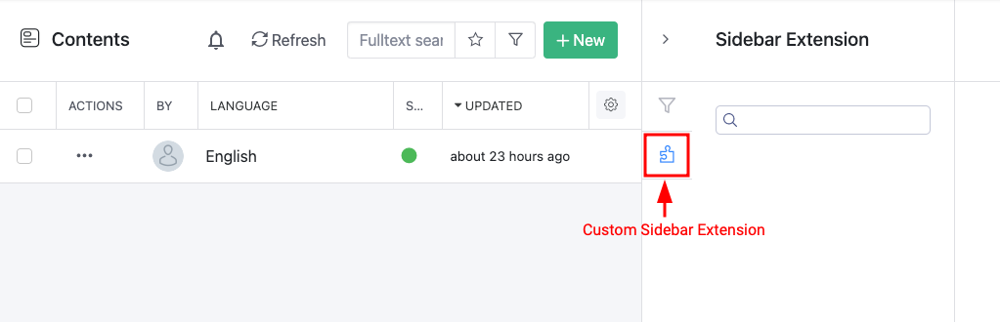

# Custom Sidebars

## How to Write Your Own Sidebar Plugin

Custom sidebar plugins enable developers to add custom UI extensions to the sidebar of a single content item, or to a list of content items.

Below is an example of a custom sidebar extension for a search:

<figure><figcaption><p>Custom Sidebar Extension</p></figcaption></figure>

Technically speaking, a UI editor lives in a sandboxed `iframe`, which interacts with the web application through a small SDK using messaging. The UI editor cannot directly interact with other elements of the Management UI.

### Configure the URL to the sidebar plugin

You can configure the sidebar plugin for each schema individually. Each schema has two URLs, the first URL named **Contents Sidebar Extension** (notice Contents as plural) points to the sidebar plugin for the content list. The second URL,  named Content Sidebar Extension (notice Content as singular) points to the sidebar plugin for single content items. You can only configure one of them or both. You can point both settings to the same URL.

<figure><figcaption><p>Configuring sidebar plugin</p></figcaption></figure>

### Write a sidebar plugin

The following code snippet shows a very simple sidebar plugin. It renders two _TextArea_ elements and displays the current content item and the context as JSON strings.

You create a very simple HTML page and then you reference the editor SDK. In your custom script element, you create a new instance of the `SquidexPlugin` class. This instance is responsible for communicating via the Management UI, through messaging:

1. First it sends a `ready` message to the Management UI to state that it is available now and ready for communication. It also sends the height of plugin to the Management UI.
2. When the Management UI receives the `ready` message, it sends an `init` message back with the context object which contains information such as the name of the API and the user profile. You should subscribe to the `init` message and then initialize your sidebar plugin.
3. When the sidebar plugin is used for a single content item, the full content item is also sent to the plugin and resent whenever it is changed. You can get the current content item by subscribing using the `onContentChanged` method. Intermediate updates are not sent to the editor, they are only sent after you have saved your changes.
4. The plugin also has a timer running in the background that periodically measures the height of the plugin. The problem is that when you use `iframes`, you have to give them a fixed height. You cannot make them resize them, automatically. Therefore the plugin has to notify the Management UI whenever the size changes.

```markup
<!DOCTYPE html>
<html>

<head>
    <meta charset="utf-8">

    <script src="https://cloud.squidex.io/scripts/editor-sdk.js"></script>
</head>

<body>
    <textarea name="content" id="content"></textarea>
    <textarea name="context" id="context"></textarea>

    <script>
        var contentElement = document.getElementById('content');
        var contextElement = document.getElementById('context');

        // When the field is instantiated it notifies the UI that 
        // it has been loaded.
        var plugin = new SquidexPlugin();

        // Init is called once with a context that contains 
        // the app name, schema name and authentication information.
        plugin.onInit(function (context) {
            contextElement.innerHTML = JSON.stringify(context, null, 2);
        });

        // The content is only available when it is used as a sidebar plugin for single content items.
        plugin.onContentChanged(function (content) {
            contentElement.innerHTML = JSON.stringify(content, null, 2);
        });
    </script>
</body>

</html>
```

## API

The `SquidexPlugin` class is the entry point to your custom sidebar.

Create a new instance when your plugin is initialized.

### Methods

| Name                                | Description                                                                                                                                                                                                                                |
| ----------------------------------- | ------------------------------------------------------------------------------------------------------------------------------------------------------------------------------------------------------------------------------------------ |
| `plugin.getContext()`               | Gets the current context information. More about that later.                                                                                                                                                                               |
| `plugin.clean()`                    | Cleanup the plugin. Usually it is not needed to call this method.                                                                                                                                                                          |
| `plugin.onInit(callback)`           | Register a function that is invoked when the messaging communication with the management UI is established. After the callback is invoked you get retrieve values with the get methods. The context object will be passed to the callback. |
| `plugin.onContentChanged(callback)` | Register a function that is invoked whenever the the current content item is changed. This callback is never triggered when your sidebar plugin is used for single content items.                                                          |
| `plugin.navigate(url)`              | Navigates the Management UI to a new URL. Because the plugin is integrated as an iframe, you cannot use normal links as it would only change the URL within the iframe and not the URL of the Management UI.                               |

### Context

The context object contains application information, such as the username and access token.

Example:

```javascript
{
  "user": {
    "user": {
      "id_token": "TOKEN",
      "session_state": "TOKEN",
      "access_token": "TOKEN", // Access Token
      "token_type": "Bearer",  // Access Token Type
      "scope": "openid profile email squidex-profile role permissions squidex-api",
      "profile": {
        "s_hash": "Wn3eHEjfi65aLx-KioJ53g",
        "sid": "-S7htcpBlnhNKfBXLhl1rg",
        "sub": "5dc32104ebc77a363cca0e0c", // User Id
        "auth_time": 1573240790,
        "idp": "Google",
        "amr": [
          "external"
        ],
        "urn:squidex:name": "USERNAME",
        "urn:squidex:picture": "URL",
        "urn:squidex:permissions": "squidex.admin.*",
        "email": "hello@quidex.io",
        "email_verified": false
      },
      "expires_at": 1573405262
    }
  },
  "apiUrl": "http://localhost:5000/api",
  "schemaName:" "my-schema",
  "schemaId": "213...",
  "appName": "my-app"
}
```

You can use `apiUrl`, `access_token` and `token_type` to retrieve additional information from the API, for example when you build a special editor to manage references or assets.

## Example Plugins

Squidex contains a few sample plugins that can help you to understand the flow, for example:

* [https://cloud.squidex.io/scripts/sidebar-context.html](https://cloud.squidex.io/scripts/editor-context.html): This demonstrates the structure of the context object by displaying the JSON representation in a text field.

## More Examples

Here are some more examples that you can use in your Apps.

### 1. Algolia Search

Reference: [https://cloud.squidex.io/scripts/sidebar-search.html](https://cloud.squidex.io/scripts/sidebar-search.html)

This example demonstrates how to build a custom search for your content using Algolia.
