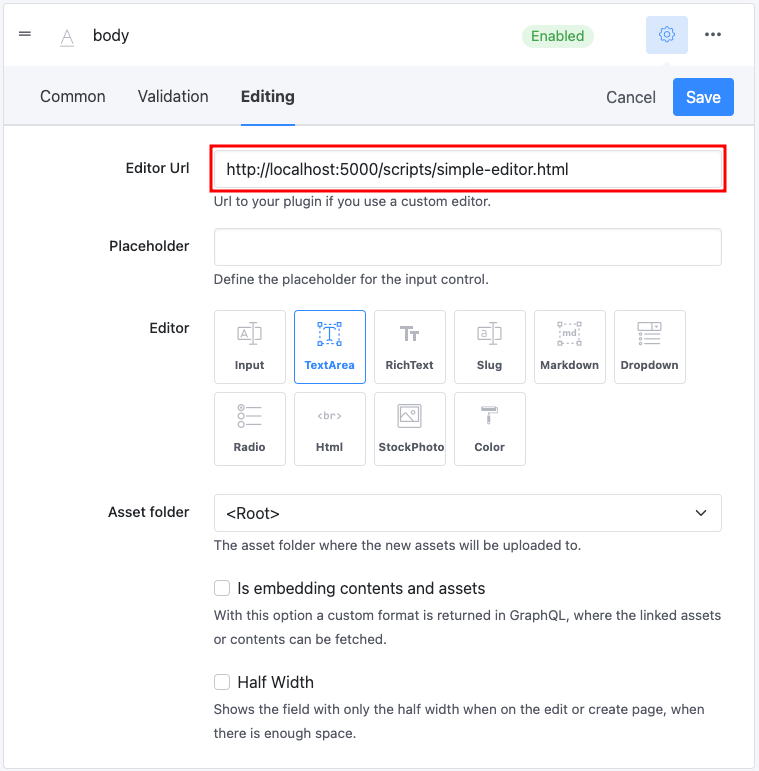
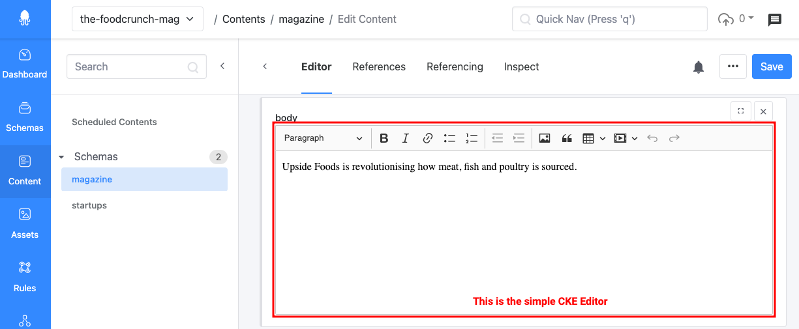
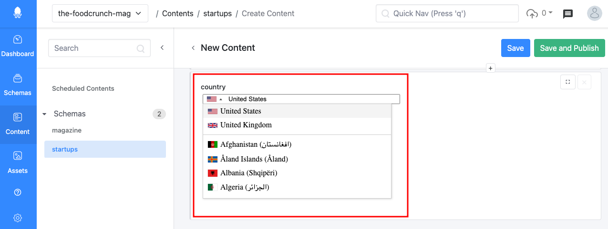
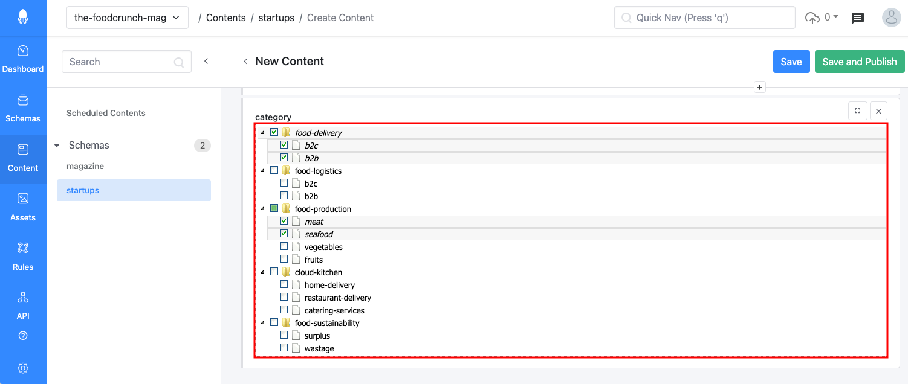
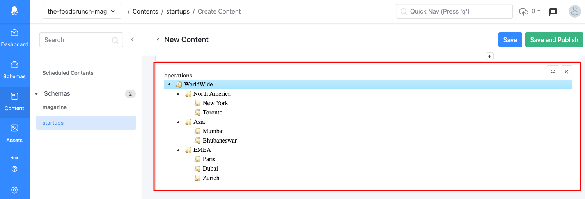
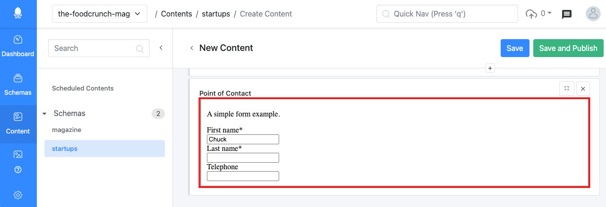
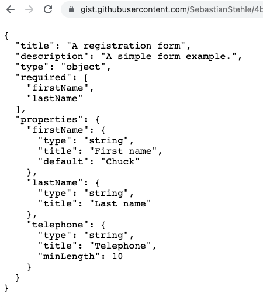

# Custom Editors

## How to Write Your Own Editor

Custom editors enable developers to replace the default editors with HTML5 applications so that the editing experience of the Squidex Web App can be customized.

Technically speaking, a UI editor lives in a sandboxed `iframe`,which interacts with the web application through a small SDK using messaging. This SDK is a proxy of the Angular [ControlValueAccessor](https://angular.io/api/forms/ControlValueAccessor), without having the dependencies of Angular itself.

<div align="left">

<figure><figcaption><p>Using an custom editor for a field</p></figcaption></figure>

</div>

Let's take a look at what the code looks like:

```markup
<!DOCTYPE html>
<html>

<head>
    <meta charset="utf-8">

    <!-- Load the editor sdk from the local folder or https://cloud.squidex.io/scripts/editor-sdk.js -->
    <script src="editor-sdk.js"></script>
    <script src="https://cdn.ckeditor.com/ckeditor5/10.0.0/classic/ckeditor.js"></script>

    <style>
        .ck-editor__editable {
            min-height: 250px;
        }
    </style>
</head>

<body>
    <textarea name="content" id="editor"></textarea>

    <script>
        var element = document.getElementById('editor');
        ClassicEditor
            .create(element)
            .catch(error => {
                console.error(error);
            })
            .then(editor => {
                // When the field is instantiated it notified the UI that it has been loaded.
                var field = new SquidexFormField();
                // Handle the value change event and set the text to the editor.
                field.onValueChanged(function (value) {
                    if (value) {
                        editor.setData(value);
                    }
                });
                // Disable the editor when it should be disabled.
                field.onDisabled(function (disabled) {
                    editor.set('isReadOnly', disabled);
                });
                editor.model.document.on('change', function () {
                    var data = editor.getData();
                    // Notify the UI that the value has been changed. Will be used to trigger validation.
                    field.valueChanged(data);
                });
                editor.ui.focusTracker.on('change:isFocused', function (event, name, isFocused) {
                    if (!isFocused) {
                        // Notify the UI that the value has been touched.
                        field.touched();
                    }
                });
            });
    </script>
</body>

</html>
```

You just have to reference the editor SDK and handle the events. You also have to push the current value to the web application whenever it changes. Validation will then happen automatically.

## API

The `SquidexFormField` class is the entry point to your editor.

Create a new instance when your editor is initialized.

### Methods

<table><thead><tr><th width="355">Name</th><th>Description</th></tr></thead><tbody><tr><td><code>editor.getValue()</code></td><td>Gets the current value of the field.</td></tr><tr><td><code>editor.getContext()</code></td><td>Gets the current context information. More about that later.</td></tr><tr><td><code>editor.getFormValue()</code></td><td>Gets the current value of the content form. Can be used to access the values of other fields.</td></tr><tr><td><code>editor.getLanguage()</code></td><td>Get the language of the field editor. If the field is not localized the master language is passed through.</td></tr><tr><td><code>editor.getIndex()</code></td><td>Get the index of the array item when the field is used within an array schema field.</td></tr><tr><td><code>editor.isDisabled()</code></td><td>Get the current disabled state of the field form. Disabled (<code>true</code>) or Enabled (<code>false</code>).</td></tr><tr><td><code>editor.isFullscreen()</code></td><td>Get the current fullscreen state of the field form. Fullscreen on (<code>true</code>) or off (<code>false</code>).</td></tr><tr><td><code>editor.touched()</code></td><td>Notifies the control container that the editor has been touched, must be called when your custom editor looses the focus.</td></tr><tr><td><code>editor.clean()</code></td><td>Cleanup the editor. Usually it is not needed to call this method.</td></tr><tr><td><code>editor.onInit(cb)</code></td><td>Register a function that is invoked when the messaging communication with the management UI is established. After the callback is invoked you get retrieve values with the get methods. The context object will be passed to the callback.</td></tr><tr><td><code>editor.onDisabled(cb)</code></td><td>Register a function that is invoked whenever the editor should either be enabled or disabled. A boolean value will be passed with either <code>true</code> (disabled) or <code>false</code> (enabled).</td></tr><tr><td><code>editor.onMoved(cb)</code></td><td>Registers a function that is invoked whenever the editor has been moved within an array item. A number will passed to the function that represents the index, starting with 0.</td></tr><tr><td><code>editor.onValueChanged(cb)</code></td><td>Register a function that is invoked whenever the value of the field has changed. The value will be passed to the callback as argument.</td></tr><tr><td><code>editor.onFormValueChanged(cb)</code></td><td>Register a function that is invoked whenever the value of the content form has changed. The value will be passed to the callback as argument.</td></tr><tr><td><code>editor.onLanguageChanged(cb)</code></td><td>Register a function that is invoked whenever the language of the field is changed, because in same cases the editor is shared between languages. If the field is not localized the master language is passed through.</td></tr><tr><td><code>editor.onFullscreen(cb)</code></td><td>Register a function that is invoked whenever the fullscreen mode is changed. The function has one argument with the the fullscreen mode.</td></tr><tr><td><code>editor.navigate(url)</code></td><td>Navigates the Management UI to a new URL. Because the plugin is integrated as an iframe, you cannot use normal links as it would only change the URL within the iframe and not the URL of the Management UI.</td></tr><tr><td><code>editor.toggleFullscreen()</code></td><td>Toggle the fullscreen mode and sends the current state to the management UI. The field editor is destroyed and recreated because it has to be moved inside the DOM. Therefore <code>onInit</code> is invoked again.</td></tr><tr><td><code>editor.notifoInfo(text)</code></td><td>Shows an info notification with the given text.</td></tr><tr><td><code>editor.notifoError(text)</code></td><td>Shows an info notification with the given text.</td></tr><tr><td><code>editor.pickAssets(cb)</code></td><td>Shows the dialog to pick assets and invokes the callback with an array of the selected assets when the dialog is closed. If no asset is selected an empty array will be passed to the callback.</td></tr><tr><td><code>editor.confirm(title, text, cb)</code></td><td>Shows a confirm dialog with the given title and text and invokes the callback when the confirm or cancel button has been pressed or when the dialog is closed otherwise. The result will be passed to the dialog as boolean.</td></tr></tbody></table>

### Context

The context object contains application information, such as the username and access token.

Example:

```javascript
{
  "user": {
    "user": {
      "id_token": "TOKEN",
      "session_state": "TOKEN",
      "access_token": "TOKEN", // Access Token
      "token_type": "Bearer",  // Access Token Type
      "scope": "openid profile email squidex-profile role permissions squidex-api",
      "profile": {
        "s_hash": "Wn3eHEjfi65aLx-KioJ53g",
        "sid": "-S7htcpBlnhNKfBXLhl1rg",
        "sub": "5dc32104ebc77a363cca0e0c", // User Id
        "auth_time": 1573240790,
        "idp": "Google",
        "amr": [
          "external"
        ],
        "urn:squidex:name": "USERNAME",
        "urn:squidex:picture": "URL",
        "urn:squidex:permissions": "squidex.admin.*",
        "email": "hello@quidex.io",
        "email_verified": false
      },
      "expires_at": 1573405262
    }
  },
  "apiUrl": "http://localhost:5000/api",
  "appName": "my-app"
}
```

You can use `apiUrl`, `access_token` and `token_type` to retrieve additional information from the API, for example, when you build a special editor to manage references or assets.

## Example editors

Squidex contains a few example editors that can help you to understand the flow, for example:

* [https://cloud.squidex.io/scripts/editor-context.html](https://cloud.squidex.io/scripts/editor-context.html): Demonstrates the structure of the context object by displaying the JSON representation in a text field.
* [https://cloud.squidex.io/scripts/editor-combined.html](https://cloud.squidex.io/scripts/editor-combined.html): Demonstrates how to use the values of the other fields to calculate the value of the current field.
* [https://cloud.squidex.io/scripts/editor-log.html](https://cloud.squidex.io/scripts/editor-log.html): Demonstrates the different callbacks by logging them in the browser console.
* [https://cloud.squidex.io/scripts/editor-simple.html](https://cloud.squidex.io/scripts/editor-simple.html): Demonstrates how to integrate the CKE editor into Squidex.

## All Examples

There are more example that you can use on your Apps:

### 1. Simple CKE Editor

Required Field Type: `string`

Reference: [https://squidex.github.io/squidex-samples/editors/cke-simple.html](https://squidex.github.io/squidex-samples/editors/cke-simple.html)

<div align="left">

<figure><figcaption><p>Example of a field using the simple CKE editor</p></figcaption></figure>

</div>

Clone the sample and configure the CKE editor as you need it.

### 2. Country Selector

Required Field Type: `string`

Reference: [https://squidex.github.io/squidex-samples/editors/country-selector.html](https://squidex.github.io/squidex-samples/editors/country-selector.html)

Let's assume in the _FoodCrunch_ use case, that a field needs to be added with the information about the country the startup is from. This can be achieved using the country selector editor:

<div align="left">

<figure><figcaption><p>Country selector editor</p></figcaption></figure>

</div>

### 3. Product Taxonomy

Required Field Type: json

Reference: [https://squidex.github.io/squidex-samples/editors/startups-category.html](https://squidex.github.io/squidex-samples/editors/tags-category.html)

The data format is a list of URL like paths for each product category that will be converted to a tree structure. An example for food startups category is listed below:

```javascript
[
  "/food-delivery/b2c/",
  "/food-delivery/b2b/",
  "/food-logistics/b2c/",
  "/food-logistics/b2b/",
  "/food-production/meat/",
  "/food-production/seafood/",
  "/food-production/vegetables/",
  "/food-production/fruits/",
  "/cloud-kitchen/home-delivery/",
  "/cloud-kitchen/restaurant-delivery/",
  "/cloud-kitchen/catering-services/",
  "/food-sustainability/surplus/",
  "/food-sustainability/wastage/"
]
```

Citing the _FoodCrunch_ use case again, let's say there's need to use a taxonomy to tag startups based on their operations:

<div align="left">

<figure><figcaption></figcaption></figure>

</div>

### 4. JSON Tree

Required Field Type: `json`

Reference: [https://squidex.github.io/squidex-samples/editors/jstree-editor.html](https://squidex.github.io/squidex-samples/editors/jstree-editor.html)

Create a visual tree for a JSON object. For example, one of the food startups wants to show a visual tree of the locations they operate in around the world:

<div align="left">

<figure><figcaption><p>JSON Tree</p></figcaption></figure>

</div>

### 5. JSON Schema Editor

Required Field Type: `string`

Reference: [https://squidex.github.io/squidex-samples/editors/react-jsonschema.html](https://squidex.github.io/squidex-samples/editors/react-jsonschema.html#https://gist.githubusercontent.com/SebastianStehle/4bb9ef57258dd95e98a19d738fdc9c2b/raw/52112bc67905f27b6f6d7754bf2e40dc40646087/schema.json)

This editor downloads the JSON schema from the URL that is defined via the URL fragment (everything after #):

[https://squidex.github.io/squidex-samples/editors/react-jsonschema.html#https://gist.githubusercontent.com/SebastianStehle/4bb9ef57258dd95e98a19d738fdc9c2b/raw/52112bc67905f27b6f6d7754bf2e40dc40646087/schema.json](https://squidex.github.io/squidex-samples/editors/react-jsonschema.html#https://gist.githubusercontent.com/SebastianStehle/4bb9ef57258dd95e98a19d738fdc9c2b/raw/52112bc67905f27b6f6d7754bf2e40dc40646087/schema.json)

<div align="left">

<figure><figcaption><p>JSON Schema from external URL</p></figcaption></figure>

</div>

<div align="left">

<figure><figcaption><p>JSON schema used in the example above</p></figcaption></figure>

</div>
