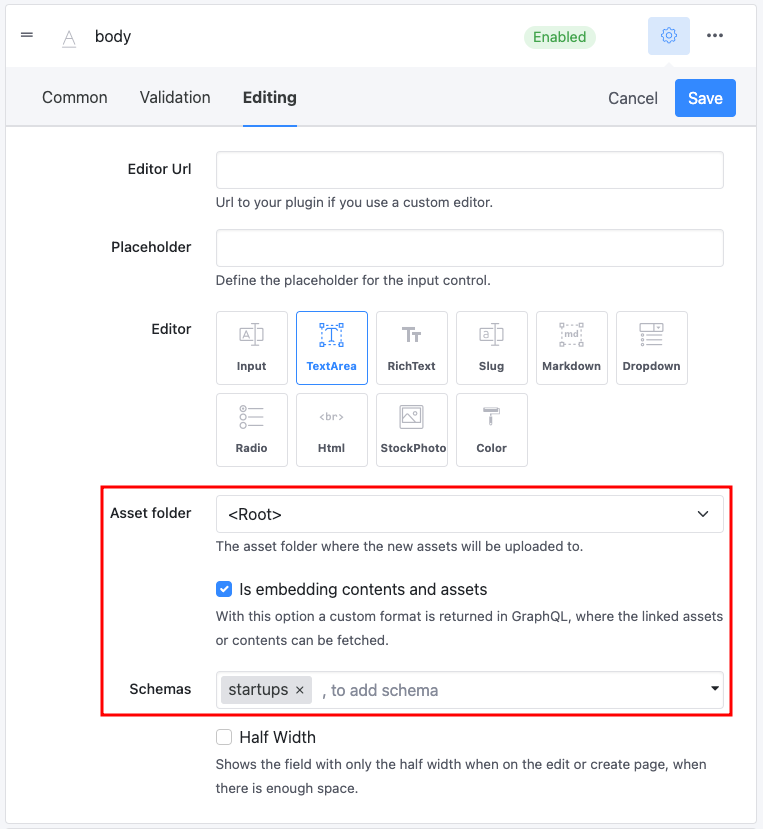

# Embed Content

## Use Case

Let's consider our _FoodCrunch_ use case, which is a new magazine for food startups. When a content author writes an article about new food startups or a review for a product sold by a startup, they might want to add startup information to the article. As the article is unstructured and just Markdown or rich-text, there are limited options mentioned below and none of them really work:

1. The author can copy and paste the startup information to the article. When the information about the startup is updated at a later date, the article will contain outdated information.
2. It's possible to use a special placeholder in the Markdown to reference the startup and ask the developers to resolve this reference in the UI.
3. The developers can build a complex schema, for example with arrays to structure the article.

As none of the options are practical and convenient, this feature has been added.

## How to Use Embedded Contents

To use this feature follow the steps below:

### 1. Define Which Schemas Can be Embedded

When you create a string field, you can decide which schemas can be embedded.

<figure><figcaption><p>Embedding schemas</p></figcaption></figure>

In this case, we only allow embedding for the `startups` schema.

### 2. Add Links to Your String Field

We can now use the Markdown editor to add links to other content items:

.png>)

### 3. Use the GraphQL to Fetch References

Use the new GraphQL structure to fetch the text and references. When you allow embedding, the structure of the GraphQL response changes and you can fetch the text and the references with a single request:

.png>)

### 4. Use the References to Render the Embedded Content

In the frontend both of the pieces of information can be used together to render the embedded content. In this sample code we've used react and react-markdown for this purpose. We can hook into the rendering process and render custom components for links.

At this point, it's important to check if the link is referencing  a content item and if this content item is part of the references. Then it's possible to render the startup.


```javascript
const startupsRegex = new RegExp(`${CONFIG.url}\\/api/content\\/${CONFIG.appName}\\/startups/(?<id>[a-z0-9\\-]+)`);

export const Markdown = ({ markdown, references }) => {
    return (
        <ReactMarkdown children={markdown} components={{
            a({ href, children }) {
                const match = startupsRegex.exec(href);

                if (match && match.groups) {
                    const referenceId = match.groups.id;
                    const reference = references?.find(x => x.id === referenceId);

                    if (reference) {
                        return <EmbeddableStartup startup={reference} />;
                    }
                } 
                
                return <a href={href} target='_blank' rel='noopener noreferrer'>{children}</a>;
            }
        }} />
    )
}s
```


As Markdown is unstructured  a regular expression must be used for this. The result is an article with embedded startup information.

This feature gives the content authors a lot more flexibility and simplifies the schemas in question.

### Examples

A sample for this feature is available in GitHub: [https://github.com/Squidex/squidex-samples/tree/master/jscript/react/sample-hotels](https://github.com/Squidex/squidex-samples/tree/master/jscript/react/sample-hotels).&#x20;


This sample does not use the _FoodCrunch_ use case but can be used as a reference to understand how it is implemented.


The template for the schemas and sample content is also available under: [https://github.com/Squidex/templates/tree/main/sample-hotels](https://github.com/Squidex/templates/tree/main/sample-hotels)
