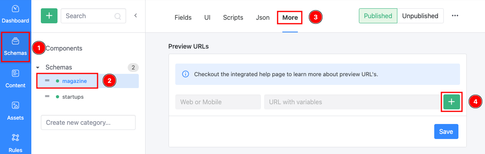
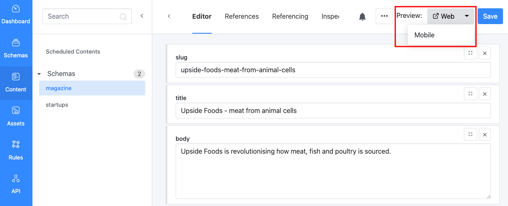

# Preview Content

By default, Squidex only delivers content that has been published. But it is beneficial to review the content in your production or staging environment before actually publishing it. This guide shows how you can use Preview URLs to do it.

## The problem statement

A traditional content management systems typically has a WYSIWYG (what you see is what you get) editor or other editing functionality where the editor can edit the content directly and understands how and where the content is used.&#x20;

This is a challenge for a headless CMS, because of the following reasons:

1. There might be more than one place where a content item is used. For example, multiple websites or multiple applications (e.g. mobile apps).
2. The frontend is not controlled or created by the headless CMS. Therefore, it cannot provide direct WYSIWG functionality and inline editing in general is tricky.
3. Sometimes a content item has to go through multiple steps until it is published to a website. For example, when you have a complex workflow with several review steps or when the publishing process takes very long due to technical challenges.

Squidex cannot solve all these problems. But with a little bit help from the frontend developers it can make the lives easier for content editors.

### Solutions

We have several solutions that work together to solve the challenges. They are are best described as through use cases.

1. **Use Case 1: Show unpublished content items.** \
   As a content editor I want to preview the content item even if it is not published or reviewed yet, to check if it looks correct and well formatted in the production environment.
2. **Use Case 2: Link to the usage of a content item.**\
   ****As a content editor I want to see all locations where a content item is used when I edit the content item in the Squidex Management UI.
3. **Use Case 3: Link to the source of a content item**\
   As a content editor I want to see which parts of the website come from Squidex and how I can edit them in the Squidex Management UI.

## Use Case 1: Show unpublished content items

By default Squidex only provides published content items over the API, because the purpose is to only deliver finished content items that have followed a defined workflow.

But this means that a content editor cannot preview content items while he still edits them. Even if he would know where a content item would be used he cannot see it, because the application only gets published content items.

To solve this challenge, Squidex provides a special header.

Add the `X-Unpublished = 1` header to all requests to retrieve unpublished content items.


You will receive all content items, even if they are in a state that is not needed. For example when they are in Archive state or a custom state that indicates that a content item should not be used anymore. Therefore you might want to add a filter to your query to filter out these content items.


Of course we do not want to show unpublished content items to the end users. Therefore it makes sense to use the header conditionally. The condition could depend on the user, environment or just a secret setting.

* You can show unpublished content items in a development or staging version of your website where you test new features.
* Use a login system and distinguish end users from content editors, you can then show unpublished content items for content editors only.
* When you neither have a login system nor a staging environment, you could just introduce a secret setting, for example a query string parameter to enable unpublished content items.

For the Squidex website we have just added a "top secret" query parameter to the blog page. When this query parameter is set to true, it will create add this header to the requests.

The following example shows how you can implement this it with the C# client library:

```csharp
public BlogPost Post { get; set; }

public async Task<IActionResult> OnGet(string slug, bool secretQueryParameter = false)
{
    var postsClient = clientManager.GetClient<BlogPost, BlogPostData>("blog");

    var context = QueryContext.Default.Unpublished(secretQueryParameter);

    var posts = await postsClient.GetAsync(filter: $"data/slug/iv eq '{slug}'", context);
    var post = pages.Items.FirstOrDefault();

    if (post == null)
    {
        return NotFound();
    }

    Post = post;

    return Page();
}
```

## Use Case 2: Link to the usage of a content item

For each content item you can define preview URLs. These are just normal links that point to the place where a content item is used. If you have multiple environments or frontends you can also define multiple preview URLs.

### Define your Preview URLs

You can define preview URL per schema in the following menu item:

1. Go to **Schemas** (1) and select your **schema** (2).
2. Select the **More** tab (3)
3. Under **Preview URLs** section (4) click **+** (5) to add Preview URLs.

<figure><figcaption><p>Navigating to Preview URLs</p></figcaption></figure>

The following example shows 2 preview URLs:

1. The URL to the normal website.
2. The URL to an dedicated mobile website (just an example).

 (1).png>)

As you can see, a placeholder can be used with the JavaScript interpolation syntax, e.g.

1. `${id}` of the content.
2. `${data.slug}`: Slug field (if not localized).
3. `${data.slug.iv}`: Slug field, alternative syntax.
4. `${data.title.en}`: Title in English
5. `${data.title.en-US}`: Title in American English
6. `${version}`: Version of the content item.

If you use a query string to enable unpublished content items, you should also add it to the URL.

### Use the preview button

If you open a saved content item, you will see the buttons with the preview URLs:

<figure><figcaption><p>Accessing the Preview button</p></figcaption></figure>

## **Use Case 3: Link to the source of a content item**

The following screenshot from the Squidex website describes this feature best. The idea is to annotate content items on your website so that we can provide links to the Squidex Management UI where you can edit them.

 (1) (1).png>)

As mentioned above Squidex has no control over your website, therefore you have to make a few changes to implement this feature.

### Add the Embed SDK script

This script is a little helper that provides the functionality. You have to add a script tag that points to [https://cloud.squidex.io/scripts/embed-sdk.js](https://cloud.squidex.io/scripts/embed-sdk.js). If you have installed Squidex on your own servers the URL is in general: `https://YOUR_DOMAIN/scripts/embed-sdk.js`.

Just add the script tag at the end of your `body` tag. This ensures that more important assets are loaded first and your website is as fast as possible.

The script is very small and has only **8.5kB** at the moment, so it is not a problem to include it for all users. But if you want to optimize it further you can implement one of the mechanisms described under "Use Case 1".

```html
<!DOCTYPE html>
<html>

<head>
    ...
</head>

<body>
    ...
    <script src="https://cloud.squidex.io/scripts/embed-sdk.js"></script>
</body>

</html>
```

The script works as follows:

1. When the user moves the mouse cursor over an element, the scripts tests whether this element or a parent element is annotated (more about this later).&#x20;
2. The annotation also contains information about the URL of the Squidex installation. This URL is used to test whether the current user is authenticated in the Squidex Management and to maintain a list of known Squidex URLs.
3. If the user is authenticated and the element is annotated it the scripts renders the blue border with links to the Squidex Management UI as long as the cursor is not moved away from the element.
4. When the user moves the mouse cursor over an image the scripts checks whether the source of the image matches to one of the Squidex URLs and if the user is authenticated. If both conditions are met a blue border is rendered around the image as long as the cursor is not moved away from the image.


The check whether a user is authenticated it was necessary to make a few changes how cookies are used. Therefore it might not work for you if you are already logged in to the Squidex Management UI. Try to logout and login again to get the correct cookie.


### How to annotate elements?

When you query content items from the Squidex API you also get an edit token for each item.

.png>)

Just annotate your elements with the edit token, for example you can show a list of blog posts like this. The actual template syntax might look different.

```html
<div class="posts">
   @foreach (var post in Posts)
   {
      <div class="post" squidex-token={@post.EditToken}>
          <h3>{post.data.title.iv}</h3>
          
          <p>{post.data.content.iv}</p>
      </div>
   }
</div>
```

### Structure of an Edit token

The edit token is just a base64-encoded JSON object.

The property names are shortened to keep the edit token as small as possible. If necessary you can also create the token manually.

#### Contents

```json
// eyJhIjoic3F1aWRleC13ZWJzaXRlIiwicyI6ImJsb2ciLCJpIjoiZWZmNGU3N2UtZDM3Zi00Zjk3LTk4YzUtZjAxYjRmYzRjNzkwIiwidSI6Imh0dHBzOi8vY2xvdWQuc3F1aWRleC5pby8ifQ==
{
   "a":"squidex-website",                      // App Name
   "s":"blog",                                 // Content Schema
   "i":"eff4e77e-d37f-4f97-98c5-f01b4fc4c790", // Content ID
   "u":"https://cloud.squidex.io/"             // Squidex Base URL
}
```

#### Assets

```json
// eyJhIjoic3F1aWRleC13ZWJzaXRlIiwiaSI6ImFjNWVlOTE5LWE1NDQtNDVjNC1iZmQ2LWY4YTk2MDcwMWJiNCIsInUiOiJodHRwczovL2Nsb3VkLnNxdWlkZXguaW8vIn0=
{
   "a":"squidex-website",                      // App Name
   "i":"ac5ee919-a544-45c4-bfd6-f8a960701bb4", // Asset ID
   "u":"https://cloud.squidex.io/"             // Squidex Base URL
}
```


The script can detect assets automatically if the asset URL is coming from a known URL. This is useful if the image tag is rendered because you use a HTML or Markdown field and you have no direct control over how images are rendered on your website.&#x20;


