# Building a Blog with Squidex and Next.js

### Introduction

This tutorial guides on creating a blog application, setting up its schema and adding mock content on Squidex. Then, the guide demonstrates how to create a Next.js blog based on the data stored in a CMS.

## Prerequisites

Here's what's needed to complete this guide:

* A Squidex account. Create an account here: [https://cloud.squidex.io](https://cloud.squidex.io).
* Node.js installed on a computer. Follow this guide to install [Node.js](https://phoenixnap.com/kb/install-node-js-npm-on-windows) if it is not yet installed.

## Step 1: Creating the App on Squidex

In Squidex, an application is an isolated data store with schemas that defines how its content is structured along with API end points to query its content. Visit [this page](https://docs.squidex.io/02-documentation/concepts/apps) of the Squidex docs to learn more about Apps in Squidex.

Start by logging into the Squidex account dashboard at [https://cloud.squidex.io/](https://cloud.squidex.io). Click **New App** (1) to create an empty application. Enter a unique **Name** (2) for the App in the space provided and click **Create** (3) to create the App. For the purposes of this guide, the Squidex application name is _squidex-blog_.


App names in Squidex cloud are global, which is why the name must be unique. Add name initials or a word to make it unique.


<figure>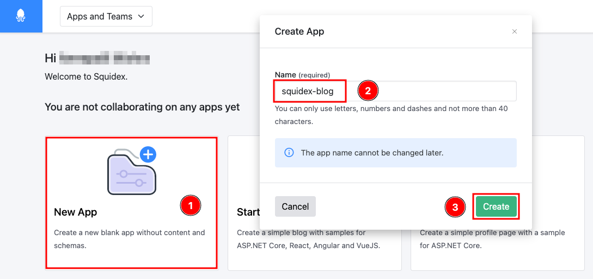<figcaption><p>Create an empty app</p></figcaption></figure>

## Step 2: Creating the Posts schema on the CMS

Now that the App is created on Squidex, let's start creating the schema for the blog application. This schema will define the structure of the blog content.

On the Squidex dashboard, click _squidex-blog_ (or whichever name you've used) to enter the dashboard for the newly created App.

<figure>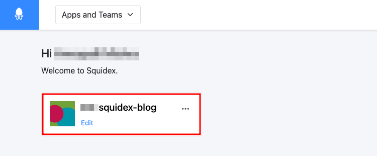<figcaption><p>Select the new app</p></figcaption></figure>

On the left panel, select **Schemas** (5) and click the **Plus(+)** (6) button to start creating the `posts` schema. Enter `posts` in the space provided under **Name** (7), select **Multiple contents** (8) as there will be multiple posts and click **Create** (9) to create the schema.

<figure>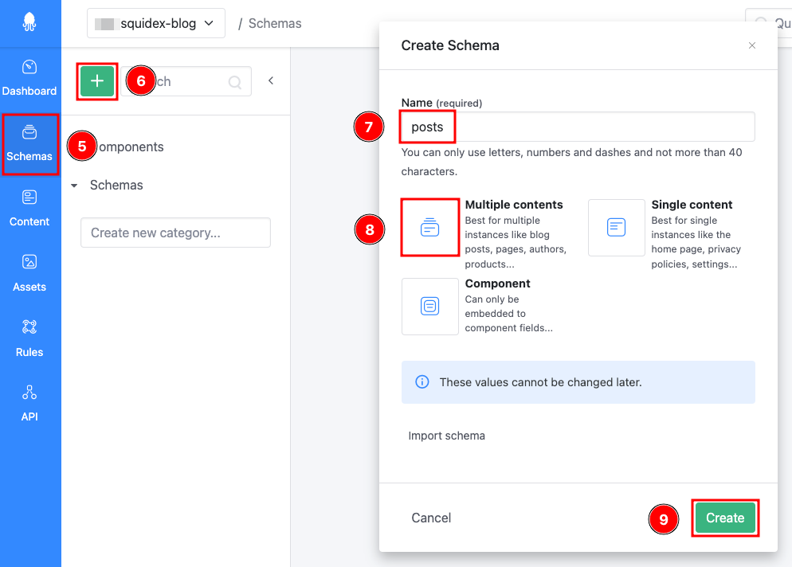<figcaption><p>Create the 'posts' schema</p></figcaption></figure>

The posts schema will have 3 fields, i.e. `Title` for the title of posts, `Slug` to define the URL of posts, and `Content` to contain the body of the blog posts.

| Field name | Type   | Editor   |
| ---------- | ------ | -------- |
| Title      | String | Input    |
| Slug       | String | Slug     |
| Content    | String | Markdown |

Ensure you are in **Posts** (11) schema under **Schemas** (10) and click **+Add Field** (12) to start adding fields.&#x20;

<div align="left">

<figure>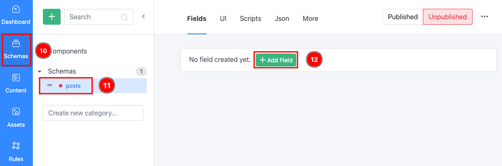<figcaption><p>Adding fields</p></figcaption></figure>

</div>

In the modal window, select **String** (13) enter `Title` (14) in the field provided and click **Create and edit field** (15) as shown below:

<div align="left">

<figure>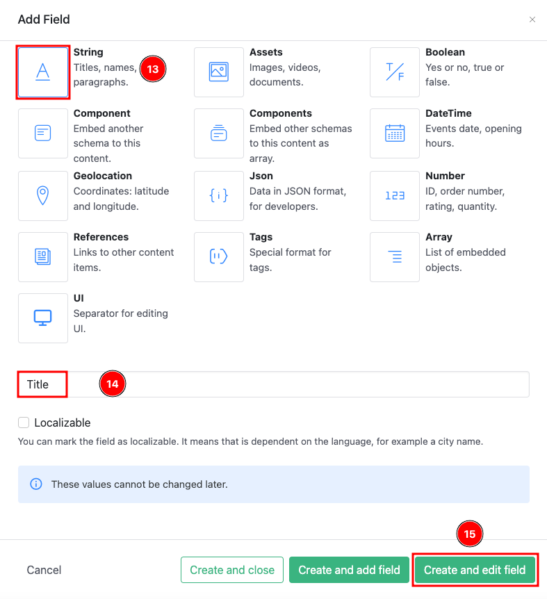<figcaption><p>Create the Title field</p></figcaption></figure>

</div>

Click the **Validation** (16) tab on the new modal window that opens up, then check **Required** (17). This is needed as every post must have a title, which is why it is a required / mandatory field. Click **Save and add field** (18) to save changes.

<div align="left">

<figure>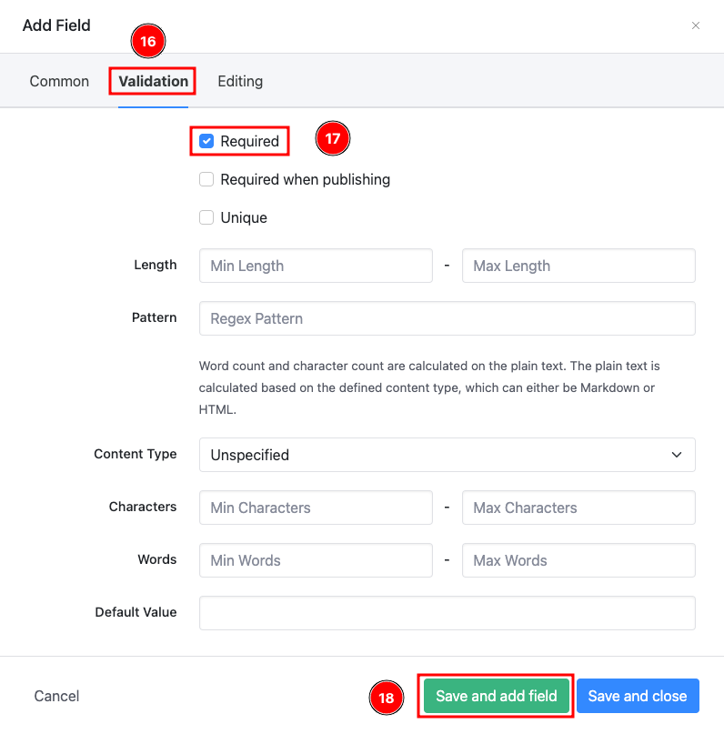<figcaption><p>Configure validation properties of title field</p></figcaption></figure>

</div>

Repeat the steps above to create the remaining two fields i.e, `Slug` and `Content`.&#x20;

The `Slug` field is configured as shown in the screenshots below:

<div align="left">

<figure>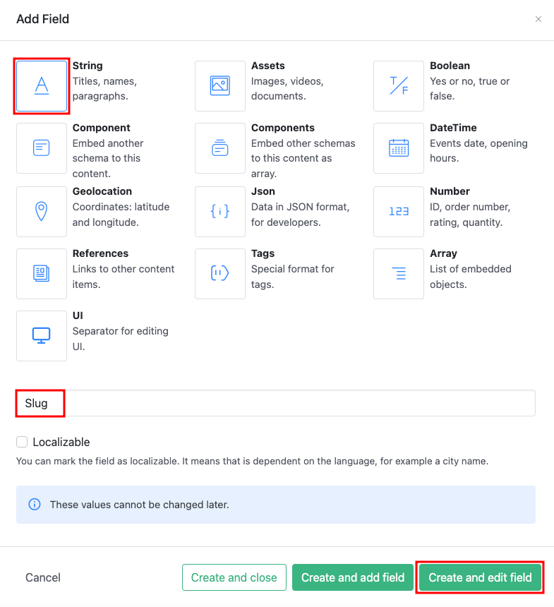<figcaption><p>Create slug field</p></figcaption></figure>

</div>

As every post must have a slug (and it has to be unique), complete the _Validation_ tab in the modal that opens as displayed below:

<figure>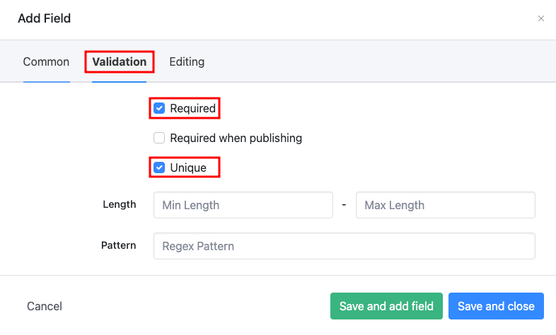<figcaption><p>Configure validation properties of slug field</p></figcaption></figure>

Finally, switch to the **Editing** tab and select **Slug** as the editor (as displayed below). The options in this _Editor_ section allow the choosing of a preferred editor to be used to edit a particular field. Click **Save and add field** to save the `Slug` field and proceed to add the `Content` field.

<div align="left">

<figure>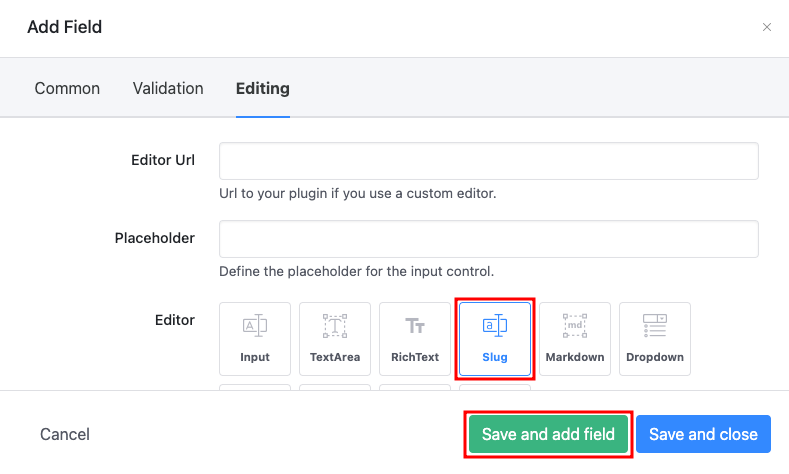<figcaption><p>Configure editing properties of slug field</p></figcaption></figure>

</div>


The third field, i.e the `Content` field is formatted as [Markdown](https://daringfireball.net/projects/markdown/) text. Configure the `Content` field as displayed below. Click **Create and edit field** to continue:

<div align="left">

<figure>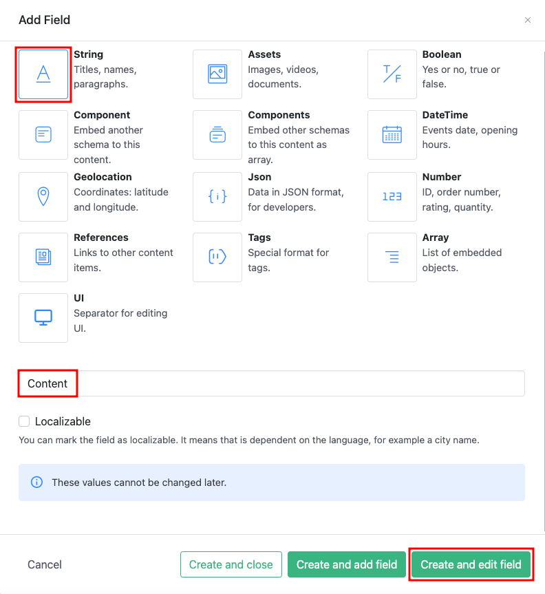<figcaption><p>Create Content field</p></figcaption></figure>

</div>

Set the `Content` field to use a WYSIWYG editor by configuring the Editor to **Markdown** in the **Editing** tab as displayed below. Click **Save and close** to save the changes to the `Content` field.

<div align="left">

<figure>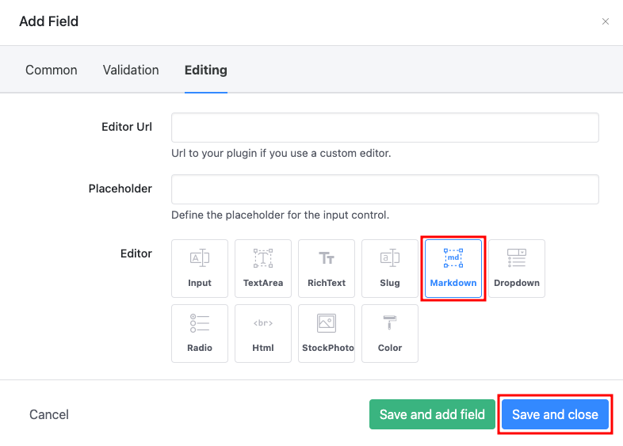<figcaption><p>Configure editing properties of content field</p></figcaption></figure>

</div>

The `posts` schema and its fields should now be completed. To  add content under the `posts` schema, it must be published. Click **Published** (situated on the top right corner of the page to do so).

<figure>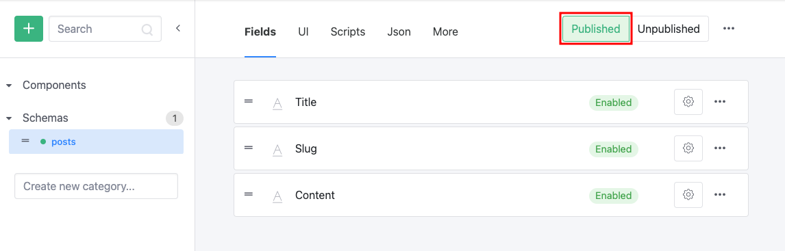<figcaption><p>Publishing the schema</p></figcaption></figure>

Now that the schema is published, sample content can be added to it which will be displayed once the blog is built.&#x20;

To add content, click **Content** (1) on the sidebar and select **posts** (2) if not already selected. Click **+New** (3) to create a new post.&#x20;

<figure>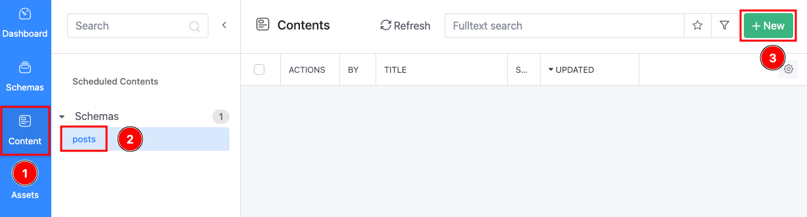<figcaption><p>Create a new post / content</p></figcaption></figure>

To transfer existing content to Squidex, just paste it here. It's also possible to manually enter some placeholders for the title, slug and content. Next, click **Save and Publish** (4) to publish the created content.&#x20;

<figure>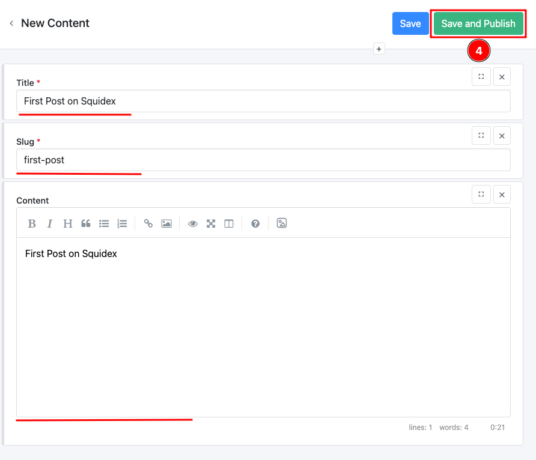<figcaption><p>Create content and publish</p></figcaption></figure>

Click the back icon to go back to the list of content for the posts' schema, click **+New** again and repeat the steps for as many posts as desired.

<figure>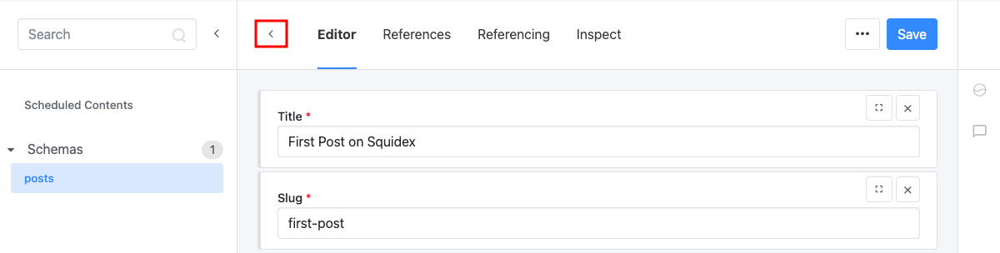<figcaption></figcaption></figure>

## Step 3: Setting Up the Next.js Workspace

Once the schema is created on Squidex, proceed to set up the Next.js workspace.

Open the terminal and run the following command to install Next.js and its dependencies.

```bash
npx create-next-app squidex-blog
```

If prompted to confirm installation of the create-next-App package, type `y` and press enter to continue with the installation.

Once Next.js is set up, run the following commands to enter the `squidex-blog` directory and start the development server.

```bash
cd squidex-blog
yarn dev
```

The `yarn dev` command starts a Next.js development server at `http://localhost:3000`. Visit `htttp://localhost:3000` to see the Next.js App. The text _Welcome to Next.js_ should appear on the page. This confirms successful installation of Next.js and that the system is ready to for a blog to be built.

## Step 4: Create Global Styles and a Layout Component

Start by creating a `Layout` component that adds a header and footer to all the pages of the blog. Create a `components` folder in `squidex-blog` and create a `layout.js` file in the `squidex-blog/components` folder with the following content:

```jsx
import Link from "next/link";

export default function Layout({ children }) {
  return (
    <div className="container">
      <div className="header">
        <Link href="/">
          <a className="blog-heading">My Blog</a>
        </Link>
      </div>
      {children}
      <div className="footer">
        <div>My Blog</div>
        <div>(c) 2022 </div>
      </div>
    </div>
  );
}
```

This creates a header and footer with a link to the blog's homepage. The `children` prop allows embedding of whatever content is added into the `Layout` component between the header and footer.

After creating the `Layout` component, replace the contents of the `squidex-blog/styles/globals.css` file with the following:

```css
html,
body {
  padding: 0;
  margin: 0;
  font-family: -apple-system, BlinkMacSystemFont, Segoe UI, Roboto, Oxygen, Ubuntu,
    Cantarell, Fira Sans, Droid Sans, Helvetica Neue, sans-serif;
}

.container {
  max-width: 800px;
  margin: 0 auto;
  padding: 1em;
}

.header {
  margin-top: 2em;
  margin-bottom: 4em;
}

.blog-heading {
  font-size: 2em;
  font-weight: bold;
  text-decoration: none;
  color: black;
}

.footer {
  margin: 4em auto;
  width: fit-content;
}

.blog-item {
  margin-top: 20px;
}

.blog-item-title {
  font-size: 2em;
  text-decoration: none;
  color: black;
}

.blog-title {
  font-size: 3em;
}
```

Now that the website's stylesheet has been modified, continue to modify the custom Next.js `App` component of the blog to wrap the application in a header and footer with the `Layout` component already created. In Next.js, a custom app component is used to add a consistent layout to App pages and to add global CSS to the App. Learn more about this by reading the [Custom App page of the Next.js documentation](https://nextjs.org/docs/advanced-features/custom-app).

Modify `_app.js` in `squidex-blog/pages` should have the the following content:

```jsx
import Layout from "../components/layout";
import "../styles/globals.css";

export default function MyApp({ Component, pageProps }) {
  return (
    <Layout>
      <Component {...pageProps} />
    </Layout>
  );
}
```

Visit `localhost:3000` (if you haven't already). The development server will rebuild the blog and you will be able to see the newly added header and footer.

Now that styles and a header and footer have been added to the application, proceed to set up authentication for requests to the Squidex API.

## Step 5: Preparing to Fetch Data From the Squidex API

To be able to fetch data from the Squidex App, create a client on Squidex.

Open the dashboard of the blog application(Squidex-blog or whatever name desired) from https://cloud.squidex.io. On the left sidebar, click the _Cog icon_ at the bottom left corner of the page to open up the settings. Under the _Security_ section click _Clients_. At the top of the page, there is a section where you can create a client. In the text box provided under _Add a New Client_, type `nextjs-blog` as the name of the client and click _Add Client_ to create the client. When scrolling down the page, notice a new `nextjs-blog` client has been created. By default, this new client comes with the Editor role. In Squidex, roles define which schemas a client has access to and which operations (such as reading and writing) a client is authorised to do. As there won't be any changes to your content from the blog's front end, change the role of the client to Reader, i.e. with read-only permissions. In the dropdown for _Role_, select _Reader_.

Normally, an access token is required to query the Squidex API, but as the blog application will only be reading data from Squidex (not editing or deleting), simply create an anonymous client. Check the _Allow Anonymous Access_ checkbox to allow this client to query published blog posts without an access token.

Now a new client has been created, and allowed anonymous access to published blog posts, create a file containing environment variables for the Next.js app. Create a `.env.local` file in the `squidex-blog` folder and add the following content:

```
SQUIDEX_API_URL=https://cloud.squidex.io/api/content/<YOUR_APP>/graphql
```

Replace `<YOUR_APP>` in the value of SQUIDEX\_API\_URL with the name of your own App on Squidex.

Next.js only loads data from the `.env.local` file once, when you start the development server. To load the environment variables created, restart the development server. Press the combination `Ctrl/CMD + C` on the terminal to stop the development server, then restart it by running the following:

```bash
yarn dev
```

Note the message in the terminal showing that environment variables have been loaded from `.env.local`. Visit the [Environment Variables page of the Next.js documentation](https://nextjs.org/docs/basic-features/environment-variables) to learn more about environment variables in Next.js. Now, proceed to create a helper function used to make GraphQL queries to Squidex.

Create a `lib` folder in `squidex-blog` and in this lib folder, create a `squidex.js` file. Add the following content to the `squidex-blog/lib/squidex.js` file:

```js
export default async function fetchAPI(query, { variables } = {}) {
  const res = await fetch(process.env.SQUIDEX_API_URL, {
    method: "POST",
    headers: {
      "Content-Type": "application/json",
    },
    body: JSON.stringify({
      query,
      variables,
    }),
  });
  const json = await res.json();

  if (json.errors) {
    console.error(json.errors);
    throw new Error("Failed to fetch API");
  }

  return json.data;
}
```

This exports a `fetchAPI` function that receives a GraphQL query and its variables (as parameters), queries the Squidex API and returns the result.

Next, fetch content from Squidex and display it in your Next.js blog.

## Step 6: Displaying Blog Posts on the Home Page

In this step, learn to fetch the titles and links of blog posts and display them on the homepage of your blog.

Replace the content of `squidex-blog/pages/index.js` with the following:

```jsx
import Head from "next/head";

export default function Home() {
  return (
    <div>
      <Head>
        <title>My blog</title>
        <link rel="icon" href="/favicon.ico" />
      </Head>
    </div>
  );
}
```

Open `http://localhost:3000` in your browser (if it is not already open), to continue previewing changes.

At the top of the `pages/index.js` file, import the `fetchAPI` utility from `squidex-app/lib/squidex`:

```js
import fetchAPI from "../lib/squidex";
```

Also in `index.js`, export a `getStaticProps` function defined as follows:

```js
export async function getStaticProps() {
  const data = await fetchAPI(`
  {
    queryPostsContents {
      id,
      flatData {
        title,
        slug,
      }
    }
  }
  `);
  return {
    props: {
      posts: data.queryPostsContents,
    },
  };
}
```

This sends a GraphQL query to your Squidex App to get the slugs and titles of all blog posts and returns this data to your page.

In Next.js, `getStaticProps` is a function that is run at build time to fetch and store data needed to render a page. To learn more about data-fetching with `getStaticProps` in Next.js, see [the getStaticProps page of the Next.js documentation](https://nextjs.org/docs/basic-features/data-fetching/get-static-props). Save the file and refresh the browser to fetch page data from the CMS.

To make this data available to the `Home` page component of `index.js`, pass posts as a prop to `Home` in index.js:

```js
export default function Home({ posts }) {
...
}
```

Although the title and slugs of your blog posts are now available to the `Home` component, they will not be rendered on the homepage. Create a `BlogItem` component that will be used to display and link to all of your posts.

Create a `blogItem.js` file in the `squidex-blog/components` folder with the following content:

```jsx
import Link from "next/link";

export default function BlogItem({ title, slug }) {
  return (
    <div className="blog-item">
      <Link href={slug}>
        <a className="blog-item-title">{title}</a>
      </Link>
    </div>
  );
}
```

To use `BlogItem` on the homepage, import it in `pages/index.js`.

```jsx
import BlogItem from "../components/blogItem";
```

And in the `Home` function in `index.js`, after the `Head` tag, add the following:

```jsx
<div className="blog-post-list">
  {posts.map((post) => (
    <BlogItem
      title={post.flatData.title}
      slug={post.flatData.slug}
      key={post.id}
    />
  ))}
</div>
```

This loops through blog posts and creates a link to each of them.

The completed `index.js` file will look like this:

```jsx
import Head from "next/head";
import fetchAPI from "../lib/squidex";
import BlogItem from "../components/blogItem";

export default function Home({ posts }) {
  return (
    <div>
      <Head>
        <title>My blog</title>
        <link rel="icon" href="/favicon.ico" />
      </Head>
      <div className="blog-post-list">
        {posts.map((post) => (
          <BlogItem
            title={post.flatData.title}
            slug={post.flatData.slug}
            key={post.id}
          />
        ))}
      </div>
    </div>
  );
}

export async function getStaticProps() {
  const data = await fetchAPI(`
  {
    queryPostsContents {
      id,
      flatData {
        title,
        slug,
      }
    }
  }
  `);
  return {
    props: {
      posts: data.queryPostsContents,
    },
  };
}
```

If you look at your blog homepage in a browser, note that the titles of posts are shown and they link to the page where the article can be read.

Now links to your posts have been successfully created, create a page to display the content of the blog posts.

## Step 7: Creating Blog Post Pages

In the `pages` folder, create a `[slug].js` file. In Next.js, a page is a React Component file in the pages directory. The component at pages/about.js, for example will be accessible at /about. A page enclosed in square brackets like \[slug].js is a fallback and Next.js will show this page for all URLs that are not handled by another page, and will pass a `slug` variable to the page. So when you visit a URL like /my-first-blog-post this page is used and `slug` will have the value my-first-blog-post.

You can learn more about this from the [dynamic routes page of the Next.js documentation.](https://nextjs.org/docs/routing/dynamic-routes).

```jsx
export default function BlogPost() {
  return <div>Body</div>;
}
```

Click one of the links on the homepage to visit the page where your blog posts will be rendered.

Since you will need to render markdown content on this page, you will install [next-mdx-remote](https://github.com/hashicorp/next-mdx-remote), a package that parses markdown content and renders it in your Next.js application. Stop the development server by pressing `Ctrl/Cmd + C` on your terminal and run the following command to install `next-mdx-remote`:

```bash
yarn add next-mdx-remote
```

Restart the development server after installation:

```
yarn dev
```

Import `serialize` and `MDXRemote` from `next-mdx-remote` at the top of `[slug].js`:

```jsx
import { serialize } from "next-mdx-remote/serialize";
import { MDXRemote } from "next-mdx-remote";
```

Import `fetchAPI` at the top of `[slug].js` as you will use it to fetch the contents your blog posts from Squidex:

```js
import fetchAPI from "../lib/squidex";
```

Export a `getStaticProps` function from `[slug].js`:

```js
export async function getStaticProps({ params }) {
  const data = await fetchAPI(
    `
  query QueryPosts($query: String!) {
    queryPostsContents(filter: $query) {
      id
      flatData {
        title
        content
      }
    }
  }
  `,
    {
      variables: {
        query: `data/Slug/iv eq '${params.slug}'`,
      },
    }
  );

  if (data.queryPostsContents.length === 0) {
    return {
      notFound: true,
    };
  }
  const post = data.queryPostsContents[0].flatData;

  const mdxSource = await serialize(post.content);

  return {
    props: {
      post: post,
      source: mdxSource,
    },
  };
}
```

This returns data for the blog post associated with a particular slug or returns a 404 error if no such post exists.

At this point, you may receive an error because when you use `getStaticPaths` with dynamic paths in Next.js, you are required to also export a `getStaticPaths` function that tells Next.js [what pages to generate at build time](https://nextjs.org/docs/basic-features/data-fetching#getstaticpaths-static-generation).

Export a `getStaticPaths` function in `squidex-blog/pages/[slug].js`:

```js
export async function getStaticPaths() {
  const data = await fetchAPI(`
  {
    queryPostsContents {
      id,
      flatData {
        slug
      }
    }
  }
  `);

  return {
    paths: data.queryPostsContents.map((post) => {
      return {
        params: {
          slug: post.flatData.slug,
        },
      };
    }),
    fallback: false,
  };
}
```

The Next.js development server only runs `getStaticProps` to fetch the page data when the page is initally loaded. So, to preview the changes made to `getStaticProps`, you will refresh the page. When you do so, the data will be made available but since it has not been rendered, nothing will be visible. You will now proceed to render the blog post on this page.

Modify the `BlogPost` function in `[slug].js`:

```jsx
export default function BlogPost({ post, source }) {
  return (
    <div>
      <h1 className="blog-post-title">{post.title}</h1>
      <MDXRemote {...source} />
    </div>
  );
}
```

Once you save the file, the title of the blog post and the body of the post will be rendered on the page. If you did not refresh the page after adding `getStaticProps`, you may see an error because the page data has not been loaded. Refresh the page to fetch data from your Squidex application.

The finished `[slug].js` file will look like this:

```jsx
import { serialize } from "next-mdx-remote/serialize";
import { MDXRemote } from "next-mdx-remote";
import fetchAPI from "../lib/squidex";

export default function BlogPost({ post, source }) {
  return (
    <div>
      <h1 className="blog-post-title">{post.title}</h1>
      <MDXRemote {...source} />
    </div>
  );
}

export async function getStaticProps({ params }) {
  const data = await fetchAPI(
    `
    query QueryPosts($query: String!) {
      queryPostsContents(filter: $query) {
        id
        flatData {
          title
          content
        }
      }
    }
    `,
    {
      variables: {
        query: `data/Slug/iv eq '${params.slug}'`,
      },
    }
  );

  if (data.queryPostsContents.length === 0) {
    return {
      notFound: true,
    };
  }
  const post = data.queryPostsContents[0].flatData;

  const mdxSource = await serialize(post.content);

  return {
    props: {
      post: post,
      source: mdxSource,
    },
  };
}

export async function getStaticPaths() {
  const data = await fetchAPI(`
    {
      queryPostsContents {
        id,
        flatData {
          slug
        }
      }
    }
    `);

  return {
    paths: data.queryPostsContents.map((post) => {
      return {
        params: {
          slug: post.flatData.slug,
        },
      };
    }),
    fallback: false,
  };
}
```

Congratulations! You have now built a fully functional blog in Next.js that sources data from Squidex.

## Conclusion

Now that you have built your blog with Next.js and Squidex, learn how to deploy your blog to a live site. Check out this page on [Deploying a Next.js site](https://nextjs.org/docs/deployment). You may also want to explore the [Next.js Head component](https://nextjs.org/docs/api-reference/next/head) to see how adding meta tags to your pages enables search engines to better understand your content.
