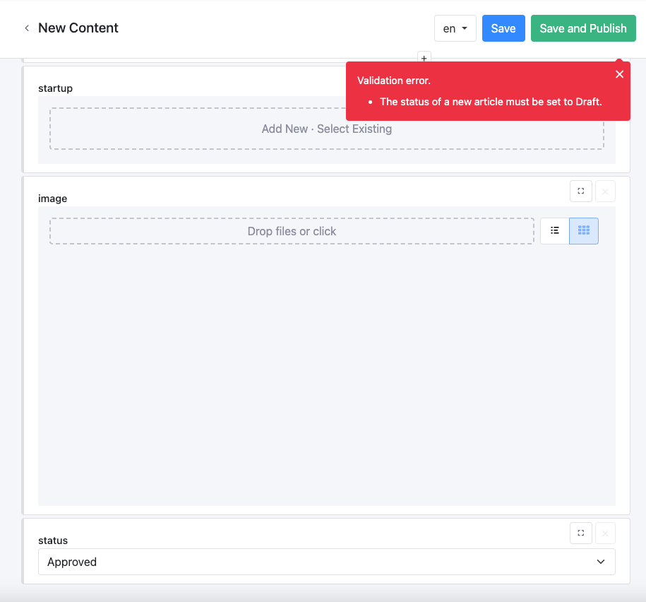

# Custom Workflows

This documentation is based on the _FoodCrunch_ use case. Please open the link below alongside this page to understand the examples.


[introduction-and-use-case.md](../introduction-and-use-case.md)



Custom workflows were implemented in 2019 and is mainly for older versions of Squidex. This guide will teach you how to implement custom workflows with permissions and scripting.

If you are up-to-date with your Squidex version, simply use the newer _Workflows_ feature. For more information visit the documentation for _Workflows_ linked below:

[workflows.md](../concepts/workflows.md "mention")


## Our Requirements

In our _FoodCrunch_ use case, we publish magazine articles and have a schema for it called `magazine`. In order to manage these articles we have three roles:

1. **Creators**: Write articles and when they are complete, they mark an article as `Ready`.
2. **Reviewers**: Review articles and either mark an article as `Approved` or `Rejected`.
3. **Publisher**: Decide when to publish an article and should only publish approved articles.

Therefore we have the following statuses for content:

1. `Draft`
2. `Ready`
3. `Approved`
4. `Rejected`
5. `Published`

The following diagram visualizes our workflow:

<div align="left">


</div>

## Step 1: Modify the Schema

In the first step we will modify the `magazine` schema to add a field called **Status** which displays the status of the article as a string field with a dropdown editor.

To do so, navigate to **Schemas** (1) in the App, select the **schema** i.e. `magazine` (2) and click **+ Add Field** (3).

<div align="left">

<figure><figcaption><p>Modify the magazine schema</p></figcaption></figure>

</div>

Select **String** (4) as the field type, enter **Name** (5) as `status` and click **Create and edit field** (6).

<div align="left">

<figure><figcaption><p>Create status field</p></figcaption></figure>

</div>

Select **Editing** (7), choose **Dropdown** (8) as the Editor type and add the _statuses_ in **Allowed Values** (9). Click **Save and close** (10) to finish editing the schema.

<div align="left">

<figure><figcaption><p>Change editor type and add allowed values.</p></figcaption></figure>

</div>

In the list view, the `magazine` schema will look something like this:

<div align="left">

<figure><figcaption><p>Magazine articles in list view with Status</p></figcaption></figure>

</div>

Now it's possible to easily see all the articles and their status. However, the reviewer will only be interested in the articles `Ready` to be reviewed. &#x20;

It's possible to search for these articles using the following query: `$filter=data/status/iv eq 'Ready'`

<div align="left">

<figure><figcaption><p>Query articles with status 'Ready' </p></figcaption></figure>

</div>

It looks a little technical, but reviewers shouldn't worry about this! The query can be **saved** (1) and given a friendly **name** (2), so it can be reused later on.&#x20;

<div align="left">

<figure><figcaption><p>Save a query</p></figcaption></figure>

</div>

To retrieve the query, click **Filters** from the side bar.

<div align="left">

<figure><figcaption><p>View saved queries</p></figcaption></figure>

</div>

The basic setup is already complete and might work well enough in a small team. It requires a little  discipline and co-operation from all team members. However, if there is critical content such as product texts or there's a large team where it's difficult to rely on other people, it's a good idea to use some rules to ensure that the workflow is utilized correctly. &#x20;

It's also possible to use the new comments feature to share information between reviewer and writer:

<div align="left">

<figure><figcaption><p>Using Comments feature</p></figcaption></figure>

</div>

## Step 2: Enforcing the Workflow

Start by creating the Creator and Reviewer roles in Squidex:

<div align="left">

<figure><figcaption><p>Creator role permissions</p></figcaption></figure>

</div>

<figure><figcaption><p>Reviewer role permissions</p></figcaption></figure>

As you can see in the screenshot above, the **Creator** can only create and update content, but cannot publish it and the **Reviewer** can only update content. Let's use the default role **Editor** for the **Publisher**.

So, the problem of just the Publisher being able to publish and unpublish content is solved, but there is still something left to do.

We have to ensure that:

1. The **Creator** must set the initial status to `Draft`.
2. The **Creator** can only change the status to `Ready`.
3. The **Creator** can only update an article when the status is `Draft` or `Rejected`.
4. The **Reviewer** can only change the status to `Approved` or `Rejected`.
5. The **Publisher** can only set the status to `Published`.
6. The **Publisher** can only publish the content when its status is `Published` (to be consistent).

Not everything is shown in this tutorial, as there is too much information and the solution is the same for all roles, but let's see how to implement this for the **Creator**.

The solution is scripting. If you click the three dots in the schema editor, a menu will pop up with a menu item to the scripting editor. Here you can define scripts that are invoked when a content item is queried, created, updated, deleted or when a status has changed.

<div align="left">

<figure><figcaption><p>Scripting</p></figcaption></figure>

</div>

### The Create Script

The script for creating content is very simple:

```
// Check the status field is set to draft.
if (ctx.data.status.iv !== 'Draft') {
    // If not reject this operation with a custom validation message.
    reject('The status of a new article must be set to Draft');
}
```

That's it, there's nothing else to do because the permission system already enforces that only **Creators** can create content.

The UI will show an error message from the script if the status of a new article is set to anything other than `Draft`:

<div align="left">

<figure><figcaption><p>Error Message</p></figcaption></figure>

</div>

### The Update Script

Lets have a look to the `update` script:

```
// Our code for the Creator
if (ctx.user.claims.role.indexOf('Creator')) {
    // Check the old status of our content.
    if (ctx.oldData.status.iv !== 'Draft' && ctx.oldData.status.iv !== 'Rejected') {
        disallow('You are not allowed to edit content that has been published already.');
    }

    if (ctx.data.status.iv !== 'Draft' && ctx.data.status.iv !== 'Ready') {
        reject('You only set the status to Draft or Ready');
    }
}
```

What does it do:

1. Check if the current user is a **Creator**.
2. If the content has the wrong status, cancel the process with the Disallow function. Then the API responds with an `HTTP 403: Forbidden` and the UI will show an error message.
3. If the content is changed to an invalid status, cancel the update with the 'reject' function. Then the API responds with an `HTTP 400: Bad Request` and the UI will display the error message.

The rest of the requirements can be implemented with some more `if` statements.

## Summary

With the steps above you can implement custom workflows with Squidex, but this solution has several shortcomings:

1. You have a second field for the status of the addition.
2. The user experience could be better.
3. You have to define and write the scripts.

There are some benefits to this solution too, such as:

1. You can implement very finely grained workflows and you are not restricted by a built-in solution.
2. You can even make the _status_ field localizable and ensure that all texts are reviewed from a different person before you publish the content.
